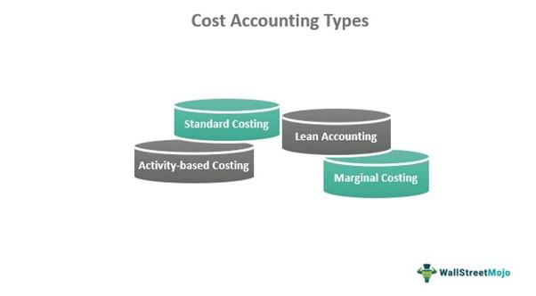

## Table of Contents

## What is cost accounting?

Cost accounting is a type of accounting that helps businesses figure out how much it costs to make their products or provide their services. It looks at all the costs involved, like the materials used, the labor needed, and other expenses like rent and utilities. By understanding these costs, a business can see which parts of their operations are expensive and where they might be able to save money.

This type of accounting is really useful for managers because it helps them make better decisions. For example, if they know exactly how much it costs to make each product, they can set prices that cover these costs and still make a profit. Cost accounting also helps in planning for the future, like deciding whether to start making a new product or if it's time to stop making something that's too costly.

## How does cost accounting differ from financial accounting?

Cost accounting and financial accounting are both important, but they do different things. Cost accounting focuses on helping a business understand the costs of making its products or providing its services. It looks inside the company to see how money is spent on things like materials, labor, and other expenses. This information helps managers make decisions about pricing, budgeting, and where to cut costs. It's like a tool for inside the company to help it run better.

On the other hand, financial accounting is about showing the overall financial health of the company to people outside of it, like investors, banks, and the government. It follows strict rules and creates reports like income statements and balance sheets. These reports show how much money the company made, how much it spent, and what it owns and owes. Financial accounting is more about keeping track of everything accurately and making sure everyone outside the company can trust the numbers.

So, while cost accounting is about helping the company manage its costs and make internal decisions, financial accounting is about reporting the company's financial situation to the outside world in a clear and standardized way. Both are essential, but they serve different purposes and audiences.

## What are the main objectives of cost accounting?

The main goal of cost accounting is to help a business understand how much it costs to make its products or provide its services. It does this by looking at all the costs involved, like the price of materials, the wages paid to workers, and other expenses like rent and utilities. By figuring out these costs, a business can see which parts of its operations are expensive and where it might be able to save money. This helps the company set prices that cover all the costs and still make a profit.

Another important objective of cost accounting is to help managers make better decisions. When managers know exactly how much it costs to make each product, they can decide if they should start making new products or stop making ones that are too costly. Cost accounting also helps with planning for the future, like setting budgets and figuring out how to use resources efficiently. It's like a tool that gives managers the information they need to run the business well.

Overall, cost accounting is all about giving a business the detailed information it needs to control costs, set prices, and make smart decisions. It's a key part of managing a company and helps make sure it stays profitable and competitive.

## What are the basic elements of cost in cost accounting?

In cost accounting, the basic elements of cost are materials, labor, and expenses. Materials are the things a business buys to make its products, like wood for furniture or fabric for clothes. Labor is the cost of paying workers to make the products, including their wages and any benefits they get. Expenses are all the other costs that help the business run, like rent for the factory, electricity, and the cost of keeping the machines working.

These three elements are important because they help a business understand all the costs of making something. By looking at materials, labor, and expenses, a business can see where it spends the most money and find ways to save. For example, if materials are very expensive, the business might look for cheaper suppliers. If labor costs are high, it might train workers to work faster or use machines to help them. And if expenses like rent are too much, the business might move to a cheaper location or find ways to use less electricity.

Understanding these elements of cost helps a business set the right prices for its products. If a business knows exactly how much it costs to make something, it can make sure the price covers all these costs and still makes a profit. This is why cost accounting is so important - it helps businesses keep track of their costs and make smart decisions about how to spend their money.

## Can you explain the difference between direct and indirect costs?

Direct costs are expenses that you can easily link to making a specific product or providing a specific service. For example, if you're making a wooden table, the cost of the wood and the wages paid to the workers who build the table are direct costs. These costs are easy to track because they are directly related to the product you're making. When you know your direct costs, you can figure out how much it costs to make each item, which helps you set the right price.

Indirect costs, on the other hand, are expenses that you can't easily link to a specific product or service. These are costs that help the whole business run but aren't tied to making one particular thing. For example, the rent for the factory where you make the wooden table, the electricity used to run the machines, and the salary of the manager who oversees the whole operation are all indirect costs. These costs are shared across all the products you make, so they're harder to track but still important to consider when figuring out the total cost of running your business.

## What are the common methods used for cost allocation?

Cost allocation is how businesses figure out how to share indirect costs among different products or departments. One common method is the direct method, which is pretty straightforward. It assigns indirect costs directly to the departments that use them the most. For example, if the maintenance department mostly helps the production department, then the costs of maintenance would be allocated to production. This method is simple and easy to understand, but it might not be very accurate if costs are shared among many departments.

Another method is the step-down method, which is a bit more complicated but tries to be more accurate. It starts by allocating the costs of one service department to other service departments and production departments. For example, if the human resources department supports both the maintenance and production departments, its costs would be shared between them. Then, the costs of the maintenance department would be allocated to production. This method tries to account for the fact that some departments help others, but it can still be a bit tricky to get right.

The most detailed method is the reciprocal method, which is the most accurate but also the most complex. It recognizes that service departments often help each other, not just the production departments. For example, the human resources department might help the maintenance department, which in turn helps human resources. The reciprocal method uses math to figure out how to allocate costs in a way that reflects all these interactions. While it gives the most accurate picture, it can be hard to do and might need special software or a lot of time to get it right.

## What are the different types of cost accounting systems?

There are two main types of cost accounting systems: job order costing and process costing. Job order costing is used when a business makes unique products or services, like custom furniture or special projects. In this system, costs are tracked for each specific job or order. For example, if a company is making a custom table, it will keep track of the cost of the wood, the labor to build it, and any other expenses just for that table. This helps the business know exactly how much it costs to make each unique item.

Process costing, on the other hand, is used when a business makes a lot of the same thing, like bottles of soda or boxes of cereal. In this system, costs are averaged over all the units produced. For example, if a factory makes thousands of bottles of soda, it will add up all the costs of making the soda and then divide that by the number of bottles to find the cost per bottle. This method is good for businesses that have a continuous production process and make large quantities of the same product.

There's also a third type called activity-based costing (ABC), which is a bit more complicated but can give a more accurate picture of costs. ABC looks at all the activities that go into making a product and assigns costs based on how much each activity is used. For example, if setting up machines is a big part of making a product, ABC will track the costs of those setups and assign them to the products that need them. This method is useful for businesses that want to understand the true cost of each activity in their operations.

## How does activity-based costing work, and what are its benefits?

Activity-based costing, or ABC, is a way of figuring out costs by looking at all the activities that go into making a product. Instead of just adding up the costs of materials, labor, and other expenses, ABC tracks the cost of each activity, like setting up machines or inspecting products. For example, if a company makes different types of toys, ABC would look at how much it costs to set up the machines for each toy and then assign those costs to the toys that need that setup. This helps the company see which activities are expensive and where they might be able to save money.

The main benefit of activity-based costing is that it gives a more accurate picture of costs. By understanding the cost of each activity, a business can see which products or services are really expensive to make and which ones are not. This helps them set better prices and make smarter decisions about where to focus their efforts. For example, if ABC shows that one product needs a lot of expensive machine setups, the company might decide to make fewer of those products or find a way to do the setups more cheaply. Overall, ABC helps businesses manage their costs better and stay more competitive.

## What is standard costing, and how is it used in cost control?

Standard costing is a way businesses figure out how much things should cost to make. They set "standard" costs for materials, labor, and other expenses based on what they think it will take to make their products. These standard costs are like a budget for each part of making something. When the actual costs are different from the standard costs, it helps the business see where they are spending more or less than they planned.

Using standard costing helps businesses control costs by showing them where they might be spending too much. If the actual cost of materials is higher than the standard cost, the business knows they need to find cheaper materials or use less of them. If labor costs are higher than expected, they might need to train workers to be more efficient or find ways to cut down on overtime. By comparing actual costs to standard costs, the business can make changes to stay on budget and keep their costs under control.

## Can you describe the process of variance analysis in cost accounting?

Variance analysis in cost accounting is a way to compare what a business planned to spend with what it actually spent. It looks at the difference, or "variance," between the standard costs and the actual costs. Standard costs are what the business thinks it should cost to make something, while actual costs are what it really costs. By figuring out these variances, the business can see where it's spending more or less than expected. This helps them understand if they're doing a good job of sticking to their budget or if they need to make changes.

The process of variance analysis starts with setting standard costs for materials, labor, and other expenses. Once the business has these standards, they track the actual costs as they make their products. Then, they compare the actual costs to the standard costs to find the variances. If the actual costs are higher than the standard costs, it's called an unfavorable variance, which means the business is spending more than it planned. If the actual costs are lower, it's a favorable variance, meaning they're spending less. By looking at these variances, the business can figure out where to focus their efforts to control costs better.

## How do cost accounting practices vary across different industries?

Cost accounting practices can be quite different from one industry to another because each industry has its own way of making things and its own kinds of costs. For example, in manufacturing, where they make physical products like cars or toys, they often use job order costing if they make custom items, or process costing if they make a lot of the same thing. They need to keep track of the costs of materials, labor, and machines, and they might use activity-based costing to understand the cost of each step in making the product. In contrast, the service industry, like restaurants or consulting firms, focuses more on labor costs and overhead expenses like rent and utilities. They might use standard costing to set expected costs for services and then compare these to actual costs to see where they can save money.

In the construction industry, cost accounting is important for tracking the costs of each project. They often use job order costing to keep track of the costs of materials, labor, and equipment for each specific building or project. They need to make sure they stay within budget, so they might use variance analysis to see where costs are higher than expected and make adjustments. On the other hand, in the healthcare industry, cost accounting helps hospitals and clinics understand the cost of providing care. They might use activity-based costing to track the costs of different treatments and procedures, which helps them set prices and manage their budgets. Each industry uses cost accounting in a way that fits their specific needs and helps them control costs and make better decisions.

## What are some advanced techniques in cost accounting for decision making?

Advanced techniques in cost accounting help businesses make better decisions by giving them more detailed information about costs. One technique is called target costing, which starts with the price customers are willing to pay and works backward to figure out how much it should cost to make the product. This helps businesses set goals for cost reduction and design products that meet both customer needs and profit goals. Another technique is life-cycle costing, which looks at the total cost of a product over its whole life, from making it to selling it and even getting rid of it. This helps businesses see the long-term costs and benefits of their products and make smarter choices about what to make and how to make it.

Another advanced technique is throughput accounting, which focuses on how much money a business makes from selling its products, rather than just looking at costs. It helps businesses see which products are most profitable and how to increase sales and profits by improving the flow of production. Throughput accounting can help businesses make decisions about which products to focus on and how to use their resources most effectively. These advanced techniques give businesses a deeper understanding of their costs and help them make decisions that keep them competitive and profitable in the long run.

## What are the types of costs in cost accounting?

Cost accounting categorizes expenses into various types to assist businesses in managing their financial resources effectively. The fundamental categories of costs in cost accounting are direct and indirect costs, as well as fixed and variable costs. Understanding these categories is essential for accurate product pricing, budgeting, and strategic financial management.

Direct costs are expenses that can be directly attributed to a specific product, service, or department. These costs tend to vary with the level of production or sales activity. Examples of direct costs include raw materials used in manufacturing, direct labor involved in production, and any specific expenses directly linked to a particular project or product line.

Indirect costs, on the other hand, are not directly traceable to a single product or service. These costs are incurred for overall operations and benefit multiple products or departments. Indirect costs include expenses such as utilities, rent, and salaries of administrative staff. Proper allocation of indirect costs is crucial for comprehensive cost analysis and ensuring accurate financial reporting.

In addition to direct and indirect costs, cost accounting also distinguishes between fixed and variable costs. Fixed costs are expenses that remain constant regardless of the level of production or sales. These include items such as rent, salaries of permanent staff, and depreciation of equipment. Even if a business does not produce any units, fixed costs still need to be paid.

Variable costs, conversely, fluctuate with changes in production [volume](/wiki/volume-trading-strategy). These costs increase as production ramps up and decrease when production slows. Common examples of variable costs include direct raw materials, commission on sales, and utility costs closely tied to manufacturing operations.

The relationship between variable costs ($VC$), fixed costs ($FC$), and the total cost ($TC$) can be expressed using the equation:

$$
TC = FC + VC \cdot Q
$$

where $Q$ represents the quantity of output. This formula demonstrates how cost components combine to influence the overall cost structure.

Accurate categorization and management of these cost types enable businesses to price their products competitively and allocate resources more efficiently. By analyzing cost behavior, companies can identify opportunities to reduce expenses and improve profitability.

## References & Further Reading

Review literature on cost accounting methodologies for a more in-depth understanding. Textbooks such as "Cost Accounting: A Managerial Emphasis" by Charles T. Horngren, Srikant M. Datar, and Madhav V. Rajan provide comprehensive insights into both traditional and contemporary cost accounting methods and their practical applications. Another valuable resource is "The Design of Cost Management Systems" by Robin Cooper and Robert S. Kaplan, which explores innovative approaches to cost management and efficiency improvements in various business contexts.

For those interested in the evolving domain of [algorithmic trading](/wiki/algorithmic-trading) and its cost dynamics, it is essential to consider publications that address the intersection of finance, technology, and cost strategies. This area of study highlights the importance of rigorous cost analysis in maintaining competitiveness and profitability amidst dynamic markets. 

Further reading on algorithmic trading could involve exploring research papers and [books](/wiki/algo-trading-books) that focus on the technical and economic aspects of high-frequency trading and transaction cost analysis. This includes understanding the algorithms' design, implementation costs, and the analysis of trading data to optimize performance within trading environments.

These resources collectively equip professionals and scholars with the necessary tools to grasp the strategic importance of cost accounting and its applicability across various industries.

