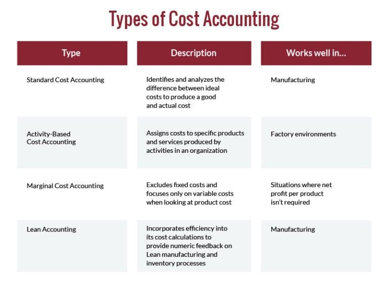

## Table of Contents

## What is cost accounting?

Cost accounting is a type of accounting that helps businesses figure out how much it costs to make their products or provide their services. It looks at all the expenses involved, like the cost of materials, labor, and overheads. By understanding these costs, a business can see if it's making a profit or not. It's different from financial accounting, which focuses on reporting to people outside the business, like investors or the government. Cost accounting is mainly for people inside the company to help them make better decisions.

One important part of cost accounting is figuring out the cost of each product or service. This is called product costing. There are different ways to do this, but the main idea is to assign costs to products so the business knows how much it costs to make each one. This information is really useful for setting prices, planning budgets, and finding ways to save money. For example, if a company sees that one product is too expensive to make, it might decide to stop making it or find a cheaper way to do it.

Another key aspect of cost accounting is helping with decisions about the future. This is called managerial accounting. It uses cost information to help managers plan and control the business. For example, cost accounting can help a company decide whether to start making a new product, or whether to buy a new machine. It can also help with setting goals and keeping track of performance. By using cost accounting, businesses can make smarter choices and work more efficiently.

## Why is cost accounting important for businesses?

Cost accounting is important for businesses because it helps them understand how much it costs to make their products or provide their services. By knowing these costs, a business can figure out if it's making money or losing money. It's like keeping a close eye on the money going in and out. This helps the business set the right prices for their products. If they know it costs $10 to make a product, they can set a price that covers that cost and also makes a profit.

Cost accounting also helps businesses make better decisions about the future. For example, if a company wants to start making a new product, cost accounting can show them if it will be profitable. It can also help them decide if they should buy new equipment or find cheaper ways to do things. By using cost accounting, businesses can plan better, save money, and work more efficiently. It's like having a roadmap that guides them to make smart choices and keep their business healthy.

## What are the main objectives of cost accounting?

The main objectives of cost accounting are to help businesses figure out how much it costs to make their products or provide their services. By doing this, a business can see if it's making a profit or losing money. This is important because knowing the costs helps the business set the right prices. For example, if it costs $5 to make a product, the business can set a price that covers that cost and also makes some profit. Cost accounting also helps in keeping track of all the expenses, like the cost of materials, labor, and other overheads. This way, the business can see where the money is going and find ways to save.

Another important objective of cost accounting is to help businesses make better decisions about the future. It does this by providing information that managers can use to plan and control the business. For example, if a company is thinking about making a new product, cost accounting can show if it will be profitable. It can also help decide whether to buy new equipment or find cheaper ways to do things. By using cost accounting, businesses can plan better, save money, and work more efficiently. This helps the business stay healthy and grow over time.

## How does cost accounting differ from financial accounting?

Cost accounting and financial accounting are two types of accounting, but they have different goals and uses. Cost accounting is used inside a business to help figure out how much it costs to make products or provide services. It looks at things like the cost of materials, labor, and overheads. This helps the business set the right prices, plan budgets, and find ways to save money. Cost accounting is all about helping the people inside the company make better decisions and run the business more efficiently.

Financial accounting, on the other hand, is used to report the financial health of a business to people outside the company, like investors, banks, and the government. It follows strict rules and standards to make sure the information is accurate and reliable. Financial accounting shows the overall financial performance of the business, like how much money it made or lost over a period of time. It's like a report card that tells outsiders if the business is doing well or not. While cost accounting is focused on helping the business from the inside, financial accounting is about communicating the business's financial situation to the outside world.

## What are the basic types of costs in cost accounting?

In cost accounting, there are several basic types of costs that businesses need to keep track of. One type is direct costs, which are expenses that can be directly linked to making a product or providing a service. For example, the cost of raw materials used to make a product or the wages of workers who are directly involved in production are direct costs. These costs are easy to assign to a specific product because they are directly related to it.

Another type of cost is indirect costs, which are expenses that are not directly tied to a specific product but are still necessary for the business to operate. Examples of indirect costs include rent for the factory, utilities, and salaries of managers who oversee the whole operation. These costs are spread out across all the products the business makes, making them harder to assign to just one product. Understanding both direct and indirect costs helps a business figure out the total cost of making each product and how to price them to make a profit.

## Can you explain the difference between direct and indirect costs?

Direct costs are expenses that you can easily link to making a specific product or providing a service. For example, if you're making a cake, the cost of the flour, sugar, and eggs that go into it are direct costs. These costs are straightforward because you can see exactly how they relate to the product. The wages of the workers who are directly involved in making the product are also direct costs. When you add up all these direct costs, you get a clear idea of how much it costs to make each item.

Indirect costs, on the other hand, are expenses that are not directly tied to a specific product but are still important for the business to run smoothly. These costs are harder to assign to just one product because they benefit the whole operation. For example, the rent for the factory where the cake is made, the electricity used to run the ovens, and the salary of the manager who oversees the entire bakery are all indirect costs. Even though these costs don't go into making one specific cake, they are necessary for the business to keep going. Understanding both direct and indirect costs helps a business figure out the total cost of making each product and set the right prices to make a profit.

## What are the primary methods used in cost accounting?

In cost accounting, one of the main methods used is called job costing. This method is great for businesses that make unique products or provide custom services. With job costing, you track the costs for each specific job or project. For example, if you're a construction company building different houses, you'd keep track of the costs for each house separately. This helps you see how much it costs to complete each job and make sure you're charging enough to cover those costs and make a profit.

Another common method is process costing. This is used when a business makes a lot of the same product in big batches. For example, if you're a factory making thousands of the same type of toy, you'd use process costing. You figure out the cost of making one unit by dividing the total costs of the production process by the number of units made. This method is helpful for businesses that have a steady production line and want to know the cost per unit.

Activity-based costing (ABC) is another method that some businesses use. It's a bit more complex but can give a very detailed view of costs. With ABC, you look at all the activities involved in making a product and assign costs to each activity. This can help you see where you're spending a lot of money and find ways to save. For example, if you find that a certain activity, like quality control, is really expensive, you might look for ways to do it more efficiently.

## What is activity-based costing and how is it applied?

Activity-based costing, or ABC, is a way of figuring out how much it costs to make a product by looking at all the different activities involved. Instead of just adding up the costs of materials and labor, ABC breaks down the production process into smaller steps, like setting up machines, running quality checks, or handling materials. Each of these activities has a cost, and ABC assigns these costs to the products based on how much of each activity is used to make them. This method helps businesses see where they're spending a lot of money and find ways to save.

To apply activity-based costing, a business first needs to identify all the activities that go into making their products. They then figure out the cost of each activity, which can include things like the time workers spend on it, the cost of the machines used, and any other expenses related to that activity. Once they have these costs, they can see how much of each activity is used for each product. For example, if one product needs a lot of quality checks, it will have higher costs for that activity. By understanding these details, businesses can make better decisions about pricing, budgeting, and finding ways to be more efficient.

## How do standard costing and variance analysis work in cost accounting?

Standard costing is a way to plan ahead in cost accounting. It means setting a standard, or expected, cost for making a product. This standard cost includes things like how much materials should cost, how much time workers should take, and how much overhead should be. By comparing the actual costs to these standards, a business can see if they are spending more or less than they planned. This helps them figure out if they are doing a good job at keeping costs down or if they need to make changes.

Variance analysis goes hand-in-hand with standard costing. It's the process of figuring out why actual costs are different from the standard costs. When a business sees a difference, or variance, they look into why it happened. For example, if the cost of materials is higher than expected, they might find out that the price of materials went up or that they used more materials than they should have. By understanding these variances, the business can take steps to fix the problems and make their cost management better.

## What are some advanced cost accounting techniques used by experts?

One advanced cost accounting technique is called target costing. This method starts with the price that customers are willing to pay for a product and works backward to figure out what the costs should be. The idea is to design the product and its production process in a way that keeps costs low enough to make a profit at the target price. This can be really helpful for businesses that want to stay competitive in the market by keeping their prices attractive to customers while still making money.

Another technique is life-cycle costing, which looks at all the costs involved in a product from start to finish. This includes the costs of designing, making, selling, and even disposing of the product. By thinking about all these costs together, a business can make better decisions about whether a product will be profitable over its whole life. This method is especially useful for products that have long life cycles or need a lot of support after they're sold, like cars or electronics.

A third advanced technique is throughput accounting, which focuses on the speed at which a business can make and sell its products. It looks at how much money the business makes from sales, how much it spends on materials, and how fast it can turn those materials into products that customers want. By improving the throughput, or flow, of production, a business can make more money and be more efficient. This method is often used in manufacturing and can help businesses find bottlenecks and fix them to increase their profits.

## How can cost accounting be integrated with other business systems for better decision-making?

Cost accounting can be integrated with other business systems like enterprise resource planning (ERP) software to help make better decisions. ERP systems manage all sorts of business activities, like keeping track of inventory, processing orders, and handling finances. By connecting cost accounting with ERP, a business can see how costs affect different parts of the company. For example, if the cost of materials goes up, the ERP system can show how this change impacts the price of the product and the overall budget. This helps managers make quick decisions about pricing, buying materials, and planning for the future.

Another way cost accounting can be integrated is with customer relationship management (CRM) systems. CRM systems help businesses understand and manage their relationships with customers. By linking cost accounting data with CRM, a company can see how much it costs to serve different customers and how profitable each customer is. This information can guide decisions about marketing, sales strategies, and customer service. For instance, if a business finds that serving a certain type of customer is too expensive, they might decide to change their approach or focus on more profitable customers. Integrating cost accounting with other systems helps businesses get a complete picture of their operations and make smarter choices.

## What are the future trends in cost accounting and how might they impact businesses?

In the future, cost accounting is likely to become more automated and use more technology like [artificial intelligence](/wiki/ai-artificial-intelligence) and [machine learning](/wiki/machine-learning). These tools can help businesses look at a lot of data quickly and find patterns and insights that would be hard for people to see on their own. For example, AI can predict how costs might change in the future based on past data. This can help businesses plan better and make decisions faster. Another trend is the use of real-time data. Instead of waiting for monthly or quarterly reports, businesses can see their costs and profits as they happen. This helps them react quickly to changes and keep their costs under control.

These future trends in cost accounting could have a big impact on businesses. With more accurate predictions and real-time data, businesses can make smarter choices about pricing, budgeting, and finding ways to save money. They can also be more flexible and respond to changes in the market faster. This could help them stay competitive and grow. However, it will also mean that businesses need to invest in new technology and train their employees to use it. While this can be a challenge, the benefits of better cost management and decision-making could be worth it in the long run.

## References & Further Reading

[1]: Horngren, C. T., Datar, S. M., & Rajan, M. V. (2014). ["Cost Accounting: A Managerial Emphasis"](https://www.semanticscholar.org/paper/Cost-Accounting%3A-A-Managerial-Emphasis-Horngren-Datar/0a40f19b3c7611bb798e8fc8641cd15bfc5eeaeb). Pearson. 

[2]: Cooper, R., & Kaplan, R. S. (1991). ["The Design of Cost Management Systems: Text and Cases"](https://archive.org/details/designofcostmana0000coop). Prentice Hall.

[3]: Bragg, S. M. (2019). ["Cost Accounting Fundamentals: Essential Concepts and Examples"](https://books.google.com/books/about/Cost_Accounting_Fundamentals.html?id=csxuwgEACAAJ). AccountingTools.

[4]: Kaplan, R. S., & Anderson, S. R. (2007). ["Time-Driven Activity-Based Costing: A Simpler and More Powerful Path to Higher Profits"](https://www.hbs.edu/ris/Publication%20Files/04-045_d62528d4-7931-4ea1-a205-d9683c639d6e.pdf). Harvard Business Review Press.

[5]: Eldridge, S. (2017). ["Lean Accounting: Best Practices for Sustainable Integration"](https://www.wiley.com/en-us/Lean+Accounting%3A+Best+Practices+for+Sustainable+Integration-p-9780470087282). CRC Press.

[6]: Lopez de Prado, M. (2018). ["Advances in Financial Machine Learning"](https://www.amazon.com/Advances-Financial-Machine-Learning-Marcos/dp/1119482089). Wiley.

[7]: Chan, E. P. (2009). ["Quantitative Trading: How to Build Your Own Algorithmic Trading Business"](https://github.com/ftvision/quant_trading_echan_book). Wiley.