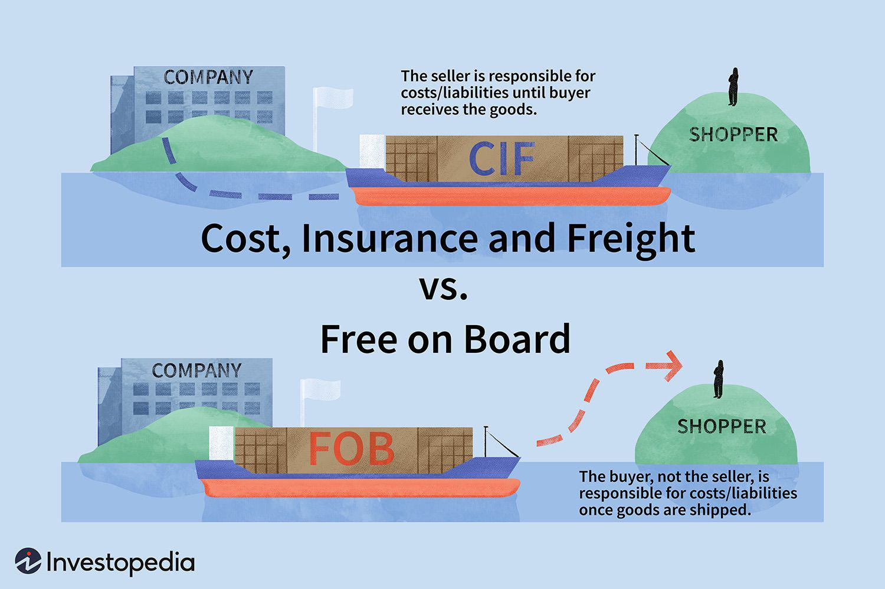

International trade utilizes a variety of terms and contractual agreements that help determine the responsibilities and financial obligations tied to the transportation of goods across borders. Among these, Cost and Freight (CFR) is a significant term in the context of foreign trade. This term is chiefly used to provide guidance for both buyers and sellers involved in transactions via sea and inland waterways, clearly demarcating roles and obligations.

Under the framework of CFR, the seller's primary responsibility is to arrange and pay for the transportation of goods to a specified port, without bearing the risk of loss or damage once the goods have been loaded onto the shipping vessel. Conversely, the buyer assumes all risks associated with the goods from the time they are on board, despite not being responsible for paying the freight costs. This division of responsibilities is designed to streamline shipping processes and ensure mutual understanding between parties, enabling smoother logistical operations and financial planning.



Understanding the implications of CFR within trade agreements is essential for optimized logistics and adept financial management. When properly applied, CFR can assist businesses in avoiding disputes and mitigating risks by clearly outlining cost and risk allocation. These considerations are increasingly relevant as businesses seek more efficient and reliable international trade solutions.

In this article, we aim to provide an in-depth exploration of CFR in international trade, examining its fundamental terms, associated contracts, and the consequential impact on algorithmic trading practices. Through this analysis, we seek to offer insights that are crucial for traders and businesses striving to navigate the complexities inherent in modern commerce.

## Table of Contents

## What is Cost and Freight (CFR)?

Cost and Freight (CFR) is an international commercial term, commonly known as an Incoterm, established by the International Chamber of Commerce (ICC) to streamline the global trading process by standardizing contractual responsibilities. Under CFR, the seller carries the obligation to arrange and finance the transportation of goods to a designated port agreed upon by the buyer. This includes procuring the necessary shipping services and fulfilling all export formalities at the origin country to ensure that the goods reach the buyer's specified port of destination. 

A distinctive feature of CFR is that it does not extend the seller’s responsibilities to insuring the goods during transit. This differentiates it from a similar Incoterm—Cost, Insurance, and Freight (CIF)—where the seller must also provide insurance coverage for the goods during the journey. Under CFR, as soon as the goods are loaded onto the vessel, the risk of loss or damage transfers from the seller to the buyer. Therefore, any unforeseen events impacting the goods while they are en route from the port of origin to the port of destination become the buyer's responsibility.

This transfer of risk, separate from the transfer of costs, makes CFR a term particularly suited for transactions where the buyer prefers to manage their own insurance or assumes any transit risk. Understanding this delineation between cost bearing and risk bearing is vital for parties entering a CFR-based contract, ensuring clarity and efficiency in international shipping arrangements.

## Key Features and Responsibilities under CFR

In a Cost and Freight (CFR) transaction, both sellers and buyers have specific responsibilities that ensure the smooth transfer of goods across international waters. Understanding these roles is crucial to avoid unnecessary disputes and ensure compliance with trade agreements.

**Seller's Responsibilities:** The seller's primary task under CFR is to deliver the goods to the shipping port and arrange for their transportation to the destination port specified by the buyer. This includes paying the cost of freight necessary to bring the goods to the port of destination. Furthermore, sellers must comply with export formalities, ensuring that all required legal and documentation processes are completed before the goods are shipped. This may include acquiring export licenses, completing customs paperwork, and adhering to any regulatory requirements specific to the goods being shipped.

**Buyer's Responsibilities:** Upon the loading of goods onto the shipping vessel, the risk transfers to the buyer. Hence, the buyer assumes all risks associated with the goods from this point forward. Additionally, while CFR does not require the seller to provide insurance, it is often in the buyer's best interest to arrange for insurance coverage to mitigate potential risks during transit. The buyer is also responsible for managing import formalities, which include obtaining necessary import licenses, paying import duties, and fulfilling any regulatory requirements to facilitate the entry of goods into the destination country.

**Documentation in CFR Transactions:** Clear and comprehensive documentation is fundamental in CFR transactions to establish the responsibilities of each party and to serve as a reference in case of disputes. Essential documents typically include the bill of lading, commercial invoice, and packing list, among others. Accurate documentation helps delineate duties, clarify the point at which risk transfers, and ensure that both parties fulfill their contractually obligated responsibilities, thereby reducing the potential for misinterpretation and conflict.

## Comparing CFR with Other Incoterms

Cost and Freight (CFR) and other Incoterms, such as Cost, Insurance, and Freight (CIF), and Free on Board (FOB), constitute pivotal components of global trade, each outlining distinct responsibilities for sellers and buyers. Understanding these differences is crucial for selecting the appropriate term that aligns with a trader's specific risk and cost strategies.

**CFR vs. CIF**

The primary distinction between CFR and CIF centers on insurance obligations. Under CFR, the seller's responsibility is limited to covering the costs and freight necessary to transport the goods to the port of destination designated by the buyer. However, insurance is not included in the seller's responsibilities under CFR. This means that while the seller arranges and pays for transportation to the buyer's specified port, the risk transfers to the buyer once the goods are on board the vessel. The buyer must independently manage insurance to cover any risks from this point onward.

Contrarily, CIF obligates the seller not only to pay for costs and freight but also to procure insurance for the goods up to the port of destination. This inclusion of insurance under CIF provides the buyer with additional security against possible in-transit damages or losses, albeit typically resulting in higher costs included in the contract price due to the insurance coverage.

**CFR vs. FOB**

The distinction between CFR and FOB lies primarily in the risk transfer point. With FOB, the seller's obligations are fulfilled once the goods are loaded onto the shipping vessel at the port of origin. The buyer assumes all transportation costs and risks from this point. This makes FOB an option that transfers more responsibility to the buyer compared to CFR, where the seller pays for and arranges transport to the destination port.

This snapshot comparison illustrates the flexibility provided by these terms. In scenarios where buyers prefer more control over insurance, choosing CFR might be more economical. In contrast, CIF offers convenience with insurance, appealing to traders desiring comprehensive coverage included in one package. FOB, meanwhile, grants buyers full autonomy in managing shipping arrangements and insurance, potentially lowering overall costs if they can secure better rates independently.

By carefully assessing these Incoterms — CFR, CIF, and FOB — traders can efficiently tailor their international contracts to reflect their risk tolerance and logistical preferences, facilitating smoother import and export operations.

## The Role of Incoterms in Algorithmic Trading

Algorithmic trading utilizes computer algorithms to execute trading decisions at speeds and frequencies that a human trader cannot achieve. The integration of Incoterms, such as Cost and Freight (CFR), into these trading strategies can significantly influence financial markets, particularly those involving commodities and freight futures.

Incorporating Incoterms into [algorithmic trading](/wiki/algorithmic-trading) strategies involves understanding the financial implications and risk allocations defined by these terms. CFR specifically outlines that the seller is responsible for transportation costs to the destination port, while the buyer assumes risks once the goods are loaded. This allocation can affect price predictions and risk assessments in commodities trading algorithms. For instance, algorithmic models might integrate transportation cost data derived from CFR agreements to forecast more accurate pricing trends in oil or grain futures.

In addition, the simulation of financial plans can be impacted by Incoterms. Algorithms capable of processing large datasets can simulate logistics cost scenarios under multiple Incoterms. By analyzing various cost structures and risk distributions, traders can better anticipate market movements and optimize their trading strategies accordingly. 

Understanding the cost components of CFR informs risk management aspects of algorithmic strategies. For example, let: 
$$
\text{Total Cost} = \text{Cost of Goods} + \text{Freight Cost}
$$
In a CFR contract, the 'Freight Cost' is a seller's responsibility, influencing the pricing models in predictive algorithms. By including variations in freight costs due to market [volatility](/wiki/volatility-trading-strategies) or geopolitical events, algorithms can adjust trading positions more effectively.

Python, being a prevalent language in algorithmic trading, can be used for modeling such scenarios. Here's a basic example of a Python function that simulates the impact of freight costs based on CFR terms:

```python
def simulate_cfr_impact(cost_of_goods, freight_cost_variation):
    # Base freight cost
    base_freight_cost = 5000

    # Calculate total costs with varying freight
    total_costs = []
    for variation in freight_cost_variation:
        total_cost = cost_of_goods + base_freight_cost + variation
        total_costs.append(total_cost)

    return total_costs

# Example usage
goods_cost = 20000
freight_variations = [-500, 0, 500, 1000]  # Possible changes in freight cost
results = simulate_cfr_impact(goods_cost, freight_variations)

print("Simulated total costs with CFR considerations:", results)
```

This function helps visualize how different freight cost scenarios could influence the overall cost calculations, aiding in decision-making processes within algorithmic trading frameworks.

The strategic application of Incoterms in algorithmic trading underscores their importance beyond traditional logistics, revealing their capacity to enhance financial analytics and risk management in rapidly evolving markets.

## Practical Considerations and Financial Dynamics

In international trade, understanding the nuances of Cost and Freight (CFR) agreements is critical for ensuring smooth transactions and minimizing disputes. One of the most significant aspects of CFR is contract clarity, which helps delineate responsibilities and manage risks effectively.

**Contract Clarity:** It is paramount to define the terms of a CFR contract with precision. This clarity ensures that both parties—buyer and seller—are fully aware of their respective obligations. Sellers are responsible for the costs of freight up to the designated port but are not required to insure the goods. Hence, a well-drafted contract outlines these stipulations clearly, avoiding potential legal complications and misunderstandings.

**Prepaid Freight:** This component of the CFR agreement provides an added layer of security for buyers. In prepaid freight agreements, the seller pays the transportation costs to the shipping company's satisfaction upfront. This prepayment not only demonstrates the seller's commitment but also mitigates financial exposure for the buyer, who does not risk default on shipping costs. Prepaid freight is a favorable term that can be intricately detailed in a contract to assure both parties of compliance.

**Insurance Considerations:** While CFR does not obligate the seller to secure insurance for the goods in transit, it is a prudent consideration for both parties. Buyers may opt to purchase insurance independently to safeguard against the inherent risks of maritime transport. This practice ensures that any potential losses or damages incurred during shipment are aptly covered. Understanding and negotiating insurance needs is crucial for reducing risk exposure and should be explicitly addressed in contract discussions.

In practical terms, the financial dynamics of a CFR agreement extend beyond the simple allocation of transport costs. They influence how parties assess and manage risk, structure payments, and secure transactions. Crafting detailed and transparent CFR contracts, incorporating considerations like prepaid freight and insurance, ultimately supports more efficient and secure international trade operations.

## The Future of CFR in International Trade

As global commerce continues to evolve, the Cost and Freight (CFR) term stands as a cornerstone in international trade, ensuring clarity and efficiency in trade contracts. The traditional manual processes associated with CFR transactions are progressively being enhanced by modern technologies, which promise to streamline operations and mitigate potential disputes.

One of the most promising technologies in this regard is blockchain. By providing an immutable ledger, blockchain technology can significantly enhance transparency in CFR transactions. Each step of the shipping process—from the issuance of shipping documents to the payment of freight costs—can be recorded on a blockchain platform. This ensures that both parties have access to real-time, tamper-proof data, reducing the likelihood of disputes and misunderstandings over contractual obligations.

In addition to blockchain, digital integration and automation are anticipated to further influence how CFR and similar terms are applied. Algorithmic trading, widely used in financial markets, can extend its principles to logistics and supply chain management. By automating decision-making processes, companies can optimize shipping routes, forecast freight costs, and manage risks more efficiently. Algorithmic models can take into account various variables, such as shipping schedules and weather patterns, to predict and mitigate potential disruptions.

The future of CFR in international trade is also marked by digital platforms that facilitate better communication and transaction tracking. As digital ecosystems grow, they enhance coordination between buyers, sellers, and logistic providers, ensuring that costs and risks are accurately tracked and managed. Furthermore, improved data analytics could provide insights into market trends, allowing traders to adapt and negotiate more favorable terms based on supply and demand dynamics.

As economic landscapes shift, innovations in technology will likely continue to redefine the application of CFR, making it an even more robust tool in international trade. Embracing these advancements will be crucial for businesses seeking to maintain competitive edges and navigate the complexities of global markets effectively.

## Conclusion

CFR (Cost and Freight) remains a crucial aspect of international shipping contracts, effectively balancing cost responsibilities between sellers and buyers. This trade term, by defining precise obligations, allows parties involved in global commerce to structure their logistics and financial strategies with clarity. Sellers are tasked with covering transportation costs to the buyer's specified port, while buyers assume risk upon the loading of goods onto the vessel. This allocation of duties not only simplifies shipping procedures but also minimizes potential conflicts, thus streamlining trade operations.

A comprehensive understanding of CFR is vital for businesses aiming to navigate the complexities associated with marine logistics and contractual obligations. Such knowledge enables companies to make informed decisions regarding risk management and insurance, even though CFR itself does not mandate insurance coverage. Being aware of the precise definitions and responsibilities allows businesses to allocate costs effectively and avoid disputes over the terms of shipment.

As economic landscapes continually evolve, traders are increasingly required to adapt to technological advancements that reshape the execution and management of these contracts. The integration of digital tools and platforms, such as blockchain technology, promises enhanced transparency and efficiency in documenting and monitoring CFR transactions. Moreover, the rise of algorithmic trading and other digital innovations offers new opportunities for optimizing logistical frameworks and financial predictions based on CFR and other Incoterms. 

Therefore, the ability to adapt to these technological changes is becoming imperative for traders who seek to maintain competitiveness in a rapidly advancing global market. As international trade dynamics shift, a robust grasp of CFR, coupled with an openness to emerging technologies, will empower businesses to ensure resilience and efficiency in their shipping operations.

## References & Further Reading

[1]: International Chamber of Commerce. (2020). ["Incoterms® 2020: ICC rules for the use of domestic and international trade terms"](https://iccwbo.org/business-solutions/incoterms-rules/incoterms-2020/).

[2]: Schmitthoff, C.M., & Schmitthoff, M. (2012). ["Schmitthoff's Export Trade: The Law and Practice of International Trade"](https://archive.org/details/schmitthoffsexpo0000darc). Sweet & Maxwell.

[3]: Davies, I., & Pearce, D. (2019). ["Global Trade Policy: Questions and Answers"](https://www.amazon.com/Global-Trade-Policy-Questions-Answers/dp/1118357655).

[4]: Lopez, J.A. (2013). ["The Technology and Economics of Algorithmic Trading and High-Frequency Trading"](https://www.annualreviews.org/content/journals/10.1146/annurev-financial-121415-033010). Federal Reserve Bank of San Francisco.

[5]: Kouvelis, P., Chambers, C., & Wang, H. (2006). ["Supply Chain Management Research and Production and Operations Management: Review, Trends, and Opportunities"](https://onlinelibrary.wiley.com/doi/abs/10.1111/j.1937-5956.2006.tb00257.x). Production and Operations Management.