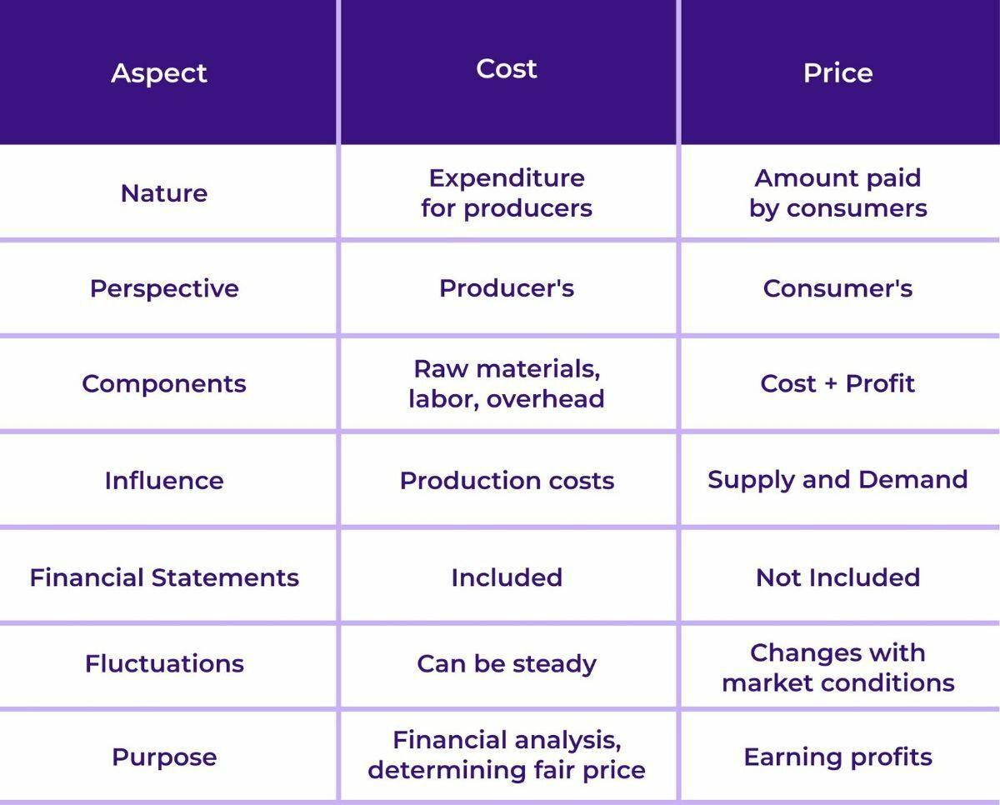

## Table of Contents

## What is the basic difference between cost and price?

The basic difference between cost and price is that cost is what a business pays to produce or buy something, while price is what a customer pays to buy that thing. For example, if a company makes a toy, the cost includes the money spent on materials, labor, and other expenses to make the toy. On the other hand, the price is what the customer pays to take the toy home, which is usually more than the cost.

Understanding the difference between cost and price is important for businesses because it helps them make money. If the price is higher than the cost, the business makes a profit. If the price is lower than the cost, the business loses money. This is why businesses often set the price higher than the cost, to cover their expenses and make a profit.

## Can you explain the components that make up the cost of a product?

The cost of a product includes several parts that a business has to pay for. First, there are the direct costs, which are the expenses that go straight into making the product. These include things like the materials used to make the product, the labor to put it together, and any other direct expenses. For example, if you're making a shirt, the direct costs would be the fabric, the thread, and the wages paid to the people who sew the shirt.

Then, there are the indirect costs, which are a bit trickier to figure out. These are the costs that support the whole business, not just one product. This can include things like rent for the factory, electricity, and the salaries of managers and other staff who don't work directly on the product. These costs are shared across all the products the business makes, so they need to be divided up fairly to understand the total cost of each product.

Finally, there might be other costs to consider, like shipping the product to stores or customers, marketing to let people know about the product, and any taxes or fees the business has to pay. All these parts together make up the total cost of a product, and understanding them helps a business set a good price to make a profit.

## How does the price of a product get determined?

The price of a product is determined by looking at many things. First, the business looks at how much it cost to make the product. They need to make sure the price they set is higher than the cost, so they can make money. They also look at what other businesses are charging for similar products. If their price is too high, people might buy from someone else. If it's too low, they might not make enough money. They also think about how much people want the product. If it's something everyone wants, they might be able to charge more.

Another important thing is how much people can afford to pay. If the price is too high, people might not buy the product at all. Businesses often do research to find out what price people think is fair. They might also change the price over time, to see if they can sell more or make more money. Sometimes, they might lower the price to get rid of old stock or raise it if the product becomes really popular. All these things help the business decide on the best price for their product.

## What role does market demand play in setting prices?

Market demand is very important when setting prices. It means how many people want to buy a product. If a lot of people want the product, the business can set a higher price. This is because people are willing to pay more to get it. For example, if a new toy is really popular, the toy company can charge more because kids and parents really want it.

On the other hand, if not many people want the product, the business might need to set a lower price. This is to make sure people will buy it. If the price is too high and nobody buys it, the business loses money. So, they might lower the price to make it more attractive to customers. This way, they can sell more products and still make some money, even if it's less per item.

## How do costs influence pricing strategies?

Costs are a big part of deciding how much to charge for a product. When a business makes something, they have to think about all the money they spent to make it. This includes the materials, the workers' pay, and other expenses. If the price they set is less than what it cost to make the product, they will lose money. So, the first thing a business does is make sure the price is higher than the cost. This way, they can make some money, called profit, on each item they sell.

But costs don't just affect the lowest price a business can set. They also help decide different ways to price things. For example, if the costs go up because materials are more expensive, the business might need to raise the price to keep making a profit. Or, if they find a way to make the product cheaper, they might lower the price to sell more and beat other businesses. Costs also help businesses decide if they should sell things at a discount or run special sales. If they can still cover their costs and make some profit, they might do it to get more customers.

## What are the different types of costs (fixed, variable, direct, indirect) and how do they affect pricing?

There are different types of costs that businesses have to think about when they set prices for their products. Fixed costs are the expenses that stay the same no matter how many products the business makes. This includes things like rent for the factory and salaries for managers. Variable costs change depending on how many products are made. These include materials and labor that go into making each item. Direct costs are the expenses that can be linked directly to making a specific product, like the fabric for a shirt. Indirect costs are the expenses that help the whole business run, like electricity and office supplies, and they are shared across all products.

These different types of costs all affect how a business sets its prices. Fixed costs have to be covered no matter what, so businesses need to make sure they sell enough products at a high enough price to pay for them. Variable costs mean that the more products a business makes, the more it costs them, so they need to set a price that covers these costs and still makes a profit. Direct costs are easy to include in the price of a product because they are directly related to making it. Indirect costs are trickier because they need to be spread out over all the products, but they still need to be covered by the prices set for each item. By understanding and managing all these costs, a business can set a price that helps them make money while still being attractive to customers.

## How can understanding cost structures help in competitive pricing?

Understanding cost structures helps businesses set prices that can beat their competition. When a business knows all its costs, like the money spent on materials, labor, and other expenses, it can see the lowest price it can charge and still make a profit. This is really important when other businesses are selling similar products. If a business can make its product for less money than others, it can set a lower price and still make money. This can attract more customers and help the business sell more than its competitors.

Also, knowing the cost structure helps businesses decide if they can lower prices during sales or promotions. If a business has lower fixed costs, like cheaper rent or fewer managers, it might be able to offer discounts without losing money. Or, if it can find cheaper materials or ways to make the product faster, it can lower its variable costs. This means the business can set competitive prices that might be lower than what others are charging, making it easier to win over customers and grow the business.

## What is the concept of price elasticity and how does it relate to costs?

Price elasticity is a way to understand how much the amount people buy changes when the price changes. If a product is very elastic, it means that if the price goes up even a little, people will buy a lot less of it. If it's not very elastic, or inelastic, people will keep buying about the same amount even if the price goes up. This is important for businesses because it helps them decide how to set prices. If a product is elastic, a business might not want to raise the price too much because they could lose a lot of customers. But if it's inelastic, they might be able to raise the price and still sell the same amount.

Costs are important when thinking about price elasticity because they help set the lowest price a business can charge. If a business knows its costs, it can see if it can lower the price to sell more of an elastic product without losing money. For example, if the costs are low, a business might be able to lower the price a lot and still make a profit. On the other hand, if the costs are high, the business might not be able to lower the price as much, even if the product is elastic. Understanding both costs and price elasticity helps a business find the best price to make money and keep customers happy.

## How do businesses use cost-plus pricing and what are its limitations?

Cost-plus pricing is a way businesses set prices by adding a certain amount of money to their costs. They figure out how much it costs to make a product, then add a percentage or a fixed amount on top of that to get the price. This extra money is the profit they want to make. For example, if it costs $10 to make a toy and the business wants to make a 50% profit, they would add $5 to the cost and sell the toy for $15. This method is simple and makes sure the business covers its costs and makes some money.

However, cost-plus pricing has some problems. One big issue is that it doesn't think about what customers are willing to pay or what other businesses are charging. If the price is too high compared to other similar products, customers might not buy it. Also, if the product is something people really want, the business might be able to charge more than just adding a little bit to the cost. Another problem is that it doesn't help the business lower prices to sell more if the costs go down. So, while cost-plus pricing is easy to use, it might not always be the best way to set prices because it doesn't look at the whole market.

## Can you discuss the impact of economies of scale on both costs and pricing?

Economies of scale happen when a business makes more products and the cost to make each one goes down. This is because when you make a lot of something, you can buy materials in bigger amounts for less money, use machines more efficiently, and spread fixed costs like rent over more products. For example, if a company makes 100 toys, the cost per toy might be high because they can't buy materials in bulk. But if they make 1,000 toys, they can buy materials cheaper and the cost per toy goes down.

This lower cost per product can help a business set lower prices. When the cost to make each product goes down, the business can sell the product for less money and still make a profit. This can help them sell more products and beat other businesses that can't make things as cheaply. For example, if a big company can make toys for less money than a small company, it can set lower prices and take more customers away from the smaller company. So, economies of scale can help businesses lower their costs and set competitive prices, which can make them more successful in the market.

## How do external factors like taxes and regulations affect the relationship between cost and price?

External factors like taxes and regulations can change how much it costs a business to make a product. Taxes add to the cost because the business has to pay money to the government. For example, if there is a tax on the materials used to make a product, the business has to pay that tax, which makes the cost of making the product higher. Regulations can also make costs go up because businesses might need to spend money to follow the rules. For instance, if there is a new rule that says factories need special equipment to be safe, the business has to buy that equipment, which adds to the cost of making the product.

These higher costs because of taxes and regulations can affect the price that the business sets for the product. If the costs go up, the business might need to raise the price to still make a profit. But if the price goes up too much, customers might not want to buy the product, so the business has to be careful. Sometimes, the business might try to find ways to lower other costs or make the product more efficiently to keep the price the same. Understanding how taxes and regulations affect costs helps businesses set prices that work for both them and their customers.

## What advanced pricing strategies can be employed to optimize profit margins while considering cost structures?

One advanced pricing strategy is called dynamic pricing. This means changing the price of a product based on how much people want it right now. For example, if a lot of people want to buy a product, the business can raise the price a little bit to make more money. But if not many people want it, they might lower the price to sell more. This strategy helps businesses make the most money they can because they are always adjusting the price to match what people are willing to pay. It works well when the business knows its costs and can set a price that is always higher than the cost, no matter how it changes.

Another strategy is value-based pricing. This means setting the price based on how much people think the product is worth, not just on the cost to make it. If a product is really special or people really want it, the business can charge more because customers are willing to pay more for something they see as valuable. This strategy can help businesses make bigger profits because they are not just adding a little bit to their costs; they are charging what the market will bear. But it's important for the business to know its costs well, so they can make sure the price they set is always enough to cover those costs and make a profit.

Segmented pricing is another advanced strategy. This means charging different prices to different groups of customers. For example, a business might charge more to people who can pay more and less to people who can't. They might do this by offering discounts to students or seniors, or by charging more for the same product in a richer area. This helps the business make more money from people who are willing to pay more, while still selling to people who can only pay less. By understanding their cost structure, the business can make sure that even the lowest price they offer still covers their costs and makes some profit.

## References & Further Reading

[1]: Kissell, R. (2013). ["The Science of Algorithmic Trading and Portfolio Management"](https://www.sciencedirect.com/book/9780124016897/the-science-of-algorithmic-trading-and-portfolio-management). Academic Press.

[2]: Aldridge, I. (2013). ["High-Frequency Trading: A Practical Guide to Algorithmic Strategies and Trading Systems"](https://www.wiley.com/en-us/High+Frequency+Trading%3A+A+Practical+Guide+to+Algorithmic+Strategies+and+Trading+Systems%2C+2nd+Edition-p-9781118343500). Wiley.

[3]: Hendershott, T., & Riordan, R. (2013). ["Algorithmic Trading and the Market for Liquidity"](https://faculty.haas.berkeley.edu/hender/ATMonitor.pdf). Journal of Financial and Quantitative Analysis.

[4]: Harris, L. (2003). ["Trading and Exchanges: Market Microstructure for Practitioners"](https://books.google.com/books/about/Trading_and_Exchanges.html?id=Rd9hDRR1Yx4C). Oxford University Press.

[5]: Tsang, P. (2013). ["Slippage in High-Frequency Trading"](https://stockbrokerreview.com/slippage-and-high-frequency-trading-the-pros-and-cons/). IEEE Distributed Computing in Economics and Finance.