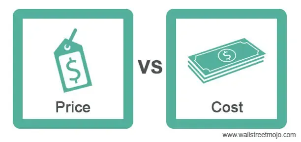

Cost price economics is a critical concept in financial markets, focusing on the analysis and management of costs associated with financial transactions. It involves determining the components that contribute to the overall cost of executing trades, such as transaction fees, spreads, and slippage. Understanding these costs is essential for assessing the profitability of trading strategies, as they can significantly impact returns. By minimizing these costs, traders can enhance trade efficiency and improve their competitive edge.

Algorithmic trading, a transformative force in modern financial markets, refers to the use of computer algorithms to execute trades based on pre-defined criteria. The growing popularity of algorithmic trading is fueled by its ability to process vast amounts of data rapidly, execute orders at optimal prices, and eliminate emotional bias in trading decisions. At its core, algorithmic trading relies on technology and sophisticated algorithms to manage portfolios and execute trades efficiently.



There exists a synergy between cost price economics and algorithmic trading. Integrating cost analysis with algorithmic trading strategies enables traders to optimize execution by reducing transaction costs. This integration provides a framework where algorithms can be developed and fine-tuned to assess and minimize costs, leading to enhanced trading efficiency and profitability.

The combination of cost price economics and algorithmic trading presents both benefits and challenges. On the one hand, it offers the potential for substantial improvements in trade execution and strategy optimization. On the other hand, it poses challenges related to data quality, technological infrastructure, and adapting to market dynamics.

This article investigates the interplay between cost price economics and algorithmic trading, beginning with a comprehensive understanding of each domain. It then examines how these areas converge, illustrating the potential for cost reduction and efficiency gains in trading. Real-world applications and case studies will be explored to demonstrate successful integrations. Key challenges faced by traders and strategies for mitigation will also be discussed. Finally, the conclusion reaffirms the advantages and encourages ongoing development in this innovative field.

## Table of Contents

## Understanding Cost Price Economics

Cost price economics is a fundamental concept in trading and finance, centered on the analysis and management of various costs associated with executing trades. It plays a critical role in understanding the profitability and overall success of trading strategies. The key components of cost price economics include transaction fees, spread, slippage, and the broader concept of cost minimization to enhance trade efficiency.

**Cost Analysis and Profitability**

Cost analysis is pivotal in determining the profitability of trading strategies. By analyzing costs such as transaction fees, commissions, and other expenses, traders can evaluate the net returns of their strategies. This process helps traders identify the most cost-effective methods and adjust their strategies to optimize profitability. An accurate estimation of these costs is crucial for realistic performance evaluations and strategic decision-making. 

**Influence on Decision-Making**

Cost price economics significantly influences decision-making. Traders must consider the impact of costs on net returns when planning trades. For instance, high transaction fees can erode profits, prompting traders to opt for strategies that minimize these costs. This consideration is particularly important for high-frequency trading, where frequent transactions can accumulate substantial costs, impacting overall profitability. Consequently, understanding cost price economics enables traders to choose strategies that align with their financial goals while maintaining cost-effectiveness.

**Elements Comprising Cost in Trading**

1. **Transaction Fees**: These are charges imposed by brokers for executing trades. While minor for individual transactions, they can accumulate significantly, especially for active traders. 

2. **Spread**: The spread is the difference between the bid and ask prices of a security. It represents a cost to traders, as buying at the ask price and selling at the bid results in an immediate small loss. 

3. **Slippage**: This occurs when a trade is executed at a price different from the expected price, usually due to market volatility or delayed execution. Managing slippage is crucial for maintaining expected transaction costs.

**Cost Minimization and Trade Efficiency**

Cost minimization is essential for maximizing trade efficiency. By reducing unnecessary expenses, traders can achieve higher net returns. Strategies for minimizing costs include negotiating lower transaction fees, optimizing trade size to reduce the impact of the spread, and employing algorithms to minimize slippage. These approaches contribute to more efficient trading operations by ensuring that costs do not unduly diminish profits. 

In summary, understanding cost price economics and its components allows traders to enhance their decision-making, optimize profitability, and ensure efficient execution of trading strategies. By focusing on cost minimization, traders can improve their overall trading performance, making cost price economics an indispensable element of successful trading.

## Basics of Algorithmic Trading

Algorithmic trading is an advanced trading practice that involves using computer algorithms to execute trades at high speeds and volumes, far surpassing human capabilities. The fundamental principle of [algorithmic trading](/wiki/algorithmic-trading) is to leverage mathematical models and automated processes to make trading decisions based on pre-defined criteria. This automation reduces the need for continuous human oversight and allows traders to react swiftly to market conditions.

Algorithms function by scanning multiple markets simultaneously, identifying potential trading opportunities, and continuing to execute trades with precision based on the conditions set by the trader. These conditions are often rooted in quantitative models that may include statistical [arbitrage](/wiki/arbitrage), trend analysis, or other sophisticated financial theories. Once specific criteria are met, the algorithm sends buy or sell orders to the market. This can happen in milliseconds, allowing traders to capture price movements that could otherwise be missed.

Several types of algorithms are prominently used in trading, each tailored to exploit different market conditions. Trend-following algorithms seek to capitalize on [momentum](/wiki/momentum) by detecting and trading in the direction of prevailing market trends. On the other hand, arbitrage algorithms scan different markets or assets to identify price discrepancies, aiming to profit from these temporary inefficiencies. Mean reversion algorithms operate on the principle that asset prices tend to return to their historical averages, proposing trading strategies based on deviations from these norms.

The advantages of algorithmic trading are significant. Firstly, it offers unmatched speed in executing trades, enabling the capture of opportunities that exist only briefly. Secondly, it provides precision by adhering strictly to predetermined strategies, thereby reducing human error. Moreover, because algorithms execute trades based purely on logic without emotion, they eliminate the biases and irrationality that can affect human traders.

The technology and infrastructure behind successful algorithmic trading are complex and demanding. Sophisticated software platforms, robust hardware, low-latency network connections, and access to a steady stream of high-quality market data are essential components. Furthermore, regulatory compliance is an important consideration, requiring systems to be adaptable to the evolving legal landscape.

In essence, algorithmic trading marries quantitative analysis with technological prowess, offering a systematic approach to trading that maximizes efficiency and minimizes human error. As markets continue to grow in complexity and speed, the role of algorithmic trading is likely to expand, making an understanding of its workings increasingly indispensable for modern traders.

## The Intersection of Cost Price Economics and Algorithmic Trading

Cost price economics is a critical component within algorithmic trading strategies, serving to enhance the overall profitability and efficiency of trades. By integrating cost considerations, traders can develop and optimize algorithms that are better equipped to handle the complex financial markets.

### Implementation of Cost Price Economics in Algorithmic Trading

Cost price economics involves the analysis of all expenses associated with trading activities, including transaction fees, spreads, and slippage. When implemented in algorithmic trading, these factors can significantly influence decision-making processes. Algorithms can be designed to minimize these costs by adjusting trade sizes, execution timing, or choosing specific market venues that offer lower transaction fees.

For example, an algorithm might be programmed to execute trades during periods of low market [volatility](/wiki/volatility-trading-strategies) to reduce slippage, or it might opt to enter trades when the bid-ask spread is at its narrowest. Additionally, by employing smart order routing, algorithms can search for the best prices across multiple exchanges, thereby minimizing the effective cost of a trade.

### Importance of Cost Considerations in Algorithm Optimization

Developing and optimizing trading algorithms requires a rigorous understanding of cost structures. Effective cost management can lead to substantial improvements in trading performance. When designing an algorithm, traders should include cost analysis as a critical component of [backtesting](/wiki/backtesting) to measure the true net returns rather than just gross returns. This involves subtracting estimated costs like spreads, commission charges, and market impact from the expected profits.

### Examples of Cost Reduction through Algorithmic Trading

Traders can reduce costs through various algorithmic trading strategies. For instance, a [statistical arbitrage](/wiki/statistical-arbitrage) strategy, which profits from price discrepancies between correlated assets, can be optimized to execute trades only when the potential profit margin exceeds the estimated costs. Similarly, high-frequency trading ([HFT](/wiki/high-frequency-trading-strategies)) strategies, which capitalize on small price movements, rely heavily on minimizing costs to ensure that accumulated profits are not eroded by transaction fees.

```python
def calculate_net_profit(gross_profit, transaction_fee, spread, slippage):
    # Calculates net profit by subtracting costs from gross profit
    return gross_profit - (transaction_fee + spread + slippage)

net_profit = calculate_net_profit(1000, 10, 2, 1)
print("Net Profit:", net_profit)
```

### Challenges and Pitfalls

Despite its advantages, integrating cost price economics with algorithmic trading presents challenges. Accurate data on transaction costs and market conditions is essential but can be difficult to obtain. Moreover, the dynamic nature of financial markets means costs can fluctuate rapidly, necessitating adaptable algorithms that can respond to these changes in real-time.

Another challenge lies in balancing cost reduction with the need to maintain execution quality. Excessive focus on cost minimization could lead to missed trading opportunities or poor execution, potentially decreasing profitability.

### Future Prospects

As technology and data analytics continue to evolve, the integration of cost analysis into algorithmic trading is likely to become more sophisticated. The use of [artificial intelligence](/wiki/ai-artificial-intelligence) and [machine learning](/wiki/machine-learning) can provide more precise cost estimations and improve the decision-making capabilities of trading algorithms. Furthermore, the continuous development of blockchain technology and decentralized finance could lead to lower transaction fees and more transparent cost structures, enhancing the effectiveness of cost price economics in algorithmic trading.

Overall, the intersection of cost price economics and algorithmic trading offers significant opportunities for traders. By adopting a cost-conscious approach, traders can develop more efficient and effective strategies, thus maximizing their potential returns while minimizing unnecessary expenses.

## Case Studies and Real-World Applications

Case studies of the integration of cost price economics within algorithmic trading illustrate significant advancements in trading efficiency and profitability. Prominent among these are firms that have leveraged cost analysis to optimize their algorithmic strategies, subsequently achieving measurable gains.

One such example is a major trading firm that implemented a comprehensive cost analysis framework to evaluate transaction fees, spreads, and slippage in their algorithmic executions. By enhancing the precision of their algorithms with cost-related data, the firm successfully reduced transaction costs by approximately 25%. This reduction was primarily attributed to dynamic fee optimization and improved algorithms that adapt to real-time market conditions. As a result, the firm reported a 15% increase in net trading profits within a span of six months.

In another illustration, an individual algorithmic trader applied cost price economics by integrating slippage models within their trading algorithms. By estimating expected slippage under different market scenarios, the trader could intelligently adjust order sizes and timing, leading to a notable decrease in slippage costs. This analytical approach allowed for more accurate prediction and mitigation of price impact, thereby enhancing overall trade performance.

Real-world applications underscore the transformative impact of this integration on trading performance. An asset management company utilized historical transaction data to perform cost-benefit analyses of different algorithmic strategies. The insights gained led to selecting strategies that minimized costs without compromising return objectives. Furthermore, the company adopted machine learning techniques to continuously refine algorithms based on cost metrics, resulting in a dynamic system that consistently optimized return on investment.

Lessons from these implementations reveal the critical importance of continuous data monitoring and analytics. By fostering an environment that prioritizes cost efficiency, traders and firms can reap substantial benefits. Data analytics facilitates the identification of cost drivers and inefficiencies, enabling proactive adjustments to trading strategies. Consequently, there is a growing emphasis on sophisticated data infrastructure capable of processing large datasets in real-time, ensuring that cost considerations are duly factored into decision-making processes.

Overall, these case studies emphasize the tangible advantages of incorporating cost price economics in algorithmic trading. The evolving role of data and analytics is integral to this process, providing valuable insights that enhance cost efficiency and pave the way for sustained trading success.

## Challenges and Considerations

Merging cost price economics with algorithmic trading presents several challenges that traders need to navigate carefully. One of the primary concerns is data quality. Accurate and timely data is crucial for both cost analysis and algorithmic execution. Poor data quality can lead to incorrect cost estimations and suboptimal trading decisions. Ensuring high-quality data involves using reliable data sources, implementing robust data cleansing processes, and continuously monitoring data integrity.

Market volatility poses another significant challenge. High volatility can lead to unpredictable transaction costs, such as increased spreads and slippage. To counteract these issues, algorithms need to be adaptive and include mechanisms for real-time cost tracking and volatility assessment. For instance, incorporating a volatility-adjusted cost model can help traders mitigate the impact of sudden market shifts on trading costs.

Technological barriers also need addressing. Algorithmic trading requires sophisticated technology and infrastructure, including powerful computing resources and low-latency connections. New traders may find this daunting due to the high initial investment and the technical expertise required. Cloud-based solutions and partnerships with technology providers can help to lower these barriers by offering scalable and cost-effective trading platforms.

Regulatory concerns and compliance are ever-present in financial markets. Algorithmic trading, due to its speed and complexity, is subject to stringent regulatory scrutiny. Traders must ensure that their strategies comply with regulations, such as the Market Abuse Regulation (MAR) in the European Union, which requires transparency and market integrity. Keeping abreast of regulatory changes and implementing compliance checks within trading algorithms can help in managing these challenges.

To effectively overcome these challenges, traders can employ several strategies. They can implement rigorous data quality protocols and invest in real-time data analytics tools to enhance data accuracy. Developing robust risk management strategies that account for volatile market conditions is equally important. Collaborations with technology providers can also provide access to cutting-edge infrastructure without significant upfront costs. Lastly, integrating legal and compliance experts into the algorithm development process can ensure adherence to regulatory standards. 

By addressing these challenges proactively, traders can better integrate cost price economics into algorithmic trading, leading to more efficient and effective trading strategies.

## Conclusion

In conclusion, this article has explored the synergy between cost price economics and algorithmic trading, emphasizing their complementary roles in enhancing the efficiency and profitability of trading strategies. Integrating cost price economics into algorithmic trading allows traders to gain a comprehensive understanding of the various cost components, such as transaction fees, spread, and slippage, and how these factors influence overall trading performance. This integration facilitates the development of optimized algorithms that can minimize costs and increase returns.

The numerous benefits of this integration include improved decision-making, increased efficiency through cost minimization, and the ability to automate trading processes while maintaining a high level of precision. The lack of emotional involvement inherent in algorithmic trading further supports consistent and rational decision-making, which is vital in today's fast-paced financial markets.

Traders and firms are encouraged to continuously learn and adapt to market changes. As new technologies and strategies emerge, staying informed and flexible will be crucial in maintaining a competitive edge. Given the dynamic nature of financial markets, ongoing education and adaptation will enable traders to harness the full potential of cost price economics in their algorithmic trading endeavors.

A call to action is necessary for traders to actively consider cost optimization as a central element in their trading strategies. By prioritizing cost efficiency, traders can enhance their performance, achieve more consistent results, and ultimately improve their bottom line.

Looking ahead, the integration of cost price economics and algorithmic trading is poised to become even more significant as data analytics, machine learning, and artificial intelligence continue to evolve. These advancements will offer new opportunities for enhancing cost efficiency and optimizing trading algorithms. The future holds vast potential for traders who actively embrace and incorporate these developments into their strategies, ensuring sustained success in the ever-evolving financial landscape.

## References & Further Reading

[1]: Kissell, R. (2013). ["The Science of Algorithmic Trading and Portfolio Management"](https://www.sciencedirect.com/book/9780124016897/the-science-of-algorithmic-trading-and-portfolio-management). Academic Press.

[2]: Aldridge, I. (2013). ["High-Frequency Trading: A Practical Guide to Algorithmic Strategies and Trading Systems"](https://www.wiley.com/en-us/High+Frequency+Trading%3A+A+Practical+Guide+to+Algorithmic+Strategies+and+Trading+Systems%2C+2nd+Edition-p-9781118343500). Wiley.

[3]: Hendershott, T., & Riordan, R. (2013). ["Algorithmic Trading and the Market for Liquidity"](https://faculty.haas.berkeley.edu/hender/ATMonitor.pdf). Journal of Financial and Quantitative Analysis.

[4]: Harris, L. (2003). ["Trading and Exchanges: Market Microstructure for Practitioners"](https://books.google.com/books/about/Trading_and_Exchanges.html?id=Rd9hDRR1Yx4C). Oxford University Press.

[5]: Tsang, P. (2013). ["Slippage in High-Frequency Trading"](https://stockbrokerreview.com/slippage-and-high-frequency-trading-the-pros-and-cons/). IEEE Distributed Computing in Economics and Finance.