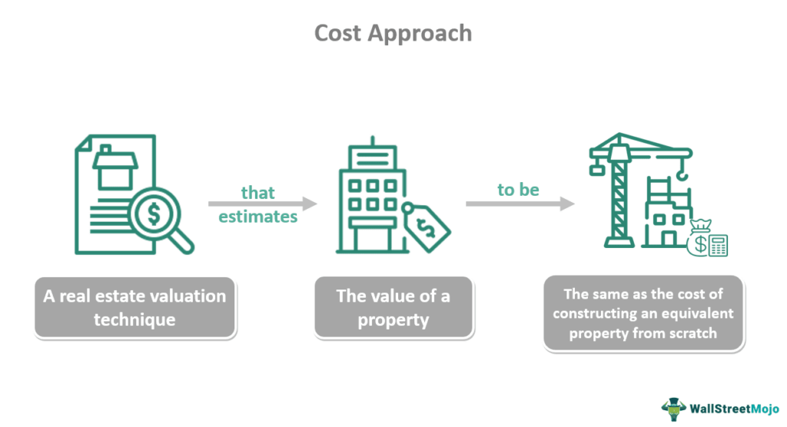

Property appraisal serves as a crucial element in the real estate market, influencing the decisions of investors, buyers, lenders, and developers. An accurate appraisal ensures that property transactions are conducted at fair market value, minimizing the risk of overpaying or underselling. Furthermore, property appraisals are essential for tax assessments and insurance purposes, thereby playing a vital role in maintaining the financial health of stakeholders involved in real estate dealings.

Traditionally, property valuation has relied on methodologies such as the Cost Approach, Sales Comparison Approach, and Income Approach. Each method offers a unique perspective on value assessment. The Cost Approach evaluates a property's value based on the cost of constructing a replica structure, accounting for depreciation. The Sales Comparison Approach analyzes comparable property sales within the area, adjusting for differences that might affect value. The Income Approach, often used for investment properties, estimates value based on potential income generation. 



In recent years, modern valuation techniques have begun to complement these traditional approaches, driven by advancements in technology and data analytics. The integration of algorithmic trading into real estate valuation marks a significant shift toward leveraging computational algorithms for market analysis. Algorithmic trading involves using automated systems to make trading decisions based on predetermined criteria and real-time market data. In real estate, these algorithms analyze vast datasets to predict property values more accurately and efficiently.

Algorithmic trading in real estate valuation brings promising opportunities for enhancing decision-making processes. By utilizing machine learning and big data analytics, these models can process and interpret complex market trends and historical data, offering insights that are difficult to achieve manually. This approach not only streamlines the valuation process but also minimizes human error, providing a data-driven foundation for property appraisal that adapts to changing market dynamics.

## Table of Contents

## Understanding Real Estate Valuation

Real estate valuation serves as a cornerstone in the real estate market, influencing decision-making for investors, sellers, and buyers alike. Accurate property valuation ensures that sellers receive a fair price, buyers make sound investments, and investors assess potential returns with a clear understanding of their investment risks. As such, understanding the frameworks and principles guiding property valuation is crucial for all stakeholders.

The foundational elements of real estate valuation can be encapsulated by the acronym DUST, standing for Demand, Utility, Scarcity, and Transferability.

1. **Demand** refers to the desire and ability of potential buyers to purchase property. It reflects market trends and consumer preferences, often driven by economic conditions, demographic shifts, and interest rates.

2. **Utility** describes a property's ability to satisfy the needs and desires of potential users. This element considers factors such as location, property size, configuration, and available amenities, which contribute to its functionality and appeal.

3. **Scarcity** emphasizes that property values are affected by the rarity or abundance of properties in a given area. Limited availability of desirable properties can drive up prices, while an oversupply might depress market values.

4. **Transferability** is the ease with which ownership rights to a property can be transferred from seller to buyer. Legal and financial encumbrances impacting this transferability can significantly affect property values.

Traditional methods of appraisal offer structured approaches to determining property value. These methods include the Cost Approach, Sales Comparison Approach, and Income Approach.

- **Cost Approach** estimates the value of a property by calculating the cost of replacing the structure with a similar one, adjusting for depreciation, and adding the value of the land. This approach is particularly useful for new constructions and special-use properties where little market data is available.

- **Sales Comparison Approach** relies on analyzing comparable sales in the area to derive a property's value. By adjusting the prices of similar recently sold properties for differences in features, location, and condition, this method provides a market-driven estimate of value. It is often considered the most straightforward approach for determining the value of single-family homes.

- **Income Approach** is primarily used for income-generating properties like rental buildings. It calculates property value based on the income it produces, considering factors such as rental income, operating expenses, and capitalization rates. This approach is especially valuable for investors analyzing the profitability potential of commercial and multi-family residential properties.

Understanding these methodologies equips stakeholders with the ability to make informed decisions, ensuring that transactions are fair and reflective of true market conditions. Real estate valuation thus remains a critical aspect of the real estate sector, balancing economic influences with property-specific attributes to determine value.

## The Cost Approach Method

The cost approach method is a fundamental technique in real estate appraisal, primarily used to determine a property's value based on the cost to replace or reproduce the structure. This method assumes that a buyer will not pay more for a property than the cost of constructing a similar one with the same functionality and utility. Consequently, the cost approach is often considered when valuing unique properties, such as public buildings or new constructions, where resale data might not be readily available or applicable.

### Components of the Cost Approach

The cost approach involves three main components: replacement cost, depreciation, and land value.

1. **Replacement Cost**: This refers to the current cost of constructing a building with the same utility using modern materials and methods. Replacement cost is a critical part of the calculation since it encompasses the expenses that would be necessary to recreate the structure in question. It’s important to distinguish it from the concept of reproduction cost, which implies creating an exact replica using identical materials and techniques.

2. **Depreciation**: Depreciation accounts for the loss in value resulting from physical deterioration, functional obsolescence, or external factors. There are several methods to estimate depreciation, including straight-line, unit of production, and declining balance methods. For example, 
$$
   \text{Depreciation} = \frac{\text{Cost of Building} - \text{Resale or Salvage Value}}{\text{Useful Life}}

$$

   This formula reflects the annual depreciation when using a straight-line method.

3. **Land Value**: Land value is estimated separately since it does not depreciate like structures. Various techniques are used to evaluate land value, including sales comparison, allocation, and extraction methods. The land’s market value is then added to the depreciated value of the building to achieve the overall property valuation under the cost approach.

### Applications of the Cost Approach

The cost approach is particularly useful in certain scenarios:

- **New Constructions**: For properties where market comparables are lacking or nonexistent, such as new subdivisions or recently erected buildings, the cost approach provides a reliable estimate by focusing on construction cost rather than sales data.

- **Special-Use Properties**: This method is ideal for unique, often utilitarian structures, such as schools, churches, or factories, where individualized usage diminishes the applicability of sales comparisons. 

- **Insurance Purposes**: The cost approach is commonly used in insurance appraisals to determine the replacement cost for policy coverage in the event of loss or damage.

While the cost approach provides a logical and structured framework for appraisal, it is essential to remember its limitations. The accuracy of the valuation hinges on the reliability of replacement cost estimates and the subjective nature of depreciation assessments. Therefore, this method is often used in conjunction with other appraisement strategies to ensure comprehensive and accurate property evaluation.

## Advantages and Disadvantages of the Cost Approach

The cost approach method is a foundational concept in real estate valuation, frequently employed for assessing the value of unique or newly constructed properties. This approach calculates a property's value by determining the cost to replace the structure with a similar one, adjusted for depreciation, and adding the land value.

### Benefits of the Cost Approach

The cost approach is particularly beneficial for appraising unique or newly constructed properties. Its primary advantage is the ability to provide an accurate estimate of property value when market comparables are unavailable. For instance, properties such as schools, churches, or newly built custom homes often lack sufficient comparable sales data, making the cost approach a reliable alternative. By focusing on the current costs of constructing a similar structure, this method offers a transparent basis for valuation rooted in present economic conditions.

### Limitations of the Cost Approach

While useful, the cost approach has limitations. It heavily relies on accurate estimations of construction costs and depreciation. The replacement cost must reflect current prices, which can fluctuate due to market conditions, availability of materials, and labor rates. Additionally, determining accurate depreciation can be challenging, as it requires assessing physical wear, functional obsolescence, and external factors affecting the property's usability. Errors in estimation can lead to significant variations in the calculated property value.

### Comparison with Other Valuation Methods

Compared to the sales comparison and income approaches, the cost approach serves a distinct purpose. The sales comparison method bases valuations on recent sales of similar properties, making it robust in active markets with abundant transaction data. Conversely, the income approach evaluates a property's value based on its ability to generate revenue, suitable for investment properties like rentals or commercial buildings. 

The cost approach, by contrast, excels in settings where comparable sales or income data are scarce or inapplicable. However, its reliance on cost and depreciation estimates may introduce subjectivity, contrasting the relatively data-driven nature of the sales comparison and income approaches.

In summary, while the cost approach provides a valuable framework for valuing specific property types, its effectiveness depends on accurate cost and depreciation estimates. Stakeholders must carefully consider these factors, alongside alternative methods, to achieve a comprehensive property valuation.

## The Role of Algorithmic Trading in Real Estate Valuation

Algorithmic trading, initially popularized in financial markets, has increasingly found applications in the field of real estate valuation. Its integration into property market analysis is revolutionizing traditional appraisal methods by introducing advanced data analytics and [machine learning](/wiki/machine-learning) techniques. This automated approach allows for the processing of vast amounts of data, leading to more precise and real-time property valuations.

Algorithms enhance property valuation by leveraging data analytics to process historical data, current market conditions, and even demographic trends. These algorithms utilize machine learning models to detect patterns and correlations that might be overlooked using traditional methods. For instance, regression models can estimate property values by analyzing various features such as location, size, and market dynamics, which are then validated against actual sale prices to refine accuracy. These models can be continually updated with new data, improving their predictive accuracy over time. 

Algorithmic models provide several benefits for real estate assessments. Firstly, they offer consistency and objectivity, reducing human bias typically present in manual appraisals. Secondly, they enhance scalability, enabling the valuation of numerous properties at once, which is particularly advantageous for large portfolios. Thirdly, these models can derive insights from non-traditional data sources, such as social media and satellite imagery, offering a comprehensive view of market conditions. 

Furthermore, the speed and efficiency of [algorithmic trading](/wiki/algorithmic-trading) facilitate real-time valuation updates, helping stakeholders make timely decisions in a fluctuating market. The integration of algorithmic trading into real estate not only refines the accuracy of valuations but also democratizes access to sophisticated analysis tools, previously limited to major financial institutions. This shift advocates for stakeholders to adopt data-driven valuation strategies to remain competitive and informed within the industry.

## Machine Learning and Big Data in Real Estate

Machine learning and big data are increasingly crucial in the field of real estate, offering enhanced tools for analyzing vast datasets that can significantly improve property value predictions and market forecasts. Machine learning models process large volumes of data, identifying patterns and correlations that are often beyond human capability, thus providing a more comprehensive understanding of the real estate market dynamics.

Machine learning algorithms, such as regression models, decision trees, and neural networks, are used to analyze historical and current data, including property prices, economic indicators, and demographic trends. By learning from these data sets, models can predict future market trends, assess property values more accurately, and even forecast neighborhood development potential. One common application is through predictive analytics where machine learning models forecast future price movements based on various influencing factors. The formula typically applied in such scenarios is:

$$
\hat{y} = f(X) + \epsilon
$$

Here, $\hat{y}$ represents the predicted property value, $f(X)$ describes the function mapping the input features (economic indicators, historical prices, etc.) to this prediction, and $\epsilon$ indicates the error term.

Big data plays a supportive role by ensuring that these models have ample high-quality information to learn from. This encompasses data sourced from government records, satellite images, social media, IoT sensors, and more. With the advent of Internet of Things (IoT), data streams related to environmental conditions, traffic patterns, and even real-time energy usage provide richer datasets for more nuanced analyses. This abundance of data allows machine learning algorithms to refine their predictions continually, leading to more precise and reliable property valuations and market forecasts.

Real-world applications of machine learning in real estate are diverse. Automated Valuation Models (AVMs) are widely used by real estate firms to assess property values by combining vast datasets with sophisticated algorithms. Predictive maintenance is another application where machine learning predicts when building systems might fail, allowing for proactive maintenance and cost savings.

Moreover, applications in trading involve algorithmic strategies using vast datasets for optimizing properties' buying and selling processes. Real estate platforms leverage machine learning to match buyers and sellers more effectively, using recommendations systems similar to those employed by e-commerce giants.

For example, Zillow utilizes machine learning algorithms to power its Zestimate feature, which provides consumers with real-time valuation estimates for millions of homes across the United States. This tool analyzes data such as sales transactions, tax assessments, and public data to offer insights into home valuations.

By integrating machine learning and big data, the potential to enhance decision-making in real estate is substantially increased, enabling industry stakeholders to achieve a competitive edge through precise analytics and data-driven strategies.

## Challenges and Considerations in Real Estate Algo Trading

Implementing algorithmic trading in the real estate sector presents various challenges, primarily revolving around data quality, market [volatility](/wiki/volatility-trading-strategies), and the legal and ethical implications of using algorithmic appraisals.

### Data Quality and Market Volatility

The accuracy of algorithmic trading models in real estate heavily relies on the quality and granularity of the data. Inconsistent, incomplete, or outdated data can lead to erroneous property valuations and flawed trading decisions. Additionally, real estate markets are influenced by numerous dynamic factors, making them inherently volatile. This volatility poses a challenge for algorithms that need to adjust instantly to market shifts. To address these issues, developers can adopt techniques such as:

- **Data Cleaning and Preprocessing:** Employ methods to detect and handle missing values, outliers, and inconsistencies in datasets.
- **Real-Time Data Feeds:** Utilize APIs to access up-to-date market information, ensuring models reflect current conditions.

Python, for example, can facilitate handling data challenges as follows:

```python
import pandas as pd

# Sample data cleaning process
def clean_data(df):
    df.dropna(inplace=True)  # Remove missing values
    df = df[df['price'] > 0]  # Filter invalid prices
    return df

data = pd.read_csv('real_estate_data.csv')
cleaned_data = clean_data(data)
```

### Legal and Ethical Implications

The application of algorithmic models in real estate raises significant ethical and legal concerns. Bias in algorithms could lead to unfair valuations and potentially discriminatory practices. Furthermore, ensuring compliance with existing real estate laws and regulations is essential to prevent legal repercussions.

To navigate these concerns, stakeholders can:

- **Algorithm Audits:** Conduct regular audits to detect and rectify biases in model predictions.
- **Transparency and Disclosure:** Maintain transparency in how algorithms make decisions and disclose the methodologies used to stakeholders.
- **Compliance Checks:** Regularly review legal guidelines and ensure algorithms meet all regulatory requirements.

### Strategies for Robust Models

Creating robust and reliable algorithmic models requires the implementation of several strategic approaches:

- **Robust Modeling Techniques:** Employ advanced statistical and machine learning techniques like ensemble methods to enhance prediction accuracy and stability.
- **Continuous Learning Systems:** Develop systems that can learn continuously from new data, improving adaptability to market changes.

By addressing these challenges, the implementation of algorithmic trading in real estate can be significantly improved, leading to more accurate appraisals and efficient market operations.

## Case Studies and Real-World Applications

Several case studies highlight the successful integration of algorithmic trading in real estate, demonstrating its potential to transform property valuation and investment strategies. These real-world applications showcase how data-driven models offer enhanced accuracy and efficiency.

### Case Study 1: Zillow Offers

Zillow's move into algorithmic real estate transactions with their "Zillow Offers" service exemplifies a significant leap toward data-driven property valuation. By leveraging machine learning models, Zillow could analyze vast datasets to assess property values more accurately and make rapid purchasing decisions. The company's algorithm considered various factors, including historical sales data, property features, and local market trends, providing almost instant valuations to homeowners considering selling.

Zillow's use of algorithmic models aimed to streamline the real estate transaction process, reduce human error, and offer competitive offers based on comprehensive data analysis. Although Zillow eventually halted the iBuying service due to operational challenges, the data-driven approach demonstrated its potential to revolutionize market practices.

### Case Study 2: HouseCanary

HouseCanary is another notable example where algorithmic models have transformed property valuations. Specializing in predictive analytics, HouseCanary uses machine learning to project property values, considering over a thousand inputs such as economic indicators, property characteristics, and regional data. The company provides precise valuations and forecasts by processing big data, aiding investors and lenders in making informed decisions.

HouseCanary's approach highlights how algorithms can uncover deeper market insights, improve investment strategies, and enhance the accuracy of appraisals beyond traditional methods. Its success underscores the potential for predictive models to reshape real estate investment and lending practices.

### Trends and Future Directions

The integration of algorithmic trading in real estate is poised for growth, shaped by several emerging trends:

- **Increased Use of AI and Machine Learning**: There is a growing trend toward incorporating artificial intelligence and machine learning to enhance model accuracy and reduce reliance on human judgment in real estate transactions.

- **Integration with Smart Contracts**: The future may also see the integration of blockchain technology with algorithmic trading, using smart contracts to automate and secure transactions, ensuring transparency and reducing transaction times.

- **Global Market Expansion**: As data availability and computational resources grow, algorithmic trading in real estate is poised for expansion into emerging markets, providing investors with new opportunities for diversification.

### Insights from Industry Leaders

Insights from industry leaders exemplify the transformative potential of algorithmic models:

- **Enhanced Decision-Making**: Industry leaders emphasize that data-driven models enhance decision-making by providing insights into market conditions and future trends, which traditional appraisal methods might overlook.

- **Efficiency and Scalability**: Automation and data analytics improve transaction efficiency and lend themselves to scaling operations, particularly beneficial in large portfolios and markets with dynamic conditions.

- **Risk Management**: Algorithms assist in identifying and mitigating risks associated with market volatility and valuation inaccuracies, thus offering a more stable foundation for investment strategies.

Overall, the integration of algorithmic trading in real estate heralds a new era of precision and efficiency in market analysis and valuation, offering significant benefits to investors and stakeholders willing to embrace these advanced methodologies.

## Conclusion

In the evolving landscape of real estate valuation, the interplay between traditional and modern methodologies provides a comprehensive framework for assessing property values. Traditional methods such as the Cost Approach, Sales Comparison Approach, and Income Approach continue to serve essential roles by providing foundational insights into a property's worth. These approaches rely on tangibles, such as construction costs, market comparisons, and potential income, forming the bedrock of conventional appraisal practices. However, they are not without limitations, chiefly their dependence on historical data and estimates, which can sometimes fall short in dynamic and unpredictable market conditions.

Contrastingly, the incorporation of algorithmic trading introduces a transformative dimension to real estate valuation. By leveraging algorithms and sophisticated data analytics, real estate stakeholders can now achieve far more accurate and timely assessments. Algorithmic models, which utilize machine learning and big data, provide a powerful tool for dissecting vast datasets, uncovering patterns, and making real-time predictions that were previously unattainable. This agility not only enhances the precision of property valuations but also supports better-informed investment decisions and strategic market positioning.

The transformative potential of algorithmic trading lies in its ability to process and analyze data at scales and speeds beyond human capability, allowing for a more nuanced understanding of market trends and property values. These advanced methodologies enable stakeholders to anticipate market movements, adapt to changing conditions, and ultimately secure a competitive edge in the real estate sector.

Encouraging stakeholders to adopt data-driven strategies is paramount to harnessing these advancements. By integrating traditional methods with modern analytical tools, industry players can enrich their valuation practices, reduce risk, and optimize returns on investment. Embracing algorithmic trading and machine learning technologies not only equips stakeholders to navigate today's complex real estate markets but also positions them to capitalize on future opportunities, ensuring sustained growth and innovation in the sector.

## References & Further Reading

[1]: Bergstra, J., Bardenet, R., Bengio, Y., & Kégl, B. (2011). ["Algorithms for Hyper-Parameter Optimization."](https://dl.acm.org/doi/10.5555/2986459.2986743) Advances in Neural Information Processing Systems 24.

[2]: ["Advances in Financial Machine Learning"](https://www.amazon.com/Advances-Financial-Machine-Learning-Marcos/dp/1119482089) by Marcos Lopez de Prado

[3]: ["Evidence-Based Technical Analysis: Applying the Scientific Method and Statistical Inference to Trading Signals"](https://www.amazon.com/Evidence-Based-Technical-Analysis-Scientific-Statistical/dp/0470008741) by David Aronson

[4]: ["Machine Learning for Algorithmic Trading"](https://github.com/stefan-jansen/machine-learning-for-trading) by Stefan Jansen

[5]: ["Quantitative Trading: How to Build Your Own Algorithmic Trading Business"](https://www.amazon.com/Quantitative-Trading-Build-Algorithmic-Business/dp/1119800064) by Ernest P. Chan