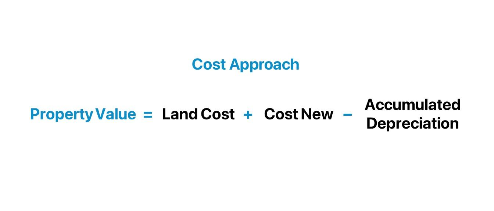

## Table of Contents

## What is the cost approach in real estate valuation?

The cost approach in real estate valuation is a method used to estimate the value of a property by calculating how much it would cost to build a similar property from scratch. This approach considers the cost of the land and the cost to construct the building, including materials and labor. If the property is older or has depreciated, the cost approach also takes into account the depreciation of the building, subtracting this from the total cost to get a more accurate value.

This method is particularly useful for valuing new properties or unique properties where there are few comparable sales to use as a reference. For example, it's often used for valuing special-purpose buildings like schools or churches, where finding similar properties to compare can be difficult. By focusing on the costs involved in creating the property, the cost approach provides a clear picture of what it would take to replace the property if it were destroyed or needed to be rebuilt.

## How does the cost approach differ from other valuation methods like the sales comparison and income approaches?

The cost approach to real estate valuation is different from the sales comparison and income approaches because it focuses on the cost of building the property from scratch. It adds up the price of the land and the cost to construct the building, including materials and labor. If the building is old, it also subtracts the amount the building has lost value over time, which we call depreciation. This method is helpful when you're looking at new buildings or special buildings like schools or churches, where it's hard to find similar properties to compare.

The sales comparison approach, on the other hand, looks at recent sales of similar properties in the same area. It adjusts these sales prices based on differences between the properties, like size or condition, to estimate the value of the property you're valuing. This method works well when there are many similar properties that have sold recently. The income approach is used mostly for rental properties. It estimates the value of a property by looking at how much income it can generate, like rent, and then figuring out what that income is worth now. This approach is useful for investors who want to know if a property will make them money over time.

## What are the main steps involved in applying the cost approach?

To use the cost approach for valuing a property, the first step is to find out the cost of the land where the property is built. You can do this by looking at recent sales of similar empty land in the area. Once you know the land's value, the next step is to calculate how much it would cost to build the property from scratch. This includes the cost of all materials and the labor needed to put everything together. It's important to use current prices for materials and labor to get an accurate estimate.

After figuring out the cost to build the property, you need to consider depreciation if the building is not new. Depreciation means the building has lost some value over time because of wear and tear or because it's not as modern as newer buildings. You subtract this depreciation from the total cost of building the property. Once you've done all these steps, you add the value of the land to the adjusted building cost to get the total value of the property using the cost approach. This method is helpful for new properties or special buildings where it's hard to find similar properties to compare.

## What types of properties are best suited for valuation using the cost approach?

The cost approach is best for valuing new properties or buildings that are unique and hard to compare with others. When a building is new, you can easily figure out how much it cost to build it and add that to the land value. This gives a good idea of what the property is worth. It's also useful for special buildings like schools, churches, or government buildings, where you can't find many similar properties that have sold recently.

For these unique or new properties, the cost approach works well because it focuses on what it would cost to build the property from scratch. If a building is old, you need to think about how much value it has lost over time, which we call depreciation. You subtract this from the building cost and then add the land value to get the total property value. This method helps give a clear picture of what it would take to replace the property if it were destroyed or needed to be rebuilt.

## How do you estimate the land value in the cost approach?

To estimate the land value in the cost approach, you look at recent sales of similar empty land in the same area. This helps you figure out what people are paying for land like yours. You need to make sure the land you're comparing is similar in size, location, and use. If there are differences, you adjust the price to match your property better.

Once you have a good idea of the land value from these comparisons, you use that number as the starting point for your cost approach valuation. This land value is important because it's added to the cost of building the property to get the total value. By focusing on what similar land is selling for, you get a fair estimate of what your land is worth.

## What methods are used to estimate the cost of improvements in the cost approach?

To estimate the cost of improvements in the cost approach, you need to figure out how much it would cost to build the property from scratch. This includes the cost of all the materials and the labor needed to put everything together. You can use something called the "unit-in-place" method, where you estimate the cost of each part of the building, like the walls, roof, and plumbing, and then add them all up. Another way is the "quantity survey" method, where you list every single item needed for the building and calculate the cost of each one.

Once you have these costs, you need to make sure they're up to date. You use current prices for materials and labor to get an accurate estimate. If the building is not new, you also have to think about depreciation. Depreciation means the building has lost some value over time because of wear and tear or because it's not as modern as newer buildings. You subtract this depreciation from the total cost of building the property. This way, you get a good idea of what it would cost to replace the building if it were destroyed or needed to be rebuilt.

## How is depreciation calculated in the cost approach, and what types of depreciation are considered?

Depreciation in the cost approach means figuring out how much a building has lost value over time. You do this by looking at three types of depreciation: physical deterioration, functional obsolescence, and external obsolescence. Physical deterioration is the wear and tear that happens naturally over time, like a roof that's starting to leak or walls that need painting. Functional obsolescence happens when the building's design or features are out of date, like a house with only one bathroom when most people expect more. External obsolescence is when something outside the property, like a noisy airport nearby, makes the property less valuable.

To calculate depreciation, you estimate how much each type affects the building's value. For physical deterioration, you might look at the age of the building and how well it's been maintained. For functional obsolescence, you compare the building to what's popular and expected today. For external obsolescence, you consider how the neighborhood or surrounding area has changed. Once you have these estimates, you add them up and subtract the total from the cost to build the building new. This gives you a more accurate value of the property because it takes into account all the ways the building might have lost value over time.

## Can you explain the concept of reproduction cost versus replacement cost in the context of the cost approach?

When you're using the cost approach to value a property, you might hear about two terms: reproduction cost and replacement cost. Reproduction cost means figuring out how much it would cost to build an exact copy of the building, using the same materials and methods that were used when it was first built. So, if the building is old and was built with materials or techniques that aren't used anymore, you'd have to find those exact things to match it perfectly.

Replacement cost, on the other hand, is about figuring out how much it would cost to build a new building that's just as good as the old one, but using today's materials and building methods. This means you don't have to find old-fashioned materials or techniques. Instead, you use what's available and common now to build something that does the same job as the old building. Both methods help you understand the value of the property, but they look at it from slightly different angles depending on whether you're trying to copy the building exactly or just replace it with something similar but modern.

## What are the common challenges and limitations of using the cost approach in real estate valuation?

Using the cost approach in real estate valuation can be tricky because it's hard to figure out the exact cost of building a property from scratch. You need to know the current prices for all the materials and the labor, which can change a lot. If you're using the reproduction cost method, finding the same old materials and techniques can be even harder. Also, guessing how much a building has lost value over time, which we call depreciation, is not easy. You have to think about physical wear and tear, outdated designs, and even things outside the property that might affect its value.

Another challenge is that the cost approach might not give you the best idea of a property's market value. Just because it would cost a lot to build something doesn't mean people are willing to pay that much for it. For example, if a building is in a bad neighborhood or if there are too many similar buildings around, it might not be worth as much as the cost approach says. This method works best for new buildings or special buildings like schools or churches, but it's not always the best choice for other types of properties.

## How can the accuracy of the cost approach be improved in practice?

To make the cost approach more accurate, you need to be very careful about the numbers you use. Start by getting the latest prices for building materials and labor. These prices can change a lot, so using up-to-date numbers is important. When you're figuring out the cost of the land, look at recent sales of similar empty land in the same area. Make sure the land you're comparing is similar in size, location, and use. If there are differences, adjust the price to match your property better. This way, you get a fair estimate of what your land is worth.

Another way to improve accuracy is to be thorough when calculating depreciation. You need to think about physical wear and tear, outdated designs, and even things outside the property that might affect its value. For physical deterioration, look at the age of the building and how well it's been maintained. For functional obsolescence, compare the building to what's popular and expected today. For external obsolescence, consider how the neighborhood or surrounding area has changed. By carefully estimating each type of depreciation and adding them up, you can subtract a more accurate total from the cost to build the building new. This gives you a better idea of the property's value because it takes into account all the ways the building might have lost value over time.

## What role does the cost approach play in the valuation of special purpose properties?

The cost approach is very helpful when you need to value special purpose properties, like schools, churches, or government buildings. These properties are unique, so it's hard to find other similar properties to compare them to. The cost approach helps by figuring out how much it would cost to build a similar property from scratch. This includes the price of the land and all the costs to build the building, like materials and labor. If the building is old, you also need to think about how much value it has lost over time, which we call depreciation. You subtract this from the building cost and then add the land value to get the total property value.

Using the cost approach for special purpose properties makes sense because these buildings are often one-of-a-kind. It's not easy to find recent sales of similar properties to use as a reference. By focusing on what it would cost to build the property today, the cost approach gives a clear picture of what it would take to replace the property if it were destroyed or needed to be rebuilt. This method helps property owners, buyers, and appraisers understand the value of these unique buildings in a way that other methods might not.

## How do economic and market conditions affect the application of the cost approach in real estate valuation?

Economic and market conditions can really change how you use the cost approach in real estate valuation. If the economy is doing well, the prices for building materials and labor might go up. This means the cost to build a new property could be higher, which would make the value of the property higher too when using the cost approach. On the other hand, if the economy is not doing well, these costs might go down, so the value you get from the cost approach would be lower. Also, if there's a lot of demand for properties in the market, people might be willing to pay more than what the cost approach says, because they see the property as more valuable.

Market conditions can also affect how much a property depreciates. For example, if a new technology makes old buildings less useful, that could increase the functional obsolescence part of depreciation. Or if a neighborhood starts to decline, that could increase external obsolescence, making the property less valuable. So, when you're using the cost approach, you need to think about these economic and market conditions to get a more accurate value for the property. By considering these factors, you can adjust your calculations to better reflect what's happening in the real world.

## What is the Cost Approach Method?

The cost approach method is a fundamental technique in real estate appraisal, primarily used to determine a property's value based on the cost to replace or reproduce the structure. This method assumes that a buyer will not pay more for a property than the cost of constructing a similar one with the same functionality and utility. Consequently, the cost approach is often considered when valuing unique properties, such as public buildings or new constructions, where resale data might not be readily available or applicable.

### Components of the Cost Approach

The cost approach involves three main components: replacement cost, depreciation, and land value.

1. **Replacement Cost**: This refers to the current cost of constructing a building with the same utility using modern materials and methods. Replacement cost is a critical part of the calculation since it encompasses the expenses that would be necessary to recreate the structure in question. It’s important to distinguish it from the concept of reproduction cost, which implies creating an exact replica using identical materials and techniques.

2. **Depreciation**: Depreciation accounts for the loss in value resulting from physical deterioration, functional obsolescence, or external factors. There are several methods to estimate depreciation, including straight-line, unit of production, and declining balance methods. For example, 
$$
   \text{Depreciation} = \frac{\text{Cost of Building} - \text{Resale or Salvage Value}}{\text{Useful Life}}

$$

   This formula reflects the annual depreciation when using a straight-line method.

3. **Land Value**: Land value is estimated separately since it does not depreciate like structures. Various techniques are used to evaluate land value, including sales comparison, allocation, and extraction methods. The land’s market value is then added to the depreciated value of the building to achieve the overall property valuation under the cost approach.

### Applications of the Cost Approach

The cost approach is particularly useful in certain scenarios:

- **New Constructions**: For properties where market comparables are lacking or nonexistent, such as new subdivisions or recently erected buildings, the cost approach provides a reliable estimate by focusing on construction cost rather than sales data.

- **Special-Use Properties**: This method is ideal for unique, often utilitarian structures, such as schools, churches, or factories, where individualized usage diminishes the applicability of sales comparisons. 

- **Insurance Purposes**: The cost approach is commonly used in insurance appraisals to determine the replacement cost for policy coverage in the event of loss or damage.

While the cost approach provides a logical and structured framework for appraisal, it is essential to remember its limitations. The accuracy of the valuation hinges on the reliability of replacement cost estimates and the subjective nature of depreciation assessments. Therefore, this method is often used in conjunction with other appraisement strategies to ensure comprehensive and accurate property evaluation.

## How are Machine Learning and Big Data utilized in Real Estate?

Machine learning and big data are increasingly crucial in the field of real estate, offering enhanced tools for analyzing vast datasets that can significantly improve property value predictions and market forecasts. Machine learning models process large volumes of data, identifying patterns and correlations that are often beyond human capability, thus providing a more comprehensive understanding of the real estate market dynamics.

Machine learning algorithms, such as regression models, decision trees, and neural networks, are used to analyze historical and current data, including property prices, economic indicators, and demographic trends. By learning from these data sets, models can predict future market trends, assess property values more accurately, and even forecast neighborhood development potential. One common application is through predictive analytics where machine learning models forecast future price movements based on various influencing factors. The formula typically applied in such scenarios is:

$$
\hat{y} = f(X) + \epsilon
$$

Here, $\hat{y}$ represents the predicted property value, $f(X)$ describes the function mapping the input features (economic indicators, historical prices, etc.) to this prediction, and $\epsilon$ indicates the error term.

Big data plays a supportive role by ensuring that these models have ample high-quality information to learn from. This encompasses data sourced from government records, satellite images, social media, IoT sensors, and more. With the advent of Internet of Things (IoT), data streams related to environmental conditions, traffic patterns, and even real-time energy usage provide richer datasets for more nuanced analyses. This abundance of data allows machine learning algorithms to refine their predictions continually, leading to more precise and reliable property valuations and market forecasts.

Real-world applications of machine learning in real estate are diverse. Automated Valuation Models (AVMs) are widely used by real estate firms to assess property values by combining vast datasets with sophisticated algorithms. Predictive maintenance is another application where machine learning predicts when building systems might fail, allowing for proactive maintenance and cost savings.

Moreover, applications in trading involve algorithmic strategies using vast datasets for optimizing properties' buying and selling processes. Real estate platforms leverage machine learning to match buyers and sellers more effectively, using recommendations systems similar to those employed by e-commerce giants.

For example, Zillow utilizes machine learning algorithms to power its Zestimate feature, which provides consumers with real-time valuation estimates for millions of homes across the United States. This tool analyzes data such as sales transactions, tax assessments, and public data to offer insights into home valuations.

By integrating machine learning and big data, the potential to enhance decision-making in real estate is substantially increased, enabling industry stakeholders to achieve a competitive edge through precise analytics and data-driven strategies.

## References & Further Reading

[1]: Bergstra, J., Bardenet, R., Bengio, Y., & Kégl, B. (2011). ["Algorithms for Hyper-Parameter Optimization."](https://dl.acm.org/doi/10.5555/2986459.2986743) Advances in Neural Information Processing Systems 24.

[2]: ["Advances in Financial Machine Learning"](https://www.amazon.com/Advances-Financial-Machine-Learning-Marcos/dp/1119482089) by Marcos Lopez de Prado

[3]: ["Evidence-Based Technical Analysis: Applying the Scientific Method and Statistical Inference to Trading Signals"](https://www.amazon.com/Evidence-Based-Technical-Analysis-Scientific-Statistical/dp/0470008741) by David Aronson

[4]: ["Machine Learning for Algorithmic Trading"](https://github.com/stefan-jansen/machine-learning-for-trading) by Stefan Jansen

[5]: ["Quantitative Trading: How to Build Your Own Algorithmic Trading Business"](https://www.amazon.com/Quantitative-Trading-Build-Algorithmic-Business/dp/1119800064) by Ernest P. Chan