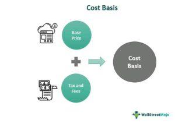

This article explores the concept of cost basis calculation in the context of algorithmic trading. Cost basis refers to the original value of an asset, which is essential for determining capital gains taxes. In trading, precise cost basis calculations are vital for accurately assessing the profitability of trades and optimizing investment portfolios. Algorithmic trading, with its dependence on precise and instantaneous calculations, can greatly benefit from accurate cost basis determination as it affects trading strategies and financial outcomes.

Investors need to understand how cost basis affects their trading strategies. For instance, it influences the timing of sales and the selection of investment lots, which, in turn, impact the optimization of investment portfolios. Accurate cost basis calculations can lead to improved portfolio performance by ensuring that capital gains or losses are correctly reported and potential tax savings are realized. This is especially important as tax regulations can be complex and vary by jurisdiction.



This discussion will include example calculations and scenarios for use in algorithmic trading. Cost basis determination can involve different methods such as First-In-First-Out (FIFO), Last-In-First-Out (LIFO), and Specific Identification, each with unique tax implications. These methods can affect the reported gains and thus the tax liabilities of investors. The choice of method and its implementation in trading algorithms can have significant financial effects over time.

Managing taxes effectively is a crucial aspect of developing profitable trading strategies. By understanding cost basis, investors can make informed decisions that align with their financial goals and market strategies. Implementing these calculations within algorithmic trading systems allows for real-time adjustments that enhance decision-making efficiency and portfolio management.

Algorithmic trading systems rely on programming languages like Python to automate financial strategies. These systems use data analysis and modeling to simulate various trading scenarios and adjust for cost basis automatically. Through accurate cost basis determination, these algorithms can better manage risk and maximize returns from trading activities.

In summary, cost basis calculation plays a critical role in managing investments strategically. Investors can better manage taxes and enhance profitability by selecting an appropriate cost basis method that aligns with their financial objectives. Algorithmic trading provides a unique advantage by enabling real-time cost basis adjustments, thus supporting more effective trading decisions and portfolio performance. Understanding and implementing these concepts are essential for anyone engaged in algorithmic trading and investment management.

## Table of Contents

## Understanding Cost Basis in Trading

Cost basis represents the original value of an asset, a key figure in tax calculation, as it determines the capital gains or losses realized from a sale. It serves as the baseline from which profit or loss is calculated when an asset is sold. Calculating cost basis accurately is essential for traders and investors as it impacts tax liability significantly. This value is not static; it requires adjustments for certain events like stock splits, dividends, and return of capital distributions.

When a stock undergoes a split, the cost basis of each individual share adjusts to reflect the increased number of shares, so the total investment value remains constant. For instance, in a 2-for-1 stock split, the investor will end up with twice the number of shares at half the original cost basis per share. Dividends reinvested in more shares also affect cost basis, as each purchase needs to be accounted for in the total cost.

Several methods can calculate cost basis, each with tax implications. The most common methods include First-In, First-Out (FIFO), Last-In, First-Out (LIFO), and the Average Cost method. 

- **First-In, First-Out (FIFO)**: Assumes the first shares purchased are sold first. This method is advantageous in a rising market, usually resulting in lower cost basis and higher reported capital gains.

- **Last-In, First-Out (LIFO)**: Assumes the last shares purchased are sold first. Inversely, in a declining market, this can be beneficial since it might reflect a higher cost basis and lower taxable gains.

- **Average cost basis**: Useful for mutual funds and certain other holdings, this method calculates the total cost of acquired shares divided by the number of shares, simplifying the process, particularly when numerous purchases are involved over time.

The importance of correctly determining cost basis cannot be overstated. Miscalculations can lead to overpaid taxes or underreported gains, leading to potential legal and financial consequences. For example, consider purchasing shares in multiple transactions: 

```python
# Example of calculating average cost basis in Python
share_purchases = [(100, 10.00), (150, 15.00), (200, 12.50)] # (shares, price per share)
total_cost = sum(shares * price for shares, price in share_purchases)
total_shares = sum(shares for shares, price in share_purchases)
average_cost_basis = total_cost / total_shares
```

In this example, the `average_cost_basis` calculation involves totaling the product of each purchase price and the number of shares, then dividing by the total number of shares. Accurate calculations like this ensure correct reporting of gains, aligning investment strategies with financial goals and tax laws.

## Examples of Cost Basis Calculations

In the context of cost basis calculations, consider a scenario where an investor purchases shares of a company in several transactions over time. This results in owning multiple lots of the same stock, each acquired at different prices. Calculating the average cost basis becomes essential for determining the appropriate taxable gain or loss when the shares are eventually sold.

### Example of Average Cost Basis Calculation

Suppose an investor purchases 100 shares of Company X on three different occasions:
- 40 shares at $10 each,
- 30 shares at $15 each,
- 30 shares at $20 each.

The total cost of all shares can be calculated as follows:
$$
\text{Total Cost} = (40 \times 10) + (30 \times 15) + (30 \times 20) = 400 + 450 + 600 = \$1450
$$

The average cost basis per share is then:
$$
\text{Average Cost Basis} = \frac{\text{Total Cost}}{\text{Total Number of Shares}} = \frac{1450}{100} = \$14.50
$$

When the investor decides to sell any shares, the taxable gain or loss is calculated using this average cost basis per share.

### FIFO and LIFO Methods

To demonstrate the tax implications of different methods, consider FIFO (First-In-First-Out) and LIFO (Last-In-First-Out):

#### FIFO Method

Using the FIFO method, the oldest shares (those purchased first) are sold first. If the investor sells 50 shares at $25 each, the cost of the shares is determined from the oldest lot:
- Selling 40 shares from the $10 lot: $10 each
- Selling 10 shares from the $15 lot: $15 each

Total cost for sold shares:
$$
\text{FIFO Total Cost} = (40 \times 10) + (10 \times 15) = 400 + 150 = \$550
$$

The revenue from selling 50 shares at $25 each is:
$$
\text{Revenue} = 50 \times 25 = \$1250
$$

The taxable gain is:
$$
\text{FIFO Taxable Gain} = 1250 - 550 = \$700
$$

#### LIFO Method

In contrast, the LIFO method assumes the most recently acquired shares are sold first. Selling the same 50 shares, the cost comes from the newest lot:
- Selling 30 shares from the $20 lot: $20 each
- Selling 20 shares from the $15 lot: $15 each

Total cost for sold shares:
$$
\text{LIFO Total Cost} = (30 \times 20) + (20 \times 15) = 600 + 300 = \$900
$$

Clearly, this affects the taxable gain:
$$
\text{LIFO Taxable Gain} = 1250 - 900 = \$350
$$

These examples illustrate how the chosen cost basis method can lead to different outcomes for tax reporting. FIFO typically results in higher capital gains in a rising market, whereas LIFO might provide a tax advantage by realizing lower taxable income. Each method has strategic implications depending on market conditions and tax planning goals.

## Algorithmic Trading and Cost Basis

Algorithmic trading involves the use of computer-implemented strategies that make trading decisions based on pre-defined parameters and market conditions. One critical component of these strategies is the incorporation of cost basis calculations, which are essential for evaluating the profitability and viability of trades.

Algorithms utilize cost basis information to determine the potential gains or losses from trades by comparing the current market price of securities with their cost basis. This comparison allows traders to assess whether selling an asset would yield a profit or a loss, which is crucial for timely decision-making. For instance, if an asset's current market price exceeds its cost basis, the algorithm may signal a sell opportunity to realize a gain. Conversely, if the market price is below the cost basis, it might suggest holding or potentially buying more to average down the cost.

Incorporating cost basis calculations into automated trading strategies helps optimize trade decisions by ensuring that transactions are executed in a way that aligns with profitability goals and portfolio management objectives. This approach not only aids in increasing profits but also in managing portfolio risks effectively. By accurately accounting for the cost basis, traders can avoid executing trades that might inadvertently result in unnecessary losses or tax liabilities.

Example algorithms in Python are particularly adept at dynamically calculating cost basis to support real-time trading decisions. Python's extensive libraries and modules, such as NumPy and Pandas, streamline processes involving large datasets and complex calculations. A basic Python function to calculate the average cost basis of a stock position might look like this:

```python
def calculate_average_cost_basis(transactions):
    total_cost = 0
    total_shares = 0

    for transaction in transactions:
        shares, price = transaction
        total_cost += shares * price
        total_shares += shares

    if total_shares == 0:
        return 0
    return total_cost / total_shares

# Example usage:
transactions = [(50, 200), (30, 220), (20, 210)]  # (shares, price per share)
print(f"Average Cost Basis: ${calculate_average_cost_basis(transactions):.2f}")
```

In this example, `transactions` is a list of tuples representing the shares bought and their respective prices. The function computes the total cost and total shares to derive the average cost basis. Automated deployments of such functions in [algorithmic trading](/wiki/algorithmic-trading) platforms assist traders by constantly updating cost basis figures as new transactions occur, thus keeping the information current and relevant for decision-making.

In summary, the integration of cost basis calculations in algorithmic trading strategies enhances the ability to manage investment decisions and risks adeptly. By leveraging dynamic programming capabilities, traders achieve greater precision and efficiency in executing trades and optimizing portfolio performance while maintaining a clear focus on maximizing profitability and minimizing tax impacts.

## Types of Cost Basis Methods

Cost basis calculation methods are essential tools for investors and traders, each offering specific strategic advantages based on varying market conditions and financial goals. Here's an overview of the primary methodologies:

### First-In, First-Out (FIFO)
The FIFO method assumes that the first assets purchased are the first to be sold. This approach is particularly advantageous in rising markets, where older shares typically have lower cost bases, resulting in higher capital gains. The formula for calculating the cost basis under FIFO is straightforward:

$$
\text{FIFO Cost Basis} = \sum (\text{Price per Share} \times \text{Number of Shares Sold})
$$

This method can lead to higher tax liabilities when asset prices increase over time, as earlier purchases generally reflect lower acquisition costs.

### Last-In, First-Out (LIFO)
In contrast, the LIFO method assumes that the latest assets purchased are the first to be sold. This method is beneficial in falling markets because assets acquired more recently might have a higher cost basis, potentially reducing capital gains and thus tax liabilities. LIFO is especially suitable for commodities or inventory where prices frequently fluctuate. The LIFO calculation is expressed as:

$$
\text{LIFO Cost Basis} = \sum (\text{Latest Purchase Price per Share} \times \text{Number of Shares Sold})
$$

### Specific Identification
Specific identification offers the most precision by allowing investors to select the exact shares to sell. This method provides flexibility in tax planning, enabling investors to strategically manage capital gains or losses. The specificity is useful for tax optimization through strategies like tax-loss harvesting, allowing investors to choose shares with the most advantageous cost basis:

```python
def specific_identification(shares, quantity_to_sell):
    shares.sort(key=lambda x: x['price'])  # Sort shares by price for optimal performance
    selected_shares = []
    remaining_quantity = quantity_to_sell

    for share in shares:
        if remaining_quantity <= 0:
            break
        if share['quantity'] <= remaining_quantity:
            selected_shares.append(share)
            remaining_quantity -= share['quantity']
        else:
            partial_share = share.copy()
            partial_share['quantity'] = remaining_quantity
            selected_shares.append(partial_share)
            break

    return selected_shares
```

### Average Cost Basis
The average cost basis method simplifies the management of large transactions over time by averaging the cost of all shares. This method is particularly useful for mutual funds and ETFs, where holding multiple share lots at different purchase prices is common. The formula for calculating the average cost is:

$$
\text{Average Cost Basis} = \frac{\sum (\text{Total Cost of all Shares})}{\text{Total Number of Shares}}
$$

This method smooths out the impact of price fluctuations over time, providing consistency in reporting and reducing the complexity of managing numerous transactions.

Each cost basis method serves different strategic purposes, and selecting the appropriate method depends on the investor's specific goals, tax situation, and market conditions. Understanding these options allows investors to optimize their tax outcomes and align their investment strategies effectively.

## Implications for Tax Reporting

Choosing an appropriate cost basis method is pivotal in the determination of reported capital gains, which directly influences tax liabilities. The method chosen dictates not only the amount of capital gains tax but also its timing, thereby impacting an investor's financial strategy significantly.

Different cost basis methods, such as First-In-First-Out (FIFO), Last-In-First-Out (LIFO), and specific identification, offer various approaches to calculating gains and losses. These methods determine the order in which assets are sold, which affects the cost basis used in tax calculations. For example, under the FIFO method, the oldest shares are sold first, which might be advantageous in a rising market as older shares tend to have lower costs. Conversely, LIFO, selling the most recent purchases first, could be more beneficial in a falling market where newer acquisitions might have higher costs.

Tax strategies, such as tax-loss harvesting, can capitalize on these variations. By strategically selling securities at a loss to offset capital gains, investors can reduce their taxable income. This is particularly effective when paired with careful selection of the cost basis method, as it enables fine-tuning of realized gains.

Moreover, a clear understanding and accurate application of cost basis rules are essential for ensuring compliance with tax regulations and optimizing tax payments. Implementing these rules without adherence can lead to inaccuracies in reported gains, potential penalties, and missed opportunities for tax optimization.

For instance, using Python, investors can automate the calculation and application of these methodologies, maintaining up-to-date records that reflect the actual market conditions and portfolio changes. This automation not only simplifies the management of assets but also ensures accuracy in compliance reporting. Here's an example snippet to calculate cost basis using FIFO in Python:

```python
def calculate_fifo_cost_basis(transactions):
    cost_basis = 0
    quantity = 0

    for txn in sorted(transactions, key=lambda x: x['date']):
        if txn['type'] == 'buy':
            cost_basis += txn['price'] * txn['quantity']
            quantity += txn['quantity']
        elif txn['type'] == 'sell' and quantity > 0:
            sold_qty = min(quantity, txn['quantity'])
            cost_basis -= (cost_basis / quantity) * sold_qty
            quantity -= sold_qty

    return cost_basis

transactions = [
    {'date': '2022-01-01', 'type': 'buy', 'price': 100, 'quantity': 10},
    {'date': '2022-02-01', 'type': 'buy', 'price': 110, 'quantity': 10},
    {'date': '2022-03-01', 'type': 'sell', 'price': 120, 'quantity': 5}
]

fifo_cost_basis = calculate_fifo_cost_basis(transactions)
print(f"FIFO Cost Basis: {fifo_cost_basis}")
```

This function tallies purchases and applies them against sales in the order they were acquired, reflecting FIFO methodology. Such technical applications enhance precision in capital gains calculations and support strategic tax planning for investors.

## Conclusion

Cost basis calculation is essential for strategic investment management, offering significant advantages in algorithmic trading. The selection of a cost basis method—such as FIFO (First In, First Out), LIFO (Last In, First Out), specific identification, or average cost—can be tailored to align with financial goals and market strategies. Each method presents unique implications for capital gains taxation; thus, choosing the right one is vital for both compliance and tax optimization.

Algorithmic trading thrives on precise and timely data, making real-time cost basis adjustments a crucial feature. By incorporating cost basis computations into trading algorithms, investors can improve decision-making efficiency. For instance, an algorithm programmed in Python can track the cost basis of assets in real time, providing immediate insights into potential gains or losses. This adaptability ensures that trading strategies remain aligned with changing market conditions and investor objectives.

Furthermore, integrating cost basis into trading algorithms enhances tax management. By dynamically and accurately calculating the cost basis, algorithms can aid in executing tax strategies like tax-loss harvesting, thus optimizing the portfolio's overall performance. This not only improves tax efficiency but also contributes to maximized returns by considering the tax impact during transaction execution.

In conclusion, understanding and effectively applying cost basis calculations in trading algorithms lead to improved investment strategies, better tax outcomes, and enhanced portfolio returns. Such integration allows for a more informed approach to trading and investment management, aligning business objectives with regulatory requirements and market opportunities.

## References & Further Reading

[1]: ["Taxation of Investment Decisions: Application to U.S. Taxation of Trading Gains and Losses"](https://www.theoasisfirm.com/tax-news/tax-implications-of-investment-decisions-a-guide-by-enrolled-agents/) - Journal of the American Taxation Association

[2]: ["IRS Publication 550 – Investment Income and Expenses"](https://www.irs.gov/publications/p550) - Internal Revenue Service (IRS)

[3]: ["Investing for Dummies"](https://www.nerdwallet.com/article/investing/investing-101) by Eric Tyson

[4]: ["Algorithmic Trading: Winning Strategies and Their Rationale"](https://www.amazon.com/Algorithmic-Trading-Winning-Strategies-Rationale-ebook/dp/B00CY5HC0U) by Ernie Chan

[5]: ["Fidelity Investments - Basics of Investing: Cost Basis"](https://www.fidelity.com/tax-information/tax-topics/capital-gains-cost-basis) - Fidelity Investments

[6]: ["Cost Basis Reporting: A Major Change for Financial Services Firms"](https://www.alvarezandmarsal.com/insights/cost-basis-reporting-why-corporate-issuers-and-not-just-brokers-should-care) - Journal of Accountancy

[7]: ["Understanding the FIFO and LIFO Inventory Accounting Methods"](https://www.investopedia.com/terms/l/lifo.asp) - Investopedia