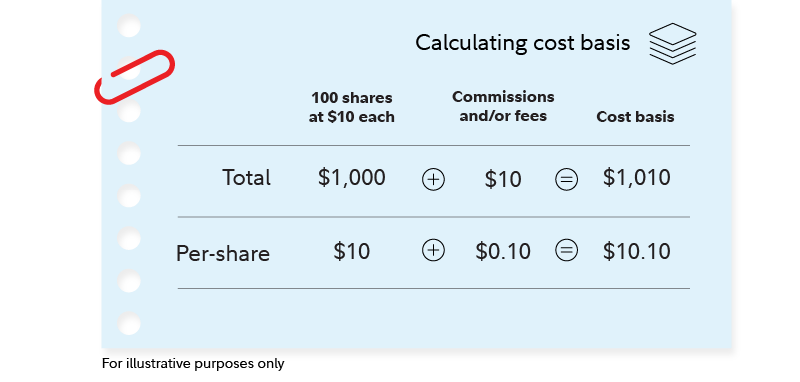

## Table of Contents

## What is cost basis and why is it important?

Cost basis is the original value of an asset, like a stock or a piece of property, that you bought. It's the price you paid for it, plus any fees or commissions you had to pay to buy it. Knowing the cost basis is important because it helps you figure out how much money you've made or lost when you sell the asset. This is called your capital gain or loss.

Understanding your cost basis is really important for taxes. When you sell an asset, you need to report any profit or loss on your tax return. If you sell it for more than you paid, you have a capital gain, and you might have to pay taxes on that gain. If you sell it for less, you have a capital loss, which can sometimes help lower your taxes. Keeping track of your cost basis helps you do all this correctly and avoid any trouble with the tax people.

## How do you calculate the cost basis for a single stock purchase?

To calculate the cost basis for a single stock purchase, you start with the price you paid for each share of the stock. Then, you add any fees or commissions you had to pay to buy the stock. For example, if you bought 100 shares of a stock at $50 per share, and you paid a $10 commission, your total cost would be (100 shares x $50 per share) + $10 = $5,010. This total amount, $5,010, is your cost basis for that stock purchase.

Knowing your cost basis is important because it helps you figure out how much money you made or lost when you sell the stock. If you sell the stock for more than your cost basis, you have a capital gain, which might be taxed. If you sell it for less, you have a capital loss, which can sometimes help lower your taxes. Keeping track of your cost basis makes it easier to report your gains or losses accurately on your tax return.

## What are the different methods for calculating cost basis?

There are a few different ways to calculate the cost basis of your investments, and the method you choose can affect how much tax you pay when you sell. The first method is the "First In, First Out" or FIFO method. This means you sell the shares you bought first before selling the ones you bought later. For example, if you bought shares in January and then more in June, when you sell, you use the cost of the January shares first. This method is simple but might not always be the best for saving on taxes.

Another method is the "Specific Identification" method. This one lets you choose which shares you want to sell. You need to keep good records of which shares you bought when and at what price. This can be more work, but it can help you pick the shares that will give you the best tax result. For example, if you want to minimize your taxes, you can sell the shares that have gone up the least in value.

The last common method is the "Average Cost" method, which is often used for mutual funds. With this method, you figure out the average price you paid for all the shares you own. To do this, you add up the total amount you spent on the shares and divide it by the total number of shares you have. This method can be easier because you don't have to keep track of when you bought each share, but it might not give you the best tax outcome in every situation.

## How does cost basis affect capital gains tax?

Cost basis is super important when it comes to figuring out how much tax you owe on your capital gains. When you sell an investment, like a stock, you compare the price you sell it for to your cost basis. If you sell it for more than your cost basis, you have a capital gain. The tax you pay on that gain depends on how big the gain is and how long you held the investment. If you held it for more than a year, it's a long-term capital gain, which usually has a lower tax rate. If you held it for a year or less, it's a short-term capital gain, and you pay your regular income tax rate on it.

The way you calculate your cost basis can also change how much tax you pay. For example, if you use the "First In, First Out" method, you might end up paying more tax than if you used the "Specific Identification" method, where you can pick which shares to sell. Picking the right method can help you lower your tax bill. It's all about keeping good records and understanding how different methods affect your taxes.

## Can the cost basis change after the initial purchase?

Yes, the cost basis can change after you first buy an investment. One way it can change is if you make improvements to the asset. For example, if you buy a house and then spend money to add a new room, the cost of that room gets added to your original cost basis. Another way is through reinvested dividends. If you own a stock that pays dividends and you use those dividends to buy more shares of the stock, the price you paid for those new shares gets added to your cost basis.

The cost basis can also change because of stock splits or mergers. In a stock split, the number of shares you own changes, but the total value stays the same. You need to adjust your cost basis to reflect the new number of shares. In a merger, if you get new shares in another company, you have to figure out how much of your original cost basis goes to the new shares. Keeping track of these changes is important because they affect how much tax you'll owe when you sell your investment.

## How do you calculate cost basis for mutual funds or ETFs?

Calculating the cost basis for mutual funds or ETFs is a bit different from single stocks, but it's still pretty straightforward. The most common way to do it is by using the "Average Cost" method. With this method, you add up the total amount of money you've spent on buying the shares and then divide it by the total number of shares you own. This gives you the average price you paid for each share. For example, if you spent $1,000 to buy 50 shares at one time and then another $1,000 to buy 50 more shares later, your total cost is $2,000 for 100 shares. Your average cost per share would be $2,000 divided by 100, which is $20 per share.

Another way to calculate the cost basis for mutual funds or ETFs is the "First In, First Out" (FIFO) method. This means you sell the shares you bought first before selling the ones you bought later. So if you bought shares in January and then more in June, when you sell, you use the cost of the January shares first. This method can be simpler to track, but it might not always be the best for saving on taxes. You can also use the "Specific Identification" method, where you choose which specific shares you want to sell. This can be more work because you need to keep good records, but it can help you pick the shares that will give you the best tax result.

## What is the impact of dividends and stock splits on cost basis?

When you get dividends from your stocks and you use them to buy more shares, it changes your cost basis. Let's say you own a stock that pays dividends and you choose to reinvest those dividends to buy more shares. The money you use to buy those new shares adds to your original cost basis. For example, if you started with 100 shares that cost $10 each, your cost basis is $1,000. If you get $100 in dividends and use that to buy 10 more shares at $10 each, your new cost basis becomes $1,100. This is important because when you sell your shares, you'll use this new, higher cost basis to figure out if you made a profit or a loss.

Stock splits also change your cost basis, but in a different way. When a company does a stock split, they give you more shares, but the total value of your investment stays the same. Let's say you have 100 shares of a stock that cost $10 each, so your cost basis is $1,000. If the company does a 2-for-1 stock split, you now have 200 shares, but each share is worth $5. Your cost basis stays $1,000, but it's now spread over 200 shares, so your cost basis per share becomes $5. Keeping track of these changes is important because they affect how much tax you'll owe when you sell your shares.

## How do you handle cost basis for inherited assets?

When you inherit an asset, like a stock or a piece of property, the cost basis changes. Instead of using what the original owner paid for it, you use the value of the asset on the day the person who left it to you passed away. This is called the "stepped-up basis." For example, if your grandma bought a stock for $10 a share and it was worth $50 a share when she passed away, your cost basis for that stock would be $50 a share, not $10. This can be really helpful because if you sell the stock right away, you might not have to pay as much in taxes.

Sometimes, figuring out the value of the asset on the day of death can be tricky. You might need to get an appraisal or use the value listed on the date of death if it's a stock that's easy to find the price for. If the asset has gone up a lot in value since it was bought, the stepped-up basis can save you a lot of money on taxes. But if it's gone down in value, you might want to use the original cost basis instead, if that's allowed. It's a good idea to talk to a tax professional to make sure you're doing everything right and getting the best tax outcome.

## What are the rules for calculating cost basis on gifted assets?

When you get a gift like a stock or a piece of property, figuring out the cost basis can be a bit tricky. If the person giving you the gift paid less for it than it's worth when they give it to you, your cost basis is the same as theirs. For example, if your friend bought a stock for $10 a share and it's worth $20 a share when they give it to you, your cost basis is still $10 a share. But if you sell it for more than $10 a share, you'll have to pay taxes on the difference between $10 and the selling price.

If the gift has gone down in value since the person bought it, things get a bit more complicated. If you sell it for less than what it was worth when you got it but more than what the original owner paid, you use their cost basis to figure out your gain or loss. But if you sell it for less than what the original owner paid, you can use the value of the gift when you got it as your cost basis. This way, you can claim a loss on your taxes. Keeping good records and maybe talking to a tax professional can help make sure you're doing everything right.

## How do you calculate cost basis for cryptocurrency transactions?

Calculating the cost basis for [cryptocurrency](/wiki/cryptocurrency) transactions is similar to doing it for stocks, but it can be a bit trickier because crypto prices can change a lot. When you buy a cryptocurrency, your cost basis is the price you paid for it, plus any fees you had to pay to buy it. For example, if you bought 1 Bitcoin for $30,000 and paid a $100 fee, your cost basis for that Bitcoin would be $30,100. If you buy more Bitcoin at different times, you'll need to keep track of the cost basis for each purchase separately.

When you sell or trade your cryptocurrency, you need to figure out your capital gain or loss by comparing the selling price to your cost basis. If you're selling part of your holdings, you can use different methods to figure out which coins you're selling. The most common method is "First In, First Out" (FIFO), where you sell the coins you bought first. For example, if you bought 1 Bitcoin at $30,000 and another at $40,000, and you sell 1 Bitcoin for $50,000, you'd use the $30,000 cost basis to figure out your gain. Keeping good records of all your transactions is really important because it helps you figure out your taxes correctly.

## What are the implications of wash sales on cost basis?

A wash sale happens when you sell a stock or another investment at a loss and then buy the same or a similar investment within 30 days before or after the sale. When this happens, the IRS doesn't let you claim the loss right away to lower your taxes. Instead, they add the loss to the cost basis of the new investment you bought. For example, if you sold a stock for a $1,000 loss and bought the same stock again within 30 days, that $1,000 loss gets added to the price you paid for the new stock. This means your cost basis for the new stock goes up by $1,000.

This rule can affect how much tax you pay when you finally sell the new investment. If you sell it for a profit, the higher cost basis might mean you pay less in taxes because your gain is smaller. But if you sell it at a loss again, you might not be able to claim that loss right away if you buy the same or a similar investment within 30 days. Keeping track of your transactions and understanding the wash sale rule is important so you can plan your investments and taxes better.

## How do professional investors manage and track cost basis across multiple asset types?

Professional investors manage and track cost basis across multiple asset types by using special software and tools that help them keep everything organized. These tools can handle different kinds of investments like stocks, bonds, mutual funds, and even cryptocurrencies. They keep track of when each asset was bought, how much was paid for it, and any changes that might affect the cost basis, like dividends or stock splits. This makes it easier for investors to figure out their gains or losses when they sell their investments and to report everything correctly on their taxes.

It's really important for professional investors to keep good records because they often have a lot of different investments. They need to know the cost basis for each one so they can make smart decisions about when to sell and how to manage their taxes. Sometimes, they might even work with tax professionals who can help them use the best methods for calculating cost basis, like FIFO, Specific Identification, or Average Cost, depending on what will save them the most money on taxes. Keeping everything clear and up-to-date helps them stay on top of their investments and avoid any trouble with the tax people.

## What are the types of cost basis methods?

Cost basis calculation methods are essential tools for investors and traders, each offering specific strategic advantages based on varying market conditions and financial goals. Here's an overview of the primary methodologies:

### First-In, First-Out (FIFO)
The FIFO method assumes that the first assets purchased are the first to be sold. This approach is particularly advantageous in rising markets, where older shares typically have lower cost bases, resulting in higher capital gains. The formula for calculating the cost basis under FIFO is straightforward:

$$
\text{FIFO Cost Basis} = \sum (\text{Price per Share} \times \text{Number of Shares Sold})
$$

This method can lead to higher tax liabilities when asset prices increase over time, as earlier purchases generally reflect lower acquisition costs.

### Last-In, First-Out (LIFO)
In contrast, the LIFO method assumes that the latest assets purchased are the first to be sold. This method is beneficial in falling markets because assets acquired more recently might have a higher cost basis, potentially reducing capital gains and thus tax liabilities. LIFO is especially suitable for commodities or inventory where prices frequently fluctuate. The LIFO calculation is expressed as:

$$
\text{LIFO Cost Basis} = \sum (\text{Latest Purchase Price per Share} \times \text{Number of Shares Sold})
$$

### Specific Identification
Specific identification offers the most precision by allowing investors to select the exact shares to sell. This method provides flexibility in tax planning, enabling investors to strategically manage capital gains or losses. The specificity is useful for tax optimization through strategies like tax-loss harvesting, allowing investors to choose shares with the most advantageous cost basis:

```python
def specific_identification(shares, quantity_to_sell):
    shares.sort(key=lambda x: x['price'])  # Sort shares by price for optimal performance
    selected_shares = []
    remaining_quantity = quantity_to_sell

    for share in shares:
        if remaining_quantity <= 0:
            break
        if share['quantity'] <= remaining_quantity:
            selected_shares.append(share)
            remaining_quantity -= share['quantity']
        else:
            partial_share = share.copy()
            partial_share['quantity'] = remaining_quantity
            selected_shares.append(partial_share)
            break

    return selected_shares
```

### Average Cost Basis
The average cost basis method simplifies the management of large transactions over time by averaging the cost of all shares. This method is particularly useful for mutual funds and ETFs, where holding multiple share lots at different purchase prices is common. The formula for calculating the average cost is:

$$
\text{Average Cost Basis} = \frac{\sum (\text{Total Cost of all Shares})}{\text{Total Number of Shares}}
$$

This method smooths out the impact of price fluctuations over time, providing consistency in reporting and reducing the complexity of managing numerous transactions.

Each cost basis method serves different strategic purposes, and selecting the appropriate method depends on the investor's specific goals, tax situation, and market conditions. Understanding these options allows investors to optimize their tax outcomes and align their investment strategies effectively.

## References & Further Reading

[1]: ["Taxation of Investment Decisions: Application to U.S. Taxation of Trading Gains and Losses"](https://www.theoasisfirm.com/tax-news/tax-implications-of-investment-decisions-a-guide-by-enrolled-agents/) - Journal of the American Taxation Association

[2]: ["IRS Publication 550 – Investment Income and Expenses"](https://www.irs.gov/publications/p550) - Internal Revenue Service (IRS)

[3]: ["Investing for Dummies"](https://www.nerdwallet.com/article/investing/investing-101) by Eric Tyson

[4]: ["Algorithmic Trading: Winning Strategies and Their Rationale"](https://www.amazon.com/Algorithmic-Trading-Winning-Strategies-Rationale-ebook/dp/B00CY5HC0U) by Ernie Chan

[5]: ["Fidelity Investments - Basics of Investing: Cost Basis"](https://www.fidelity.com/tax-information/tax-topics/capital-gains-cost-basis) - Fidelity Investments

[6]: ["Cost Basis Reporting: A Major Change for Financial Services Firms"](https://www.alvarezandmarsal.com/insights/cost-basis-reporting-why-corporate-issuers-and-not-just-brokers-should-care) - Journal of Accountancy

[7]: ["Understanding the FIFO and LIFO Inventory Accounting Methods"](https://www.investopedia.com/terms/l/lifo.asp) - Investopedia