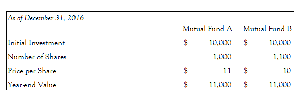

## Table of Contents

## What is cost basis and why is it important for mutual fund investors?

Cost basis is the original value of an asset for tax purposes, usually the purchase price, adjusted for stock splits, dividends, and return of capital distributions. For mutual fund investors, it's the price you paid for each share of the fund. This number is important because it helps you figure out how much profit or loss you made when you sell your shares. The difference between the cost basis and the sale price is what you use to calculate your capital gains or losses, which are reported on your taxes.

Understanding your cost basis is crucial for mutual fund investors because it directly affects your tax situation. If you sell your mutual fund shares for more than your cost basis, you'll have a capital gain, which might be taxed. If you sell for less, you'll have a capital loss, which you can use to offset other gains and reduce your taxable income. Knowing your cost basis helps you plan your investments better and make informed decisions about when to buy or sell, keeping your tax implications in mind.

## How is the initial cost basis of a mutual fund calculated?

The initial cost basis of a mutual fund is simply the amount of money you spend to buy the shares. If you buy 100 shares at $10 each, your cost basis is $1,000. This number is important because it's the starting point for figuring out if you've made money or lost money when you sell the shares later.

Sometimes, you might buy more shares over time, or the fund might give you more shares through reinvested dividends. Each time you add to your investment, you're adding to your cost basis. So, if you later buy another 50 shares at $12 each, you'd add $600 to your original $1,000, making your new cost basis $1,600. Keeping track of these additions helps you know exactly how much you've invested overall.

## What are the different methods for calculating cost basis in mutual funds?

There are several ways to figure out the cost basis of your mutual fund shares, and the method you choose can affect how much tax you pay. One common method is the "First In, First Out" (FIFO) method. With FIFO, you sell the shares you bought first before selling the ones you bought later. This can be simple to keep track of, but it might mean you pay more in taxes if the shares you bought first have gone up a lot in value.

Another method is "Specific Identification," where you pick which shares to sell. This can be good if you want to minimize your taxes by selling shares that have gone up less in value or even lost value. But you need to keep careful records to show which shares you're selling. A third method is "Average Cost," where you take the total amount you've spent on the shares and divide it by the total number of shares you own. This gives you an average price per share, which can be easier to calculate but might not be the best for tax purposes.

Lastly, there's the "Double Category" method, which is a bit like the Average Cost method but splits your shares into two groups: those bought before a certain date and those bought after. This can be useful if tax rules changed at some point. Each method has its own pros and cons, so it's good to think about which one works best for your situation and talk to a tax advisor if you're not sure.

## How does the average cost method work for mutual fund cost basis calculation?

The average cost method is a way to figure out the cost basis of your mutual fund shares. It's pretty simple. You add up all the money you've spent to buy the shares, and then you divide that total by the total number of shares you own. This gives you an average price per share. So, if you spent $1,000 to buy 100 shares, your average cost per share would be $10.

When you decide to sell some of your shares, you use this average price to figure out your profit or loss. For example, if you sell 50 shares and the average cost per share was $10, your cost basis for those 50 shares would be $500. If you sell them for $12 each, you'd get $600, and your profit would be $100 ($600 - $500). This method can make it easier to keep track of your investments, but it might not always be the best for saving on taxes.

## What is the FIFO (First-In, First-Out) method and how is it applied to mutual funds?

The FIFO method stands for "First-In, First-Out." It's a way to figure out which shares of a mutual fund you're selling when you decide to sell some. With FIFO, you sell the shares you bought first before you sell the ones you bought later. It's like if you had a bunch of apples and you wanted to sell them, you'd sell the oldest apples first. This method can be easy to keep track of because you just go by the order you bought the shares.

When you use FIFO with mutual funds, you look at the date you bought each share. If you bought 100 shares on January 1st and another 100 shares on June 1st, and then you decide to sell 100 shares, you'd sell the ones you bought on January 1st first. This can affect how much tax you pay because the shares you bought first might have gone up more in value than the ones you bought later. So, it's important to think about which shares you're selling and how it might impact your taxes.

## How does the specific identification method work for mutual fund shares?

The specific identification method lets you pick exactly which shares of a mutual fund you want to sell. This can be really helpful if you want to save on taxes. For example, if some of your shares went up a lot in value and others didn't, you might want to sell the ones that didn't go up as much. That way, you might pay less in taxes because your profit is smaller. But you need to keep good records to show which shares you're selling. You might need to tell your broker which shares to sell when you make the sale.

Using the specific identification method can take a bit more work, but it can be worth it. You need to keep track of when you bought each share, how much you paid for it, and any changes like dividends or splits. When you decide to sell, you tell your broker, "Sell these specific shares," and you use the cost of those shares to figure out your profit or loss. This method gives you more control over your taxes, but it means you have to be organized and keep good records.

## What impact do reinvested dividends and capital gains have on the cost basis of mutual funds?

When you reinvest dividends and capital gains in your mutual fund, it changes your cost basis. Your cost basis is the total amount you've put into the fund, and when you reinvest, you're putting more money in without actually spending more out of your pocket. So, every time the fund pays out dividends or capital gains and you choose to reinvest them, you're buying more shares. These new shares add to your total investment, which means your cost basis goes up. If you get $100 in dividends and use that to buy more shares, your cost basis increases by $100.

Keeping track of these changes is important because it affects how much profit or loss you have when you sell your shares. If you don't account for the reinvested dividends and capital gains, you might think you made more money than you really did. For example, if you originally bought shares for $1,000 and then reinvested $200 in dividends, your new cost basis would be $1,200. If you sell your shares later for $1,300, your profit would be $100 ($1,300 - $1,200), not $300 ($1,300 - $1,000). So, it's key to update your cost basis every time you reinvest to get an accurate picture of your investment's performance.

## How do you adjust the cost basis for mutual funds after a fund merger or acquisition?

When a mutual fund goes through a merger or acquisition, it can change the cost basis of your shares. A merger or acquisition means that the fund you own is combining with another fund or being bought by another company. This can change the value of your shares and the number of shares you own. To figure out your new cost basis, you need to know the exchange ratio, which tells you how many new shares you get for your old shares. You multiply the number of old shares you had by the exchange ratio to find out how many new shares you have. Then, you multiply your old cost basis by the same exchange ratio to get your new cost basis.

For example, if you had 100 shares of Fund A with a cost basis of $10 per share, and the merger gives you 1.2 new shares of Fund B for each share of Fund A, you would end up with 120 shares of Fund B. To find your new cost basis, you would multiply your old cost basis of $1,000 (100 shares x $10 per share) by the exchange ratio of 1.2, giving you a new cost basis of $1,200. This new cost basis is what you use to figure out your profit or loss when you sell your shares of Fund B. Keeping track of these changes is important for understanding your investment's performance and for tax purposes.

## What are the tax implications of different cost basis calculation methods for mutual funds?

The way you figure out your cost basis can affect how much tax you pay when you sell your mutual fund shares. If you use the FIFO method, you sell the shares you bought first. This might mean you pay more in taxes if those first shares have gone up a lot in value. For example, if you bought shares a long time ago and they've grown a lot, selling them first could mean a bigger profit and more taxes. On the other hand, the average cost method can be simpler but might not be the best for saving on taxes. It averages out the price of all your shares, which could lead to a higher tax bill if you sell when the market is high.

Using the specific identification method can help you save on taxes because you get to choose which shares to sell. If some shares haven't gone up as much or even lost value, selling those can lower your tax bill. You need to keep good records and tell your broker which shares you want to sell. This method gives you more control over your taxes, but it requires more work. Knowing how each method works and talking to a tax advisor can help you pick the best one for your situation and keep more money in your pocket.

## How can investors track and calculate cost basis over multiple years and transactions?

Keeping track of your mutual fund's cost basis over many years and lots of transactions can be tricky, but it's important for figuring out your taxes right. Every time you buy more shares, reinvest dividends, or the fund goes through a merger, your cost basis changes. You need to keep good records of each transaction, including the date you bought the shares, how many you bought, and how much you paid for them. If you reinvest dividends, you add those amounts to your cost basis too. It's like keeping a running total of all the money you've put into the fund.

There are tools and software that can help you keep track of all this. Many brokers and mutual fund companies offer cost basis tracking as part of their service. These tools can automatically update your cost basis whenever you buy more shares or reinvest dividends. If you prefer to do it yourself, you can use a spreadsheet to keep track of your transactions. Just make sure to update it every time something changes. By keeping careful records and using the right tools, you can make sure you know exactly what your cost basis is, which helps you figure out your profit or loss when you sell your shares and how much tax you might owe.

## What software tools or services are available to help with cost basis calculations for mutual funds?

There are several software tools and services that can help you figure out the cost basis of your mutual fund shares. Many big brokers like Fidelity, Vanguard, and Charles Schwab have tools built into their websites and apps. These tools keep track of your cost basis automatically whenever you buy or sell shares or reinvest dividends. They do the math for you and show you what your cost basis is at any time. This can save you a lot of work and help you make sure your numbers are right.

Besides broker tools, there are also special software programs you can use. Programs like GainsKeeper and Quicken can help you track your investments, including your mutual fund cost basis. These programs let you enter all your transactions and they keep a running total of your cost basis. They can also help you figure out your taxes by showing you your gains or losses. Some people like using these programs because they give you more control and can work with different brokers.

## How do regulatory changes affect cost basis reporting and calculation for mutual funds?

Regulatory changes can have a big impact on how mutual fund companies report and calculate the cost basis for investors. In the United States, for example, the IRS made a rule called the Emergency Economic Stabilization Act of 2008. This rule said that starting in 2012, mutual fund companies had to report the cost basis of shares sold to both the investor and the IRS. Before this rule, it was up to the investor to keep track of their cost basis, which could be hard and lead to mistakes. Now, with the rule in place, it's easier for investors because the fund companies do a lot of the work for them.

These changes also mean that mutual fund companies have to keep better records and use certain methods to calculate cost basis. They have to follow the rules about which method to use, like FIFO or average cost, unless the investor tells them to use a different method like specific identification. This helps make sure everyone is playing by the same rules and makes it easier for the IRS to check that taxes are being paid correctly. But it's still important for investors to understand these rules and check their own records, because sometimes there can be differences between what the fund company reports and what the investor thinks is right.

## What is Cost Basis in Mutual Funds?

Cost basis is the original value of an investment in mutual funds, including the purchase price and associated transaction costs. Its significance lies in its role in determining capital gains or losses when investments are sold. Accurately calculating the cost basis is crucial for tax purposes, as it affects the taxable income reported to tax authorities. Inaccurate calculations can lead to overpayment or underpayment of taxes.

There are three primary methodologies for calculating the cost basis of mutual funds:

1. **Average Cost Method**: This method involves averaging the cost of all mutual fund shares owned. It is calculated as follows:
$$
   \text{Average Cost} = \frac{\text{Total Cost of Shares Purchased}}{\text{Total Number of Shares Owned}}

$$

   This method simplifies record-keeping and is widely used, particularly when shares are bought at different prices.

2. **Specific Share Identification**: This method allows investors to identify which specific shares they are selling, useful in optimizing tax outcomes. By selecting shares with a higher cost basis for sale, investors can minimize taxable gains.

3. **FIFO (First-In, First-Out)**: Under this method, the earliest purchased shares are considered sold first. This approach often results in higher taxable gains when older shares, typically bought at lower prices, are sold first.

The tax implications of accurately determining the cost basis are significant. A precise calculation ensures that investors do not pay more taxes than necessary. Errors can lead to audits, penalties, or incorrect tax returns. For long-term investment strategies, cost basis calculations affect decisions on when to sell assets to optimize tax outcomes. Long-term capital gains offer more favorable tax rates compared to short-term gains, making precise cost basis calculation important for long-term tax planning.

Investors must carefully consider which cost basis method suits their strategy and situation. The average cost method offers simplicity, while specific share identification provides flexibility for optimizing tax outcomes. The FIFO method is straightforward but may not always be the most tax-efficient. Selecting an appropriate method requires understanding one’s investment goals, trading frequency, and potential tax impacts.

## References & Further Reading

[1]: Bergstra, J., Bardenet, R., Bengio, Y., & Kégl, B. (2011). ["Algorithms for Hyper-Parameter Optimization."](https://dl.acm.org/doi/10.5555/2986459.2986743) Advances in Neural Information Processing Systems 24.

[2]: ["Advances in Financial Machine Learning"](https://www.amazon.com/Advances-Financial-Machine-Learning-Marcos/dp/1119482089) by Marcos Lopez de Prado

[3]: Aronson, D. R. (2006). ["Evidence-Based Technical Analysis: Applying the Scientific Method and Statistical Inference to Trading Signals."](https://www.amazon.com/Evidence-Based-Technical-Analysis-Scientific-Statistical/dp/0470008741) John Wiley & Sons.

[4]: Jansen, S. (2020). ["Machine Learning for Algorithmic Trading."](https://github.com/stefan-jansen/machine-learning-for-trading) Packt Publishing.

[5]: Chan, E. P. (2008). ["Quantitative Trading: How to Build Your Own Algorithmic Trading Business."](https://github.com/ftvision/quant_trading_echan_book) John Wiley & Sons.