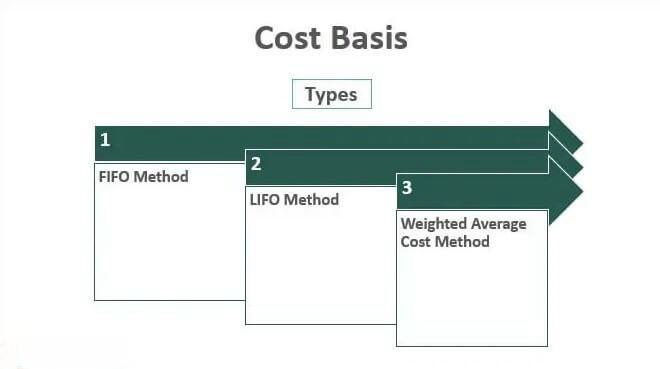

Cost basis is a critical concept in both investing and tax calculations, serving as the foundation for determining capital gains or losses when an asset is sold. It represents the original value of an asset, including any associated costs such as brokerage fees and commissions. This initial measurement is pivotal, as the difference between the cost basis and the sale price of an asset will dictate the capital gain or loss, which in turn influences the taxable event.

Algorithmic trading has gained prominence for its capacity to execute trades with speed and precision, relying on mathematical models and complex algorithms to make split-second decisions. Within this context, precise cost basis calculations become crucial. Automated trading systems must accurately account for the cost basis of each transaction to ensure the correct computation of profits and losses in real-time. This accuracy is vital for strategic decision-making and maintaining compliance with tax regulations.



The tax implications of cost basis calculations are significant for investors. The Internal Revenue Service (IRS) mandates that taxpayers report capital gains or losses on their tax returns, and inaccurate cost basis reporting can lead to improper tax filings and potential penalties. For example, understanding whether to account for short-term versus long-term capital gains—each taxed at different rates—depends heavily on accurate cost basis assessments. Investors who engage in frequent trading, including those using algorithmic platforms, must pay particular attention to cost basis accounting, as discrepancies can lead to significant financial consequences.

In summary, cost basis plays an integral role in both investment strategy and tax compliance, particularly with the growing prevalence of algorithmic trading. Accurate cost basis calculations not only inform investors of their true economic gains or losses but also assure proper tax reporting, thereby optimizing financial outcomes and minimizing legal risks.

## Table of Contents

## Understanding Cost Basis

Cost basis is a fundamental concept in investing, playing a crucial role in determining an investor's capital gains or losses upon the sale of an asset. It represents the original value or purchase price of an asset, including any associated costs such as commissions or fees. When an asset is sold, the cost basis is subtracted from the sale price to determine the taxable gain or loss. Accurate calculation of cost basis ensures compliance with tax regulations and aids in effective financial planning.

To calculate cost basis, investors must consider not only the purchase price but also a variety of factors that may adjust the original cost. For stocks and other investments, these adjustments might include dividends, reinvestment plans, stock splits, and return of capital distributions. Each of these elements can alter the cost basis and, consequently, the reported gain or loss when an asset is sold.

### Calculating Adjusted Cost Basis

1. **Dividends and Reinvestment**: When dividends are reinvested to purchase additional shares, the cost basis of the new shares must be added to the original investment. For example, if you purchase 100 shares at $10 each, and then reinvest $200 worth of dividends to buy 20 more shares, the adjusted cost basis would be:
$$
   \text{Total Cost Basis} = (100 \, \text{shares} \times \$10) + (20 \, \text{shares} \times \$10) = \$1200

$$

2. **Stock Splits**: A stock split increases the number of shares owned while decreasing the price per share. This requires an adjustment in the cost per share. If an investor owns 100 shares with a cost basis of $10 each and the company announces a 2-for-1 stock split, the investor will then own 200 shares, and the new cost basis per share will be:
$$
   \text{New Cost Basis per Share} = \frac{\$1000}{200} = \$5

$$

3. **Return of Capital**: If a company returns capital to shareholders, this amount is subtracted from the cost basis. For instance, if $2 per share is returned, the cost basis is adjusted by subtracting this amount. 

Incorrect or misunderstood cost basis calculations can lead to significant tax consequences. Overestimating cost basis might reduce taxable gains improperly, leading to potential penalties and interest charges from tax authorities. Conversely, underestimating it may result in an overpaid tax liability, minimizing investment returns. Therefore, maintaining accurate records and understanding how various factors influence cost basis are key to optimizing tax outcomes for investors.

Investors must proactively manage their cost basis calculations, integrating changes promptly and accurately, to avoid tax issues. This involves keeping detailed records of all transactions, including any corporate actions affecting the securities held. By doing so, they ensure that when it comes time to report to tax authorities, the information is precise and aligns with legal expectations.

## Cost Basis Methods and Tax Implications

Cost basis methods are crucial for determining the taxable gain or loss realized upon the sale of an investment. Understanding these methods and choosing the appropriate one can significantly influence an investor’s tax liability. The primary cost basis methods include First-In First-Out (FIFO), Last-In First-Out (LIFO), Specific Identification, and Average Cost Basis. Each method has unique implications for how capital gains are calculated and the subsequent tax liabilities.

**First-In First-Out (FIFO):** FIFO assumes that the earliest purchased shares are sold first. In periods of rising prices, FIFO often results in higher taxable gains because the older shares, usually bought at lower prices, are used to calculate the profit. Consequently, this method might lead to higher tax liabilities in bullish markets. 

**Last-In First-Out (LIFO):** LIFO assumes that the most recently purchased or acquired assets are sold first. This method might reduce tax liabilities in rising markets since the latest acquisitions, typically at higher prices, are used to determine the taxable amount. However, LIFO is not permitted under International Financial Reporting Standards (IFRS) and is mostly applicable to specific scenarios and jurisdictions.

**Specific Identification:** This method allows investors to choose which specific shares or lots to sell. By strategically selecting shares with the highest or lowest cost basis, investors can optimize their tax outcomes. For instance, selling the highest-cost shares can minimize taxable gains, whereas choosing lower-cost shares can maximize realized gains. Specific identification requires meticulous record-keeping and is beneficial for tax loss harvesting strategies.

**Average Cost Basis:** This approach calculates the average price of all shares owned. It is commonly used for mutual funds and covers, where tracking individual lot prices over time can be cumbersome. The average cost method provides a middle-ground effect on tax implications, smoothing out the highs and lows in cost basis, but might not offer the acute tax optimization potential of specific identification.

Each method presents specific tax implications and requires strategic consideration of current market conditions, investor goals, and regulatory constraints. For example, in a volatile market, using specific identification could offer tactical advantages by allowing an investor to match gains with losses efficiently, thereby minimizing overall tax impact. Conversely, using FIFO in a declining market might make the most sense to realize higher previously accumulated basis as opposed to more recent, possibly devalued, acquisitions.

The choice of method can also be influenced by available technology platforms, which can simplify the tracking and reporting of cost basis, thereby assisting investors in making informed decisions tailored to their tax optimization strategies.

## Algorithmic Trading and Cost Basis Calculations

Algorithmic trading systems are designed to execute trades automatically based on predefined criteria, using computational algorithms to analyze market data and make decisions at high speeds. A critical aspect of these systems is the real-time calculation of cost basis—the initial value of an investment adjusted for various factors such as fees and corporate actions. Accurately calculating cost basis in real-time allows traders to make informed decisions regarding portfolio management and tax implications.

In [algorithmic trading](/wiki/algorithmic-trading), cost basis calculations must account for variable factors such as dividends, stock splits, and wash sales. These events can affect the acquisition cost of stocks, which in turn impacts capital gains or losses. Accurate real-time adjustments ensure that traders understand their true tax liabilities when positions are sold or modified. Algorithmic systems typically initialize cost basis calculations upon the acquisition of financial instruments and continually update these calculations with each market transaction.

Python, a prominent language in algorithmic trading, is often used to implement real-time cost basis calculations. Here is a simple Python example illustrating how cost basis might be managed within a trading algorithm:

```python
class Trade:
    def __init__(self, quantity, purchase_price):
        self.quantity = quantity
        self.purchase_price = purchase_price

def calculate_cost_basis(trades):
    total_cost = sum(trade.quantity * trade.purchase_price for trade in trades)
    total_quantity = sum(trade.quantity for trade in trades)
    return total_cost / total_quantity if total_quantity else 0

# Example trades
trades = [Trade(100, 10.00), Trade(50, 12.00), Trade(200, 11.00)]

cost_basis = calculate_cost_basis(trades)
print(f"Cost basis: ${cost_basis:.2f}")
```

This code snippet calculates the average cost basis of a portfolio through cumulative weighted average price, adjusting the cost per share based on the number of shares bought and their respective purchase prices.

Integrating cost basis into algorithmic trading strategies provides several benefits. From a tax perspective, knowing cost basis in real-time allows traders to make informed decisions about when to sell assets, thereby optimizing tax outcomes. Strategies such as tax loss harvesting, where investors sell securities at a loss to offset gains elsewhere, rely heavily on accurate cost basis tracking.

However, there are challenges associated with real-time cost basis calculations. Market [volatility](/wiki/volatility-trading-strategies) and the execution of high-frequency trades can lead to rapid changes in portfolio composition, demanding robust systems capable of handling complex data efficiently. Furthermore, maintaining regulatory compliance involves thorough documentation and reporting, necessitating sophisticated algorithms that can match trades with their corresponding cost basis records accurately.

Common algorithmic trading strategies that account for cost basis include [momentum](/wiki/momentum) strategies, mean reversion, and statistical [arbitrage](/wiki/arbitrage). In momentum strategies, where assets are bought or sold based on upward or downward trends, understanding cost basis aids in assessing the potential capital gain or loss. Meanwhile, in mean reversion strategies, which anticipate an asset's return to its long-term mean price, cost basis calculations inform profit margins. Lastly, [statistical arbitrage](/wiki/statistical-arbitrage) may encompass multiple trades aimed at exploiting pricing inefficiencies; here, real-time cost basis assessment is crucial for ensuring strategies remain profitable after accounting for tax implications.

In conclusion, while integrating cost basis calculations into algorithmic trading presents challenges, it is crucial for optimizing trading efficiency and tax strategies. Effective implementation requires precise algorithms and possibly advanced [machine learning](/wiki/machine-learning) techniques to maintain accuracy in real-world trading environments.

## Tools and Technologies

Software tools and platforms that assist with cost basis tracking and calculations have become essential in today's investment landscape. These tools provide investors and traders with the capabilities needed to manage their portfolios effectively, ensuring accurate tax reporting and strategic planning.

### Software Tools for Cost Basis Tracking

One prominent category of software tools focuses on cost basis tracking, helping users maintain a precise record of their investments. Such platforms often offer features like automatic transaction importing, dividend and corporate action handling, and real-time cost basis updates. Examples include platforms like Quicken, TurboTax, and specialized financial software such as Portfolio Performance and CapTools.

Most of these tools are designed to integrate seamlessly with brokerage accounts, automatically fetching transaction data to update cost basis records. They account for stock splits, dividend reinvestments, and other adjustments that affect an asset's cost basis. This integration reduces manual entry, decreasing the likelihood of errors and ensuring that investors have access to up-to-date information.

### Integration with Algorithmic Trading Platforms

Cost basis tracking tools must effectively integrate with algorithmic trading platforms to support active traders. Modern algorithmic trading systems, such as QuantConnect, Alpaca, and MetaTrader, often provide APIs that allow third-party applications to interface with their systems. This compatibility ensures that traders using algorithms can access precise cost basis information in real-time, which is critical for strategies that rely on accurate accounting of gains and losses.

For instance, a trading algorithm written in Python might connect to an investment tracking tool via an API:

```python
import requests

API_KEY = 'your_api_key'
ACCOUNT_ID = 'your_account_id'

response = requests.get(f'https://api.tradingplatform.com/accounts/{ACCOUNT_ID}/positions',
                        headers={'Authorization': f'Bearer {API_KEY}'})

positions = response.json()
for position in positions:
    current_cost_basis = position['cost_basis']
    print(f"Ticker: {position['symbol']}, Cost Basis: {current_cost_basis}")
```

This kind of integration allows traders to dynamically adjust their strategies based on the cost basis data, possibly minimizing tax liabilities by selecting which positions to liquidate.

### Importance of Choosing the Right Tools

Selecting the appropriate tools is crucial for accurate cost basis management. The chosen platform must not only perform correct calculations but also offer scalability, allowing for efficient handling of growing and complex portfolios. Accurate cost basis tracking is indispensable for strategic tax management, as discrepancies can lead to either overpayment or underpayment of taxes, both of which [carry](/wiki/carry-trading) consequences.

Advanced platforms often include features like tax lot optimization, allowing users to determine the most tax-efficient way to realize gains or losses. This level of sophistication is vital for investors who wish to optimize their tax positions proactively. 

In summary, the selection and integration of cost basis tracking tools with algorithmic trading platforms greatly influence a trader's ability to manage their portfolio efficiently and comply with tax requirements. The combination of automation and real-time data accessibility supports rigorous strategic planning and execution.

## Real-World Examples

In the context of cost basis calculations and algorithmic trading, hypothetical scenarios can effectively demonstrate the impact of employing different cost basis methods and trading strategies. These scenarios reveal both strategic advantages and potential pitfalls, providing valuable insights for investors and traders.

### Hypothetical Scenario: FIFO vs. Specific Identification

Consider an investor who purchased 100 shares of XYZ Corporation on three different occasions:

- 100 shares at $10 each
- 100 shares at $15 each
- 100 shares at $20 each

Later, the investor decides to sell 100 shares at the current market price of $25 each. Using the First-In First-Out (FIFO) method, the investor sells the oldest batch first, thus calculating the cost basis based on the $10 purchase price per share. The capital gain per share would be $15, leading to a total gain of $1,500 [(25 - 10) * 100]. 

Alternatively, by utilizing the Specific Identification method, the investor chooses to sell the shares purchased at $20 per share. This lowers the capital gain per share to $5, resulting in a total gain of $500 [(25 - 20) * 100]. In this scenario, the Specific Identification method significantly reduces taxable capital gains, illustrating its strategic benefit for managing tax liabilities in rising markets.

### Real-World Application: Algorithmic Trading with Cost Basis Consideration

A case study involving an algorithmic trading firm showcases the integration of cost basis calculations in trading strategies. The firm employs a high-frequency trading algorithm that executes numerous trades daily and adjusts positions based on market signals. To minimize tax liabilities, the algorithm incorporates the Average Cost Basis method, continuously recalculating the average cost of acquired assets.

Python code for continuous cost basis recalculation might look like this:

```python
def update_average_cost(previous_cost, previous_quantity, new_purchase_cost, new_purchase_quantity):
    new_total_quantity = previous_quantity + new_purchase_quantity
    if new_total_quantity == 0:
        return 0
    new_average_cost = ((previous_cost * previous_quantity) + (new_purchase_cost * new_purchase_quantity)) / new_total_quantity
    return new_average_cost
```

By integrating this calculation, the firm ensures that their trading decisions account for the potential tax impact, optimizing after-tax returns. The implementation enhances the firm's ability to manage portfolios efficiently, demonstrating a practical advantage of combining algorithmic strategies with cost basis calculations.

### Lessons Learned

These examples highlight critical lessons for investors and algorithmic traders:

1. **Strategic Flexibility**: Choosing the appropriate cost basis method can substantially affect tax outcomes. Specific Identification offers flexibility in selecting the least costly shares to minimize capital gains tax.

2. **Technological Integration**: Algorithmic trading systems that integrate real-time cost basis calculations allow for dynamic decision-making and tax optimization. Automating this process increases the efficiency and accuracy of trading strategies.

3. **Regulatory Awareness**: Traders and investors must maintain a keen awareness of tax regulations to optimize their strategies in compliance with legal requirements. Different methods can lead to varying degrees of regulatory scrutiny.

By understanding and applying these lessons, traders and investors can enhance their investment strategies, aligning them with both financial goals and tax considerations for superior performance.

## Strategies for Optimizing Tax Outcomes

Investors can use strategic management of cost basis to optimize tax outcomes effectively. The cost basis, which represents the original value of an asset for tax purposes, is a crucial component in calculating capital gains and losses. By understanding and applying the right cost basis methods, investors can reduce tax liabilities and enhance overall portfolio returns.

**Strategic Tax Planning with Cost Basis**

Cost basis plays a pivotal role in strategic tax planning. One core strategy involves strategically selling assets to realize losses, which can then offset capital gains and reduce taxable income. This practice, known as tax-loss harvesting, relies on accurate cost basis calculations to be effective. For instance, if an investor sells an asset at a loss, they can deduct that loss from their taxable capital gains, thereby reducing their overall tax burden. Accurate calculation and documentation of cost basis are essential in ensuring these transactions are recorded correctly and withstand scrutiny from tax authorities.

Another strategic use of cost basis lies in timing gains and losses. By analyzing market conditions and personal income levels, investors can decide when to sell assets to either maximize taxable profits in a low-income year or stabilize higher tax categories in more profitable years.

**Maintaining Accurate Records**

Accurate record-keeping is paramount in managing cost basis. Investors should keep track of purchase prices, dividends reinvested, stock splits, and any return of capital, as these factors can adjust the cost basis of an asset. Here are some tips for maintaining accurate records:

1. **Utilize Technology**: Software tools and platforms can automate record-keeping. These tools often integrate with broker platforms to track purchase prices, compute adjusted cost basis, and provide detailed transaction records.

2. **Regular Review**: Periodically reviewing investment account statements ensures that all cost basis information aligns with transactions. This task is crucial before the tax season when calculations need to be verified against reported amounts to avoid discrepancies.

3. **Organize Documentation**: Keeping thorough documentation of trades, dividends, and adjustments ensures that all the necessary information is available if audited. Digital solutions can assist in scanning and organizing physical documents for easier access and management.

```python
# Python example for adjusting cost basis after a stock split
def adjust_cost_basis_after_split(original_basis, split_ratio):
    """
    Adjusts the cost basis of a stock after a stock split.

    Parameters:
    - original_basis: float, Original cost basis of the stock
    - split_ratio: tuple, (shares_after_split, shares_before_split)

    Returns:
    - new_basis: float, Adjusted cost basis
    """
    shares_before, shares_after = split_ratio
    new_basis = original_basis * (shares_after / shares_before)
    return new_basis

# Example usage
original_basis = 1000  # Original cost basis for 100 shares
split_ratio = (150, 100)  # 3-for-2 stock split
new_basis = adjust_cost_basis_after_split(original_basis, split_ratio)
print(f"Adjusted Cost Basis: ${new_basis:.2f}")
```

Cost basis management also extends to long-term investment strategies. Investors can align their capital gains and losses with long-term financial goals, ensuring that investments align not just with market opportunities but with tax efficiencies as well. For instance, long-term holdings typically benefit from lower tax rates on capital gains, providing additional tax benefits. Hence, retaining documentation over the duration of the investment is essential.

Ensuring accurate cost basis tracking is integral for optimizing tax outcomes. Through strategic management, investors can not only minimize taxable income in the short term but also enhance their long-term financial planning. By leveraging technology and maintaining diligent records, they can navigate the complexities of tax planning more effectively.

## Conclusion

Understanding cost basis and its associated tax implications is essential for both individual investors and those using algorithmic trading systems. Cost basis serves as the foundation for calculating capital gains or losses, directly influencing an investor's tax liabilities. Algorithmic trading, which involves high-frequency and automated decision-making processes, necessitates accurate and real-time management of cost basis to ensure compliance and optimize tax outcomes.

The complexity of financial transactions and varying cost basis methods underscore the importance of strategic planning and management. Investors must employ suitable methods—such as FIFO, LIFO, or specific identification—and understand how each affects their tax obligations. Errors or oversights in cost basis calculations can lead to financial losses through overpayment of taxes or penalties related to non-compliance.

To effectively manage cost basis, investors should proactively utilize advanced software tools and platforms capable of accurate tracking and integration with trading systems. The right technology can automate the process, reducing the margin for error and freeing investors to focus on strategic decision-making. Choosing capable tools and ensuring they are correctly configured is vital to maintaining rigorous, accurate financial records.

In conclusion, the successful navigation of cost basis within algorithmic trading frameworks hinges on informed decision-making, thorough planning, and strategic management. Investors are encouraged to embrace technology and methodological rigor to enhance their investment strategies and optimize their tax outcomes.

## References & Further Reading

1. **Internal Revenue Service (IRS) Publication 550** - This document provides detailed guidance on investment income and expenses, including important information about cost basis calculations and how these affect tax liability. It is an essential resource for anyone dealing with investments and related taxes.

2. **"The Intelligent Investor" by Benjamin Graham** - While primarily focused on investment strategy, this classic book discusses the importance of understanding taxation and cost basis within the broader context of value investing.

3. **Investopedia - Cost Basis** - An online educational article explaining the concept of cost basis in investments, along with practical information on how it affects capital gains and tax reporting.

4. **Algorithmic and High-Frequency Trading by Álvaro Cartea, Sebastian Jaimungal, and José Penalva** - This book provides comprehensive coverage of algorithmic trading strategies and includes a discussion on the importance of efficient tax management, including cost basis handling.

5. **TurboTax Tax Tips - Understanding Cost Basis** - This guide offers step-by-step instructions for calculating and reporting cost basis, emphasizing how it can affect your tax returns.

6. **"A Random Walk Down Wall Street" by Burton G. Malkiel** - Although focused on different types of investments, this book also underscores the relevance of tax implications and how proper management of cost basis can enhance investment outcomes.

7. **Fidelity Investments - Cost Basis Tracking** - Provides insights on how investors can use Fidelity’s account features to effectively track and manage cost basis, including specific examples for different types of investment accounts.

8. **Python for Finance by Yves Hilpisch** - This book includes practical Python applications for finance, including algorithms to manage cost basis in trading strategies, making it a useful resource for both algorithmic traders and financial data analysts.

9. **Morningstar - Tax Strategies for Investors** - An article providing strategic guidance on tax optimization for investors, with specific references to the impact of different cost basis methods on investment returns.

10. **Journal of Financial Economics** - This journal publishes articles on various financial topics, including research studies that examine the impact of trading strategies, tax regulations, and cost basis calculations on market behavior and investor performance.