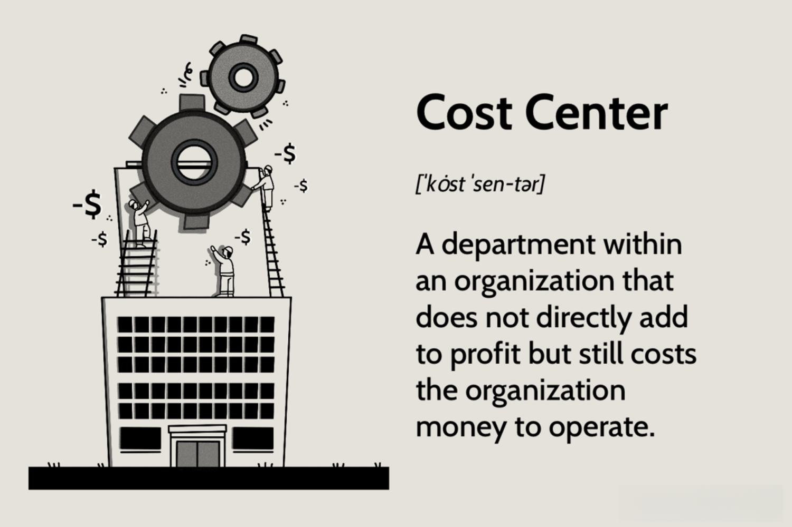

Understanding the intricate dynamics of financial management is crucial for any organization seeking sustained growth. Central to this understanding is the recognition of how cost centers, business operations, and algorithmic trading intersect to influence financial management strategies. These elements form an essential triad that, when effectively managed, can significantly optimize business efficiency and profitability.

Cost centers play a pivotal role in financial structuring by tracking and controlling organizational expenditures. Although they do not directly generate revenue, they are indispensable for maintaining efficient operational structures. Their management is integral to effective budgeting processes and for discerning areas where cost-reduction strategies can be implemented.

Streamlined business operations are key to improving financial outcomes and sustaining a competitive advantage. Technology and innovation drive the optimization of operational processes, allowing for reduced overhead costs and enhanced performance. Automation, lean management techniques, and continuous process improvement are among the strategies that contribute to this efficiency.

Algorithmic trading represents a modern approach to financial growth, leveraging complex algorithms to automate and optimize trading decisions. It offers advantages of speed, precision, and the capacity to process large volumes of data. The potential synergy between algorithmic trading, cost centers, and operational efficiency underscores its strategic value.

This article provides a comprehensive exploration of these components, aiming to equip financial professionals and business leaders with insights to enhance their financial management frameworks. By dissecting the interplay between cost centers, business operations, and algorithmic trading, we seek to provide a holistic perspective that fosters greater financial stability and strategic advantage for organizations.

## Table of Contents

## Understanding Cost Centers in Financial Management

Cost centers are pivotal units within an organization's financial management framework, primarily focused on tracking and controlling expenses. Despite not being direct revenue generators, they are indispensable for maintaining efficient operational structures. By carefully managing these centers, organizations gain insights into operational efficiencies and potential areas for cost reduction, thus influencing their overall financial strategy.

Cost centers serve as a foundational element in the budgeting process, allowing for detailed expenditure tracking. This detailed financial insight helps in creating more accurate financial forecasts. In essence, cost centers help in identifying discrepancies between budgeted and actual spending, enabling organizations to make informed strategic decisions regarding resource allocation and process improvements.

The role of cost centers in financial management is best understood through examples across diverse industries. For instance, in manufacturing, cost centers may include departments such as production, quality control, and logistics. By analyzing the expenses incurred in each of these departments, a company can identify inefficiencies and possible cost reduction strategies, such as negotiating better rates with suppliers or optimizing the supply chain.

In the service sector, cost centers might include customer service departments or information technology units. By monitoring the costs associated with these functions, organizations can ensure they are operating within budget, and can allocate resources to areas that enhance customer satisfaction or technological advancement.

Cost center management involves not just tracking past expenditures, but also planning future budgets. This includes using historical data to predict future costs and adjusting financial plans accordingly. For example, if a financial service company notices a trend of increasing customer support costs, it might decide to invest in automated support solutions to mitigate these rising costs while maintaining service levels.

Through effective cost center management, organizations also refine their strategies for resource allocation. This involves periodically reviewing and reallocating resources within an organization to optimize operational efficiency. Regular audits and performance evaluations of cost centers enable organizations to identify operational bottlenecks and execute necessary adjustments swiftly.

In summary, cost centers are integral to successful financial management. They offer a structured approach to managing expenses, contributing significantly to budgeting processes and financial forecasts. By effectively integrating cost centers into their financial strategies, organizations can cultivate a culture of continuous improvement, drive operational efficiencies, and ultimately, enhance profitability.

## Optimizing Business Operations for Financial Efficiency

Streamlining business operations is pivotal for improving financial outcomes and sustaining a competitive edge in the modern marketplace. Technology and innovation are at the forefront of this transformation, enabling organizations to optimize their operational processes and significantly reduce overhead costs. 

The integration of automation into business operations represents one of the most effective approaches for achieving financial efficiency. Automation minimizes human error, accelerates processes, and allows businesses to allocate resources more optimally. For instance, automating data entry tasks or routine financial calculations can result in considerable time savings and increased accuracy, ultimately contributing to cost reductions.

Another critical technique is the implementation of lean management principles. Lean management focuses on maximizing value by reducing waste within an organization. This approach not only enhances operational efficiency but also aligns closely with the objectives of cost centers, which aim to control and minimize expenses. By refining processes and eliminating unnecessary steps, lean management helps streamline operations, thus improving both cost center efficiency and overall business performance.

Continuous process improvement is also a vital facet of optimizing business operations. Organizations are encouraged to constantly evaluate their processes to identify areas for enhancement. This involves adopting a mindset of perpetual evolution, where systems and procedures are regularly assessed and refined to maintain peak efficiency. By fostering an environment that encourages innovation and adaptation, businesses can better respond to changing market demands while maintaining financial health.

To illustrate, consider a manufacturing company employing a continuous process improvement strategy using statistical analysis to monitor production efficiency. By analyzing data related to production times, defect rates, and equipment usage, the company can identify bottlenecks and implement changes to minimize downtime and defects. This proactive approach results in cost savings and improved product quality, directly benefiting the organization's financial position.

As organizations seek to enhance their financial health through operational efficiencies, data analytics becomes an indispensable tool. Leveraging data analytics allows businesses to make informed decisions based on empirical evidence rather than conjecture. By analyzing trends and patterns within organizational data, companies can forecast demand, optimize inventory levels, and predict financial performance with greater accuracy.

In summary, optimizing business operations through technology, automation, lean management, and continuous process improvement is essential for achieving financial efficiency. These strategies enable organizations to make informed decisions and enhance their financial health, ensuring a sustained competitive advantage in a rapidly evolving market landscape.

## Algorithmic Trading: A Modern Approach to Financial Growth

Algorithmic trading, often referred to as algo trading, is reshaping the financial markets by leveraging complex algorithms to automate and execute trading strategies. This automation enables traders to process vast amounts of data with remarkable speed and precision, offering several significant advantages over traditional trading methods.

One of the primary benefits of [algorithmic trading](/wiki/algorithmic-trading) is its ability to execute orders at speeds beyond human capabilities. By analyzing real-time market conditions, these algorithms can identify profitable opportunities and execute trades in milliseconds, minimizing the effects of market fluctuations that could impact trade profitability. Furthermore, the precision of algo trading ensures that trades are executed at optimal prices, reducing transaction costs and slippage.

Despite these advantages, algorithmic trading comes with its share of challenges and risks. Market [volatility](/wiki/volatility-trading-strategies) can pose a threat as rapid price movements might lead to unintended trading outcomes, such as executing orders at unfavorable prices. Additionally, technical failures, including software glitches or connectivity issues, can disrupt the trading process, potentially resulting in significant losses. Ensuring the robustness and reliability of algorithmic systems is thus crucial to mitigating these risks.

The integration of algorithmic trading within an organization's financial strategy also affects its cost centers. As cost centers are typically responsible for tracking expenses and maintaining operational efficiency, the use of algorithmic trading can streamline these processes by reducing manual labor and associated costs. For instance, the automation of trading tasks can lead to decreased human resource expenses, as fewer personnel are required to monitor market activity and execute trades.

Several case studies illustrate the successful implementation of algorithmic trading to boost profitability. A notable example is the use of statistical [arbitrage](/wiki/arbitrage) strategies, where algorithms identify pricing inefficiencies between related financial instruments. By capitalizing on these discrepancies, organizations can achieve consistent profits with minimal risk exposure. Another instance is the deployment of trend-following algorithms, which analyze historical price data to predict future market movements, allowing traders to ride significant price trends for profit.

In conclusion, algorithmic trading presents a modern approach to financial growth by enhancing the efficiency and accuracy of trading operations. While it offers substantial benefits, its associated risks necessitate careful management to fully integrate into an organization's financial framework, ultimately contributing to the optimization of cost centers and overall financial strategies.

## Interplay Between Cost Centers, Business Operations, and Algo Trading

The synergy between cost centers, business operations, and algorithmic trading forms a cornerstone of sophisticated financial management systems. These elements, while distinct in their operations, interconnectedly bolster comprehensive financial frameworks that aim to optimize resource allocation and maximize profitability.

Cost centers provide valuable insights into the financial health of an organization by tracking specific expenses and controlling financial outflows. While they do not directly contribute to revenue generation, the data derived from cost centers can inform strategic decision-making. For instance, reports from cost centers highlight areas where expenses may be streamlined, thereby guiding operational adjustments that enhance overall efficiency.

In terms of business operations, the focus is on streamlining processes to reduce unnecessary costs and improve output efficiency. By integrating insights from cost centers, businesses can refine operational strategies to ensure that resources are aptly allocated and utilized. This can involve adopting automation technologies that eliminate redundant tasks, implementing lean management techniques to reduce waste, and fostering a culture of continuous process improvement.

Algorithmic trading introduces a high-tech layer to financial management by employing complex algorithms to execute trades at speeds and precisions unattainable by human traders. The integration of algorithmic trading within an organization's financial framework allows for the leveraging of data analytics, enabling the processing and interpretation of vast amounts of market data. This empowers financial managers to make informed trading decisions based on real-time analyses, which can significantly enhance profitability.

The interplay between these elements is further amplified by advanced data analytics. Data analytics serves as the bridge that connects the operational insights from cost centers and business activities with the strategic imperatives of algorithmic trading. By analyzing data trends and patterns, organizations can align their cost management strategies with operational workflows and trading algorithms to optimize performance.

For example, a company might utilize data analytics to assess the impact of operational costs on trading margins. By understanding these relationships, the company can adjust its trading strategies to favor cost-effective operations, thus maintaining or even increasing profitability. Additionally, organizations that successfully integrate these components often benefit from a feedback loop where insights from one area inform improvements in another, creating a dynamic system responsive to market conditions and internal benchmarks.

In summary, the cohesive integration of cost centers, business operations, and algorithmic trading, underscored by robust data analytics, enables organizations to establish resilient financial management systems. This alignment not only ensures optimized resource utilization but also enhances the organization's ability to adapt to shifting market dynamics and maintain a competitive edge.

## Conclusion

Effective management of cost centers, business operations, and algorithmic trading is integral to sound financial management. Organizations that understand and align these elements can achieve greater financial stability and strategic advantage. The synergy between these components enables businesses to optimize resource allocation, reduce unnecessary expenditures, and capitalize on technological advancements.

A holistic approach to financial management is essential. It requires integration across departments and functions to ensure seamless operations and coherence in financial decision-making. This integration enhances an organization's ability to respond to both predictable and unforeseen challenges in the marketplace. As financial environments continue to evolve, the necessity for agility and innovation in managing cost centers, streamlining operations, and employing algorithmic trading strategies becomes increasingly evident.

Continuous adaptation and leveraging technological advancements are crucial for sustaining a competitive edge. As market dynamics shift and new technologies emerge, organizations must remain proactive in updating their financial management practices to leverage data insights, enhance automation, and improve decision-making processes.

Investment in technology and skill development is vital. Leaders are encouraged to cultivate a forward-thinking mindset, focusing on the implementation of modern technologies and the upskilling of their workforce. This not only maximizes the benefits derived from financial management components but also supports long-term organizational growth.

In conclusion, by fostering a comprehensive understanding of cost centers, business operations, and algorithmic trading, and by strategically aligning these elements, businesses can ensure robust financial management. This alignment forms the backbone of a resilient financial strategy, capable of navigating the complexities of today's global markets.

## References & Further Reading

[1]: ["Cost Management: Accounting and Control"](https://www.amazon.com/Cost-Management-Accounting-Control-6th/dp/0324559674) by Don R. Hansen and Maryanne M. Mowen

[2]: ["Lean Thinking: Banish Waste and Create Wealth in Your Corporation"](https://www.researchgate.net/publication/200657172_Lean_Thinking_Banish_Waste_and_Create_Wealth_in_Your_Corporation) by James P. Womack and Daniel T. Jones

[3]: ["Trading and Exchanges: Market Microstructure for Practitioners"](https://books.google.com/books/about/Trading_and_Exchanges.html?id=Rd9hDRR1Yx4C) by Larry Harris

[4]: ["Algorithmic Trading and DMA: An Introduction to Direct Access Trading Strategies"](https://www.amazon.com/Algorithmic-Trading-DMA-introduction-strategies/dp/0956399207) by Barry Johnson

[5]: ["Financial Management and Control in Higher Education"](https://www.taylorfrancis.com/books/mono/10.4324/9780203416143/financial-management-control-higher-education-malcolm-prowle-eric-morgan) by Tony Angelo