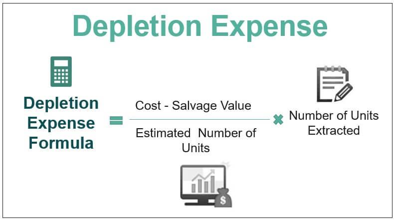

In the intersecting worlds of resource extraction and algorithmic trading, understanding the depletion formula and its implications is crucial. This article explores the concept of cost depletion, its application in resource extraction, and its relevance in algorithmic trading. In doing so, we establish a comprehensive framework connecting financial strategies and investment decisions with practical methodologies for accounting and trading.

Cost depletion acts as a cornerstone in industries reliant on natural resources, such as oil, gas, and minerals, by offering a systematic way to account for resource consumption over time. This approach helps businesses accurately reflect the diminishing value of natural reserves on their financial statements, thereby informing strategic decisions about future investments and operations. By aligning accounting procedures with resource extraction activities, companies can optimize their resource management approaches and maintain sustainable practices.

In parallel, algorithmic trading has emerged as a transformative force in financial markets, driven by automated systems capable of executing trades at speeds and volumes far beyond human capacity. Here, the concept of depletion translates to the erosion of trading opportunities and market inefficiencies, which are the primary targets of trading algorithms. Understanding how depletion affects trading strategies is vital for professionals aiming to maximize financial returns and maintain a competitive edge in dynamic markets.

By drawing connections between these seemingly disparate fields, this discussion underscores the importance of leveraging both predictable accounting methods and adaptive trading strategies. With the complex layers of resource management and trading at play, we aim to unravel the intricacies involved in better handling financial and resource-driven challenges. This holistic view is essential for navigating the evolving landscape of both resource extraction and financial markets, ensuring that professionals are well-equipped to tackle the challenges and opportunities that arise.

## Table of Contents

## Understanding Cost Depletion

Cost depletion is an accounting method utilized predominantly in industries engaged in the extraction of natural resources such as oil, gas, and minerals. Its primary purpose is to systematically allocate the costs associated with extracting these resources and record them as operating expenses within financial statements. By doing so, companies are able to accurately reflect the consumption of finite resources and the associated costs over time.

The process begins with the initial investment in the resources, which includes acquisition, exploration, and development costs. These costs form the basis for calculating depletion. The principle behind cost depletion hinges on the extraction level or the units of resources extracted within a specific time period. Hence, the annual depletion cost is closely tied to the quantity of resources extracted or utilized.

The formula typically used to calculate cost depletion is: 

$$
\text{Depletion Expense} = \left(\frac{\text{APV}}{\text{TR}}\right) \times \text{U}
$$

Where:
- APV represents the adjusted property value, essentially the total capital investment made into the resource.
- TR stands for total reserves, indicating the estimated total amount of resource available for extraction.
- U symbolizes the units of resource extracted during the period.

This method ensures that the reported depletion expense aligns with the amount of resource extraction, allowing for a proportional and systematic expense recognition.

In practical terms, cost depletion is executed by first determining the cost per unit of resource, which is calculated by dividing the adjusted property value by the total reserves. This cost per unit is subsequently multiplied by the number of units extracted during the financial period to ascertain the annual depletion cost.

Cost depletion is pivotal in industries reliant on natural resources, as it influences strategic financial decision-making. Companies use this method to manage their financial statements effectively, ensuring that the asset depletion corresponds with the physical depletion of resources. Moreover, this recognition aids in forecasting resource longevity and planning for future extraction projects, balancing current profitability against long-term sustainability.

## The Cost Depletion Formula

Cost depletion is calculated using the formula: 

$$
\text{Cost of Depletion} = \left(\frac{\text{APV}}{\text{TR}}\right) \times U
$$

where APV is the adjusted property value, TR stands for total reserves, and U represents the units extracted within a given time period. This calculation is primarily utilized in the accounting practices of industries involved in the extraction of natural resources, such as oil, gas, and mining, to methodically allocate the extraction costs over the resource's life.

APV, or adjusted property value, reflects the initial investment made into acquiring and preparing the natural resource for extraction, factoring in expenses such as drilling, equipping, and potential environmental mitigation. This value may be adjusted throughout the resource's lifecycle to account for additional investments or changes in estimated reserves.

TR, indicating total reserves, represents the estimated total [volume](/wiki/volume-trading-strategy) of the natural resource that can feasibly be extracted. Accurate estimation of reserves is crucial, as it influences the annual depreciation rate of the resource asset.

Units extracted (U) refer to the volume or amount of resource that has been extracted within a specific accounting period. This dynamic variable directly influences the annual depletion charge.

A practical example might involve a mining operation where the APV is determined at $1,000,000, with total estimated reserves (TR) of 500,000 units and 50,000 units extracted in a given year. Applying the formula:

$$
\text{Cost of Depletion} = \left(\frac{1,000,000}{500,000}\right) \times 50,000 = \$100,000
$$

Thus, the depletion expense for the year would be $100,000, which would be recorded as an operating expense on the company's financial statements under the depletion, depreciation, and amortization (DD&A) line item.

Through this systematic process, companies are better equipped to evaluate and manage the economic lifespan of their natural resource investments. By accurately accounting for resource consumption, organizations can make informed strategic decisions regarding future investments and asset utilization, optimizing both financial and operational efficiencies.

## Cost Depletion in Resource Extraction

Cost depletion in resource extraction is a method utilized to account for the gradual reduction in the value of a natural resource as it is harvested or utilized over time. This reduction in value is systematically recorded in the financial statements of companies involved in natural resource industries, reflecting the diminishing asset value as resources are extracted. These figures are typically reported under the DD&A line, which stands for depreciation, depletion, and amortization, in a company's income statements. This financial reporting is critical as it not only impacts a company's profit calculations but also affects its tax obligations and overall financial health.

The application of the cost depletion formula is important for several reasons. Primarily, it allows companies to effectively plan for and manage their resource extraction activities. By knowing the rate at which a resource is being depleted, companies can make informed decisions about production levels and the lifespan of their resource reserves. This information is essential for ensuring sustainable resource management, as it can help in balancing the rate of extraction with the remaining life of the resource.

Furthermore, understanding depletion expenses aids companies in prioritizing their extraction projects. For instance, a company might use depletion data to decide which reserves to develop first based on economic viability and operational cost-efficiency. This prioritization helps in optimizing resource allocation and investment strategies, ensuring that capital is directed towards projects with the highest potential returns.

In summary, cost depletion in resource extraction not only represents the systematic reduction in resource value but also serves as a strategic tool for financial and operational decision-making. By effectively applying depletion formulas, companies can enhance their resource management strategies, ensuring long-term sustainability and profitability in their operations.

## Algorithmic Trading and Depletion

Depletion in [algorithmic trading](/wiki/algorithmic-trading) signifies the diminution of trading opportunities and resources, which can profoundly influence trading strategies. This phenomenon is crucial for traders who need to continually adapt their strategies to align with evolving market dynamics and the availability of resources. 

Understanding depletion in this context enables traders to adjust their models and algorithms to maintain a competitive edge. The efficient management of financial capital is paramount, as it allows traders to leverage market conditions optimally and avoid capital depletion. Additionally, ensuring adequate market [liquidity](/wiki/liquidity-risk-premium) is critical, as it affects the execution of trades and the ability to enter or [exit](/wiki/exit-strategy) positions swiftly without significant price impacts.

Alpha, representing the excess return on an investment relative to the market return, is another vital consideration. Traders must continuously seek out and capitalize on alpha opportunities to outperform the market. This requires a keen understanding of market inefficiencies and the development of sophisticated algorithms that can identify and exploit these inefficiencies before they diminish due to market saturation and competition.

In practical terms, algorithmic traders might implement these strategies using statistical models or [machine learning](/wiki/machine-learning) techniques to optimize their trading algorithms continuously. A Python-based implementation could restructure trading strategies based on real-time data, adjusting key parameters to account for changing liquidity conditions and potential alpha erosion.

For instance, traders might use a Python script to backtest trading strategies across historical data to identify periods of alpha depletion and adapt the model variables accordingly. By automating this process, traders can ensure that their strategies remain robust against the backdrop of diminishing opportunities, maintaining efficient and profitable trading operations over time.

## Challenges and Opportunities

Resource extraction industries are tasked with the complex challenge of optimizing depletion costs while ensuring operational efficiency. The methodological application of cost depletion helps companies more accurately account for the diminishing value of their natural resources. However, striking a balance between resource extraction rates and the associated costs is crucial to maintaining sustainable business operations. This often requires companies to innovatively manage resources, invest in technology to improve extraction efficiency, and develop strategies that align with long-term economic and environmental goals.

In algorithmic trading, traders face the persistent challenge of adapting to market saturation and rapidly depleting alpha opportunities. Alpha refers to the excess return or premium obtained through active trading strategies as opposed to passive indices. With increasing competition in the trading sphere, identifying and capitalizing on new opportunities while mitigating risks is pivotal. Algorithm developers constantly refine models and incorporate advanced data analytics to enhance decision-making. Such efforts necessitate a comprehensive understanding of both market conditions and technological advances to maintain a competitive edge.

Addressing these challenges also presents significant opportunities. In resource extraction, businesses can adopt sustainable practices that not only improve profitability but also positively impact the environment. Innovations such as data-driven predictive maintenance and real-time monitoring systems can play a crucial role in enhancing operational efficiency and reducing unnecessary depletion costs. 

Similarly, in algorithmic trading, the integration of machine learning and [artificial intelligence](/wiki/ai-artificial-intelligence) can enhance the adaptability of trading strategies. These technologies can process vast amounts of market data to uncover patterns and inform decision-making processes. Furthermore, expanding into emerging markets or asset classes can present new alpha generation opportunities, allowing traders to diversify and hedge against market [volatility](/wiki/volatility-trading-strategies).

Thus, the intricate understanding of depletion in both industries drives innovation and strategic advancement. For resource extraction, it leads to sustainable management and optimized cost structures. For algorithmic trading, it fosters adaptive strategies that respond to dynamic market landscapes effectively. In both cases, a thorough grasp of depletion concepts unlocks potential pathways toward enhanced performance and profitability.

## Conclusion

The depletion formula is an instrumental resource in both resource extraction and trading domains, providing a structured approach to cost management and the maximization of opportunities. By allocating the extraction costs systematically, entities in the resource sector can better account for the diminishing value of their assets over time. This not only aids in precise financial reporting but also supports strategic planning and decision-making. Similarly, in algorithmic trading, understanding depletion helps traders adapt their strategies to dynamic market conditions, ensuring that investments are optimized for both return potential and risk management.

As industries continue to advance, the ability to adapt and apply the depletion concept is crucial for maintaining profitable operations. Companies that master this concept can anticipate shifts in market demands and resource availability, crafting strategies that safeguard their interests while promoting growth. In resource extraction, this could mean prioritizing certain projects based on depletion estimates, while in trading, it might involve algorithmic adjustments to cope with changing liquidity or market saturation levels.

Ultimately, organizations equipped with sound strategies surrounding the depletion formula can effectively manage their resources, whether natural or financial. This enables them to navigate complex market environments with agility, ultimately maximizing returns and fostering sustainable growth. By leveraging the insights provided by the depletion formula, businesses can turn potential challenges into opportunities, ensuring resilience and success in an ever-evolving economic landscape.

## References & Further Reading

[1]:  Dechow, P. M., Ge, W., & Schrand, C. M. (2010). ["Understanding earnings quality: A review of the proxies, their determinants and their consequences."](https://www.sciencedirect.com/science/article/pii/S0165410110000339) Journal of Accounting and Economics, 50(2-3), 344-401.

[2]: Weiss, J. B. (2015). ["Financial Reporting and Analysis"](https://www.academia.edu/37830596/Financial_Reporting_and_Analysis) by Lawrence Revsine, Daniel W. Collins, W. Bruce Johnson, and Fred Mittelstaedt.

[3]: Kini, O., & Rao, V. (2001). ["The effect of stock market trading on accounting practices in the United States."](https://journals.sagepub.com/doi/abs/10.1177/0148558x0101600409) Journal of Financial Economics, 60(3), 455-487.

[4]: Hull, J. C. (2020). ["Options, Futures, and Other Derivatives"](https://www.pearson.com/en-us/subject-catalog/p/options-futures-and-other-derivatives/P200000005938/9780136939917) by John C. Hull.

[5]: Chan, E. P. (2009). ["Quantitative Trading: How to Build Your Own Algorithmic Trading Business"](https://github.com/ftvision/quant_trading_echan_book) by Ernest P. Chan.  

[6]: Grinold, R. C., & Kahn, R. N. (1999). ["Active Portfolio Management: A Quantitative Approach for Producing Superior Returns and Controlling Risk"](https://archive.org/details/activeportfoliom0000grin) by Richard C. Grinold and Ronald N. Kahn.

[7]: Kissell, R., & Glantz, M. (2010). ["Optimal Trading Strategies: Quantitative Approaches for Managing Market Impact and Trading Risk"](https://www.semanticscholar.org/paper/Optimal-Trading-Strategies%3A-Quantitative-Approaches-Kissell-Glantz/0552eba9819c8b3091684cbe8c94fc68724e739e) by Robert Kissell.