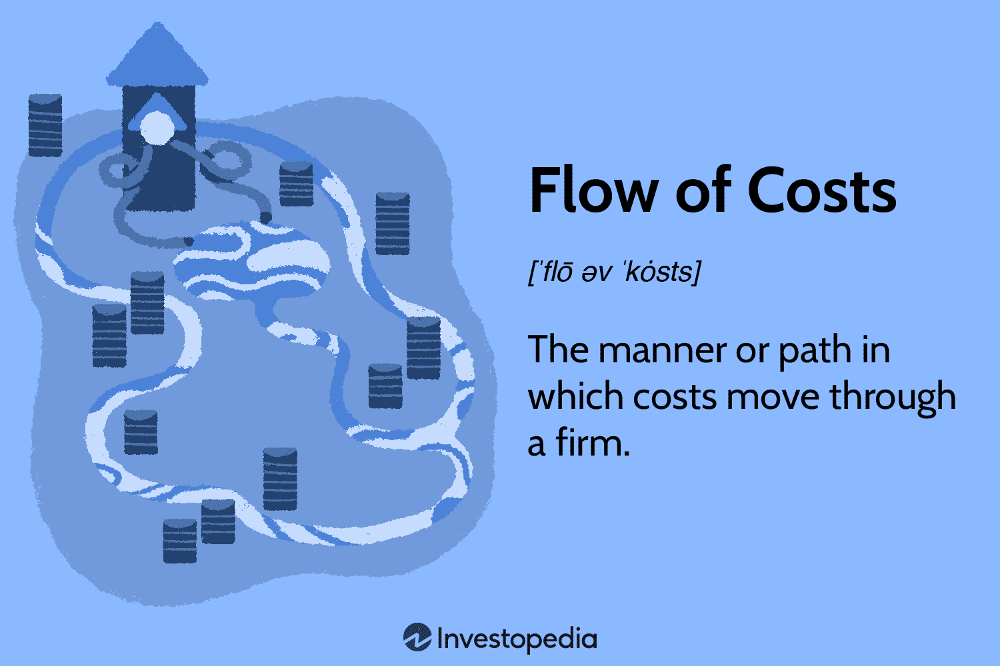

Cost flow, financial analysis, cost accounting, and algorithmic trading serve as fundamental pillars in today's intricate financial ecosystem. Understanding these concepts' interconnectedness is essential for businesses aiming to thrive in a competitive marketplace. Cost flow refers to the path costs take as they traverse through different stages within a company, a process that is pivotal in industries like manufacturing. It involves tracing costs from raw materials to work in progress, then to finished goods inventory, and finally to the cost of goods sold [^1^]. Financial analysis leverages cost flow data to evaluate a company’s financial health, enabling informed decision-making and strategy formulation.

Cost accounting is a critical component that supports financial analysis by providing precise costing information. This accuracy is indispensable for businesses to manage their expenses effectively and forecast future costs. In algorithmic trading, cost accounting plays a significant role by improving the accuracy of trading expenses and helping to refine trading strategies. By applying cost flow principles, traders and analysts can streamline operations, minimize costs, and boost profitability.



The integration of these concepts offers strategic advantages, such as enhanced decision-making and improved operational efficiency. The synergy between cost flow management, financial analysis, and algorithmic trading allows businesses to turn massive data streams into actionable insights. This capability is vital for optimizing trading strategies, reducing unnecessary expenses, and increasing profitability in a sustainable manner. Furthermore, understanding cost flow and related accounting methods equips businesses with the knowledge required to maintain a competitive edge in a rapidly evolving market landscape.

[^1^]: Bragg, S. M. (2019). "Cost Accounting: Concepts and Applications." Financial Times Press.

## Table of Contents

## Understanding Flow of Costs

Flow of costs refers to the systematic approach by which expenses are traced and recorded as they move through different stages within a company, particularly significant in manufacturing contexts. The main stages typically include raw materials, work in process, finished goods inventory, and cost of goods sold. This concept is pivotal in enabling businesses to accurately track expenses and ensure appropriate accounting practices.

In manufacturing, understanding how costs flow through the production process is essential for quantifying costs associated with each stage. For example, the raw materials stage involves calculating the costs of all materials that are consumed during production. These costs then transition into the work in process stage, where they are combined with labor and overhead costs as products progress towards completion. Finally, when goods are ready to be sold, they are moved into finished goods inventory and subsequently into the cost of goods sold upon sale.

To manage these cost flows, firms often employ methods such as FIFO (First-In, First-Out), LIFO (Last-In, First-Out), and the average cost method. Each of these approaches offers a different way to value inventory and track costs:

1. **FIFO (First-In, First-Out)**: This method assumes that the oldest inventory items are used or sold first. In periods of rising prices, FIFO results in lower cost of goods sold and higher ending inventory values, thereby increasing reported profits.

2. **LIFO (Last-In, First-Out)**: Contrary to FIFO, LIFO assumes that the most recently acquired inventory is used or sold first. This method often leads to higher cost of goods sold and lower profits during inflationary periods, and it may result in tax advantages due to the lower taxable income.

3. **Average Cost Method**: This method takes the weighted average cost of all inventory items available for sale during the period and applies it to the cost of goods sold and ending inventory. This approach smooths out price fluctuations over time.

Understanding the impact of these cost flow methods on financial statements is critical. Accurate cost quantification affects not only inventory valuation but also profitability and tax implications. For instance, during periods of inflation, choosing between FIFO and LIFO could significantly influence the bottom line reported on the financial statements.

In strategic business decision-making, comprehending how these methods alter the accounting outcomes is indispensable. Firms can use these insights to choose the most advantageous inventory accounting method that aligns with their financial goals and reporting standards. Accurate portrayal of cost flows ensures the integrity of financial statements, providing transparent insights for stakeholders including investors, management, and regulatory authorities.

Through meticulous application of these concepts, businesses are better positioned to make informed decisions, allocate resources efficiently, and maintain robust financial health.

## Interplay between Cost Accounting and Algorithmic Trading

Cost accounting plays a crucial role in supporting financial decision-making in [algorithmic trading](/wiki/algorithmic-trading) by providing precise insights into trading expenses. One of the essential methods within cost accounting that can significantly impact algorithmic trading is the average cost flow method. This method is beneficial in valuing assets and optimizing cost bases, pivotal for executing trades efficiently and maximizing returns.

In algorithmic trading, where trades are executed at high speed based on pre-defined criteria, maintaining control over costs is crucial. Cost accounting helps track expenses related to trading activities, including transaction costs, data acquisition fees, and technology costs. By providing a detailed breakdown of these expenditures, cost accounting allows traders to evaluate the profitability of their strategies accurately.

Implementing the average cost flow method within algorithmic trading systems offers specific advantages. This approach calculates the cost of inventory by averaging the cost of all similar items available during a period. In the context of trading, it assists in determining the average price of assets held, which is vital for valuing securities and determining the profit or loss for a given trading strategy. The average cost method offers a balanced view, especially when dealing with large volumes of trades, as it smooths out price fluctuations.

For instance, suppose an algorithmic trader deals in buying and selling stocks. They use a Python-based trading algorithm to assess the average cost of their stock portfolio to make informed decisions. Here is a simple example of how this can be implemented:

```python
def calculate_average_cost(prices, quantities):
    total_cost = sum(p * q for p, q in zip(prices, quantities))
    total_quantity = sum(quantities)
    if total_quantity == 0:
        return 0
    return total_cost / total_quantity

# Example usage
buy_prices = [100, 105, 110]  # Prices of stocks purchased
quantities = [10, 5, 15]      # Quantities of stocks purchased

average_cost = calculate_average_cost(buy_prices, quantities)
print("Average Cost of Stocks:", average_cost)
```

This script calculates the average cost of stocks held by an algorithmic trader, helping them evaluate their inventory's value. Such insights directly impact trading decisions, enabling traders to manage their portfolios more effectively.

Furthermore, using the average cost flow method aligns well with the need for precision in algorithmic trading. It supports optimization algorithms that require accurate valuation inputs to function efficiently. By integrating cost accounting principles, particularly average cost methodologies, algorithmic traders can strategically adjust their trading models to reflect true economic values, ensuring optimized decision-making and enhanced operational performance.

## The Role of Cost Flow Analysis in Financial Strategies

Cost flow analysis is an essential tool for businesses aiming to gain insights into their financial health and profitability by accurately managing costs. This analytical approach involves tracking and managing the costs associated with production and operations, which significantly influences a company's financial stance. By navigating these cost trajectories, businesses can make informed strategic decisions, leading to improved capital allocation, heightened resource utilization, and the identification of profitable ventures.

A primary advantage of cost flow analysis lies in its ability to detect profitable strategies. By understanding the flow of costs through various processes, companies can identify inefficiencies and areas where costs can be minimized. For example, using cost flow analysis, a manufacturing company might discover that certain materials are consuming a disproportionate amount of resources. This discovery allows the company to renegotiate supplier contracts or substitute materials to reduce costs and enhance margins.

Moreover, effective cost flow analysis facilitates optimal capital allocation. By having a clear picture of cost distribution and expenditure within the company, management can allocate resources to areas with the highest return potential. This ensures that capital is used efficiently and helps prevent the wastage of resources on less profitable segments.

Another crucial aspect of cost flow analysis is its role in efficient resource utilization. By analyzing cost data, businesses can adjust processes and operations to better utilize their existing resources. For instance, in a production environment, cost flow analysis might reveal underutilization of machinery or labor, prompting changes in scheduling or process layouts to maximize output without incurring additional cost.

In today's rapidly changing markets, maintaining competitiveness is paramount. A thorough understanding of cost flows allows businesses to adapt quickly to market fluctuations, technological advancements, and competitive pressures. By continuously analyzing and adjusting cost flows, companies can remain agile and responsive to external changes, ensuring sustained competitiveness and profitability.

In summary, cost flow analysis is not merely an accounting exercise but a strategic financial tool that underpins a company's ability to thrive in dynamic environments. By leveraging insights from cost flow data, businesses enhance their decision-making capabilities, improve financial performance, and secure a competitive edge in their respective markets.

## Integrating Cost Accounting in Trading Platforms

Integrating cost accounting principles into trading platforms involves utilizing technology to perform real-time cost analysis and reporting. Advanced cost accounting technologies allow businesses to track, analyze, and interpret cost data across various trading operations, thereby optimizing decision-making processes and improving operational transparency.

Software solutions like SAP and QuickBooks are essential in facilitating inventory management through the use of average cost methods, which in turn enable accurate asset valuation and comprehensive financial reporting. For instance, the average cost method, a fundamental concept in cost accounting, calculates the cost of goods available for sale by averaging the cost of inventory items. By doing so, it provides a consistent and systematic approach to managing inventory costs, which is particularly beneficial in environments with fluctuating prices.

The incorporation of such tools within algorithmic trading platforms offers substantial benefits by ensuring that trading processes are both cost-effective and transparent. These platforms can automatically update cost bases and inventory valuations as market conditions change, thereby providing traders with up-to-date financial information essential for making informed decisions. The integration of cost accounting tools allows trading algorithms to not only consider market conditions but also the associated transaction costs and tax implications, enhancing the overall trading strategy.

Moreover, technology-driven solutions provide real-time data analysis capabilities, which are crucial for maintaining the speed and accuracy required in today's financial markets. By automating cost management processes, trading platforms can minimize manual errors and reduce the time spent on data reconciliation, ultimately contributing to more efficient and effective trading operations.

Overall, integrating cost accounting principles within trading platforms is pivotal for achieving accurate cost analysis and fostering an environment of transparency and accountability in financial transactions. As trading environments become increasingly complex, the role of robust accounting software becomes ever more critical, ensuring that traders can consistently meet their financial reporting obligations and sustain competitive edge.

## Challenges and Opportunities in Algo Trading Cost Management

Algorithmic trading, while offering advantages like speed and efficiency, also presents several cost-related challenges. Rapid market changes require adaptive strategies and robust systems capable of evaluating a massive amount of data quickly. This necessitates continuous investment in infrastructure, technology, and skilled personnel to adapt algorithms that can maintain performance in volatile markets. Additionally, the costs associated with high-frequency trading platforms, including server costs and co-location fees, can be significant.

Technological advancements present both opportunities and hurdles. As markets evolve, algorithmic trading systems must leverage new technologies to stay competitive. Implementing [artificial intelligence](/wiki/ai-artificial-intelligence) (AI) and [machine learning](/wiki/machine-learning) algorithms can enhance decision-making processes, providing real-time analysis and predictions. These technologies allow traders to identify patterns and execute trades more effectively, but they require substantial investment in both software development and the acquisition of quality data sets.

Blockchain technology also offers opportunities in algorithmic trading for improving cost management and increasing transparency within trading operations. By ensuring secure and immutable transaction records, blockchain can help reduce discrepancies and errors, potentially lowering compliance costs. However, the integration of blockchain technology into existing systems poses both technical and financial challenges, requiring thorough assessments of its long-term value.

Key considerations for profitability in algorithmic trading include the costs of systems development, ongoing maintenance, and data acquisition. Developing and refining trading algorithms involves extensive testing and optimization, often utilizing historical data to improve accuracy—processes that can be inherently costly. Additionally, acquiring timely and refined market data is essential to the success of these algorithms. The costs for these data streams can be substantial, especially for proprietary or real-time data feeds.

In such a dynamic environment, compliance costs are another critical [factor](/wiki/factor-investing). Regulatory obligations require systems to be transparent and auditable, necessitating additional software solutions for reporting and monitoring. Compliance mandates may vary across jurisdictions, adding complexity and cost to global trading operations.

Thus, businesses in algorithmic trading must balance these challenges with opportunities presented by cutting-edge technologies. Strategic investments in AI and blockchain can optimize cost management, enhance transparency, and improve scalability. However, careful financial planning and cost analysis are crucial to ensure that these investments yield sustainable profitability without compromising compliance or operational integrity.

## Concluding Thoughts

Understanding and managing cost flows through financial analysis and cost accounting is essential for optimizing algorithmic trading strategies. As the financial markets become increasingly intricate, the ability to accurately track and analyze these cost flows becomes a pivotal aspect for any trading operation seeking to maximize its returns.

To maintain effective cost management, companies must continuously adapt to emerging trends and technologies. The rapid advancements in information technology, artificial intelligence, and data analytics provide opportunities for more precise and timely cost assessments, enabling traders to make informed decisions. These technologies can automate complex processes, reduce human error, and provide a competitive advantage to those who can implement them effectively.

Adopting robust accounting software solutions is vital. Solutions such as SAP, QuickBooks, or specialized trading platforms allow for real-time tracking and analysis of trading activities. These systems enable the consistent application of accounting principles across all trading operations, ensuring transparency and accuracy in financial reporting. For example, using the average cost method within these platforms can help standardize asset valuation and cost optimization, ultimately leading to better decision-making.

The integration of accounting software with algorithmic trading systems offers capabilities for real-time cost management. By embedding cost accounting principles into trading algorithms, companies can continuously assess the profitability and cost-effectiveness of their trades. This integrated approach not only enhances transparency but also supports sustainable financial success by aligning trading activities with strategic financial goals.

While these technologies offer considerable advantages, they also present challenges, particularly in terms of costs associated with their implementation and the need for skilled personnel to manage them effectively. It is crucial for businesses to balance these costs against the long-term benefits in operational efficiency and profitability.

In conclusion, the strategic management of cost flows, informed by robust financial analysis and cost accounting, is a cornerstone of successful algorithmic trading strategies. By leveraging the latest technologies and adapting to industry developments, companies can enhance their cost efficiency and maintain a competitive edge in the marketplace. The consistent application of these principles can lead to sustained financial success and provide a strong foundation for future growth.

## References & Further Reading

[1]: Bragg, S. M. (2019). ["Cost Accounting: Concepts and Applications."](https://www.amazon.com/Cost-Accounting-Comprehensive-Steven-Bragg-ebook/dp/B000VOZKL4) Financial Times Press.

[2]: ["Quantitative Trading: How to Build Your Own Algorithmic Trading Business"](https://www.amazon.com/Quantitative-Trading-Build-Algorithmic-Business/dp/1119800064) by Ernest P. Chan.

[3]: ["Advances in Financial Machine Learning"](https://www.amazon.com/Advances-Financial-Machine-Learning-Marcos/dp/1119482089) by Marcos Lopez de Prado.

[4]: ["Machine Learning for Algorithmic Trading"](https://github.com/stefan-jansen/machine-learning-for-trading) by Stefan Jansen.

[5]: ["Evidence-Based Technical Analysis: Applying the Scientific Method and Statistical Inference to Trading Signals"](https://www.amazon.com/Evidence-Based-Technical-Analysis-Scientific-Statistical/dp/0470008741) by David Aronson.