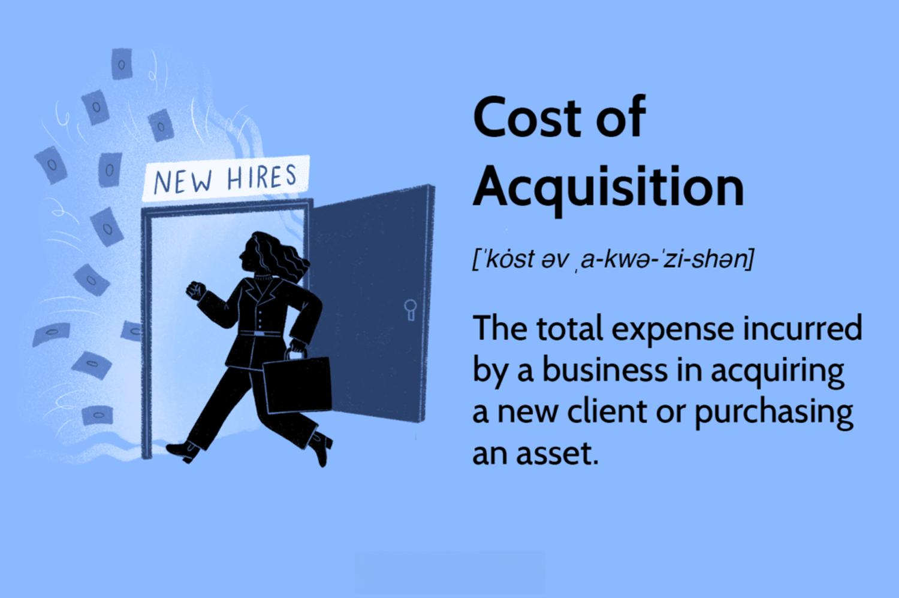

In the rapidly evolving world of finance, the integration of innovative technologies and analytical tools is transforming how investors approach the market. With the advent of algorithmic trading and cost of acquisition analysis, traditional investment strategies are being revolutionized to accommodate the demands of modern markets. Algorithmic trading, a method that utilizes computer algorithms to execute trades based on predefined criteria, offers unparalleled speed and accuracy, allowing investors to strategically navigate price variations efficiently. This shift not only enhances market operations but also equips traders with the capability to make informed, data-driven decisions at unprecedented speeds.

Concurrently, understanding acquisition costs—encompassing the total expenses involved in acquiring new clients or assets—profoundly influences investment performance. Analyzing acquisition costs elucidates the efficiency with which companies can obtain and maintain clients, directly impacting profitability. By optimizing these costs, investors can achieve superior returns, particularly in competitive industries where marketing strategies and negotiation play crucial roles.



This article explores the synergy between investment strategies, acquisition cost analysis, and algorithmic trading, examining how these components can jointly enhance investment performance. The primary aim is to provide a comprehensive overview of their interaction and the benefits they bring to modern trading and investment methodologies. We focus on key areas such as the definition and selection of effective investment strategies, the crucial role of acquisition costs in financial decision-making, and the pivotal impact of algorithmic trading in current market contexts. By integrating these elements, investors can optimize their strategies to achieve more robust and informed market participation, ensuring a competitive edge in the rapidly transforming financial landscape.

## Table of Contents

## Understanding Investment Strategies

Investment strategies serve as structured guidelines for investors aiming to optimize returns while mitigating risk. These strategies encompass a diverse range of financial instruments including stocks, bonds, exchange-traded funds (ETFs), cryptocurrencies, and other assets. The formulation of a suitable investment strategy is contingent on a multitude of factors, such as prevailing market conditions, an investor's personal financial objectives, and their risk tolerance.

**Types of Investment Strategies:**

1. **Buy-and-Hold Strategy**: This long-term investment approach involves purchasing securities and retaining them over an extended period, regardless of market fluctuations. The underlying principle is that markets tend to rise over time, providing capital appreciation and dividend income. This strategy is favored for its simplicity, minimal transaction costs, and potential tax advantages.

2. **Growth Investing**: Focused on capital appreciation, growth investing targets companies with high potential for significant financial expansion. Investors typically look for firms with above-average growth rates in revenue or earnings. However, this strategy carries a higher risk due to potential market volatility and speculation.

3. **Value Investing**: Popularized by investors such as Warren Buffett, value investing involves finding undervalued stocks that trade below their intrinsic value. This strategy is grounded in comprehensive financial analysis to identify companies with sound fundamentals yet overlooked by the market, presenting an opportunity for profit when the market corrects its valuation.

4. **Dividend Investing**: This strategy prioritizes accumulating stocks that offer regular dividend payments. Investors favor companies with a history of stable and increasing dividends, as these provide a steady income stream and potential for capital growth. Dividend investing is often preferred by those seeking income, particularly retirees.

**Core Components of Effective Investment Strategies:**

- **Market Analysis**: An integral component, market analysis involves examining economic conditions, industry trends, and specific company performance to make informed decisions. Utilizing tools such as technical analysis and fundamental analysis enhances understanding and anticipation of market movements.

- **Diversification**: Spreading investments across various asset classes, sectors, or geographic regions to reduce risk exposure. Diversification aims to maximize returns by investing in different areas that would each react differently to the same event.

- **Regular Portfolio Reviews**: Periodic assessment of an investment portfolio ensures alignment with financial goals and risk appetite. Such reviews allow investors to rebalance their portfolios, adjust strategies according to changing market conditions, and capitalize on new investment opportunities.

By considering these aspects, investors can craft robust investment strategies that align with their objectives, risk tolerance, and market expectations, thereby improving their chances of achieving desired financial outcomes over the long term.

## The Role of Acquisition Costs in Investing

Acquisition cost is a fundamental concept in finance, representing the total expenditure required to acquire a new client or purchase an asset. This metric is essential for investors aiming to make informed decisions and assessing an asset's potential return accurately. Understanding acquisition costs enables investors to evaluate how these expenses impact a company's overall financial performance, particularly in the context of competitive markets.

In the context of asset acquisition, the total cost includes the purchase price, transportation, installation, and any other expenses necessary to prepare the asset for use. This metric can significantly influence asset depreciation schedules and financial statements. By affecting these factors, acquisition costs directly impact a company's profitability and potential tax benefits. Investors and companies might hence analyze acquisition costs to optimize their financial strategies and ensure that assets contribute optimally to business objectives.

For businesses focused on customer acquisition, understanding and minimizing acquisition costs are equally crucial. High acquisition costs can erode profitability, particularly if the revenue generated from newly acquired customers does not offset these costs. Businesses often conduct acquisition cost analysis to determine how efficiently they can attract and retain customers, which is vital for maintaining competitive advantage. By analyzing this metric, businesses can streamline operations and implement more cost-effective marketing strategies.

Reducing acquisition costs is a strategic objective for many businesses. Effective marketing strategies, such as leveraging social media or optimizing search engine results, can diminish these costs. Additionally, thoughtful negotiation during purchasing processes can contribute to lower acquisition costs. Reduction of these costs not only enhances profitability but also improves return on investment (ROI), making the endeavor more worthwhile for investors.

Overall, acquisition cost analysis serves as a crucial tool for evaluating the efficiency of marketing strategies and resource allocation in asset purchasing. Both companies and investors must navigate acquisition costs effectively to maximize returns and sustain long-term financial growth.

## Algorithmic Trading: A Modern Game Changer

Algorithmic trading employs computer algorithms to execute trades automatically, based on specific rules or criteria, offering significant advantages over manual trading methods. The automation in [algorithmic trading](/wiki/algorithmic-trading) enhances speed, accuracy, and efficiency, enabling traders to capitalize on fleeting opportunities by executing large volumes of trades with minimal human intervention. This increase in trading efficiency is critical in modern financial markets where price discrepancies are often extremely brief and volatile.

One of the fundamental benefits of algorithmic trading is its ability to perform trades at much faster speeds than human-based trading, enabling the exploitation of small price discrepancies within milliseconds. This rapid execution is beneficial in high-frequency trading, where profits are garnered through small price changes over numerous trades. The accuracy of trade execution also reduces the likelihood of human error, ensuring that trades are completed exactly as intended by the algorithm's design.

Algorithmic trading strategies are diverse, with each designed to exploit specific market inefficiencies. Popular strategies include:

1. **Trend-following strategies**: These algorithms are designed to identify and follow trends in market prices, either going long in an uptrend or short in a downtrend. By analyzing historical price data, these algorithms attempt to predict and act on future price movements.

2. **Mean reversion strategies**: This strategy is based on the premise that asset prices will return to their historical average over time. Algorithms following this strategy identify overbought or oversold conditions and place trades that bet on prices reverting to the mean.

3. **Arbitrage opportunities**: Arbitrage algorithms exploit price differences of the same asset across different markets or platforms. By buying the asset where it is undervalued and selling it where it is overvalued, these algorithms secure risk-free profits.

4. **Market-making strategies**: Market makers provide liquidity to the markets by offering to buy and sell assets simultaneously, profiting from the bid-ask spread. Algorithmic market makers adjust their quotes based on market conditions to realize profits while managing inventory risk.

The incorporation of data analytics and [machine learning](/wiki/machine-learning) into algorithmic trading systems has further enhanced their ability to process large datasets, identify patterns, forecast trends, and make data-driven decisions. Machine learning algorithms can adapt to new information and dynamically refine their trading criteria, thereby improving their prediction accuracy over time. For example:

```python
import pandas as pd
from sklearn.model_selection import train_test_split
from sklearn.ensemble import RandomForestClassifier

# Loading historical market data
data = pd.read_csv('market_data.csv')

# Features and target variable
features = data.drop('target', axis=1)
target = data['target']

# Splitting the data
X_train, X_test, y_train, y_test = train_test_split(features, target, test_size=0.3, random_state=42)

# Implementing a Random Forest Classifier
model = RandomForestClassifier(n_estimators=100)
model.fit(X_train, y_train)

# Predicting on test data
predictions = model.predict(X_test)
```

Algorithmic trading offers substantial scalability, allowing traders and institutional investors to manage and optimize a diverse portfolio of assets simultaneously. The ability to automate trading across multiple instruments and markets simultaneously not only maximizes potential profits but also diversifies risk, thus making it highly suitable for contemporary investment strategies.

In summary, the synergy between sophisticated algorithms and rapid technological advancements has transformed algorithmic trading into a cornerstone of modern financial markets, empowering traders with tools to enhance trade execution, capitalize on market inefficiencies, and achieve scalability in asset management.

## Integrating Acquisition Cost Analysis with Algorithmic Trading

Integrating acquisition cost analysis with algorithmic trading provides a comprehensive view of investment opportunities by allowing investors to incorporate cost efficiency into their trading strategies. By factoring in acquisition costs, algorithmic trading strategies can be refined to optimize profitability metrics. The inclusion of acquisition cost data enables traders to evaluate the financial impact of acquiring new assets or customers, allowing for more informed decision-making.

Algorithmic trading systems can be programmed to adjust parameters dynamically based on acquisition cost data. For instance, an algorithm might reduce trading activity when acquisition costs exceed a certain threshold, thereby preventing unnecessary expenditure. Conversely, in scenarios where acquisition costs are low, the algorithm can increase trading activity to capitalize on favorable market conditions.

Consider the efficiency of a trading algorithm described using a basic profitability function:

$$
P = (R - C) \times Q
$$

where $P$ is profit, $R$ is revenue per trade, $C$ is the acquisition cost per trade, and $Q$ is the quantity of trades executed. By minimizing $C$, traders can enhance overall profitability.

Moreover, integrating acquisition costs into algorithmic trading provides significant benefits in risk management. Algorithms equipped with acquisition cost parameters can better assess market [volatility](/wiki/volatility-trading-strategies) and make preemptive adjustments to trading strategies. This addition helps manage exposure and implement effective risk mitigation techniques, ensuring a balanced trade-off between risk and reward.

Sophisticated algorithmic systems can incorporate machine learning models to predict acquisition costs and adjust trading strategies accordingly. Using historical data, these models can forecast potential costs and returns, allowing for better alignment with market trends and optimizing investment outcomes.

In Python, a simple implementation might employ the use of libraries such as NumPy or pandas to analyze historical acquisition cost data, combined with machine learning packages like scikit-learn to enhance predictive capabilities. For example:

```python
import numpy as np
import pandas as pd
from sklearn.linear_model import LinearRegression

# Load historical acquisition cost data
data = pd.read_csv('acquisition_cost_data.csv')
feature = data[['market_conditions', 'trade_volume']]
target = data['acquisition_cost']

# Train a linear regression model
model = LinearRegression()
model.fit(feature, target)

# Predict future acquisition costs
future_conditions = np.array([[condition1, volume1], [condition2, volume2]])
predicted_costs = model.predict(future_conditions)
```

By understanding acquisition costs and leveraging algorithmic tools, investors can create sophisticated and robust investment strategies that maximize returns while minimizing unnecessary expenditure. The synergy between these elements provides a dynamic framework for navigating modern financial markets, offering a competitive advantage and paving the way for more efficient and effective trading practices.

## Case Studies and Real-World Applications

Examining real-world examples of companies that have successfully integrated acquisition cost analysis with algorithmic trading provides valuable insights into how these tools can optimize investment strategies. These companies span various industries, including telecommunications and streaming services, which typically contend with high customer acquisition costs. However, they have identified effective strategies to mitigate these expenses and improve profitability.

In the telecommunications industry, firms face significant acquisition costs due to intense competition and the necessity of attracting and retaining customers in rapidly changing markets. Companies have adopted algorithmic trading techniques alongside traditional investment strategies to better manage these costs. This involves utilizing data analytics to optimize marketing expenditures, targeting prospective customers more efficiently, and enhancing customer retention through personalized communication strategies.

For instance, telecommunication companies use machine learning algorithms to analyze consumer data, enabling them to segment the market accurately and tailor their marketing efforts. By implementing predictive models, these firms can anticipate customer churn and proactively address potential retention challenges. This not only lowers acquisition costs but also sustains a stable revenue stream. Algorithmic trading strategies further aid these firms by optimizing asset allocation and identifying high-yield investment opportunities.

In the streaming services sector, firms often grapple with high acquisition costs as they strive to grow their subscriber base in a competitive landscape. Companies such as Netflix and Hulu have effectively employed data-driven strategies to curb these costs. By leveraging extensive user data, these firms develop detailed customer personas and predict viewing preferences, enabling them to design targeted marketing campaigns. Machine learning models and sentiment analysis are utilized to refine content recommendations and user experiences, thereby boosting customer satisfaction and retention rates.

Beyond these industries, hedge funds and trading firms increasingly employ sentiment analysis and [alternative data](/wiki/best-alternative-data) to enhance market predictions. By analyzing social media trends, news articles, and other non-conventional data sources, these firms identify market sentiments and anticipate movements. This information is incorporated into algorithmic trading strategies, allowing for more accurate forecasting and optimal trade execution. Trading algorithms can further accommodate acquisition cost insights, adjusting trading thresholds and allocations based on potential profitability and risk assessment.

These examples underscore the tangible benefits of integrating acquisition cost analysis with algorithmic trading into cohesive investment strategies. By efficiently managing these costs and refining investment tactics, companies can bolster financial performance and secure a competitive advantage in various markets.

## Conclusion

The intersection of investment strategies, acquisition cost analysis, and algorithmic trading offers significant advantages by fostering more efficient and profitable investment practices. Investors who adeptly integrate these components into their operations can markedly enhance their decision-making capabilities, improve their returns, and maintain a competitive edge in a rapidly evolving market. The strategic leverage of acquisition costs, aligned with advanced algorithmic tools, facilitates the formulation of more informed and profitable investment strategies. This alignment allows for precise targeting in acquisition processes and fine-tuning of investment algorithms to maximize returns while minimizing costs.

The ongoing advancement in technology and data analytics ensures that these strategies are not static; they evolve continually, offering greater potential for future gains. As machine learning and big data analytics continue to mature, investors can harness these technologies to interpret complex market trends and make data-driven decisions with unprecedented accuracy and speed. This technological progression reduces human error and introduces opportunities for automation and scalability in trading strategies, broadening the potential for returns across diverse asset classes.

In this dynamic environment, staying informed is not merely advantageous—it's essential. Investors and companies must be willing to adapt to these cutting-edge practices to remain successful. This adaptability requires continuous education and openness to novel technological integrations, ensuring that strategies evolve in tandem with market developments and technological advancements. The landscape of finance is shifting, and those who recognize and embrace these changes position themselves strategically for sustained success.

## References & Further Reading

[1]: Lopez de Prado, M. (2018). ["Advances in Financial Machine Learning"](https://www.amazon.com/Advances-Financial-Machine-Learning-Marcos/dp/1119482089). Wiley.

[2]: Chan, E. P. (2009). ["Quantitative Trading: How to Build Your Own Algorithmic Trading Business"](https://github.com/ftvision/quant_trading_echan_book). Wiley.

[3]: Jansen, S. (2020). ["Machine Learning for Algorithmic Trading: Second Edition"](https://github.com/PacktPublishing/Machine-Learning-for-Algorithmic-Trading-Second-Edition). Packt Publishing.

[4]: Aronson, D. (2007). ["Evidence-Based Technical Analysis: Applying the Scientific Method and Statistical Inference to Trading Signals"](https://www.amazon.com/Evidence-Based-Technical-Analysis-Scientific-Statistical/dp/0470008741). Wiley.

[5]: Bergstra, J., Bardenet, R., Bengio, Y., & Kégl, B. (2011). ["Algorithms for Hyper-Parameter Optimization"](https://dl.acm.org/doi/10.5555/2986459.2986743). Advances in Neural Information Processing Systems 24.

[6]: Kissell, R. (2013). ["The Science of Algorithmic Trading and Portfolio Management"](https://www.sciencedirect.com/book/9780124016897/the-science-of-algorithmic-trading-and-portfolio-management). Academic Press.