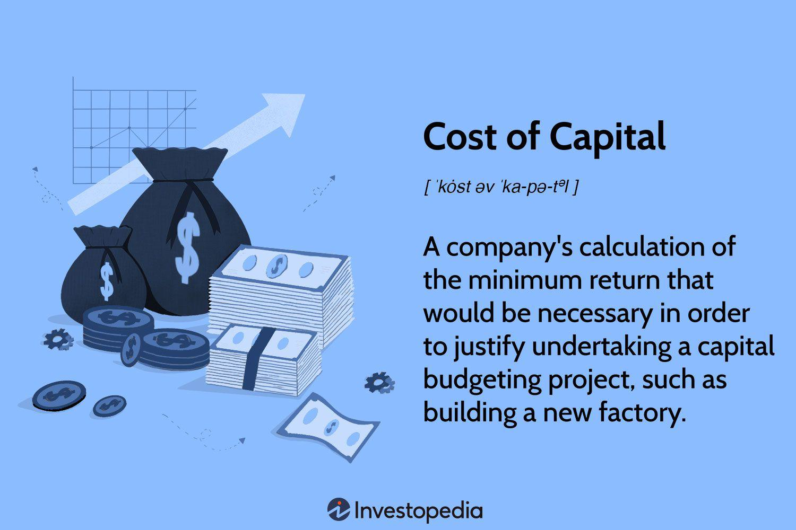

The concept of cost of capital is pivotal in financial decision-making as it represents the return rate that a firm must achieve to justify the cost of the necessary investment. Essentially, it serves as a benchmark for evaluating the viability of investment opportunities and guides executives in strategizing for growth and profitability. In financial analysis, the cost of capital connects directly with assessing the risk and potential returns of investments, enabling analysts to determine whether a project is likely to create value.

The cost of capital is instrumental in estimating a project's net present value (NPV) and composing the internal rate of return (IRR). These metrics influence executives and investors in making informed decisions by providing a comparison against set hurdle rates—the minimum acceptable return on investment. Understanding the cost of capital helps corporations in aligning their projects with shareholders' expectations and optimizing their capital structure.



In the dynamic landscape of algorithmic trading, capital calculation becomes even more significant. Algorithmic trading involves executing pre-programmed trading instructions that consider various market variables such as timing, price, and volume. Here, capital calculation, integrating the cost of capital, is crucial in constructing robust algorithms that not only target profit optimization but also account for risk management. Accurate capital calculation ensures that the algorithms trade within a strategically balanced framework, aimed at maximizing returns while minimizing undue risk exposure.

The interlinking of cost of capital with financial analysis and algorithmic trading yields profound implications for traders and investors. By incorporating the cost of capital in their strategic toolkit, traders can leverage data-driven insights to optimize trading operations and make judicious investment decisions. Investors, on the other hand, can assess the risk-adjusted return potential more accurately, which is vital for portfolio management and allocation strategies. This integration underscores the importance of a comprehensive understanding of financial mechanics and technological prowess in adapting to ever-evolving market dynamics.

## Table of Contents

## Understanding Cost of Capital

**Understanding Cost of Capital**

In a financial context, the cost of capital represents the return that a company must earn on its investment projects to maintain its market value and attract funds necessary for its operations. It is essentially the company's opportunity cost of investing resources in a particular way rather than the alternative opportunities. This cost plays a crucial role in corporate finance and investment decisions as it acts as a benchmark that projects must exceed to be considered viable and promising.

The cost of capital has two primary components: debt and equity. Debt refers to the borrowed funds a company uses, which typically entail interest payments. Equity represents the funds raised by a company through selling ownership shares. Both components are pivotal in understanding a company's financial strategy as they reflect different levels of risk and financial obligation. 

1. **Cost of Debt**: This is the effective rate that a company pays on its borrowed funds. It is often calculated on an after-tax basis due to the tax deductibility of interest expenses. The formula is generally expressed as:
$$
   \text{Cost of Debt} = \frac{\text{Total Interest Expense} \times (1 - \text{Tax Rate})}{\text{Total Debt}}

$$

2. **Cost of Equity**: This represents the return required by equity investors to compensate them for the risk of investing in the company. Common models to estimate the cost of equity include the Capital Asset Pricing Model (CAPM), which is expressed as:
$$
   \text{Cost of Equity} = \text{Risk-Free Rate} + \beta \times (\text{Market Return} - \text{Risk-Free Rate})

$$
   where $\beta$ represents the sensitivity of the company's stock returns relative to the overall market returns.

The weighted average cost of capital (WACC) combines these components by weighting them according to their proportion in the company's capital structure. The formula for WACC is:
$$
\text{WACC} = \left(\frac{E}{V} \times \text{Re}\right) + \left(\frac{D}{V} \times \text{Rd} \times (1 - \text{Tc})\right)
$$

Where:
- $E$ is the market value of equity,
- $D$ is the market value of debt,
- $V$ is the total market value of the company (equity plus debt),
- $\text{Re}$ is the cost of equity,
- $\text{Rd}$ is the cost of debt,
- $\text{Tc}$ is the corporate tax rate.

Understanding and accurately calculating the cost of capital is essential for evaluating investment opportunities and strategic financial planning. It ensures that resources are allocated efficiently and that the company can sustain its growth and competitive position in the market.

## The Role of Cost of Capital in Financial Analysis

Cost of capital is a fundamental concept in financial analysis, serving as a benchmark for evaluating the attractiveness of investment projects. It represents the minimum return that a firm must earn on its investment projects to maintain its market value and satisfy its investors. The cost of capital plays a pivotal role in determining hurdle rates, which are the minimum acceptable rates of return for investments, enabling firms to assess the feasibility of potential projects effectively.

For investment project evaluations, the cost of capital acts as a financial metric that aids in deciding whether a project is worth pursuing. It reflects the opportunity cost of investing resources in a specific project rather than alternative ventures. Firms use this metric to set hurdle rates, which are critical in assessing a project's potential to generate returns. If a project's expected rate of return exceeds the firm's hurdle rate, it is typically considered viable. Conversely, if the expected return falls short of the hurdle rate, the project may be rejected or subjected to further scrutiny.

The influence of cost of capital extends to company valuations and investor decisions. It affects the discount rates used in valuation models, such as the Discounted Cash Flow (DCF) model, impacting the present value of future cash flows and, consequently, the company's valuation. A lower cost of capital generally leads to a higher valuation, whereas a higher cost of capital might result in a reduced valuation. Investors carefully consider a firm's cost of capital to assess the risk and potential return associated with their investment. A company with a high cost of capital might be perceived as riskier, which can influence investment decisions at the individual and institutional levels.

The components of cost of capital, namely debt and equity, are weighted to derive the Weighted Average Cost of Capital (WACC). The WACC formula is used extensively across industries to appraise the opportunity costs of specific investments. It is calculated as follows:

$$

\text{WACC} = \left(\frac{E}{V} \times Re \right) + \left(\frac{D}{V} \times Rd \times (1 - T)\right) 
$$

Where:
- $E$ is the market value of equity.
- $V$ is the total market value of the company’s financing (equity and debt).
- $Re$ is the cost of equity.
- $D$ is the market value of debt.
- $Rd$ is the cost of debt.
- $T$ is the corporate tax rate.

Different industries present varied considerations for the cost of capital. For instance, in technology sectors where growth potential and innovation drive valuations, a lower hurdle rate might be acceptable due to higher expected returns. Conversely, in traditional manufacturing or utility companies, which may have more stable cash flows, higher hurdle rates could be adopted to counterbalance lower growth prospects and greater emphasis on operational efficiency.

By comprehensively understanding the cost of capital and its implications, firms gain insights into capital budgeting decisions, leading to more informed and strategic investment choices that align with long-term financial goals.

## Algorithmic Trading and Capital Calculation

Algorithmic trading involves the use of computer programs to execute trades based on predefined criteria without human intervention. This method relies heavily on mathematical models and strategies to optimize trading efficiency. Algorithmic trading has grown significantly since its inception, driven by advancements in technology and the expansion of financial markets. Today, it accounts for a substantial portion of trading activity in global markets.

Algorithms are essential for calculating trading costs and managing investments efficiently. These systems assess multiple variables—such as market conditions, asset prices, and order execution costs—to determine the most cost-effective way to enter or [exit](/wiki/exit-strategy) positions. Effective algorithms consider factors like transaction costs, market impact costs, and delay costs. Here, the ability to estimate and minimize trading costs can distinguish successful strategies from less effective ones.

Accurate capital calculation is crucial in [algorithmic trading](/wiki/algorithmic-trading), as it ensures that trades are executed within the risk and capital constraints of a trader or firm. It involves determining the optimal amount of capital to allocate to any given trade, balancing risk and return. The capital calculation should justify the potential returns by properly evaluating the trade's risk exposure. This process often involves stress testing, scenario analysis, and sensitivity analysis to assess the impact of different market conditions on the trade’s capital requirements.

Aligning capital calculation with algorithmic trading practices presents several challenges. One major challenge is the dynamic nature of financial markets where prices and conditions change rapidly, necessitating real-time adjustments to trading algorithms. Additionally, market microstructure anomalies and latency issues can affect the execution of trades and their associated capital costs. Another significant challenge is integrating diverse data sources to inform capital calculation accurately, which requires sophisticated data handling and analytical capabilities.

Strategies to address these challenges involve the use of advanced [machine learning](/wiki/machine-learning) and data analytics techniques to enhance the adaptability and accuracy of trading algorithms. Incorporating [artificial intelligence](/wiki/ai-artificial-intelligence) (AI) can improve algorithmic responsiveness to market changes, while high-frequency trading ([HFT](/wiki/high-frequency-trading-strategies)) systems can manage latency and microstructure issues. It is also essential for traders to continuously refine their algorithms by [backtesting](/wiki/backtesting) on historical data and applying quantitative metrics to evaluate algorithm performance. 

Effective integration of capital calculation into algorithmic trading helps maximize returns while minimizing risk, a fundamental goal for traders and investors leveraging algorithmic strategies.

## Integrating Cost of Capital with Algo Trading Strategies

Understanding the cost of capital is crucial for enhancing algorithmic trading strategies. In algorithmic trading, where decisions are taken in fractions of a second, integrating cost of capital into trading algorithms allows for more refined control over investments, leading to potentially higher returns. This involves considering various factors, such as trading costs, bid-ask spreads, and price impacts, which are essential components for optimizing trading execution.

**Interplay between Trading Costs, Bid-Ask Spreads, and Price Impacts**

Trading costs are a combination of explicit costs (like commissions and fees) and implicit costs, which include bid-ask spreads and price impacts. The bid-ask spread represents the difference between the highest price a buyer is willing to pay for an asset and the lowest price a seller is willing to accept. This spread is a transaction cost and affects the profitability of trading strategies. The price impact refers to changes in the asset's price due to the trader's order; large orders typically lead to higher price impacts, potentially diminishing returns.

Understanding and efficiently managing these components is essential for optimizing trading strategies. By accurately predicting and minimizing spreads and price impacts, an algorithm can improve the execution of trades, leading to better investment outcomes. This requires advanced modeling and the integration of these cost factors into the trading algorithm.

**Efficient Management of Trading Costs**

Efficient management of trading costs can significantly improve investment returns. This involves developing algorithms that consider and seek to minimize both explicit and implicit costs. Algorithms can be designed to execute trades at optimal times or break larger orders into smaller ones to reduce market impact.

For example, the use of machine learning models can help predict market conditions that might lead to unfavorable spreads or price impacts. This predictive capability allows traders to adjust their strategies dynamically, mitigating costs and enhancing returns.

**Incorporating WACC into Algo Trading Models**

The weighted average cost of capital (WACC) is a measure that represents a firm's cost of capital, factoring in the relative weights of each component of the capital structure—such as debt and equity. For algo traders, incorporating WACC into their models can lead to better decision-making. WACC can be used as a benchmark for expected returns; trades that do not meet this threshold can be filtered out, optimizing the portfolio towards higher profitability.

Python, a preferred language for developing trading algorithms, can be leveraged to incorporate WACC calculations into trading models. Below is a simple outline of how this might be implemented:

```python
# Sample Python code to calculate WACC
def calculate_wacc(equity, debt, cost_of_equity, cost_of_debt, tax_rate):
    equity_ratio = equity / (equity + debt)
    debt_ratio = debt / (equity + debt)
    wacc = (equity_ratio * cost_of_equity) + (debt_ratio * cost_of_debt * (1 - tax_rate))
    return wacc

# Example use
equity = 100000  # Example equity amount
debt = 50000     # Example debt amount
cost_of_equity = 0.08  # 8% cost of equity
cost_of_debt = 0.05    # 5% cost of debt
tax_rate = 0.30        # 30% corporate tax rate

wacc = calculate_wacc(equity, debt, cost_of_equity, cost_of_debt, tax_rate)
print("Weighted Average Cost of Capital (WACC):", wacc)
```

By integrating WACC in this manner, algo traders can filter and select trades that not only generate returns above threshold levels but also align with their risk and cost structures, ultimately promoting more efficient capital allocation and higher investment gains.

## Case Studies and Practical Applications

### Case Studies and Practical Applications

The integration of cost of capital analysis in trading scenarios has been exemplified by several companies that have successfully optimized their trading strategies. This section provides examples to illustrate how cost of capital considerations play a critical role in algorithmic trading and investment decisions.

One prominent example is Goldman Sachs, which has been at the forefront of integrating sophisticated cost of capital analyses in its trading strategies. By employing the weighted average cost of capital (WACC) as a key metric, Goldman Sachs evaluates potential trading opportunities against a backdrop of capital costs. This strategic assessment enables the firm to identify trading scenarios where the expected returns exceed their calculated cost of capital, ensuring profitable investments. In practice, Goldman Sachs incorporates WACC into its risk management framework, thereby enhancing the precision of its trading models and optimizing capital deployment.

Another relevant case is Renaissance Technologies, a [hedge fund](/wiki/hedge-fund-trading-strategies) known for its algorithmic trading prowess. The firm has mastered the balance between trading costs and expected returns by leveraging cost of capital computations. Renaissance Technologies implements advanced algorithms that [factor](/wiki/factor-investing) in both the cost of equity and debt when assessing trading positions. By doing so, the firm can dynamically adjust its positions based on fluctuating market conditions and cost structures. This flexibility provides a competitive advantage, allowing Renaissance Technologies to consistently generate superior returns while managing trading risks effectively.

Below is a simplified Python code snippet illustrating how a trading algorithm might incorporate WACC into its decision-making process:

```python
def calculate_wacc(equity_cost, debt_cost, equity_weight, debt_weight, tax_rate):
    return (equity_weight * equity_cost) + (debt_weight * debt_cost * (1 - tax_rate))

def should_invest(expected_return, equity_cost, debt_cost, equity_weight, debt_weight, tax_rate):
    wacc = calculate_wacc(equity_cost, debt_cost, equity_weight, debt_weight, tax_rate)
    return expected_return > wacc

equity_cost = 0.08  # 8%
debt_cost = 0.05    # 5%
equity_weight = 0.6
debt_weight = 0.4
tax_rate = 0.3      # 30%
expected_return = 0.07 # 7%

decision = should_invest(expected_return, equity_cost, debt_cost, equity_weight, debt_weight, tax_rate)
print("Invest" if decision else "Do not invest")
```

In another example, J.P. Morgan Chase leverages its understanding of cost of capital to enhance its trading desks' efficiency. By incorporating metrics like WACC into their algorithmic frameworks, they can tailor their trading strategies to account for varying costs associated with different markets and economic environments. This strategic use of financial metrics ensures that trading activities align with the firm's capital allocation goals, maximizing shareholder value.

Lessons learned from these industry leaders underscore the importance of aligning capital costs with trading operations. Successful firms employ robust analytical frameworks to ensure that their capital is used efficiently, thus enhancing their competitive edge in fast-paced financial markets.

These examples highlight how incorporating detailed cost of capital analysis into trading scenarios helps firms not only evaluate the profitability of investments but also optimize capital allocation to achieve sustained growth and financial success.

## Conclusion

The cost of capital serves as a fundamental pillar in financial decision-making, providing a measure of the required return necessary for an investment to be worthwhile. It intertwines with financial analysis to guide corporations and individual investors in evaluating the viability of potential projects and investments. In today's fast-paced financial markets, algorithmic trading plays an increasingly crucial role, and the precise calculation of capital is vital for algorithmic systems to execute effective strategies.

By understanding the mutual relationships between the cost of capital, financial analysis, and algorithmic trading, traders and investors gain a comprehensive view that allows them to make informed decisions. This interconnection enables the assessment of investment feasibility, impacts company valuation, and determines the efficiency of trading strategies. It underscores the necessity of accurate capital calculations to set appropriate hurdle rates and benchmark returns, which are crucial for maintaining competitive and profitable trading operations.

Financial markets do not exist in a vacuum. Economic conditions and market dynamics are constantly evolving, necessitating a commitment to continuous learning and adaptation. Developing strategies that accommodate these changes ensures resilience and long-term success. By integrating a deep understanding of the cost of capital into trading models and decisions, market participants can enhance their strategies to optimize returns while carefully managing risks. Emphasis on thorough and accurate capital calculation is indispensable for navigating the complex landscape of contemporary financial markets.

## References & Further Reading

[1]: ["Advances in Financial Machine Learning"](https://www.amazon.com/Advances-Financial-Machine-Learning-Marcos/dp/1119482089) by Marcos Lopez de Prado

[2]: ["Quantitative Trading: How to Build Your Own Algorithmic Trading Business"](https://www.amazon.com/Quantitative-Trading-Build-Algorithmic-Business/dp/1119800064) by Ernest P. Chan

[3]: ["Corporate Finance"](https://www.investopedia.com/terms/c/corporatefinance.asp) by Stephen A. Ross, Randolph W. Westerfield, Jeffrey F. Jaffe

[4]: Berk, J. B., & DeMarzo, P. M. (2017). ["Corporate Finance"](https://www.pearson.com/nl/en_NL/higher-education/subject-catalogue/finance/corporate-finance-4e-berk-and-demarzo.html). Pearson

[5]: ["Principles of Corporate Finance"](https://www.wallstreetmojo.com/corporate-finance/) by Richard Brealey, Stewart Myers, and Franklin Allen