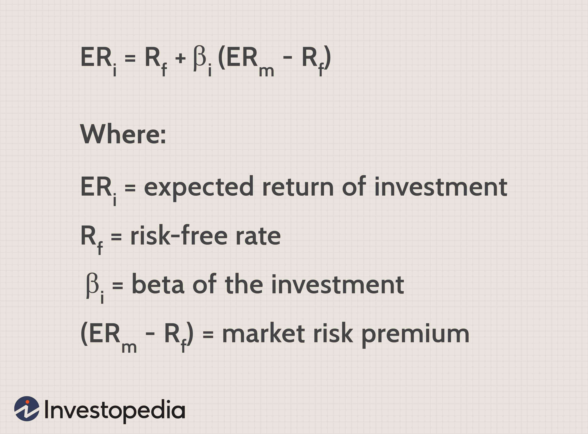

Financial management is fundamentally rooted in the evaluation of the cost of capital, a crucial element influencing both financial analysis and corporate finance. The cost of capital represents the rate of return required by investors to justify the risks undertaken in investing in a company or financial asset. This metric is vital for assessing investment opportunities and determining the financial viability of projects. It acts as a benchmark for necessary returns, guiding decision-making processes in the corporate sphere.

In today's dynamic financial markets, algorithmic trading has significantly transformed investment decision-making. By employing sophisticated algorithms and high-speed data processing, algorithmic trading enables rapid and informed transactions based on precise financial analysis metrics. These algorithms rely heavily on accurate calculations and projections, where the cost of capital is a pivotal factor. Algorithmic trading systems incorporate this data to forecast market movements and optimize trading strategies, ensuring alignment with expected financial performance metrics.



A key part of both algorithmic trading and broader investment decision-making is the required rate of return. This metric is closely linked to the cost of capital and serves as a foundation for investment analysis. It represents the minimum expected return investors demand for investing in a particular asset, considering its risk profile. Understanding the required rate of return in conjunction with the cost of capital is essential for making informed investment decisions that aim to maximize returns.

This article examines how the cost of capital, financial analysis, and algorithmic trading strategies interconnect, impacting investment outcomes. Comprehension of these concepts is crucial for navigating financial markets effectively, allowing investors and financial professionals to optimize their strategies in pursuit of maximized returns. The article seeks to provide insights into the integration of these principles in modern finance, reflecting the ongoing evolution of financial strategies and technology.

## Table of Contents

## Understanding the Cost of Capital

The cost of capital is a foundational concept in financial management, representing the minimum return that investors expect for investing in a company or financial asset, considering the inherent risks. It serves as a crucial benchmark for assessing the desirability of potential investment projects and the overall corporate performance. By setting this benchmark, the cost of capital influences managerial decisions on whether to pursue new projects or strategies, ensuring that they meet or exceed investor expectations.

The primary components of the cost of capital include the cost of debt and the cost of equity, each offering insights into the financial health and risk profile of an enterprise. The cost of debt is typically assessed as the effective rate a company pays on its borrowed funds, which can be calculated by considering both the interest rates and the tax shields offered by interest expenses. Conversely, the cost of equity represents the returns required by equity investors, taking into account stock volatility and market conditions.

To calculate the weighted average cost of capital (WACC), a commonly used measure, the following formula is applied:

$$

\text{WACC} = \left(\frac{E}{V} \times \text{Re}\right) + \left(\frac{D}{V} \times \text{Rd} \times (1 - \text{Tc})\right) 
$$

Where:
- $E$ is the market value of equity
- $D$ is the market value of debt
- $V$ is the total market value of the company's financing (equity + debt)
- $\text{Re}$ is the cost of equity
- $\text{Rd}$ is the cost of debt
- $\text{Tc}$ is the corporate tax rate

In evaluating the cost of capital, businesses must consider prevailing market conditions, the specific risks associated with their industry, and their unique capital structure. Accurately assessing these elements guides enterprises in making informed investment decisions that align with their financial objectives and risk tolerance.

Incorporating the cost of capital into financial analysis is essential for obtaining precise estimations of an investment project’s profitability and value. It is an indispensable tool for determining the Discounted Cash Flows (DCF) of projects, which assists in comparing the viability and potential returns of various opportunities. This ultimately aids in maximizing shareholder value by efficiently allocating resources to projects and ventures that promise the highest returns relative to their associated risks.

## Financial Analysis: Measuring Required Rate of Return

The required rate of return is a critical concept in financial analysis, representing the minimum return an investor expects when investing in an asset or project. This rate serves as a benchmark for assessing the feasibility of investments by weighing potential rewards against the inherent risks. Evaluating the required rate of return involves considering various models and market factors.

Among the most widely used models in determining the required rate of return is the Capital Asset Pricing Model (CAPM), which provides a theoretical framework for evaluating the risk versus return dynamics. The CAPM formula is:

$$

r_i = r_f + \beta_i (r_m - r_f) 
$$

where:
- $r_i$ is the expected return on the investment,
- $r_f$ is the risk-free rate of return,
- $\beta_i$ is the beta coefficient representing the asset's risk relative to the market,
- $r_m$ is the expected return of the market.

This model assumes that investors require compensation for both the time value of money (represented by the risk-free rate) and the risk taken (beta times the market risk premium). The CAPM helps quantify an investor's expectation by incorporating the systematic risk associated with market movements.

Market conditions and sector-specific factors also significantly influence the required rate of return. Different industries may have varying average returns and risk profiles, reflecting their distinctive economic characteristics. For instance, technological sectors might command higher required rates due to rapid innovation and competitive dynamics, whereas utilities, often considered stable, might have lower required rates.

Macroeconomic factors, such as inflation rates, interest rates, and economic growth projections, also impact required rates. Investors may adjust their expectations based on changing economic conditions or regulatory environments, leading to shifts in perceived risk and return balances.

Accurate calculation of the required rate of return is vital for financial analysis, aiding investors in making informed decisions regarding potential opportunities. Estimating this rate correctly allows for better evaluation of whether an investment meets the risk and return criteria aligned with an investor's financial goals. The precision of these calculations can significantly affect investment strategy and portfolio management, underscoring the importance of rigorous financial analysis and continuous market assessment.

## The Intersection of Cost of Capital and Algorithmic Trading

Algorithmic trading utilizes sophisticated algorithms to automate trading activities and make informed investment decisions through the analysis of comprehensive financial data sets. These algorithms are designed to interpret financial metrics that influence trading strategies dynamically. Among these metrics, the cost of capital plays a pivotal role in shaping the algorithms' decision-making process.

The cost of capital is crucial because it serves as an input that affects the assessment of financial performance and the calculation of risk-adjusted returns on trades. By incorporating the cost of capital into algorithmic models, traders can evaluate whether an investment meets the required rate of return after accounting for the risk associated with the financial asset. The process involves using various metrics such as the weighted average cost of capital (WACC), which combines the cost of equity and the cost of debt to provide an average expected return demanded by all investors in a firm:

$$
WACC = \left(\frac{E}{V} \times Re\right) + \left(\frac{D}{V} \times Rd \times (1 - Tc)\right)
$$

where:
- $E$ is the market value of equity,
- $V$ is the total market value of equity and debt,
- $Re$ is the cost of equity,
- $D$ is the market value of debt,
- $Rd$ is the cost of debt,
- $Tc$ is the corporate tax rate.

Automated trading systems benefit from the continuous update of financial metrics such as the cost of capital. This dynamic refinement enables the systems to align with financial performance expectations and adjust their strategies in response to market conditions. Incorporating the cost of capital ensures that these strategies remain grounded in a realistic assessment of potential returns against the benchmarks set by investors.

The integration of cost of capital considerations also represents a fusion of finance theory and advanced technology, a synergy that enhances trading outcomes. In volatile market environments, this approach helps optimize trades, ensuring that they not only meet performance targets but also respect the risk parameters set by firms. The application of such principles to [algorithmic trading](/wiki/algorithmic-trading) underscores the need for precise financial analysis tools and the sophisticated modeling of individual investment scenarios.

Overall, by embedding cost of capital assessments in algorithmic trading, finance professionals can enhance the computational intelligence of trading systems, leveraging theoretical finance concepts effectively within automated environments. This intersection highlights the importance of a coherent financial framework in managing modern trading systems, empowering traders to make accurate decisions in fast-paced markets.

## Challenges and Opportunities in Aligning Cost of Capital with Algorithmic Trading

Aligning the cost of capital with algorithmic trading presents several challenges and opportunities, given the dynamic nature of financial markets.

One significant challenge lies in the accurate integration of cost of capital metrics into trading algorithms. These metrics must adapt to market fluctuations and economic changes to maintain the stability of the required rate of return. In volatile markets, the cost of capital can shift rapidly, affecting the expected returns on investments. Algorithms must therefore be designed to respond and adjust to these fluctuations in real-time, ensuring that trading strategies remain profitable and aligned with financial goals.

Financial technology innovations offer a promising opportunity to enhance the precision with which these financial metrics are integrated into algorithmic trading. Advanced data analytics, [machine learning](/wiki/machine-learning), and [artificial intelligence](/wiki/ai-artificial-intelligence) can significantly improve the accuracy and adaptability of trading algorithms. For example, machine learning algorithms can be used to identify patterns and predict market movements, allowing for more precise adjustments to trading strategies based on cost of capital changes. Python, with libraries like NumPy for numerical computations and Pandas for data manipulation, is particularly useful for developing such adaptive trading models.

```python
import numpy as np
import pandas as pd

# Example of adjusting cost of capital in a trading model based on market data
def adjust_cost_of_capital(market_data):
    """
    Adjusts the cost of capital based on the [volatility](/wiki/volatility-trading-strategies) of market data.
    """
    volatility = np.std(market_data['returns'])
    adjusted_cost_of_capital = market_data['base_cost_of_capital'] * (1 + volatility)
    return adjusted_cost_of_capital

# Example market data
market_data = pd.DataFrame({
    'returns': [0.02, 0.01, -0.03, 0.04],
    'base_cost_of_capital': [0.05] * 4
})

adjusted_costs = adjust_cost_of_capital(market_data)
print(adjusted_costs)
```

Opportunities also exist to enhance risk management techniques through a better understanding of the cost of capital and required rates of return. By incorporating real-time data and predictive analytics, financial professionals can develop more robust risk management frameworks that anticipate and mitigate potential losses associated with market volatility.

Professionals who can effectively address these challenges and seize the opportunities provided by technological advancements will be better positioned to leverage algorithmic trading. By maintaining an adaptive strategy that aligns with accurate assessments of the cost of capital, they can maximize returns and maintain a competitive edge in finance.

## Conclusion

The cost of capital, required rate of return, and algorithmic trading are significant elements in modern finance. In today's fast-paced financial markets, where time is of the essence, understanding and effectively managing these concepts can offer a substantial competitive advantage. Mastery of these areas allows financial professionals to design and execute trading strategies with a refined precision that aligns with the current market dynamics and investor expectations.

Accuracy in calculating the cost of capital is essential as it impacts the assessment of investment projects and corporate strategies. This understanding informs the development of more effective algorithmic trading strategies, which are vital in the pursuit of maximizing investor returns. As financial markets and technology rapidly advance, the methodologies employed in both financial analysis and trading need continuous enhancement to remain relevant and effective.

Professionals in finance must remain agile, incorporating the latest data and technologies to refine their models and trading algorithms continually. Adaptive strategies, informed by accurate cost of capital calculations, are crucial in navigating market volatility and economic shifts. Staying informed and flexible equips financial experts with the tools to tackle the challenges and harness the opportunities presented by the evolving landscape of algorithmic trading and financial management.

Incorporating the latest innovations in financial technology can improve the precision of these calculations, thus enhancing the overall effectiveness of trading platforms. Python, for example, provides a flexible and powerful toolset for crafting algorithms that can dynamically adjust to changes in the required rate of return based on varying market conditions. Ensuring that trading strategies are informed by current economic indicators and risk assessments is essential for maintaining a competitive edge and achieving long-term success in the world of finance.

## References & Further Reading

[1]: ["The Theory and Practice of Investment Management"](https://onlinelibrary.wiley.com/doi/book/10.1002/9781118267028), edited by Frank J. Fabozzi and Harry M. Markowitz.

[2]: ["Cost of Capital in Managerial Finance"](https://link.springer.com/book/10.1007/978-3-319-15135-9) by J. Richard Dietrich.

[3]: ["Algorithmic Trading: Winning Strategies and Their Rationale"](https://www.wiley.com/en-us/Algorithmic+Trading%3A+Winning+Strategies+and+Their+Rationale-p-9781118460146) by Ernie Chan.

[4]: ["The Book of R: A First Course in Programming and Statistics"](https://www.amazon.com/Book-First-Course-Programming-Statistics/dp/1593276516) by Tilman M. Davies.

[5]: ["Corporate Finance"](https://www.investopedia.com/terms/c/corporatefinance.asp) by Jonathan Berk and Peter DeMarzo.