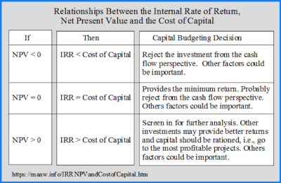

## Table of Contents

## What is the cost of capital?

The cost of capital is the return a company needs to give to its investors to make them happy with their investment. It's like the price a company pays for using money from different sources, like loans or selling shares. This cost is important because it helps companies decide if a new project or investment is worth it. If the project's return is higher than the cost of capital, it might be a good idea to go ahead with it.

There are two main parts to the cost of capital: the cost of debt and the cost of equity. The cost of debt is what the company pays in interest on its loans. It's usually easier to figure out because it's based on the interest rate. The cost of equity is trickier. It's what shareholders expect to earn from their investment in the company. This can be influenced by things like how risky the company is and what other investment options are out there. Companies often use a mix of debt and equity, so they calculate a weighted average cost of capital (WACC) to get a full picture.

## How is the cost of capital calculated?

The cost of capital is calculated by figuring out the cost of each type of money a company uses and then mixing them together. There are two main types of money: debt and equity. The cost of debt is easier to find because it's just the interest rate the company pays on its loans. But, because companies can deduct interest from their taxes, the real cost of debt is a bit less than the interest rate. You figure this out by multiplying the interest rate by one minus the tax rate.

The cost of equity is trickier because it's what shareholders expect to earn. One common way to estimate it is the Capital Asset Pricing Model (CAPM). This model says the cost of equity equals a risk-free rate (like what you'd get from a super safe investment) plus a premium for the risk of investing in the company. The risk premium is based on how risky the company is compared to the overall market. Once you have the cost of debt and the cost of equity, you combine them to get the weighted average cost of capital (WACC). You do this by multiplying the cost of each type of money by how much of it the company uses, and then adding those numbers together. This gives you a big-picture view of how much it costs the company to use money from all sources.

## What is the difference between the cost of capital and the required rate of return?

The cost of capital and the required rate of return are related but different concepts. The cost of capital is the average rate a company must pay to finance its operations and growth through debt and equity. It's like the price a company pays for using money from investors and lenders. This cost is important because it helps a company decide if a new project or investment is worth pursuing. If the project's return is higher than the cost of capital, it might be a good idea to go ahead with it.

The required rate of return, on the other hand, is the minimum return an investor expects to earn from an investment. It's what investors think is fair for the risk they're taking. This rate can vary a lot depending on the investor and the investment. For example, a shareholder might have a different required rate of return than a bondholder. While the cost of capital is about the company's perspective on financing costs, the required rate of return is about what individual investors expect to get back from their investments.

## Why is the cost of capital important for businesses?

The cost of capital is really important for businesses because it helps them make smart choices about where to spend their money. It's like a guide that tells a company if a new project or investment is a good idea. If the money they expect to make from a project is more than the cost of capital, then it might be worth doing. This way, businesses can pick projects that will make them more money than they have to pay to get the money in the first place.

Also, the cost of capital helps businesses figure out how to get the money they need. They can choose between borrowing money (debt) or selling shares (equity), or a mix of both. Knowing the cost of each helps them decide the best way to finance their operations and growth. It's like shopping for the best deal on money, making sure they're not paying more than they have to.

## How does the cost of capital affect investment decisions?

The cost of capital is like a benchmark for businesses when they're thinking about new investments. It tells them the minimum return they need to make from a project to cover the cost of the money they're using. If a project's expected return is higher than the cost of capital, it's a good sign that the project could be profitable. But if the expected return is lower, the business might decide not to go ahead with it because it wouldn't make enough money to justify the cost of the money used.

This affects investment decisions a lot because it helps businesses pick the best projects. They want to use their money on things that will give them more back than what they're spending. So, if a company is looking at different projects, they'll compare the expected returns of each to their cost of capital. The projects that look like they'll make more money than the cost of capital are the ones they'll likely choose to invest in. This way, the cost of capital helps guide businesses to make smart and profitable choices.

## What are the different components of the cost of capital?

The cost of capital is made up of two main parts: the cost of debt and the cost of equity. The cost of debt is what a company pays in interest on its loans. It's usually pretty easy to figure out because it's just the [interest rate](/wiki/interest-rate-trading-strategies) the company has to pay. But, because companies can deduct interest from their taxes, the real cost of debt is a bit less than the interest rate. You find this by taking the interest rate and multiplying it by one minus the tax rate.

The cost of equity is trickier because it's what shareholders expect to earn from their investment in the company. One way to estimate it is by using the Capital Asset Pricing Model (CAPM). This model says the cost of equity is a risk-free rate (like what you'd get from a super safe investment) plus a premium for the risk of investing in the company. The risk premium depends on how risky the company is compared to the overall market.

When a company uses both debt and equity, they calculate a weighted average cost of capital (WACC). This is done by figuring out how much of each type of money the company uses and then mixing the costs together. The WACC gives a full picture of how much it costs the company to use money from all sources.

## How do you calculate the weighted average cost of capital (WACC)?

The weighted average cost of capital (WACC) is a way to figure out the total cost of money for a company when it uses both debt and equity. To calculate it, you first need to know the cost of debt and the cost of equity. The cost of debt is the interest rate the company pays on its loans, but because interest can be deducted from taxes, you multiply this rate by one minus the tax rate to get the real cost. The cost of equity is what shareholders expect to earn, and you can estimate it using the Capital Asset Pricing Model (CAPM), which adds a risk premium to a risk-free rate based on how risky the company is.

Once you have the costs of debt and equity, you mix them together based on how much of each the company uses. You do this by finding the proportion of debt and equity in the company's total capital structure. Then, you multiply the cost of debt by the proportion of debt, and the cost of equity by the proportion of equity. Finally, you add these two numbers together to get the WACC. This gives you a big-picture view of how much it costs the company to use money from all sources, helping them make smart decisions about investments and financing.

## What factors influence the required rate of return?

The required rate of return is what investors expect to earn from their investment. It's influenced by a few key things. One big [factor](/wiki/factor-investing) is how risky the investment is. If an investment is seen as risky, investors will want a higher return to make up for that risk. Another factor is the overall economy and what other investment options are out there. If there are lots of safe investments that give good returns, investors might expect a higher return from riskier investments to make it worth their while.

Also, the time frame of the investment can affect the required rate of return. If investors are putting their money into something for a long time, they might want a higher return because they can't use that money for other things in the meantime. Finally, the investor's own situation plays a role. Some investors might be okay with lower returns if they're not in a hurry to make money, while others might need higher returns because they need the money sooner.

## How does the risk profile of a company affect its cost of capital?

The risk profile of a company has a big impact on its cost of capital. When a company is seen as risky, investors and lenders want to be paid more for putting their money into it. They do this because there's a higher chance they might not get their money back or might not earn as much as they hoped. So, the cost of equity goes up because shareholders want a bigger return to make up for the risk. The cost of debt might also go up because lenders charge higher interest rates to cover the risk of the company not being able to pay back the loans.

This means that a company with a high-risk profile will have a higher cost of capital overall. It's like the company has to pay more to borrow money or get people to invest in it. This can make it harder for the company to start new projects or grow because they have to make more money from their investments just to cover the higher costs of getting the money in the first place. On the other hand, a company with a low-risk profile will have a lower cost of capital, making it easier and cheaper for them to finance their operations and growth.

## What are the implications of a high cost of capital for a company?

A high cost of capital means a company has to pay more to borrow money or get people to invest in it. This can make it tougher for the company to start new projects or grow. If the cost of capital is high, the company needs to make a lot more money from its investments just to cover what it's paying for the money. So, it might have to be really picky about which projects it chooses, only going for the ones that look like they'll make a big profit.

Also, a high cost of capital can slow down a company's growth. When it's expensive to get money, a company might not be able to do as many new things or expand as quickly as it would like. This can make it harder for the company to stay competitive. If other companies in the same industry have a lower cost of capital, they might be able to grow faster and take more business away from the company with the high cost of capital.

## How can a company optimize its cost of capital?

A company can optimize its cost of capital by figuring out the best mix of debt and equity to use. If a company uses too much debt, it might have to pay a lot in interest, which raises the cost of capital. But if it uses too much equity, shareholders might want a bigger return because they're taking on more risk. So, the company needs to find the right balance. This balance can change depending on things like how much money the company needs and how risky it is. By looking at these things, a company can decide if it should borrow more money or sell more shares to get the lowest cost of capital.

Another way to optimize the cost of capital is by making the company less risky. If a company can show that it's stable and likely to do well, investors and lenders will be more willing to give it money at a lower cost. This could mean improving how the company runs, making more money, or having less debt. When a company is seen as less risky, the cost of debt goes down because lenders don't need to charge as much interest. And the cost of equity goes down too, because shareholders don't need as big a return to feel good about their investment. By working on these things, a company can lower its overall cost of capital and make it easier to grow and invest in new projects.

## What advanced models exist for estimating the cost of capital and required rate of return?

There are a few advanced models that companies use to figure out their cost of capital and the required rate of return. One popular model is the Capital Asset Pricing Model (CAPM), which helps estimate the cost of equity. CAPM says that the cost of equity is a risk-free rate (like what you'd get from a super safe investment) plus a premium for the risk of investing in the company. This risk premium depends on how risky the company is compared to the overall market. Another model is the Arbitrage Pricing Theory (APT), which looks at several factors that can affect the returns of an investment, not just the overall market risk like CAPM does.

Another advanced model is the Fama-French Three-Factor Model, which builds on CAPM by adding two more factors: the size of the company and the book-to-market ratio. This model says that smaller companies and companies with high book-to-market ratios might have higher expected returns. There's also the Dividend Discount Model (DDM), which estimates the cost of equity based on the idea that the value of a stock is the present value of all its future dividends. Each of these models has its own way of figuring out what investors should expect to earn, and companies might use one or more of them depending on what fits their situation best.

## What is the Cost of Capital and How Can We Understand It?

The cost of capital is a foundational concept in financial management, representing the minimum return that investors expect for investing in a company or financial asset, considering the inherent risks. It serves as a crucial benchmark for assessing the desirability of potential investment projects and the overall corporate performance. By setting this benchmark, the cost of capital influences managerial decisions on whether to pursue new projects or strategies, ensuring that they meet or exceed investor expectations.

The primary components of the cost of capital include the cost of debt and the cost of equity, each offering insights into the financial health and risk profile of an enterprise. The cost of debt is typically assessed as the effective rate a company pays on its borrowed funds, which can be calculated by considering both the interest rates and the tax shields offered by interest expenses. Conversely, the cost of equity represents the returns required by equity investors, taking into account stock [volatility](/wiki/volatility-trading-strategies) and market conditions.

To calculate the weighted average cost of capital (WACC), a commonly used measure, the following formula is applied:

$$

\text{WACC} = \left(\frac{E}{V} \times \text{Re}\right) + \left(\frac{D}{V} \times \text{Rd} \times (1 - \text{Tc})\right) 
$$

Where:
- $E$ is the market value of equity
- $D$ is the market value of debt
- $V$ is the total market value of the company's financing (equity + debt)
- $\text{Re}$ is the cost of equity
- $\text{Rd}$ is the cost of debt
- $\text{Tc}$ is the corporate tax rate

In evaluating the cost of capital, businesses must consider prevailing market conditions, the specific risks associated with their industry, and their unique capital structure. Accurately assessing these elements guides enterprises in making informed investment decisions that align with their financial objectives and risk tolerance.

Incorporating the cost of capital into financial analysis is essential for obtaining precise estimations of an investment project’s profitability and value. It is an indispensable tool for determining the Discounted Cash Flows (DCF) of projects, which assists in comparing the viability and potential returns of various opportunities. This ultimately aids in maximizing shareholder value by efficiently allocating resources to projects and ventures that promise the highest returns relative to their associated risks.

## What is Financial Analysis: Measuring Required Rate of Return?

The required rate of return is a critical concept in financial analysis, representing the minimum return an investor expects when investing in an asset or project. This rate serves as a benchmark for assessing the feasibility of investments by weighing potential rewards against the inherent risks. Evaluating the required rate of return involves considering various models and market factors.

Among the most widely used models in determining the required rate of return is the Capital Asset Pricing Model (CAPM), which provides a theoretical framework for evaluating the risk versus return dynamics. The CAPM formula is:

$$

r_i = r_f + \beta_i (r_m - r_f) 
$$

where:
- $r_i$ is the expected return on the investment,
- $r_f$ is the risk-free rate of return,
- $\beta_i$ is the beta coefficient representing the asset's risk relative to the market,
- $r_m$ is the expected return of the market.

This model assumes that investors require compensation for both the time value of money (represented by the risk-free rate) and the risk taken (beta times the market risk premium). The CAPM helps quantify an investor's expectation by incorporating the systematic risk associated with market movements.

Market conditions and sector-specific factors also significantly influence the required rate of return. Different industries may have varying average returns and risk profiles, reflecting their distinctive economic characteristics. For instance, technological sectors might command higher required rates due to rapid innovation and competitive dynamics, whereas utilities, often considered stable, might have lower required rates.

Macroeconomic factors, such as inflation rates, interest rates, and economic growth projections, also impact required rates. Investors may adjust their expectations based on changing economic conditions or regulatory environments, leading to shifts in perceived risk and return balances.

Accurate calculation of the required rate of return is vital for financial analysis, aiding investors in making informed decisions regarding potential opportunities. Estimating this rate correctly allows for better evaluation of whether an investment meets the risk and return criteria aligned with an investor's financial goals. The precision of these calculations can significantly affect investment strategy and portfolio management, underscoring the importance of rigorous financial analysis and continuous market assessment.

## What is the Intersection of Cost of Capital and Algorithmic Trading?

Algorithmic trading utilizes sophisticated algorithms to automate trading activities and make informed investment decisions through the analysis of comprehensive financial data sets. These algorithms are designed to interpret financial metrics that influence trading strategies dynamically. Among these metrics, the cost of capital plays a pivotal role in shaping the algorithms' decision-making process.

The cost of capital is crucial because it serves as an input that affects the assessment of financial performance and the calculation of risk-adjusted returns on trades. By incorporating the cost of capital into algorithmic models, traders can evaluate whether an investment meets the required rate of return after accounting for the risk associated with the financial asset. The process involves using various metrics such as the weighted average cost of capital (WACC), which combines the cost of equity and the cost of debt to provide an average expected return demanded by all investors in a firm:

$$
WACC = \left(\frac{E}{V} \times Re\right) + \left(\frac{D}{V} \times Rd \times (1 - Tc)\right)
$$

where:
- $E$ is the market value of equity,
- $V$ is the total market value of equity and debt,
- $Re$ is the cost of equity,
- $D$ is the market value of debt,
- $Rd$ is the cost of debt,
- $Tc$ is the corporate tax rate.

Automated trading systems benefit from the continuous update of financial metrics such as the cost of capital. This dynamic refinement enables the systems to align with financial performance expectations and adjust their strategies in response to market conditions. Incorporating the cost of capital ensures that these strategies remain grounded in a realistic assessment of potential returns against the benchmarks set by investors.

The integration of cost of capital considerations also represents a fusion of finance theory and advanced technology, a synergy that enhances trading outcomes. In volatile market environments, this approach helps optimize trades, ensuring that they not only meet performance targets but also respect the risk parameters set by firms. The application of such principles to [algorithmic trading](/wiki/algorithmic-trading) underscores the need for precise financial analysis tools and the sophisticated modeling of individual investment scenarios.

Overall, by embedding cost of capital assessments in algorithmic trading, finance professionals can enhance the computational intelligence of trading systems, leveraging theoretical finance concepts effectively within automated environments. This intersection highlights the importance of a coherent financial framework in managing modern trading systems, empowering traders to make accurate decisions in fast-paced markets.

## References & Further Reading

[1]: ["The Theory and Practice of Investment Management"](https://onlinelibrary.wiley.com/doi/book/10.1002/9781118267028), edited by Frank J. Fabozzi and Harry M. Markowitz.

[2]: ["Cost of Capital in Managerial Finance"](https://link.springer.com/book/10.1007/978-3-319-15135-9) by J. Richard Dietrich.

[3]: ["Algorithmic Trading: Winning Strategies and Their Rationale"](https://www.wiley.com/en-us/Algorithmic+Trading%3A+Winning+Strategies+and+Their+Rationale-p-9781118460146) by Ernie Chan.

[4]: ["The Book of R: A First Course in Programming and Statistics"](https://www.amazon.com/Book-First-Course-Programming-Statistics/dp/1593276516) by Tilman M. Davies.

[5]: ["Corporate Finance"](https://www.investopedia.com/terms/c/corporatefinance.asp) by Jonathan Berk and Peter DeMarzo.