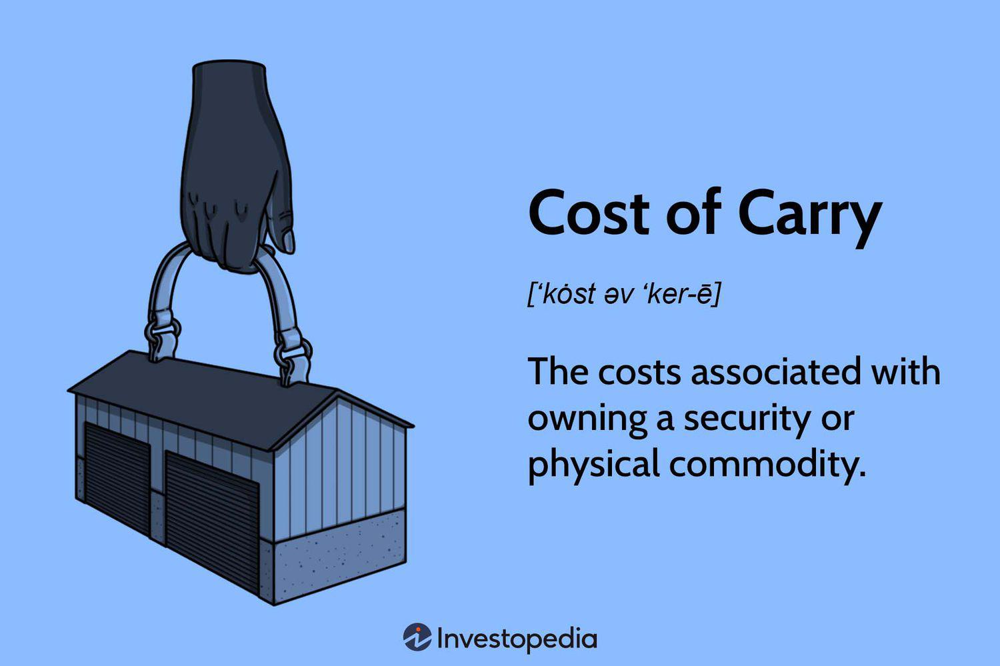

## Table of Contents

## What is the cost of carry?

The cost of carry is the total cost of holding an investment or asset over a period of time. This includes expenses like storage costs, insurance, and interest on borrowed funds, minus any income the asset generates, like dividends or interest. For example, if you buy a stock and hold it, you might have to pay for the interest on the money you borrowed to buy the stock, but you could also earn dividends from the stock.

In financial markets, cost of carry is important for futures and options pricing. It helps traders understand the difference between the spot price of an asset and its futures price. If the cost of carry is high, the futures price will be higher than the spot price to cover these costs. This concept is used by investors to make decisions about whether to buy an asset now or in the future.

## How does the cost of carry affect financial markets?

The cost of carry has a big impact on financial markets, especially in how prices are set for futures and options. When people trade futures, they are agreeing to buy or sell an asset at a future date. The price of these futures includes the cost of carry. If it costs a lot to hold onto an asset, like if you have to pay high storage fees or interest, then the futures price will be higher than the current price of the asset. This is because the seller needs to cover those extra costs.

This idea affects how people invest and trade. If the cost of carry is low, it might be cheaper to buy an asset now and hold onto it until the future date. But if the cost of carry is high, it might be better to wait and buy the asset later. Traders and investors watch these costs closely because they can make a big difference in whether they make or lose money. Understanding the cost of carry helps them decide the best time to buy or sell assets in the market.

## What are the main components of the cost of carry?

The cost of carry includes several main parts that all add up to the total cost of holding an asset. One big part is the storage cost, which is what you pay to keep the asset safe. For example, if you own oil, you need to pay for tanks or warehouses to store it. Another part is the insurance cost, which is what you pay to protect the asset from damage or loss. If you own a valuable painting, you might pay for insurance to cover it if something goes wrong.

Another key part of the cost of carry is the interest cost, which is what you pay if you borrow money to buy the asset. If you take out a loan to buy stocks, you have to pay interest on that loan. But the cost of carry isn't just about expenses. It also includes any income the asset might bring in, like dividends from stocks or interest from bonds. If you subtract this income from the expenses, you get the net cost of carry.

These components together help determine if it's better to buy an asset now or wait until later. If the costs are high, it might be cheaper to wait. If the costs are low or if the asset brings in a lot of income, it might be better to buy now. Understanding these parts helps investors make smart choices in the market.

## Can you explain the difference between positive and negative cost of carry?

The cost of carry can be positive or negative, and this depends on whether the costs of holding an asset are more or less than the income it brings in. A positive cost of carry happens when the costs, like storage, insurance, and interest, are higher than any income from the asset, like dividends or interest payments. For example, if you buy gold and have to pay to store and insure it, but gold doesn't pay any dividends, you might have a positive cost of carry. This means it costs you money to hold onto the gold over time.

On the other hand, a negative cost of carry occurs when the income from the asset is more than the costs of holding it. For instance, if you own a stock that pays high dividends, and the costs of holding it, like interest on a loan to buy the stock, are low, you might have a negative cost of carry. This means you actually make money by holding onto the stock. Understanding whether the cost of carry is positive or negative helps investors decide if it's better to buy an asset now or wait until later.

## What are some common models used to calculate the cost of carry?

One common model used to calculate the cost of carry is the Futures Pricing Model. This model looks at the difference between the price of an asset today and its price in the future. It takes into account the costs of holding the asset, like storage, insurance, and interest, and subtracts any income the asset might bring in, like dividends. If the costs are higher than the income, the futures price will be higher than the current price to cover those costs. This model helps traders figure out if it's better to buy an asset now or wait until later.

Another model is the Cost of Carry Model, which is similar but focuses more on the actual costs and benefits of holding an asset. It adds up all the expenses, like storage and interest, and subtracts any income, like dividends or interest from bonds. If the total is positive, it means it costs money to hold the asset, and if it's negative, it means you make money by holding it. This model is useful for investors who want to understand the real cost of keeping an asset over time and make smart decisions about when to buy or sell.

## How do interest rates influence the cost of carry?

Interest rates play a big role in the cost of carry. When you borrow money to buy an asset, you have to pay interest on that loan. If interest rates are high, the cost of borrowing goes up, which means the cost of carry also goes up. This makes it more expensive to hold onto an asset over time because you're paying more to keep the money you used to buy it. For example, if you take out a loan to buy stocks and the interest rate on that loan goes up, it costs you more to hold those stocks.

On the flip side, if interest rates are low, the cost of carry can go down. When it's cheaper to borrow money, the cost of holding an asset isn't as high. This can make it more attractive to buy assets now rather than waiting, especially if the asset also brings in income like dividends or interest. So, when interest rates are low, investors might find it easier to hold onto assets because the cost of borrowing the money to buy them is less.

## What role do storage costs play in the cost of carry for commodities?

Storage costs are a big part of the cost of carry for commodities like oil, grains, or metals. These costs are what you pay to keep the commodity safe until you sell it. For example, if you buy oil, you need to store it in tanks or warehouses, and that costs money. The higher the storage costs, the more expensive it is to hold onto the commodity. This means that if storage costs go up, the price of a futures contract for that commodity will also go up to cover those extra costs.

When traders and investors look at commodities, they always think about storage costs. If it's very expensive to store a commodity, it might be better to sell it now instead of holding onto it. But if storage costs are low, it might make sense to buy the commodity and store it until prices go up. So, storage costs can really affect decisions about buying and selling commodities, and they help set the prices in the futures market.

## How can dividends impact the cost of carry for stocks?

Dividends can lower the cost of carry for stocks. When you own a stock that pays dividends, you get money back from the company regularly. This money can help cover the costs of holding the stock, like the interest you might have to pay if you borrowed money to buy it. If the dividends you receive are more than the costs, like storage or interest, then the cost of carry becomes negative. This means you're actually making money by holding onto the stock, not losing it.

For example, if you buy a stock with a high dividend yield and the interest rate on your loan is low, the dividends might be enough to cover the interest and more. This makes the stock cheaper to hold over time. Investors look at these dividends when deciding whether to buy a stock now or wait. If the dividends are high, it might be better to buy the stock now and start earning those dividends, even if there are some costs to holding it.

## What are the implications of the cost of carry for futures pricing?

The cost of carry is really important for figuring out the price of futures contracts. When someone buys a futures contract, they agree to buy or sell an asset at a certain price in the future. The price of this contract needs to cover all the costs of holding the asset until that future date. These costs include things like storage, insurance, and interest on money borrowed to buy the asset. If these costs are high, the price of the futures contract will be higher than the price of the asset today. This is because the person selling the futures contract needs to make sure they can cover all those costs.

Understanding the cost of carry helps traders decide if it's better to buy an asset now or wait until later. If the costs are low, it might be cheaper to buy the asset now and hold onto it. But if the costs are high, it might be better to wait and buy the asset later when the futures contract comes due. This is why the cost of carry is always a big part of how futures prices are set. It helps make sure that the price of the futures contract makes sense based on what it costs to hold the asset until the future date.

## How do you calculate the cost of carry for a specific asset?

To calculate the cost of carry for a specific asset, you need to add up all the costs of holding it over time and then subtract any income it brings in. The costs can include things like storage fees, insurance to protect the asset, and interest if you borrowed money to buy it. For example, if you own oil, you might have to pay to store it in a tank and insure it against damage. If you took out a loan to buy the oil, you'd also need to pay interest on that loan. These are all part of the cost of carry.

After you've added up all the costs, you then subtract any income the asset might generate. For stocks, this could be dividends the company pays out to shareholders. For bonds, it might be the interest payments you receive. If the total income from the asset is more than the costs, you have a negative cost of carry, which means you're making money by holding the asset. But if the costs are more than the income, you have a positive cost of carry, and it's costing you money to hold the asset. This simple calculation helps investors decide if it's better to buy an asset now or wait until later.

## What advanced techniques can be used to model the cost of carry more accurately?

To model the cost of carry more accurately, one advanced technique is to use stochastic models. These models take into account that costs like interest rates and storage fees can change over time. Instead of using fixed numbers, stochastic models use random variables to predict how these costs might go up or down. This can give a more realistic picture of what it might cost to hold an asset in the future. For example, if interest rates might go up, a stochastic model can show how that would affect the cost of carry for someone who borrowed money to buy stocks.

Another technique is to use Monte Carlo simulations. These simulations run many different scenarios to see how the cost of carry might change under different conditions. By running thousands of these scenarios, you can get a good idea of the range of possible costs and how likely each scenario is. This can be really helpful for commodities where storage costs can change a lot. For instance, if you're storing oil, a Monte Carlo simulation can help you understand how different storage cost changes could affect your decision to buy or sell the oil in the future.

## How does the cost of carry vary across different asset classes and why?

The cost of carry can be different for different types of assets because each asset has its own set of costs and benefits. For example, commodities like oil or grains have high storage costs because you need to pay to keep them safe in tanks or warehouses. They also might need insurance to protect them from damage. On the other hand, stocks don't have storage costs, but if you borrowed money to buy them, you have to pay interest on that loan. Stocks can also pay dividends, which can help lower the cost of carry. Bonds are another type of asset where you might have to pay interest on borrowed money, but they also pay interest to you, which can make the cost of carry lower or even negative.

The differences in the cost of carry across asset classes matter because they affect how people decide to invest. If the cost of carry for commodities is high because of expensive storage, it might be better to sell them now instead of holding onto them. But if the cost of carry for stocks is low because of high dividends, it might be a good idea to buy them now and hold onto them. Understanding how the cost of carry works for different assets helps investors make smart choices about when to buy or sell, and it also helps set the prices in the futures market where people trade agreements to buy or sell assets in the future.

## What are carrying costs and how can they be understood?

Carrying costs represent the various expenses incurred while maintaining a financial position over time. These expenses comprise interest payments, storage fees, insurance, and opportunity costs. Such costs are not just peripheral concerns—they play a pivotal role in the valuation and management of financial assets.

Interest payments are particularly notable in leveraged positions where borrowing funds to maintain the position incurs additional costs. For instance, if a trader uses margin to buy securities, the interest on the borrowed funds constitutes a carrying cost. In addition to interest, commodities stored physically impose storage fees, a tangible component of carrying costs. This is evident in markets like oil or agricultural products, where warehousing and preservation costs accrue.

Insurance costs also contribute significantly, especially in commodity markets, where insuring physical goods against damage or loss is critical. Opportunity costs, although not as explicit, reflect the potential gains forfeited by committing capital to a particular investment as opposed to alternative investments that might offer better returns.

Carrying costs significantly affect both direct investments and derivatives markets. In derivatives, such as futures and options, these costs influence pricing models like Black-Scholes. This model is used to price options by considering factors such as the asset's price, the option’s strike price, time to expiration, risk-free rate, and the [volatility](/wiki/volatility-trading-strategies) of the asset. The formula in its simplest form is:

$$
C = S_0 N(d_1) - Xe^{-rt} N(d_2)
$$

where:
- $C$ is the price of the call option,
- $S_0$ is the current price of the stock,
- $X$ is the strike price of the option,
- $r$ is the risk-free interest rate,
- $t$ is the time to expiration,
- $N(d)$ represents the cumulative distribution function of the standard normal distribution.

Within this framework, carrying costs influence the expected future prices of the underlying asset or commodity. A higher carrying cost generally raises the future price of the commodity under consideration in the absence of [arbitrage](/wiki/arbitrage) opportunities. Therefore, understanding these costs is crucial for accurately predicting asset prices and formulating effective trading strategies.

Incorporating carrying costs into investment decisions enables traders and investors to optimize their portfolio management by precisely gauging the expected profitability of holding particular positions over time.

## What are Cost of Carry Models in Financial Markets?

Various models exist to calculate the cost of [carry](/wiki/carry-trading), each tailored to specific market contexts and asset classes. These models help traders understand how carrying costs influence financial positions and asset pricing.

### Futures Cost of Carry Model

The Futures Cost of Carry Model is primarily used in futures markets. It calculates the futures price based on several factors, including the spot price of the underlying asset, the risk-free [interest rate](/wiki/interest-rate-trading-strategies), and any associated storage costs. The fundamental equation for calculating the futures price $F$ can be expressed as:

$$
F = S \times e^{(r + c)T}
$$

where $S$ is the spot price of the asset, $r$ is the risk-free rate, $c$ represents the cost of storage, and $T$ is the time to maturity. This model is especially significant for commodities where storage costs can be considerable, such as oil or agricultural products.

### Convenience Yield

The concept of convenience yield is essential for assets that provide certain benefits from immediate ownership, such as commodities like oil or metals. Convenience yield represents the non-monetary advantage of holding the physical asset rather than the derivative. It modifies the futures pricing formula as follows:

$$
F = S \times e^{(r + c - y)T}
$$

where $y$ is the convenience yield. The higher the utility of immediate ownership, the higher the convenience yield may be, leading to an adjusted assessment of carrying costs.

### Black-Scholes Model for Options

In options markets, the Black-Scholes model is a dominant framework that incorporates carrying costs in pricing European-style options. The model considers carrying costs through the inclusion of dividends or other payouts associated with holding the underlying stock. The Black-Scholes formula for a call option $C$ is:

$$
C = S_0 \times N(d_1) - X \times e^{-rT} \times N(d_2)
$$

where:
- $S_0$ is the current stock price.
- $X$ is the strike price.
- $r$ is the risk-free interest rate.
- $T$ is the time to expiration.
- $N$ is the cumulative distribution function of the standard normal distribution.
- $d_1$ and $d_2$ are calculated as:

$$
d_1 = \frac{\ln(S_0 / X) + (r + \frac{\sigma^2}{2})T}{\sigma \sqrt{T}}
$$

$$
d_2 = d_1 - \sigma \sqrt{T}
$$

Here, $\sigma$ is the volatility of the stock's returns over the option's life. Carrying costs influence this model by affecting the underlying asset's price through dividends, altering the premium of the option.

### Summary

Each of these models provides fundamental insights that allow traders to optimize their decisions in respective markets. By understanding the cost of carry via these frameworks, traders are equipped to anticipate price variations and strategize effectively, enhancing portfolio management and profitability.

## References & Further Reading

[1]: Black, F., & Scholes, M. (1973). ["The Pricing of Options and Corporate Liabilities."](https://www.cs.princeton.edu/courses/archive/fall09/cos323/papers/black_scholes73.pdf) Journal of Political Economy, 81(3), 637-654.

[2]: Hull, J. C. (2018). ["Options, Futures, and Other Derivatives."](https://www.semanticscholar.org/paper/Options%2C-Futures%2C-and-Other-Derivatives-Hull/89bdee500c8623864fc9eb7a471546aa713acc44) Pearson Education.

[3]: Wilmott, P. (2006). ["Paul Wilmott Introduces Quantitative Finance."](https://www.amazon.com/Paul-Wilmott-Quantitative-Finance-Set/dp/0470018704) John Wiley & Sons.

[4]: Fabozzi, F. J., & Modigliani, F. (2009). ["Capital Markets: Institutions and Instruments."](https://archive.org/details/capitalmarketsin0000fabo_b7q6) Prentice Hall.

[5]: Murphy, J. J. (1999). ["Technical Analysis of the Financial Markets: A Comprehensive Guide to Trading Methods and Applications."](https://archive.org/details/technicalanalysi0000murp) New York Institute of Finance.