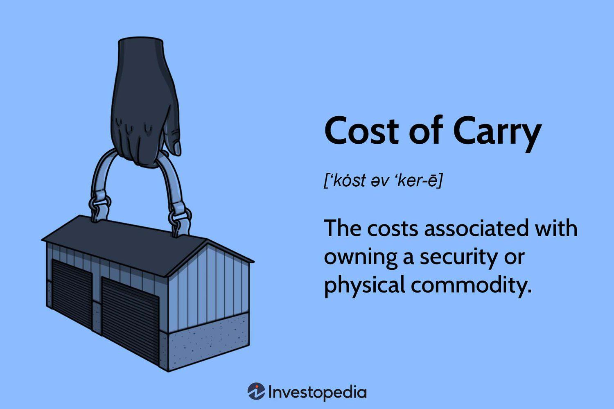

## Table of Contents

## What is the basic definition of 'Cost of Carry'?

The cost of carry is the total cost of holding an asset or investment over a period of time. This can include expenses like storage fees, insurance, and interest on borrowed money used to buy the asset. For example, if you buy gold and keep it in a safe deposit box, the rent for the box and any insurance you pay to protect the gold are part of the cost of carry.

In financial markets, the cost of carry is important for understanding the pricing of futures contracts. If the cost of carry is high, it can make the futures price higher than the current price of the asset. This is because investors need to be compensated for the extra costs they bear while holding the asset until the future date. So, the cost of carry helps explain why the price of a futures contract might be different from the price of the asset today.

## How does the cost of carry affect investment decisions?

The cost of carry plays a big role in deciding whether to invest in something. When you think about buying an asset, like stocks or commodities, you need to think about all the extra costs that come with holding onto it. These costs can eat into your profits. For example, if you're thinking about buying oil, you need to consider the cost of storing it safely. If these costs are too high, it might not make sense to invest, even if the price of oil looks good.

Investors also use the cost of carry to compare different investment options. If one investment has a lower cost of carry than another, it might be a better choice, even if the expected returns are similar. This is because the lower costs mean more money in your pocket at the end of the day. So, understanding the cost of carry helps investors make smarter choices about where to put their money.

## What are the components that make up the cost of carry?

The cost of carry includes several different expenses that come with holding an investment over time. One big part is the interest you might have to pay if you borrow money to buy the asset. For example, if you take out a loan to buy stocks, the interest on that loan is part of your cost of carry. Another part is any fees you have to pay to keep the asset safe, like storage costs for commodities like oil or gold. If you need to insure the asset against damage or loss, that insurance cost is also included.

There are also other smaller costs that can add up. For instance, if you're investing in something that needs to be managed, like a rental property, you might have to pay for maintenance and repairs. Even the time and effort you spend managing the investment can be thought of as a cost. All these costs together make up the total cost of carry, which is important for figuring out if an investment is worth it.

## Can you explain the difference between positive and negative cost of carry?

The cost of carry can be positive or negative, and it all depends on whether the costs of holding an asset are more or less than the benefits you get from it. A positive cost of carry means you're spending more money to hold the asset than you're [earning](/wiki/earning-announcement) from it. For example, if you're storing oil and the storage fees and insurance costs are higher than any income you get from the oil, like rental income or dividends, you have a positive cost of carry. This can make the investment less attractive because it's eating into your profits.

On the other hand, a negative cost of carry happens when the benefits you get from holding the asset are more than the costs. This is a good situation because it means the asset is actually making you money just by holding onto it. For instance, if you own a stock that pays high dividends and the costs of holding the stock, like any interest on a loan you took to buy it, are lower than the dividends, you have a negative cost of carry. This makes the investment more appealing because it's adding to your overall returns.

## How is the cost of carry calculated for different types of assets?

The cost of carry for stocks includes things like interest on loans used to buy them and any fees for holding them, like account maintenance fees. If you borrow money to buy stocks, the interest you pay on that loan is part of the cost of carry. If the stock pays dividends, you subtract those from the costs because dividends are like income. So, for stocks, you add up all the costs of holding them and then subtract any income you get from them, like dividends, to find the cost of carry.

For commodities like gold or oil, the cost of carry includes storage fees and insurance costs. If you're storing oil, you have to pay to keep it in a safe place, and you might need insurance to protect it. These costs are added up to find the cost of carry for commodities. If you're holding commodities that don't produce any income, like gold, the cost of carry is usually positive because you're just spending money to hold them without getting anything back.

For real estate, the cost of carry includes things like mortgage interest, property taxes, maintenance costs, and insurance. If you rent out the property, you subtract the rental income from these costs to find the cost of carry. If the rental income is more than the costs, you have a negative cost of carry, which is good because it means the property is making you money just by holding onto it. If the costs are more than the income, you have a positive cost of carry, which means the property is costing you money to hold.

## What role does the cost of carry play in futures pricing?

The cost of carry is really important for figuring out the price of futures contracts. A futures contract is an agreement to buy or sell something at a future date for a price agreed on today. The cost of carry helps explain why the price of the futures contract might be different from the price of the asset right now. If the cost of carry is high, like if it costs a lot to store oil, the futures price will be higher than the current price of oil. This is because investors need to be paid back for the extra costs they have to pay while waiting for the future date.

In simple terms, the cost of carry can make the futures price go up or down. If the cost of carry is low, like if it's cheap to hold onto stocks, the futures price might be closer to the current price of the stocks. But if the cost of carry is high, the futures price will be higher to cover those costs. So, understanding the cost of carry helps investors and traders know if a futures contract is a good deal or not. It's all about making sure the price of the futures contract makes sense when you think about all the costs of holding the asset until the future date.

## How do interest rates impact the cost of carry?

Interest rates have a big impact on the cost of carry because they affect the cost of borrowing money to buy an asset. If you need to take out a loan to buy stocks or commodities, the interest you pay on that loan is part of the cost of carry. When interest rates go up, the cost of borrowing money goes up too. This means the cost of carry gets higher because you're paying more interest on your loan. So, if interest rates are high, it can make holding onto an investment more expensive.

On the other hand, when interest rates are low, the cost of borrowing money is cheaper. This means the cost of carry goes down because you're not paying as much interest on your loan. Lower interest rates can make it more attractive to invest in assets because the cost of holding them is lower. So, interest rates play a key role in deciding whether the cost of carry is high or low, which can affect how much you want to invest in something.

## What are some strategies to minimize the cost of carry in trading?

One way to minimize the cost of carry in trading is to choose assets that have low holding costs. For example, if you're trading commodities like oil, you might look for storage options that are cheaper or find ways to reduce insurance costs. Another strategy is to use leverage carefully. If you borrow money to buy an asset, high interest rates can make the cost of carry go up a lot. So, try to keep your borrowing to a minimum or look for loans with lower interest rates.

Another strategy is to focus on assets that give you income while you hold them. Stocks that pay dividends can help offset the cost of carry because the dividends act like money coming in. If the dividends are more than the costs of holding the stock, like interest on a loan, then you're actually making money just by holding onto it. Also, if you're trading futures, you can try to pick contracts where the cost of carry is already built into the price in a way that works in your favor. By understanding how the cost of carry affects futures pricing, you can make better choices about which contracts to trade.

## How does the cost of carry vary across different markets and asset classes?

The cost of carry changes a lot depending on what kind of asset you're looking at and which market you're in. For stocks, the cost of carry might include the interest you pay if you borrowed money to buy them, plus any fees for keeping them in your account. But if the stock pays dividends, those can help lower the cost of carry because they're like money coming in. In the bond market, the cost of carry can include the interest you pay on borrowed money to buy the bonds, but you also get interest payments from the bonds, which can offset the costs. So, the cost of carry for stocks and bonds can be different because of the income they might give you while you hold them.

For commodities like oil or gold, the cost of carry is usually higher because you need to pay for storage and insurance. These costs can be pretty big, especially for things like oil that need special storage. In the real estate market, the cost of carry includes things like mortgage interest, property taxes, and maintenance costs. If you rent out the property, the rental income can help lower the cost of carry. But if you're not getting any income from the property, the cost of carry can be high. So, the cost of carry can be very different across different markets and asset classes, depending on the specific costs and benefits of holding each type of asset.

## Can you discuss the tax implications related to the cost of carry?

The cost of carry can have tax implications that affect how much you end up paying in taxes. For example, if you're holding onto stocks and you borrowed money to buy them, the interest you pay on that loan might be tax-deductible. This means you can subtract that interest from your income when you file your taxes, which can lower your tax bill. But the rules can be different depending on where you live and what kind of investment you have. So, it's a good idea to talk to a tax professional to make sure you're doing things right.

Another thing to think about is the income you get from holding an asset. If you're holding stocks that pay dividends, those dividends are usually taxable income. This means you have to pay taxes on them, which can add to the cost of carry. The same goes for rental income from real estate. But again, the tax rules can be complicated, and they might change depending on your situation. So, it's always smart to get advice from a tax expert to understand how the cost of carry affects your taxes.

## How do advanced traders use the cost of carry to gain a competitive edge?

Advanced traders use the cost of carry to find opportunities that other people might miss. They look at how much it costs to hold different assets and compare those costs to the income they might get from holding them. For example, if they see that the cost of carry for a certain commodity is low, they might buy futures contracts for that commodity because they know the futures price will be lower. This can give them a chance to make a profit when the futures contract comes due. They also pay attention to interest rates because lower rates mean lower borrowing costs, which can make certain investments more attractive.

These traders also use the cost of carry to manage their risks better. They might use strategies like hedging to protect themselves from big price changes. For instance, if they think the cost of carry for a stock is going to go up because of rising interest rates, they might short sell that stock or buy put options to protect their investments. By understanding the cost of carry, they can make smarter decisions about when to buy or sell, and how to protect their money. This gives them a competitive edge because they can see things that other traders might not notice.

## What are the latest research findings or models concerning the cost of carry?

Recent research on the cost of carry has focused on how it affects different kinds of investments, especially in the futures market. Researchers have been looking at how the cost of carry can change over time and what that means for pricing futures contracts. They found that the cost of carry can be influenced by things like interest rates, storage costs, and even how easy it is to borrow money. By studying these factors, researchers have come up with new models that help predict how the cost of carry will affect the price of futures. These models are useful for traders who want to make better decisions about when to buy or sell futures contracts.

Another area of research has been about how the cost of carry impacts the stock market. Some studies have shown that the cost of carry can help explain why stock prices move the way they do. For example, if the cost of carry for stocks goes up because of higher interest rates, it might make stocks less attractive to investors. This can lead to lower stock prices. Researchers have also been looking at how the cost of carry can affect different kinds of stocks, like those that pay dividends versus those that don't. These findings are helping investors understand how to manage their portfolios better and make smarter investment choices.

## What is the Understanding of Cost of Carry?

Cost of carry refers to the costs incurred in maintaining a financial position or holding an asset over a period. These costs are multifaceted and depend on the asset type involved in the transaction. Generally, the components of the cost of carry include interest expenses, storage fees, insurance, and opportunity costs.

Interest expenses represent one of the most significant elements of the cost of carry, especially for positions that are financed through debt. This interest represents the cost of borrowing capital to hold the position. For physical commodities, such as precious metals or agricultural products, storage fees are another crucial element. These fees cover the expenses related to storing and preserving the asset over time. Insurance costs may also be incurred to protect the investment against potential risks such as theft or damage.

Opportunity costs, often considered in economic theory, refer to income or returns that could have been generated if the resources used to maintain the current position were allocated elsewhere. This aspect is crucial for understanding the overall economic implication of holding an asset.

The cost of [carry](/wiki/carry-trading) plays a critical role in pricing and trading strategies. It influences the cash-and-carry [arbitrage](/wiki/arbitrage) process, which involves simultaneous buying of an asset in the spot market and selling a futures contract to profit from pricing inefficiencies. The presence of carry costs dictates whether such arbitrage opportunities are feasible.

In derivatives markets, particularly futures and options, the cost of carry acts as a determining [factor](/wiki/factor-investing) for future asset pricing. For instance, the futures price of an asset incorporates the cost of carry, often calculated through the formula:

$$
F = S \times e^{(r + s - c) \times t}
$$

where $F$ is the future price, $S$ is the current spot price, $r$ is the risk-free interest rate, $s$ is the storage cost, $c$ is the convenience yield, and $t$ is the time to maturity of the contract.

Understanding the cost of carry is essential for traders and investors as it affects derivatives pricing models, trading strategies, and the decision-making process regarding the holding period of various assets. Accurate estimation and accounting for these costs can enhance the effectiveness of investment strategies and improve profitability.

## What is the Calculation of Cost of Carry?

The calculation of cost of carry in financial markets involves several critical variables. These include the spot price of the asset (S), the risk-free [interest rate](/wiki/interest-rate-trading-strategies) (r), storage costs (s), and the convenience yield (c). These factors collectively influence the future price (F) of an asset.

A prevalent model for estimating the future price, considering the cost of carry, is given by the formula:

$$
F = S \times e^{(r + s - c) \times t}
$$

In this equation:
- $F$ represents the future price of the asset.
- $S$ is the current spot price of the asset.
- $r$ denotes the risk-free interest rate, which is the return on an investment with no risk of financial loss.
- $s$ accounts for storage costs, pertinent to certain physical commodities requiring expenditure for storage.
- $c$ is the convenience yield, reflecting the non-monetary benefits of holding the actual physical commodity as opposed to holding a contract for future delivery.
- $t$ represents the time to maturity of the contract.

Different assets often have varying cost of carry components. For example, commodities like oil and grains might have significant storage costs and convenience yields, while financial assets like stocks or currencies may primarily be influenced by interest rates. Consequently, traders need to customize their calculations according to the specific characteristics and market conditions of each asset. This adaptation is pivotal for determining the precise cost of carry, thereby enabling traders to make informed decisions about the timing and nature of their trading activities.

In [algorithmic trading](/wiki/algorithmic-trading), integrating these calculations into programming models allows for automatic, precise adjustments to trading strategies, enhancing potential profitability. The application of Python can facilitate these calculations, as demonstrated in a simple code snippet:

```python
import math

def calculate_future_price(spot_price, risk_free_rate, storage_cost, convenience_yield, time_to_maturity):
    future_price = spot_price * math.exp((risk_free_rate + storage_cost - convenience_yield) * time_to_maturity)
    return future_price

# Example usage:
spot_price = 100  # Current price of the asset
risk_free_rate = 0.02  # 2% risk-free interest rate
storage_cost = 0.01  # 1% storage cost
convenience_yield = 0.005  # 0.5% convenience yield
time_to_maturity = 1  # 1 year until maturity

future_price = calculate_future_price(spot_price, risk_free_rate, storage_cost, convenience_yield, time_to_maturity)
print("Future Price:", future_price)
```

By understanding and executing these calculations, traders can effectively predict future asset prices, leading to more successful trading ventures.

## References & Further Reading

[1]: Hull, J. C. (2017). ["Options, Futures, and Other Derivatives"](https://www.semanticscholar.org/paper/Options%2C-Futures%2C-and-Other-Derivatives-Hull/89bdee500c8623864fc9eb7a471546aa713acc44) (9th Edition). Pearson.

[2]: Shreve, S. E. (2004). ["Stochastic Calculus for Finance I: The Binomial Asset Pricing Model"](https://link.springer.com/book/10.1007/978-0-387-22527-2). Springer Finance.

[3]: Taleb, N. N. (1997). ["Dynamic Hedging: Managing Vanilla and Exotic Options"](https://www.amazon.com/Dynamic-Hedging-Managing-Vanilla-Options/dp/0471152803). Wiley.

[4]: Kolb, R. W., Overdahl, J. A. (2010). ["Financial Derivatives: Pricing and Risk Management"](https://papers.ssrn.com/sol3/papers.cfm?abstract_id=1568206). Wiley.

[5]: de Prado, M. L. (2018). ["Advances in Financial Machine Learning"](https://www.amazon.com/Advances-Financial-Machine-Learning-Marcos/dp/1119482089). Wiley.