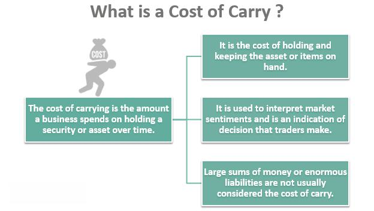

In finance, algorithmic trading has emerged as a significant force, revolutionizing how investments are managed. One critical concept that traders and investors need to understand is the 'cost of carry', which plays a pivotal role in determining the profitability of trades. Cost of carry refers to the costs involved in holding a financial position or asset over time, including interest expenses, storage fees, insurance, and opportunity costs. 

In algorithmic trading, where automated systems execute trades based on pre-defined criteria, understanding the cost of carry is essential. These costs affect decision-making processes, influencing when to enter or exit positions. For instance, in the derivatives markets, the cost of carry helps determine future asset prices, directly impacting trading strategies. 



Accurate calculation and management of the cost of carry can enhance trading efficiency and profitability. This involves considering various factors such as the spot price of the asset, the risk-free interest rate, storage costs, and convenience yield. Traders who can effectively manage these costs are better equipped to optimize their portfolios and improve their investment outcomes.

As financial markets continue to evolve, comprehending the cost of carry and its diverse implications across various markets is crucial. Staying informed about these elements allows traders to maintain a competitive edge, ensuring more informed trading decisions and enhanced strategic outcomes.

## Table of Contents

## Understanding Cost of Carry

Cost of carry refers to the costs incurred in maintaining a financial position or holding an asset over a period. These costs are multifaceted and depend on the asset type involved in the transaction. Generally, the components of the cost of carry include interest expenses, storage fees, insurance, and opportunity costs.

Interest expenses represent one of the most significant elements of the cost of carry, especially for positions that are financed through debt. This interest represents the cost of borrowing capital to hold the position. For physical commodities, such as precious metals or agricultural products, storage fees are another crucial element. These fees cover the expenses related to storing and preserving the asset over time. Insurance costs may also be incurred to protect the investment against potential risks such as theft or damage.

Opportunity costs, often considered in economic theory, refer to income or returns that could have been generated if the resources used to maintain the current position were allocated elsewhere. This aspect is crucial for understanding the overall economic implication of holding an asset.

The cost of [carry](/wiki/carry-trading) plays a critical role in pricing and trading strategies. It influences the cash-and-carry [arbitrage](/wiki/arbitrage) process, which involves simultaneous buying of an asset in the spot market and selling a futures contract to profit from pricing inefficiencies. The presence of carry costs dictates whether such arbitrage opportunities are feasible.

In derivatives markets, particularly futures and options, the cost of carry acts as a determining [factor](/wiki/factor-investing) for future asset pricing. For instance, the futures price of an asset incorporates the cost of carry, often calculated through the formula:

$$
F = S \times e^{(r + s - c) \times t}
$$

where $F$ is the future price, $S$ is the current spot price, $r$ is the risk-free interest rate, $s$ is the storage cost, $c$ is the convenience yield, and $t$ is the time to maturity of the contract.

Understanding the cost of carry is essential for traders and investors as it affects derivatives pricing models, trading strategies, and the decision-making process regarding the holding period of various assets. Accurate estimation and accounting for these costs can enhance the effectiveness of investment strategies and improve profitability.

## Calculation of Cost of Carry

The calculation of cost of carry in financial markets involves several critical variables. These include the spot price of the asset (S), the risk-free [interest rate](/wiki/interest-rate-trading-strategies) (r), storage costs (s), and the convenience yield (c). These factors collectively influence the future price (F) of an asset.

A prevalent model for estimating the future price, considering the cost of carry, is given by the formula:

$$
F = S \times e^{(r + s - c) \times t}
$$

In this equation:
- $F$ represents the future price of the asset.
- $S$ is the current spot price of the asset.
- $r$ denotes the risk-free interest rate, which is the return on an investment with no risk of financial loss.
- $s$ accounts for storage costs, pertinent to certain physical commodities requiring expenditure for storage.
- $c$ is the convenience yield, reflecting the non-monetary benefits of holding the actual physical commodity as opposed to holding a contract for future delivery.
- $t$ represents the time to maturity of the contract.

Different assets often have varying cost of carry components. For example, commodities like oil and grains might have significant storage costs and convenience yields, while financial assets like stocks or currencies may primarily be influenced by interest rates. Consequently, traders need to customize their calculations according to the specific characteristics and market conditions of each asset. This adaptation is pivotal for determining the precise cost of carry, thereby enabling traders to make informed decisions about the timing and nature of their trading activities.

In [algorithmic trading](/wiki/algorithmic-trading), integrating these calculations into programming models allows for automatic, precise adjustments to trading strategies, enhancing potential profitability. The application of Python can facilitate these calculations, as demonstrated in a simple code snippet:

```python
import math

def calculate_future_price(spot_price, risk_free_rate, storage_cost, convenience_yield, time_to_maturity):
    future_price = spot_price * math.exp((risk_free_rate + storage_cost - convenience_yield) * time_to_maturity)
    return future_price

# Example usage:
spot_price = 100  # Current price of the asset
risk_free_rate = 0.02  # 2% risk-free interest rate
storage_cost = 0.01  # 1% storage cost
convenience_yield = 0.005  # 0.5% convenience yield
time_to_maturity = 1  # 1 year until maturity

future_price = calculate_future_price(spot_price, risk_free_rate, storage_cost, convenience_yield, time_to_maturity)
print("Future Price:", future_price)
```

By understanding and executing these calculations, traders can effectively predict future asset prices, leading to more successful trading ventures.

## Impact on Algorithmic Trading

In algorithmic trading, the concept of cost of carry plays a critical role in shaping the strategies and decisions executed by automated trading systems. Trading algorithms use the cost of carry to assess the all-in cost of holding a position over time, which is directly influenced by expenses such as interest rates, storage, and opportunity costs. By integrating these calculations into their decision-making processes, algorithms can effectively determine the optimal times to enter or [exit](/wiki/exit-strategy) a position, thereby enhancing profitability.

Automated trading systems, including trading bots, are programmed to continuously analyze market conditions and the associated costs of carry. This allows them to execute trades that position themselves advantageously within the market while factoring in any potential carrying costs. For instance, if the cost of carry becomes unfavorable due to a significant increase in interest rates or changes in storage fees, an algorithm may decide to exit the position early to avoid eroding profit margins.

The importance of managing cost of carry becomes even more significant in high-frequency trading ([HFT](/wiki/high-frequency-trading-strategies)) scenarios, where the strategy revolves around making numerous transactions within very short time spans. In such cases, the profit per transaction is typically small, so even a slight miscalculation in the cost of carry can lead to substantial impacts over a large number of trades. Algorithms designed for HFT must be adept at precisely calculating the cost of carry to avoid any negative consequences on the aggregated profitability across trades.

Incorporating cost of carry effectively into trading algorithms involves not only calculating but dynamically responding to real-time changes in the underlying variables that affect it. For example, Python can be used to develop algorithmic trading strategies that factor in these costs. A simple example is using the following Python snippet to calculate the expected future price considering costs:

```python
import math

def calculate_future_price(spot_price, risk_free_rate, storage_cost, convenience_yield, time_period):
    future_price = spot_price * math.exp((risk_free_rate + storage_cost - convenience_yield) * time_period)
    return future_price

spot_price = 100  # current price of the asset
risk_free_rate = 0.05  # annual risk-free interest rate
storage_cost = 0.02  # annual storage cost as a percentage
convenience_yield = 0.01  # annual convenience yield as a percentage
time_period = 1  # time in years

future_price = calculate_future_price(spot_price, risk_free_rate, storage_cost, convenience_yield, time_period)
print(f"The calculated future price is: {future_price}")
```

This kind of real-time calculation enables trading algorithms to make informed decisions, optimizing strategies to maximize returns after accounting for the cost of carry. As financial technologies evolve, the integration of more sophisticated cost of carry analyses into algorithmic trading systems is poised to enhance the precision and efficiency of executing trades.

## Strategies to Manage Cost of Carry

In financial markets, managing the cost of carry efficiently is essential for maximizing profitability, especially in trading strategies that involve holding assets over time. This management can be achieved through various hedging techniques and the effective use of derivatives such as futures and options.

One popular method to manage cost of carry is by employing hedging strategies. Traders often resort to buying put options as a form of insurance to mitigate risks that arise from unexpected rises in carrying costs. A put option gives the holder the right, but not the obligation, to sell an asset at a predetermined price before a specified expiry date, thereby providing a safety net against potential losses from adverse price movements or increased storage costs.

To stay ahead of changing market dynamics and control the cost of carry, it is important to regularly assess market conditions, interest rates, and storage costs. By understanding these elements, traders can predict future cost fluctuations more accurately. For example, if interest rates are expected to rise, the cost of financing a leveraged position will increase, prompting a reassessment of whether the position remains profitable.

Adaptability is key to managing the cost of carry in volatile markets. Traders must be prepared to adjust their strategies in real-time based on new information. By doing so, they can better control their investment costs and shield their profit margins from being eroded by unfavorable conditions. For instance, during periods of heightened [volatility](/wiki/volatility-trading-strategies), dynamic hedging strategies, which involve constantly recalibrating the hedge ratio according to market movements, can provide significant cost savings.

Furthermore, leveraging futures contracts can offer a practical approach to managing the cost of carry. Futures allow for the locking in of prices for assets to be delivered at a future date, effectively freezing the cost elements associated with carrying that asset. By doing so, traders can reduce uncertainty and better forecast their financial outcomes over the holding period.

In conclusion, effective management of the cost of carry involves an array of strategic approaches, from hedging with options to the systematic use of futures contracts, along with a keen eye on fluctuating market variables. By integrating these techniques into their trading strategies, market participants can improve their cost efficiency and sustain their profit margins even in the face of market volatility.

## Conclusion

The investment cost of carry plays a crucial role in financial decision-making, particularly in algorithmic trading. A comprehensive understanding and effective management of these costs allow traders to significantly improve their strategic outcomes and optimize investment portfolios. As financial markets continue to advance and evolve, a clear and thorough analysis of the cost of carry can offer a competitive advantage, helping traders make more informed decisions.

Algorithmic trading, which relies on automated decision-making processes, benefits significantly from integrating cost of carry considerations. By accounting for these costs, algorithms can optimize trade execution, improve profitability, and minimize risks associated with holding positions. This strategic adjustment is particularly important in high-frequency trading scenarios where even marginal cost efficiencies can lead to substantial financial gains.

Furthermore, as financial technology progresses, we can anticipate that cost of carry metrics will be more deeply embedded within advanced trading algorithms. This integration will lead to more precise trading decisions by using real-time data and sophisticated computational models. Such advancements will enable traders to navigate complex market conditions with greater agility and accuracy, further elevating their competitive standing in the trading landscape. 

In conclusion, ignoring the cost of carry in financial modeling and trading strategies can lead to suboptimal performance and missed opportunities. Therefore, its continued analysis and integration into trading algorithms will be indispensable for achieving long-term investment success as markets become increasingly fast-paced and technologically driven.

## References & Further Reading

[1]: Hull, J. C. (2017). ["Options, Futures, and Other Derivatives"](https://www.semanticscholar.org/paper/Options%2C-Futures%2C-and-Other-Derivatives-Hull/89bdee500c8623864fc9eb7a471546aa713acc44) (9th Edition). Pearson.

[2]: Shreve, S. E. (2004). ["Stochastic Calculus for Finance I: The Binomial Asset Pricing Model"](https://link.springer.com/book/10.1007/978-0-387-22527-2). Springer Finance.

[3]: Taleb, N. N. (1997). ["Dynamic Hedging: Managing Vanilla and Exotic Options"](https://www.amazon.com/Dynamic-Hedging-Managing-Vanilla-Options/dp/0471152803). Wiley.

[4]: Kolb, R. W., Overdahl, J. A. (2010). ["Financial Derivatives: Pricing and Risk Management"](https://papers.ssrn.com/sol3/papers.cfm?abstract_id=1568206). Wiley.

[5]: de Prado, M. L. (2018). ["Advances in Financial Machine Learning"](https://www.amazon.com/Advances-Financial-Machine-Learning-Marcos/dp/1119482089). Wiley.