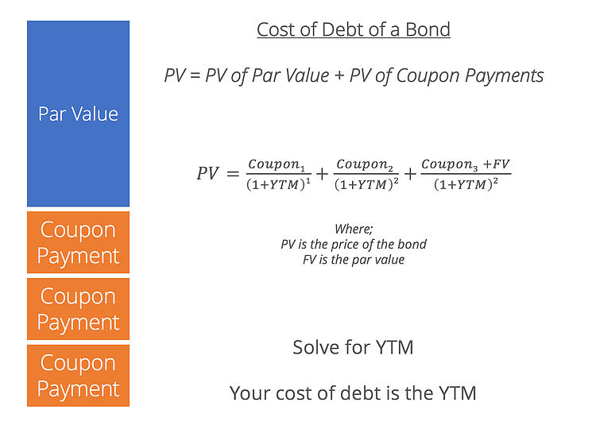

## Table of Contents

## What is the cost of debt?

The cost of debt is the interest rate a company pays on its loans and bonds. It shows how much it costs a company to borrow money. When a company borrows money, it has to pay it back with interest. This interest rate is the cost of debt. Companies look at the cost of debt to understand their financial health and to make good decisions about borrowing more money.

The cost of debt is important because it helps companies figure out if borrowing money is a good idea. If the cost of debt is low, it means the company can borrow money at a cheaper rate. This can be good for the company because it can use the borrowed money to grow its business. But if the cost of debt is high, it means the company has to pay a lot of interest, which can make it harder for the company to make money. So, companies always try to keep their cost of debt as low as possible.

## Why is it important to calculate the cost of debt?

Calculating the cost of debt is important because it helps a company understand how much it costs to borrow money. When a company knows its cost of debt, it can make better decisions about whether to borrow more money or not. If the cost of debt is low, the company can borrow money at a cheaper rate, which can be good for growing the business. But if the cost of debt is high, the company might decide not to borrow because it would have to pay a lot of interest.

The cost of debt also helps investors understand how risky it is to invest in a company. If a company has a high cost of debt, it might mean the company is seen as risky by lenders, which could make investors worried. On the other hand, a low cost of debt can show that a company is financially healthy and a safer investment. By looking at the cost of debt, both the company and investors can make smarter choices about money and investments.

## How does the cost of debt affect a company's financial decisions?

The cost of debt is like a big sign that tells a company how much it will have to pay to borrow money. When the cost of debt is low, it's like getting a good deal on a loan. This can make a company feel more confident about borrowing money to grow its business. For example, if a company wants to build a new factory, a low cost of debt means it won't have to pay much interest, so it might decide to go ahead with the project.

On the other hand, if the cost of debt is high, it's like getting a bad deal on a loan. This can make a company think twice before borrowing more money. High interest rates mean the company will have to pay back a lot more than it borrowed, which can eat into its profits. So, a company might decide to hold off on big projects or look for other ways to get money, like selling shares, if the cost of debt is too high.

## What is the formula for calculating the cost of debt?

The formula for calculating the cost of debt is pretty simple. You take the total interest the company pays on its debt in a year and divide it by the total amount of debt the company has. Then, you multiply that number by 100 to turn it into a percentage. So, if a company pays $50,000 in interest on a $1,000,000 debt, the cost of debt would be (50,000 / 1,000,000) * 100, which equals 5%.

But there's another way to calculate it that takes into account the tax the company pays. Since interest on debt can be deducted from taxes, you can adjust the cost of debt to show this. You use the formula: Cost of Debt = (Total Interest / Total Debt) * (1 - Tax Rate). So, if the company's tax rate is 30%, the adjusted cost of debt would be (50,000 / 1,000,000) * (1 - 0.30), which equals 3.5%. This way, you get a more accurate picture of how much the debt really costs the company after taxes.

## Can you explain each component of the cost of debt formula?

The first part of the cost of debt formula is the total interest the company pays on its debt in a year. This is the amount of money the company has to give back to the people or banks it borrowed from, just for the privilege of borrowing the money. You can find this number by looking at the company's financial statements, which show all the interest payments made during the year.

The second part is the total amount of debt the company has. This is how much money the company has borrowed overall. It could be from loans, bonds, or any other kind of borrowing. You divide the total interest by the total debt to get a fraction, and then multiply by 100 to turn it into a percentage. This gives you the basic cost of debt before taxes.

If you want to account for taxes, you add another part to the formula: the tax rate. Since companies can deduct interest payments from their taxes, this makes the cost of debt a bit lower. You take the basic cost of debt and multiply it by one minus the tax rate. This gives you the after-tax cost of debt, which is a more accurate picture of what the debt really costs the company.

## How do you find the interest rate for the cost of debt calculation?

To find the interest rate for the cost of debt calculation, you need to know the total interest the company pays on its debt in a year and the total amount of debt the company has. The total interest paid can be found in the company's financial statements, which list all the interest payments made during the year. The total amount of debt is also in the financial statements, showing how much the company has borrowed from loans, bonds, or other sources.

Once you have these two numbers, you can calculate the interest rate by dividing the total interest paid by the total debt. Then, multiply that number by 100 to turn it into a percentage. This gives you the interest rate, which is the cost of debt before considering taxes. If you want to account for taxes, you can adjust this rate by multiplying it by one minus the company's tax rate, giving you the after-tax cost of debt.

## What is the difference between pre-tax and after-tax cost of debt?

The pre-tax cost of debt is the interest rate a company pays on its loans and bonds before considering any tax benefits. It's calculated by taking the total interest paid on the debt in a year and dividing it by the total amount of debt, then multiplying by 100 to get a percentage. This number shows how much it costs the company to borrow money without taking into account any tax deductions.

The after-tax cost of debt, on the other hand, takes into account the tax benefits a company gets from being able to deduct interest payments from its taxes. To find the after-tax cost of debt, you start with the pre-tax cost of debt and then multiply it by one minus the company's tax rate. This gives a lower number because the company doesn't have to pay taxes on the interest it pays, making the real cost of borrowing less than the pre-tax cost.

## How does the tax shield affect the cost of debt?

A tax shield is like a special discount that companies get on their taxes because they can deduct the interest they pay on their debt. When a company borrows money, it has to pay interest on that money. But, the good news is, the company can subtract this interest from its income before it figures out how much tax it owes. This makes the real cost of borrowing money less than what it looks like at first.

So, when we talk about the cost of debt, we can look at it two ways: before and after taxes. The cost of debt before taxes is just the interest rate the company has to pay. But after taxes, it's lower because of the tax shield. To figure out the after-tax cost of debt, you take the before-tax cost and multiply it by one minus the tax rate. This shows how much the debt really costs the company after getting that tax break.

## What are common sources of debt for a company?

Companies often borrow money from different places to help them grow or run their business. One common source of debt is bank loans. Banks lend money to companies, and the companies pay it back over time with interest. Another source is bonds. When a company issues bonds, it's like borrowing money from lots of people at once. People buy the bonds and get their money back plus interest when the bond matures.

There are also other ways companies can borrow money. For example, they might use lines of credit, which are like credit cards for businesses. Companies can borrow money up to a certain limit and pay it back whenever they want. Another source is trade credit, where companies buy things from suppliers and pay for them later. This can be a quick way to get the things they need without using cash right away.

All these sources of debt help companies manage their money and grow, but they also mean the company has to pay interest. The interest rate they pay is the cost of debt, which can affect how much they decide to borrow and how they plan their finances.

## How can the cost of debt be used in the Weighted Average Cost of Capital (WACC)?

The Weighted Average Cost of Capital (WACC) is like a big recipe that shows how much it costs a company to get money from different places. One of the ingredients in this recipe is the cost of debt. When a company borrows money, it has to pay it back with interest, and that interest rate is the cost of debt. To use the cost of debt in the WACC, you first figure out what the after-tax cost of debt is. This means you take the interest rate and multiply it by one minus the company's tax rate, because companies can deduct interest from their taxes. Then, you mix this after-tax cost of debt with other costs, like the cost of equity, which is the return shareholders expect.

The WACC is important because it helps companies decide if they should go ahead with a new project or investment. If the return they expect from the project is higher than the WACC, it's a good sign that the project will make money for the company. The cost of debt plays a big part in this because it's usually cheaper than the cost of equity. So, if a company has a lot of debt, it can lower the overall WACC, making more projects look good. But too much debt can be risky, so companies have to find the right balance to keep their WACC as low as possible while still being safe.

## What are the limitations and challenges in accurately determining the cost of debt?

Figuring out the exact cost of debt can be tricky because there are a lot of things to think about. One big challenge is that companies often have different kinds of debt, like loans from banks, bonds, and lines of credit. Each type of debt might have a different interest rate, so you have to figure out the average cost of all these different debts. Also, the interest rates can change over time, especially if a company has variable-rate debt. This means the cost of debt isn't always the same and can go up or down depending on what's happening in the economy.

Another limitation is that the cost of debt is usually calculated after taxes, but tax rates can change. If the government decides to change the tax laws, it can affect how much a company can deduct from its taxes for interest payments. This makes it hard to predict the real cost of debt in the future. Plus, figuring out the cost of debt can be even harder for companies that have a lot of debt in different countries, because each country might have different tax rules and interest rates. So, while the cost of debt is an important number for companies to know, it's not always easy to get it exactly right.

## How do changes in market conditions impact the cost of debt for a company?

Changes in market conditions can really shake up the cost of debt for a company. When the economy is doing well and interest rates are low, it's easier for companies to borrow money because they don't have to pay as much interest. This means the cost of debt goes down, and companies might decide to borrow more to grow their business. But if the economy starts to struggle or if the government decides to raise interest rates to control inflation, borrowing money becomes more expensive. This makes the cost of debt go up, and companies might think twice before taking on more debt because it could eat into their profits.

Another way market conditions can affect the cost of debt is through the company's credit rating. If investors and lenders think a company is doing well and is likely to pay back its debts, they might give it a good credit rating. This can help the company get loans at lower interest rates, keeping the cost of debt down. But if the market turns sour or if the company starts to struggle, its credit rating might drop. When this happens, lenders see the company as riskier and might charge higher interest rates to lend money. This makes the cost of debt go up, which can make it harder for the company to borrow money and grow.

## What are the key aspects of understanding debt formulas?

Debt formulas are pivotal in determining the cost of debt, which is a fundamental component of a company's financial strategy. Understanding different types of debt and how their associated costs are calculated forms the backbone of effective financial management.

### Types of Debt

Companies typically incur various types of debt, including:

1. **Corporate Bonds**: Issued by companies to raise capital, these bonds come with a fixed interest rate.
2. **Bank Loans**: These can have fixed or variable interest rates and often depend on the company’s creditworthiness.
3. **Convertible Debt**: Initially functions as a bond but can be converted into equity shares at predetermined rates.

### Calculating Cost of Debt

The cost of debt is essentially the effective rate a company pays on its borrowed funds. It's influenced by interest rates and credit risk. Here's how the calculations are typically structured:

#### Interest Rate Considerations

Interest rate expenses form the primary component of the cost of debt. For bonds, the [interest rate](/wiki/interest-rate-trading-strategies) is the coupon rate, while for loans it may be based on benchmark rates like the LIBOR or the federal funds rate.

#### Formula for Cost of Debt

The pre-tax cost of debt can be calculated using:

$$
\text{Cost of Debt} = \frac{\text{Total Interest Expense}}{\text{Total Debt}}
$$

Where:

- Total Interest Expense is the annual expenditure on interest for the company.
- Total Debt refers to the aggregate amount of debt held by the company.

#### After-Tax Cost of Debt

Since interest expenses are tax-deductible, the after-tax cost of debt is often more relevant for analysis:

$$
\text{After-Tax Cost of Debt} = \text{Cost of Debt} \times (1 - \text{Tax Rate})
$$

This formula highlights the importance of understanding both the nominal and real impacts of financial obligations.

### Application in Real-World Scenarios

To illustrate, consider a company with an annual interest payment of $5 million and total outstanding debt of $100 million. Assuming a tax rate of 30%, the calculations for cost of debt are as follows:

1. **Pre-Tax Cost of Debt:**
   \[ \frac{5,000,000}{100,000,000} \times 100 = 5\%
$$

2. **After-Tax Cost of Debt:**
   \[ 5\% \times (1 - 0.3) = 3.5\%
$$

This example demonstrates how companies can assess their debt service burden and incorporate this knowledge into broader financial strategies.

Understanding these mechanisms enables companies to manage credit risk effectively and optimize their financial operations, providing crucial insights for strategic decision-making.

## What is the Cost of Debt in Financial Analysis?

The cost of debt is a fundamental metric in financial analysis that denotes the effective interest rate a company incurs on its borrowed capital. It plays a critical role in appraising a firm's financial health and efficiency. This measure provides insight into the firm's debt management and is instrumental in assessing its risk profile.

**Understanding the Risk Profile:**
The cost of debt is an indicator of the risk a company holds. A higher cost typically suggests that creditors perceive the company as a higher risk, perhaps due to unstable cash flows or a vulnerable position in its industry. Analysts often compare the company's cost of debt to industry benchmarks to contextualize this figure. A cost significantly above the industry average may raise red flags regarding the firm's financial health or operational stability.

**Financial Efficiency:**
Evaluating the cost of debt enables stakeholders to judge the company's financial efficiency. A lower cost implies that the firm is capable of acquiring capital at favorable rates, underlining its strong creditworthiness and operational prospects. Moreover, companies that can finance projects at a lower cost may achieve higher profitability due to reduced interest expenses, enhancing shareholders' returns.

**Impact of Taxes:**
Taxes significantly impact the cost of debt, as interest payments on debt are generally tax-deductible. This advantage reduces the actual expense incurred by the firm, making debt a relatively cheaper source of financing compared to equity. The after-tax cost of debt can be calculated using the formula:

$$
\text{After-Tax Cost of Debt} = \text{Interest Rate} \times (1 - \text{Tax Rate})
$$

This formula highlights the reduction in interest expense due to tax deductions. For example, if a firm has an interest rate of 6% and falls under a tax rate of 30%, the after-tax cost of debt is computed as:

$$
6\% \times (1 - 0.30) = 4.2\%
$$

Therefore, the tax shield offered by debt financing effectively lowers the cost of borrowing, making it an advantageous strategy for capital acquisition.

Overall, understanding and analyzing the cost of debt provides valuable insights into a company's financial strategy, its risk exposure, and the efficiency of its capital structure.

## How can the cost of debt be integrated with algorithmic trading strategies?

Integrating cost of debt analysis into [algorithmic trading](/wiki/algorithmic-trading) strategies offers a dynamic approach to enhancing investment decision-making and managing risk effectively. Algorithmic models can benefit from incorporating the cost of debt to evaluate the financial standing of potential investments and adjust trading strategies accordingly.

### Practical Strategies for Incorporating Debt Cost Calculations

1. **Cost of Debt as a Financial Health Indicator**: By calculating the cost of debt, algorithmic traders can assess a company's financial health and leverage ratio. The formula for the cost of debt after tax is given by:
$$
   \text{Cost of Debt (After Tax)} = \text{Interest Rate} \times (1 - \text{Tax Rate})

$$

   This insight can be used to weigh the risks associated with a company's debt load against the potential returns, allowing for more informed portfolio adjustments.

2. **Debt Ratios in Signals Generation**: Debt ratios, such as the debt-to-equity ratio, can be integrated into algorithms as part of a broader set of signals that influence buy/sell decisions. A lower ratio typically suggests a more financially stable company, potentially signaling a safer investment.

3. **Simulating Interest Rate Sensitivity**: Algorithms can be programmed to simulate changes in interest rates and assess their impact on a company's cost of debt. Through these simulations, traders can forecast how future interest rate changes might influence debt costs and stock prices, optimizing trading strategies to capitalize on expected market movements.

4. **Dynamic Adjustment of Leverage**: Trading systems can incorporate cost of debt data to dynamically adjust leverage strategies based on current and projected debt costs. For example, a trading algorithm could scale back leverage in anticipation of rising interest rates, thereby reducing the potential risk from increased borrowing costs.

### Examples of Successful Integration

Several trading systems have successfully integrated cost of debt analysis into their algorithms. Quantitative models often employ cost of debt as one of many variables that influence trade execution decisions. For example, a [hedge fund](/wiki/hedge-fund-trading-strategies) might use complex models that [factor](/wiki/factor-investing) in cost of debt alongside other financial metrics to shortlist stocks for long-term positions. Moreover, some proprietary trading firms leverage [machine learning](/wiki/machine-learning) algorithms that continuously learn and adapt based on new data, including variations in the cost of debt.

Integrating the cost of debt into algorithmic trading not only provides a hedge against adverse market conditions but also offers a mechanism for exploiting feasible market opportunities based on comprehensive financial insights. This approach maximizes the strategic advantage of traders by embedding financial consciousness into automated decision-making processes, resulting in more robust and adaptive trading models.

## What are some case studies and examples?

In this section, we explore the practical application of debt formulas and cost of debt through real-world case studies, showcasing how these concepts influence financial strategies.

### Case Study 1: Company A - Cost of Debt for Capital Structure Optimization

Company A is a multinational corporation in the manufacturing sector. To optimize its capital structure, the company focused on minimizing its weighted average cost of capital (WACC), a critical factor in reducing overall financing costs. The cost of debt was calculated using the formula:

$$
\text{Cost of Debt} = \frac{\text{Interest Expenses}}{\text{Average Debt Outstanding}}
$$

With an average debt outstanding of $500 million and annual interest expenses of $25 million, the cost of debt was determined to be 5%. By maintaining a balance between equity and debt, Company A was able to lower its WACC, thus achieving an optimal capital structure that led to improved profitability and shareholder value.

### Case Study 2: Company B - Impact of Tax on Cost of Debt

Company B, a tech firm heavily reliant on innovation, used after-tax cost of debt to refine its financial strategy. This involved the formula:

$$
\text{After-Tax Cost of Debt} = \text{Cost of Debt} \times (1 - \text{Tax Rate})
$$

With an initial cost of debt at 6% and a corporate tax rate of 30%, the after-tax cost of debt was recalculated as 4.2%. Recognizing this effective rate allowed Company B to assess its affordability of additional debt and evaluate investment opportunities with precision.

### Case Study 3: Company C - Financial Strategy Integration with Algo Trading

Company C, an investment firm, integrated after-tax cost of debt considerations into its algorithmic trading strategies. Their algorithm accounted for debt servicing costs while executing trades, ensuring transactions aligned with risk-adjusted returns. A simplified Python code snippet for integrating cost of debt into trading decisions is as follows:

```python
def calculate_after_tax_cost_of_debt(cost_of_debt, tax_rate):
    return cost_of_debt * (1 - tax_rate)

def optimize_trade_positions(trades, capital_structure, tax_rate):
    for trade in trades:
        financing_cost = calculate_after_tax_cost_of_debt(capital_structure['debt_cost'], tax_rate)
        if trade['expected_return'] > financing_cost:
            execute_trade(trade)
        else:
            continue

optimize_trade_positions(trades, {'debt_cost': 0.06}, 0.3)
```

### Trading Efficiencies

These strategies enabled companies to enhance trading efficiencies by precisely aligning debt management goals with operational tactics. Companies leveraging their cost of debt analytics have seen marked improvements in financial performance and better alignment of financing strategies with market conditions.

By applying these techniques, businesses gain strategic advantages that enhance their trading algorithms, positioning them for future financial success while maintaining optimal risk management frameworks.

## References & Further Reading

[1]: ["Algorithmic Trading and DMA: An Introduction to Direct Access Trading Strategies"](https://www.amazon.com/Algorithmic-Trading-DMA-introduction-strategies/dp/0956399207) by Barry Johnson

[2]: Damodaran, A. (2001). ["The Dark Side of Valuation: Valuing Old Tech, New Tech, and New Economy Companies"](https://archive.org/details/darksideofvaluat0000damo). FT Press.

[3]: ["Corporate Finance and the Theory of the Firm"](https://www.jstor.org/stable/2646896) by Michael C. Jensen and William H. Meckling, Journal of Financial Economics.

[4]: ["The Cost of Debt"](https://www.investopedia.com/terms/c/costofdebt.asp) by Noel Amenc and Lionel Martellini, SSRN Electronic Journal.

[5]: Tsay, R. S. (2010). ["Analysis of Financial Time Series"](https://onlinelibrary.wiley.com/doi/book/10.1002/9780470644560). Wiley.