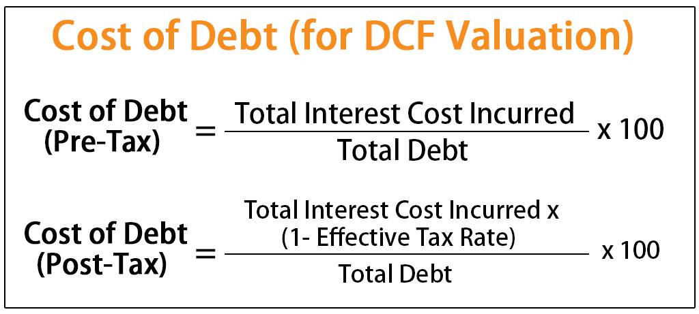

The financial landscape has evolved into a multidimensional arena, integrating various concepts that govern both traditional and modern financial practices. Among these are the cost of debt and algorithmic trading, two seemingly distinct domains that, when understood comprehensively, can significantly impact financial strategies. As globalization and technological advancements continue to reshape economies, the need for a well-rounded grasp of fundamental financial principles becomes imperative for effective decision-making and financial management.

Fundamental financial knowledge, such as understanding the cost of debt, plays a critical role in shaping comprehensive financial strategies. The cost of debt refers to the effective rate a company pays on its borrowed funds, a crucial factor that influences a firm's capital structure and financial performance. By incorporating the cost of debt into financial analysis, businesses can gauge their risk profiles, make informed funding decisions, and engage in effective planning to enhance profitability and shareholder value.



Algorithmic trading represents a newer strategic approach, utilizing data and sophisticated mathematical models to execute trades with unprecedented speed and precision. This aspect of trading harnesses technology to potentially generate higher returns and manage risks more effectively than traditional manual trading methods. The integration of financial analysis, such as understanding the intricacies of the cost of debt, into algorithmic trading can optimize investment strategies, enhance trading efficiency, and enable better risk management.

In this article, we will explore the multifaceted relationship between the cost of debt and algorithmic trading, beginning with a comprehensive understanding of what the cost of debt is, how it is calculated, and why it is significant in the broader context of financial analysis. Additionally, we will examine how these insights can inform and enhance algorithmic trading strategies. This exploration aims to provide readers with valuable perspectives that can be applied to improve financial decision-making and optimize investment outcomes in an ever-evolving financial landscape.

## Table of Contents

## Understanding Debt Formulas

Debt formulas are pivotal in determining the cost of debt, which is a fundamental component of a company's financial strategy. Understanding different types of debt and how their associated costs are calculated forms the backbone of effective financial management.

### Types of Debt

Companies typically incur various types of debt, including:

1. **Corporate Bonds**: Issued by companies to raise capital, these bonds come with a fixed interest rate.
2. **Bank Loans**: These can have fixed or variable interest rates and often depend on the company’s creditworthiness.
3. **Convertible Debt**: Initially functions as a bond but can be converted into equity shares at predetermined rates.

### Calculating Cost of Debt

The cost of debt is essentially the effective rate a company pays on its borrowed funds. It's influenced by interest rates and credit risk. Here's how the calculations are typically structured:

#### Interest Rate Considerations

Interest rate expenses form the primary component of the cost of debt. For bonds, the [interest rate](/wiki/interest-rate-trading-strategies) is the coupon rate, while for loans it may be based on benchmark rates like the LIBOR or the federal funds rate.

#### Formula for Cost of Debt

The pre-tax cost of debt can be calculated using:

$$
\text{Cost of Debt} = \frac{\text{Total Interest Expense}}{\text{Total Debt}}
$$

Where:

- Total Interest Expense is the annual expenditure on interest for the company.
- Total Debt refers to the aggregate amount of debt held by the company.

#### After-Tax Cost of Debt

Since interest expenses are tax-deductible, the after-tax cost of debt is often more relevant for analysis:

$$
\text{After-Tax Cost of Debt} = \text{Cost of Debt} \times (1 - \text{Tax Rate})
$$

This formula highlights the importance of understanding both the nominal and real impacts of financial obligations.

### Application in Real-World Scenarios

To illustrate, consider a company with an annual interest payment of $5 million and total outstanding debt of $100 million. Assuming a tax rate of 30%, the calculations for cost of debt are as follows:

1. **Pre-Tax Cost of Debt:**
   \[ \frac{5,000,000}{100,000,000} \times 100 = 5\%
$$

2. **After-Tax Cost of Debt:**
   \[ 5\% \times (1 - 0.3) = 3.5\%
$$

This example demonstrates how companies can assess their debt service burden and incorporate this knowledge into broader financial strategies.

Understanding these mechanisms enables companies to manage credit risk effectively and optimize their financial operations, providing crucial insights for strategic decision-making.

## Cost of Debt in Financial Analysis

The cost of debt is a fundamental metric in financial analysis that denotes the effective interest rate a company incurs on its borrowed capital. It plays a critical role in appraising a firm's financial health and efficiency. This measure provides insight into the firm's debt management and is instrumental in assessing its risk profile.

**Understanding the Risk Profile:**
The cost of debt is an indicator of the risk a company holds. A higher cost typically suggests that creditors perceive the company as a higher risk, perhaps due to unstable cash flows or a vulnerable position in its industry. Analysts often compare the company's cost of debt to industry benchmarks to contextualize this figure. A cost significantly above the industry average may raise red flags regarding the firm's financial health or operational stability.

**Financial Efficiency:**
Evaluating the cost of debt enables stakeholders to judge the company's financial efficiency. A lower cost implies that the firm is capable of acquiring capital at favorable rates, underlining its strong creditworthiness and operational prospects. Moreover, companies that can finance projects at a lower cost may achieve higher profitability due to reduced interest expenses, enhancing shareholders' returns.

**Impact of Taxes:**
Taxes significantly impact the cost of debt, as interest payments on debt are generally tax-deductible. This advantage reduces the actual expense incurred by the firm, making debt a relatively cheaper source of financing compared to equity. The after-tax cost of debt can be calculated using the formula:

$$
\text{After-Tax Cost of Debt} = \text{Interest Rate} \times (1 - \text{Tax Rate})
$$

This formula highlights the reduction in interest expense due to tax deductions. For example, if a firm has an interest rate of 6% and falls under a tax rate of 30%, the after-tax cost of debt is computed as:

$$
6\% \times (1 - 0.30) = 4.2\%
$$

Therefore, the tax shield offered by debt financing effectively lowers the cost of borrowing, making it an advantageous strategy for capital acquisition.

Overall, understanding and analyzing the cost of debt provides valuable insights into a company's financial strategy, its risk exposure, and the efficiency of its capital structure.

## Algorithmic Trading: A New Frontier

Algorithmic trading utilizes advanced data analysis and mathematical models to conduct trades with optimal speed and efficiency. By automating decision-making processes, [algorithmic trading](/wiki/algorithmic-trading) systems can react to market changes within fractions of a second, enhancing the ability to capitalize on fluctuations in asset prices. 

One critical aspect of creating efficient trading algorithms lies in understanding key financial concepts like the cost of debt. This knowledge can significantly aid in the development of algorithms tailored to manage debt-related investment strategies. The cost of debt is essential when considering the leverage a company or portfolio might assume, influencing risk-return profiles.

There are diverse ways to integrate financial analysis tools into trading algorithms. These tools can process large datasets to extract relevant insights that guide algorithm decisions. For instance, evaluating a company's debt structure and cost effectively allows algorithms to assess credit risks and potential returns. An algorithm might utilize the formula for cost of debt (usually represented before tax as the interest rate on debt, $r_d$, and after-tax as $r_d \times (1 - T)$, where $T$ is the corporate tax rate) to refine trading decisions:

```python
def after_tax_cost_of_debt(interest_rate, tax_rate):
    return interest_rate * (1 - tax_rate)

# Example usage:
interest_rate = 0.05  # 5% annual interest rate
tax_rate = 0.21  # 21% corporate tax rate
cost = after_tax_cost_of_debt(interest_rate, tax_rate)
print("After-tax cost of debt:", cost)
```

This calculation enables the algorithm to adjust positions based on the comparative cost efficiency of different capital structures. Furthermore, it allows the algorithm to consider macroeconomic indicators, like changes in central bank policies that may impact interest rates and thereby the cost of debt.

Moreover, integrating cost of debt analysis into automated trading strategies mitigates risks associated with debt-financed assets, which can be leveraged to enhance returns. Advanced algorithms may incorporate [machine learning](/wiki/machine-learning) models that continuously learn and adjust based on debt-related market data and economic indicators.

In essence, the harmonization of financial principles such as the cost of debt with algorithmic trading models provides a strategic advantage. It not only optimizes market engagement but also ensures that investment strategies are fortified against potential financial risks. As trading technologies evolve, the emphasis on integrating comprehensive financial data into trading algorithms continues to grow, underscoring the significant impact these integrations have on informed trading and strategic outcomes.

## Integrating Cost of Debt with Algo Trading Strategies

Integrating cost of debt analysis into algorithmic trading strategies offers a dynamic approach to enhancing investment decision-making and managing risk effectively. Algorithmic models can benefit from incorporating the cost of debt to evaluate the financial standing of potential investments and adjust trading strategies accordingly.

### Practical Strategies for Incorporating Debt Cost Calculations

1. **Cost of Debt as a Financial Health Indicator**: By calculating the cost of debt, algorithmic traders can assess a company's financial health and leverage ratio. The formula for the cost of debt after tax is given by:
$$
   \text{Cost of Debt (After Tax)} = \text{Interest Rate} \times (1 - \text{Tax Rate})

$$

   This insight can be used to weigh the risks associated with a company's debt load against the potential returns, allowing for more informed portfolio adjustments.

2. **Debt Ratios in Signals Generation**: Debt ratios, such as the debt-to-equity ratio, can be integrated into algorithms as part of a broader set of signals that influence buy/sell decisions. A lower ratio typically suggests a more financially stable company, potentially signaling a safer investment.

3. **Simulating Interest Rate Sensitivity**: Algorithms can be programmed to simulate changes in interest rates and assess their impact on a company's cost of debt. Through these simulations, traders can forecast how future interest rate changes might influence debt costs and stock prices, optimizing trading strategies to capitalize on expected market movements.

4. **Dynamic Adjustment of Leverage**: Trading systems can incorporate cost of debt data to dynamically adjust leverage strategies based on current and projected debt costs. For example, a trading algorithm could scale back leverage in anticipation of rising interest rates, thereby reducing the potential risk from increased borrowing costs.

### Examples of Successful Integration

Several trading systems have successfully integrated cost of debt analysis into their algorithms. Quantitative models often employ cost of debt as one of many variables that influence trade execution decisions. For example, a [hedge fund](/wiki/hedge-fund-trading-strategies) might use complex models that [factor](/wiki/factor-investing) in cost of debt alongside other financial metrics to shortlist stocks for long-term positions. Moreover, some proprietary trading firms leverage machine learning algorithms that continuously learn and adapt based on new data, including variations in the cost of debt.

Integrating the cost of debt into algorithmic trading not only provides a hedge against adverse market conditions but also offers a mechanism for exploiting feasible market opportunities based on comprehensive financial insights. This approach maximizes the strategic advantage of traders by embedding financial consciousness into automated decision-making processes, resulting in more robust and adaptive trading models.

## Case Studies and Examples

In this section, we explore the practical application of debt formulas and cost of debt through real-world case studies, showcasing how these concepts influence financial strategies.

### Case Study 1: Company A - Cost of Debt for Capital Structure Optimization

Company A is a multinational corporation in the manufacturing sector. To optimize its capital structure, the company focused on minimizing its weighted average cost of capital (WACC), a critical factor in reducing overall financing costs. The cost of debt was calculated using the formula:

$$
\text{Cost of Debt} = \frac{\text{Interest Expenses}}{\text{Average Debt Outstanding}}
$$

With an average debt outstanding of $500 million and annual interest expenses of $25 million, the cost of debt was determined to be 5%. By maintaining a balance between equity and debt, Company A was able to lower its WACC, thus achieving an optimal capital structure that led to improved profitability and shareholder value.

### Case Study 2: Company B - Impact of Tax on Cost of Debt

Company B, a tech firm heavily reliant on innovation, used after-tax cost of debt to refine its financial strategy. This involved the formula:

$$
\text{After-Tax Cost of Debt} = \text{Cost of Debt} \times (1 - \text{Tax Rate})
$$

With an initial cost of debt at 6% and a corporate tax rate of 30%, the after-tax cost of debt was recalculated as 4.2%. Recognizing this effective rate allowed Company B to assess its affordability of additional debt and evaluate investment opportunities with precision.

### Case Study 3: Company C - Financial Strategy Integration with Algo Trading

Company C, an investment firm, integrated after-tax cost of debt considerations into its algorithmic trading strategies. Their algorithm accounted for debt servicing costs while executing trades, ensuring transactions aligned with risk-adjusted returns. A simplified Python code snippet for integrating cost of debt into trading decisions is as follows:

```python
def calculate_after_tax_cost_of_debt(cost_of_debt, tax_rate):
    return cost_of_debt * (1 - tax_rate)

def optimize_trade_positions(trades, capital_structure, tax_rate):
    for trade in trades:
        financing_cost = calculate_after_tax_cost_of_debt(capital_structure['debt_cost'], tax_rate)
        if trade['expected_return'] > financing_cost:
            execute_trade(trade)
        else:
            continue

optimize_trade_positions(trades, {'debt_cost': 0.06}, 0.3)
```

### Trading Efficiencies

These strategies enabled companies to enhance trading efficiencies by precisely aligning debt management goals with operational tactics. Companies leveraging their cost of debt analytics have seen marked improvements in financial performance and better alignment of financing strategies with market conditions.

By applying these techniques, businesses gain strategic advantages that enhance their trading algorithms, positioning them for future financial success while maintaining optimal risk management frameworks.

## Conclusion

Integrating an understanding of debt formulas and the cost of debt into financial analysis is crucial for optimizing financial strategies. Accurately calculating the cost of debt allows companies to comprehend their financial obligations better and make informed decisions about borrowing and investment strategies. By understanding costs, companies can negotiate better terms, optimize their capital structures, and enhance overall financial health.

Algorithmic trading, where algorithms execute many trades at speeds impossible for humans, combines traditional financial analysis with technological innovations. This fusion creates opportunities to leverage financial insights, like cost of debt calculations, to develop sophisticated trading strategies. By incorporating debt-related metrics, such as interest rates and credit risk, into algorithms, traders can optimize investment decisions and manage risk more effectively.

The transformative power of these financial concepts lies in their ability to enhance trading strategies and company valuation. Cost of debt analysis not only aids in understanding financial efficiency and risk profiles, it also provides critical data for optimizing algorithms in trading systems. Companies that effectively integrate these analyses can harness more accurate market predictions, articulate robust financial strategies, and improve their overall competitive advantage in the market.

## References & Further Reading

[1]: ["Algorithmic Trading and DMA: An Introduction to Direct Access Trading Strategies"](https://www.amazon.com/Algorithmic-Trading-DMA-introduction-strategies/dp/0956399207) by Barry Johnson

[2]: Damodaran, A. (2001). ["The Dark Side of Valuation: Valuing Old Tech, New Tech, and New Economy Companies"](https://archive.org/details/darksideofvaluat0000damo). FT Press.

[3]: ["Corporate Finance and the Theory of the Firm"](https://www.jstor.org/stable/2646896) by Michael C. Jensen and William H. Meckling, Journal of Financial Economics.

[4]: ["The Cost of Debt"](https://www.investopedia.com/terms/c/costofdebt.asp) by Noel Amenc and Lionel Martellini, SSRN Electronic Journal.

[5]: Tsay, R. S. (2010). ["Analysis of Financial Time Series"](https://onlinelibrary.wiley.com/doi/book/10.1002/9780470644560). Wiley.