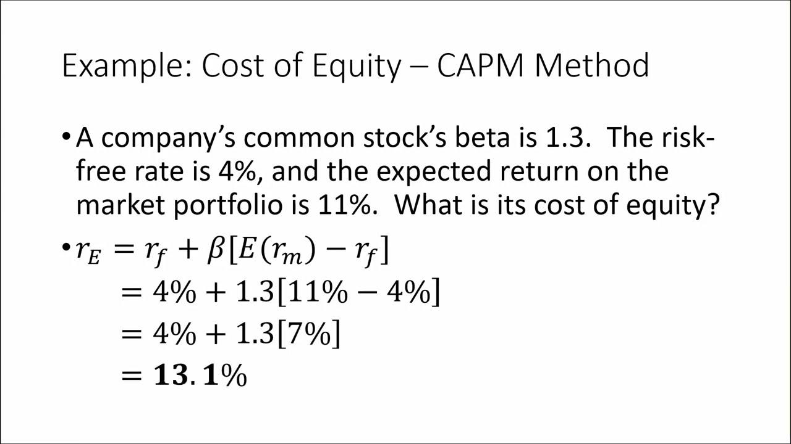

In this article, we explore the cost of equity, a vital financial metric for both companies and investors. The cost of equity represents the return that a company must earn to justify an investment decision, and it reflects the expected return required by investors to invest in a company's stock. Calculating the cost of equity involves various models and formulas, each offering unique insights into the financial health of a company and the potential returns for investors. As the financial sector continues to advance with automation and algorithmic trading, the significance of understanding the cost of equity becomes pivotal in crafting informed investment strategies.

We aim to illuminate the methodologies used to calculate the cost of equity, including the Dividend Discount Model (DDM) and the Capital Asset Pricing Model (CAPM). Additionally, we'll provide practical financial examples to help decipher this complex but essential concept. Recognizing the influence of cost of equity on strategic investment decisions is crucial, particularly in an era where algorithmic trading is reshaping how investments are made and managed. By the end of this article, readers will have a clearer understanding of the intricate relationship between cost of equity and modern finance, facilitating better decision-making and strategic planning in an increasingly automated world.

## Table of Contents

## What is the Cost of Equity?

Cost of equity is a critical financial metric representing the return a company must achieve to justify an investment. This metric plays a vital role in corporate finance and is essential for both companies and investors in assessing potential investment opportunities and financing options.

For companies, the cost of equity is the minimum rate of return they must earn on equity-financed projects to meet the expectations of their shareholders. This required rate of return is crucial in capital budgeting processes, where firms assess the viability of projects and investments. By ensuring that project returns exceed the cost of equity, companies can enhance shareholder value.

From the perspective of investors, the cost of equity signifies the expected rate of return they demand as compensation for the risk of owning a stock. This expected return accounts for factors such as market volatility and the inherent risks associated with individual companies. Consequently, the cost of equity helps investors make informed decisions regarding portfolio diversification and stock selection, ensuring that investments align with their return expectations and risk tolerance.

In determining a company's required rate of return, the cost of equity is an indispensable component. Firms often use models like the Dividend Discount Model (DDM) and the Capital Asset Pricing Model (CAPM) to estimate the cost of equity. These models help quantify shareholder return expectations and form the bedrock of a company's financing strategy. By understanding and accurately calculating the cost of equity, firms can optimize their capital structure, balancing equity and debt financing to minimize their overall cost of capital.

In conclusion, the cost of equity serves as a benchmark rate of return that companies must achieve to attract and retain investors. It is fundamental in capital budgeting and investment decision-making, ensuring that businesses can meet or exceed shareholder expectations and grow sustainably.

## Understanding the Cost of Equity

Cost of equity is a pivotal metric for both investors and companies, yet its implications and computations differ slightly between these two perspectives. For companies, the cost of equity represents the return required to justify the risk associated with an equity investment. It is crucial for companies to determine this rate to ensure that they are not overpaying for their financial resources. For investors, on the other hand, the cost of equity signifies the expected rate of return from a purchased share, acting as a benchmark for evaluating the attractiveness of potential investments.

**Capital Raising: Debt vs. Equity**

Companies have two primary avenues for raising capital: debt and equity. Debt involves borrowing money with an obligation to repay it with interest, whereas equity involves issuing shares of the company to investors. While debt can be less expensive since interest payments are tax-deductible, equity does not require repayment, which can be beneficial in managing cash flow and financial flexibility.

Debt has the advantage of leveraging potential returns for shareholders during profitable times. However, it introduces financial obligation irrespective of the company's performance. Equity financing, while potentially costlier due to higher required rates of return, allows companies to share risks with investors and avoids the burden of fixed repayments.

**Tax Implications of Equity Investments**

Tax implications play a significant role in equity investments. Dividends paid to shareholders are not tax-deductible for the company, unlike interest payments on debt. This affects the after-tax cost of equity, potentially making it more expensive than debt financing from a tax perspective. For investors, dividends are typically subject to taxation, which can impact the net return on equity investments. Understanding these tax dynamics is crucial for both companies considering their financing options and investors evaluating their after-tax returns.

**Significance in Pricing and Risk Assessment**

Cost of equity is integral to pricing decisions and risk assessments within a company. It serves as the discount rate in valuation models, impacting the present value of future cash flows. This, in turn, influences the company's valuation and stock price. A lower cost of equity implies a higher valuation and, potentially, a more attractive investment opportunity.

Additionally, cost of equity is utilized in risk assessment frameworks, such as the Capital Asset Pricing Model (CAPM). The CAPM formula is as follows:

$$

\text{Cost of Equity} = R_f + \beta (R_m - R_f) 
$$

where $R_f$ is the risk-free rate, $\beta$ is the beta coefficient of the stock (a measure of its volatility relative to the market), and $R_m$ is the expected market return. This formula plays an essential role in quantifying the risk-return tradeoff for equity investments, informing both company strategies and investor decisions.

In conclusion, comprehending the differing perspectives on the cost of equity for investors and companies, alongside its implications in capital structuring and risk assessment, is essential for making informed financial decisions.

## Cost of Equity Calculation Methods

The Cost of Equity is a pivotal concept in corporate finance and investment, capturing the expected return demanded by investors for providing capital to a company. Two primary models are employed to calculate this metric: the Dividend Discount Model (DDM) and the Capital Asset Pricing Model (CAPM). Each model employs distinct approaches and assumptions to estimate the cost of equity, and understanding their methodologies is essential for accurate financial analysis.

### Dividend Discount Model (DDM)

The Dividend Discount Model is a valuation method predicated on the notion that a stock's intrinsic value is equal to the present value of all its expected future dividends. The formula for a stock with dividends growing at a constant rate (Gordon Growth Model) is given by:

$$

\text{Cost of Equity (Ke)} = \frac{D_1}{P_0} + g 
$$

where:
- $D_1$ is the expected dividend in the next period,
- $P_0$ is the current price of the stock,
- $g$ is the growth rate of dividends.

The DDM is straightforward and best suited for companies with stable dividend growth rates. However, it presents several limitations. Not all companies pay dividends, and those that do might not exhibit stable growth rates. This restricts the model's applicability to well-established firms with predictable dividend patterns.

### Capital Asset Pricing Model (CAPM)

The Capital Asset Pricing Model provides a more comprehensive framework by considering the risk associated with a stock. The CAPM formula is:

$$

\text{Cost of Equity (Ke)} = R_f + \beta(R_m - R_f) 
$$

where:
- $R_f$ is the risk-free rate,
- $\beta$ (beta) is the measure of a stock's volatility relative to the market,
- $R_m$ is the expected return of the market.

CAPM recognizes that investors should be compensated for both the time value of money (given by $R_f$) and the risk undertaken (captured by the risk premium, $\beta(R_m - R_f)$). Its strengths lie in its broad applicability, as it can be used for any stock, regardless of dividend policies. However, its assumptions — such as market efficiency and normally distributed returns — have been subjects of criticism. Additionally, accurately estimating the stock's beta and the expected market return can be challenging.

### Advantages and Limitations

While the DDM offers simplicity and a direct link to tangible returns via dividends, it lacks flexibility. The CAPM, conversely, provides a robust framework accounting for risk and is widely applicable, yet hinges on the accurate estimation of several market parameters.

Both models serve as crucial tools in the financial analyst's toolkit, offering different lenses through which the cost of equity can be viewed. Choosing between them depends on the characteristics of the company being evaluated and the availability of input data. Understanding these models' advantages and limitations allows analysts and investors to make well-informed decisions based on the financial context.

## Financial Example

In this section, we will illustrate the calculation of the cost of equity using a hypothetical example by applying both the Dividend Discount Model (DDM) and the Capital Asset Pricing Model (CAPM). These calculations will help us understand the practical application of these models and interpret the implications for a company’s financial health.

### Hypothetical Scenario

Let's consider a company, XYZ Corp, which has the following financial data:
- The expected dividend per share next year (D1) is $2.
- The current market price of the stock (P0) is $40.
- The dividends are expected to grow at a constant rate (g) of 5% annually.
- The company's beta (β) is 1.2.
- The risk-free rate (Rf) is 3%.
- The expected market return (Rm) is 8%.

### Using the Dividend Discount Model (DDM)

The Dividend Discount Model calculates the cost of equity $(r)$ using the formula:

$$
r = \frac{D1}{P0} + g
$$

Plugging XYZ Corp's data into the formula gives:

$$
r = \frac{2}{40} + 0.05 = 0.05 + 0.05 = 0.10 \text{ or } 10\%
$$

This calculation indicates that, according to the DDM, the cost of equity for XYZ Corp is 10%.

### Using the Capital Asset Pricing Model (CAPM)

The Capital Asset Pricing Model calculates the cost of equity using the formula:

$$
r = Rf + β(Rm - Rf)
$$

Substituting the given values for XYZ Corp, we get:

$$
r = 0.03 + 1.2 \times (0.08 - 0.03) = 0.03 + 1.2 \times 0.05 = 0.03 + 0.06 = 0.09 \text{ or } 9\%
$$

According to the CAPM, the cost of equity for XYZ Corp is 9%.

### Interpretation of Results

The cost of equity calculated using the DDM is slightly higher at 10% compared to the 9% calculated using the CAPM. This variation is attributed to the different assumptions and factors each model incorporates. The DDM relies heavily on the assumption of constant dividend growth, making it more suitable for companies with stable and predictable dividend payouts. The CAPM, on the other hand, accounts for market risk and is versatile across various corporate growth conditions.

The calculated cost of equity provides a benchmark for XYZ Corp's investment decisions. If XYZ Corp can generate returns above the cost of equity, it implies efficient and favorable use of equity funding from a financial health perspective. Conversely, returns below this rate could raise concerns regarding investment performance and shareholder value creation. Understanding both models equips investors and companies with a nuanced approach to evaluating investment opportunities and corporate financial strategies.

## Cost of Equity in Algorithmic Trading

Algorithmic trading, which leverages computer algorithms to execute trades at high speeds, is an integral part of modern financial markets. The cost of equity is a crucial [factor](/wiki/factor-investing) influencing decisions and strategies within this domain. By understanding and integrating the cost of equity, algorithms can make more informed decisions regarding stock valuation, risk management, and expected returns.

### Incorporating Cost of Equity in Trading Strategies

Algorithmic models often utilize the cost of equity to evaluate the expected returns of stocks. By determining the required return rate, trading systems can identify undervalued or overvalued stocks. The Capital Asset Pricing Model (CAPM) is commonly employed to estimate the cost of equity. CAPM considers the risk-free rate, beta (a measure of a stock's [volatility](/wiki/volatility-trading-strategies) relative to the market), and the market return. The formula for CAPM is:

$$
\text{Cost of Equity} (r) = r_f + \beta \times (r_m - r_f)
$$

where:
- $r_f$ is the risk-free rate,
- $\beta$ is the beta of the stock,
- $r_m$ is the expected market return.

Algorithmic models can integrate this formula to fine-tune the predictions of returns, thus optimizing buy or sell signals based on whether the market has overestimated or underestimated the stock's intrinsic value.

### Impact on Decision-Making and Risk Management

In [algorithmic trading](/wiki/algorithmic-trading), decision-making is highly data-driven and the cost of equity provides critical information about potential risks and returns. Algorithms incorporate this metric to assess the risk-adjusted performance of stocks, enabling more precise execution strategies. For instance, in a portfolio optimization scenario, algorithms can allocate capital efficiently by comparing the expected returns against the cost of equity, ensuring that investments meet the minimum acceptable return thresholds.

Furthermore, understanding the cost of equity aids in risk management by helping algorithms adjust for volatility. If a stock's beta indicates high volatility, algorithms can adjust holdings to mitigate risk, only keeping investments whose expected returns surpass the cost of equity.

### Impact on Potential Returns

By integrating the cost of equity, algorithmic trading systems can enhance their return potential. When the expected returns of a stock exceed the calculated cost of equity, it signifies an opportunity for profit. Conversely, if returns are less than the cost of equity, the stock might be considered overpriced or too risky, prompting a sell-off by the algorithm.

Overall, incorporating cost of equity within algorithmic trading enhances strategy precision and risk management, leading to more informed and effective trading decisions. Understanding and applying this financial metric allows algorithms to more accurately predict stock movements and optimize the trade execution strategies.

## Conclusion

The cost of equity is pivotal in financial decision-making, representing the expected return necessary to persuade investors to invest in a company. This metric is not only essential for corporate decision-makers evaluating potential investments and various financing methods but also serves as a critical benchmark for investors gauging the attractiveness of equities.

In the context of investments and financing, the cost of equity helps companies make informed decisions by reflecting the opportunity cost associated with investing capital elsewhere. When evaluating potential projects, a company uses the cost of equity as a discount rate to assess the anticipated returns against the required rate set by shareholders. A project is considered viable if its prospective returns exceed the cost of equity, thereby generating value for shareholders.

The incorporation of cost of equity into algorithmic trading further emphasizes its significance. Algorithmic trading strategies, which rely on executing pre-programmed trading instructions at high speeds, can integrate the cost of equity to refine risk assessments and enhance return optimization. By adjusting for the cost of equity, these algorithms can better evaluate the risk-adjusted performance of equity positions, leading to improved strategic decisions and potentially higher returns.

Understanding the cost of equity is imperative for navigating the intricacies of modern finance, as it facilitates more precise investment assessments and strategic planning. In a world where financial markets are becoming increasingly sophisticated, mastering this concept enables both investors and companies to make rational, evidence-based decisions, thus optimizing financial outcomes.

## FAQs

### FAQs

#### Answers to common questions about cost of equity and its calculation.

**When should I use DDM vs. CAPM?**

The choice between the Dividend Discount Model (DDM) and the Capital Asset Pricing Model (CAPM) depends on the specific circumstances and data availability. 

- **Dividend Discount Model (DDM):** This model is particularly useful when a company regularly pays dividends and there is a reasonable expectation that the dividends will grow at a constant rate. DDM is effective for evaluating stable, mature companies in industries where dividends are a significant part of shareholder returns. However, it may not be suitable for companies that do not pay dividends or have unpredictable dividend patterns.

- **Capital Asset Pricing Model (CAPM):** This model is more versatile and widely used, particularly for companies of any size, whether or not they pay dividends. CAPM takes into account the risk-free rate, beta (a measure of a stock's volatility relative to the market), and the expected market return. It is especially useful in evaluating companies with fluctuating dividend policies or those in growth stages that do not yet distribute dividends.

**Insights into market conditions that affect cost of equity.**

Market conditions play a crucial role in determining the cost of equity. Several factors can influence this metric:

- **Interest Rates:** Generally, higher interest rates increase the cost of equity since they raise the risk-free rate component in the CAPM formula. As borrowing becomes more expensive, investors require a higher return to compensate for increased opportunity costs.

- **Market Volatility:** Increased volatility often raises the cost of equity, as greater risk demands higher expected returns. This is directly reflected in the beta component of the CAPM, which moves upwards in turbulent markets.

- **Economic Growth:** During periods of economic expansion, the cost of equity might decrease due to higher expected growth rates in dividends and earnings, which are favorable conditions for DDM. Conversely, economic downturns may increase the cost of equity due to reduced growth expectations and higher risk perceptions.

- **Inflation Rates:** High inflation often leads to an increase in the cost of equity, as investors require higher returns to preserve their purchasing power. This might also alter the calculations for expected market returns and risk-free rates in CAPM. 

Understanding these factors, alongside choosing the appropriate model (DDM versus CAPM), allows for a more nuanced analysis of the cost of equity and its impact on investment decisions.

## References & Further Reading

[1]: Damodaran, A. (2002). ["Investment Valuation: Tools and Techniques for Determining the Value of Any Asset"](https://archive.org/details/investmentvaluat0000damo_n6k9). John Wiley & Sons.

[2]: Brealey, R. A., Myers, S. C., & Allen, F. (2016). ["Principles of Corporate Finance"](https://www.mheducation.com/highered/product/Principles-of-Corporate-Finance-Brealey.html). McGraw-Hill Education.

[3]: Bodie, Z., Kane, A., & Marcus, A. (2013). ["Investments"](https://www.mheducation.com/highered/product/Investments-Bodie.html). McGraw-Hill Education.

[4]: Fama, E. F., & French, K. R. (2004). ["The Capital Asset Pricing Model: Theory and Evidence"](https://www.aeaweb.org/articles?id=10.1257/0895330042162430). Journal of Economic Perspectives.

[5]: Gordon, M. J. (1959). ["Dividends, Earnings, and Stock Prices."](https://www.jstor.org/stable/1927792?read-now=1) Review of Economics and Statistics.

[6]: Sharpe, W. F. (1964). ["Capital Asset Prices: A Theory of Market Equilibrium under Conditions of Risk"](https://onlinelibrary.wiley.com/doi/full/10.1111/j.1540-6261.1964.tb02865.x). The Journal of Finance.