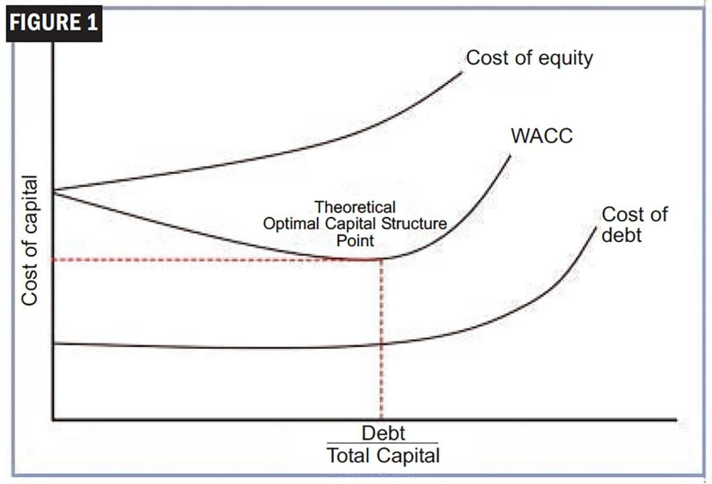

The exploration of the interaction between the cost of equity, cost of capital, financial analysis, and algorithmic trading is pivotal in contemporary financial decision-making. These concepts form the foundation of how firms evaluate investment opportunities, optimize their capital structure, and enhance their trading strategies.

The cost of equity reflects the return expectations of shareholders, forming a crucial part of the broader cost of capital. It is integral to determining the weighted average cost of capital (WACC), which companies use to measure the minimum acceptable return on their investments. Accurately calculating these costs ensures that firms make informed financial decisions and maintain their market value.



In recent years, the rise of algorithmic trading has transformed financial markets, necessitating a comprehensive understanding of capital cost calculations. Algorithmic trading employs pre-set rules—often advanced by machine learning and artificial intelligence—to execute trades with precision and speed, relying heavily on accurate financial inputs such as cost of capital. This relationship is critical for traders and investors aiming to maximize returns while managing risks.

For both individual and institutional investors, understanding the interplay between these financial elements is essential for optimizing investment decisions and strategies. Investors utilize the cost of capital to gauge risk-adjusted returns, allowing them to make informed choices that align with their financial goals and risk tolerance.

Practical applications of these financial concepts are evident in real-world trading scenarios. By examining case studies, one can appreciate how firms effectively integrate cost calculations into their trading algorithms, enabling superior performance and strategic advantage in competitive markets. Successful management and application of these principles highlight their importance in achieving optimal trading execution and financial resilience.

## Table of Contents

## Understanding Cost of Capital

Cost of capital is a critical metric that reflects the return rate a company must achieve on its investments to sustain its market value. It is a composite figure that includes the cost of equity and the cost of debt. These elements are integrated to form the Weighted Average Cost of Capital (WACC), which plays a vital role in evaluating a firm's investment opportunities.

1. **Components of Cost of Capital**: 
   - **Cost of Equity**: This represents the return required by equity investors, given the risk of the investment in the company. It can be estimated using models like the Capital Asset Pricing Model (CAPM), which considers the risk-free rate, the equity beta (a measure of risk), and the expected market return.
   - **Cost of Debt**: This is the effective rate that a company pays on its borrowed funds. It is often calculated as the yield to maturity on existing debt adjusted for the tax shield provided by interest tax-deductibility. The after-tax cost of debt can be expressed as: 
$$
     \text{Cost of Debt} = \text{Interest Rate} \times (1 - \text{Tax Rate})

$$

2. **Weighted Average Cost of Capital (WACC)**:
   WACC is calculated by weighting the cost of each capital component by its proportion in the firm's capital structure. The formula for WACC is:
$$
   \text{WACC} = \left( \frac{E}{V} \times \text{Cost of Equity} \right) + \left( \frac{D}{V} \times \text{Cost of Debt} \times (1 - \text{Tax Rate}) \right)

$$
   where $E$ is the market value of the equity, $D$ is the market value of the debt, and $V = E + D$ is the total value of the firm's financing.

3. **Investment Evaluation**:
   Understanding the cost of capital is essential for companies as it determines the hurdle rate for investment projects. Projects that are expected to generate returns above the WACC add value to the company, while those below it may destroy value.

4. **Variability Across Industries**:
   Different industries exhibit varying cost structures due to factors like risk levels, capital intensity, and growth opportunities. For example, technology firms often have higher costs of equity reflecting higher growth prospects and risks, whereas utility companies might have lower WACC due to stable cash flows and significant debt-financing capabilities. This diversity necessitates industry-specific considerations when calculating the cost of capital.

Analyzing cost structures and effectively calculating WACC helps firms in capitalizing their projects, thereby optimizing investment decisions and maintaining competitive advantages in a dynamic financial landscape.

## The Role of Cost of Capital in Financial Analysis

Cost of capital plays a pivotal role in financial analysis by serving as a benchmark for assessing the viability of investment projects. It essentially represents the minimum return that an investment must generate to justify its acceptance. This threshold is often referred to as the hurdle rate. Firms employ hurdle rates to filter and prioritize potential investment opportunities, ensuring that only those projects that meet or exceed this benchmark are pursued.

In valuation models, particularly the Discounted Cash Flow (DCF) model, the cost of capital is a critical component as it functions as the discount rate. The DCF model estimates the present value of future cash flows to ascertain the value of an investment. The formula for calculating the present value $PV$ of future cash flows $CF_t$ is given by:

$$
PV = \sum_{t=1}^{n} \frac{CF_t}{(1 + r)^t}
$$

Here, $r$ is the discount rate, which is often equated with the cost of capital. A higher discount rate, reflecting a higher cost of capital, results in a lower present value, thereby reducing the estimated worth of future cash flows. Thus, the cost of capital directly influences company valuations.

Furthermore, investors utilize the cost of capital to assess risk-adjusted returns. This involves comparing the expected returns on an investment against the cost of capital to evaluate whether the investment compensates adequately for its risk. This measure is essential for making informed investment choices, as it helps in aligning investment decisions with the risk profiles and return expectations.

In summary, the cost of capital is integral to financial analysis, as it aids in determining hurdle rates, influences valuation models like DCF through discount rates, and serves as a metric for evaluating risk-adjusted returns. By incorporating these calculations, both investors and firms can make more informed and strategic investment decisions.

## Algorithmic Trading and Capital Calculation

Algorithmic trading utilizes sophisticated computer programs to execute trades automatically, following a set of predefined parameters. These parameters can include timing, price, quantity, or complex mathematical models. Setting up these algorithms requires a precise understanding of capital calculations to ensure strategies are profitable and efficient.

Accurate capital calculation is fundamental for the effective deployment of [algorithmic trading](/wiki/algorithmic-trading) strategies. Traders need to account for various factors, such as initial capital, potential returns, and associated risks. Ensuring precise calculations is crucial in a trading environment characterized by rapid changes and high [volatility](/wiki/volatility-trading-strategies).

Dynamic market conditions pose significant challenges to capital calculations. Markets can be influenced by numerous factors, including macroeconomic indicators, political events, and investor sentiment, leading to fluctuations in prices and [liquidity](/wiki/liquidity-risk-premium). These factors must be incorporated into the algorithms to ensure their resilience and adaptability. 

Additionally, microstructure issues such as transaction costs, bid-ask spreads, and price slippage need careful consideration. Algorithms must be crafted to minimize these costs to maintain strategy profitability. For this purpose, traders often utilize the Weighted Average Cost of Capital (WACC) as a benchmark to assess and optimize trade executions.

Advanced techniques like [machine learning](/wiki/machine-learning) and [artificial intelligence](/wiki/ai-artificial-intelligence) are increasingly being applied to enhance the adaptability of trading algorithms. These technologies allow for the analysis of vast datasets and real-time pattern recognition, thereby refining trading decisions. Machine learning models can adjust strategies based on historical data, identifying trends and predicting future market behavior. For example, linear regression models can forecast asset prices, while [reinforcement learning](/wiki/reinforcement-learning) can optimize strategy performance by learning from historical trades.

```python
# Example: Simple moving average crossover strategy using Python
import numpy as np
import pandas as pd
from sklearn.linear_model import LinearRegression

# Load market data
data = pd.read_csv('market_data.csv')

# Calculate short-term and long-term moving averages
data['SMA_50'] = data['Close'].rolling(window=50).mean()
data['SMA_200'] = data['Close'].rolling(window=200).mean()

# Define trading signals
data['Signal'] = 0
data['Signal'][data['SMA_50'] > data['SMA_200']] = 1  # Buy signal

# Fit linear regression model
model = LinearRegression()
X = np.array(range(len(data))).reshape(-1, 1)
y = data['Close'].values
model.fit(X, y)

# Predict future prices
predicted_prices = model.predict(X)

# Execute trades based on predictions
# (Further implementation is required to simulate trade execution and calculate returns)
```

Incorporating such advanced computational techniques enables traders to maintain competitiveness in rapidly evolving financial markets. By ensuring robust capital calculations and leveraging machine learning, traders can optimize their strategies for improved performance and efficiency.

## Integrating Cost of Capital with Algo Trading Strategies

Integrating the cost of capital into algorithmic trading strategies can significantly enhance investment control and profitability. This integration allows traders to evaluate the financial viability of trades by filtering opportunities based on expected returns that exceed their cost of capital, frequently calculated using the weighted average cost of capital (WACC).

One of the primary challenges in algorithmic trading is managing trading costs, bid-ask spreads, and the impact of trades on market prices. Algorithms, by design, execute trades at speeds and frequencies far beyond human capability. To maintain control over these trading costs, it is crucial to [factor](/wiki/factor-investing) in the WACC when executing trades, ensuring that the trades contribute positively to overall strategy performance rather than merely adding cost pressures.

The WACC is essential for filtering trades by enabling trading programs to consider only those opportunities that promise a return higher than the cost of capital. This can be expressed mathematically as:

$$
\text{Expected Return} > \frac{E}{V} \times Re + \frac{D}{V} \times Rd \times (1-T)
$$

where $E$ represents the market value of equity, $D$ is the market value of debt, $V$ is the total market value of the company’s financing (equity + debt), $Re$ is the cost of equity, $Rd$ is the cost of debt, and $T$ is the tax rate. This approach helps ensure that trading strategies align with desired profitability metrics.

Python programming provides a robust platform for integrating these calculations into trading algorithms. By leveraging libraries such as NumPy for numerical calculations and Pandas for data manipulation, traders and developers can create sophisticated scripts that automatically adjust to market conditions and recalibrate strategies based on dynamic WACC calculations.

For example, by using Python, investors can write a function to calculate WACC and apply it within a trading strategy:

```python
import numpy as np

def calculate_wacc(equity_value, debt_value, cost_of_equity, cost_of_debt, tax_rate):
    total_value = equity_value + debt_value
    equity_weight = equity_value / total_value
    debt_weight = debt_value / total_value
    wacc = (equity_weight * cost_of_equity) + (debt_weight * cost_of_debt * (1 - tax_rate))
    return wacc

# Example usage
wacc = calculate_wacc(equity_value=500000, debt_value=300000, 
                      cost_of_equity=0.08, cost_of_debt=0.05, tax_rate=0.3)

print(f'Calculated WACC: {wacc:.2%}')
```

Incorporating such calculations into a trading algorithm would allow real-time assessments of potential trades against a moving financial benchmark, bringing a higher degree of control and precision to trade execution. Moreover, it supports improved risk management by aligning trades with quantifiable financial expectations, thus optimizing profitability in the fast-paced world of algorithmic trading.

## Case Studies and Practical Applications

Companies like Goldman Sachs and Renaissance Technologies exemplify the application of cost of capital in algorithmic trading strategies, reflecting an advanced understanding of financial metrics and trading efficiencies. Both companies utilize the Weighted Average Cost of Capital (WACC) extensively to assess and optimize their trading scenarios and strategies.

Goldman Sachs employs WACC as a fundamental financial tool for evaluating potential trading opportunities and investment projects. By integrating WACC into their trading models, the firm systematically filters trades, ensuring that expected returns adequately surpass the cost of invested capital. This careful alignment of the cost of capital with trading objectives enables Goldman Sachs to optimize profitability while managing risk effectively. Furthermore, by taking into account the varying elements that constitute WACC—such as the cost of equity and the cost of debt—the company can adapt its strategies to changing financial landscapes, thereby maintaining a competitive edge.

Renaissance Technologies relies heavily on quantitative strategies, leveraging sophisticated algorithms to execute trades based on mathematical models. The company's integration of cost management principles, including WACC, into these models serves as a critical factor in achieving superior returns. By incorporating WACC, Renaissance Technologies is able to evaluate trade scenarios comprehensively, factoring in liquidity costs, bid-ask spreads, and potential market impacts on trade execution. This thorough approach allows them to precisely measure expected returns against the inherent costs, thus refining their strategies to maximize profit while mitigating risk.

A practical example of cost management leading to superior returns is seen when both companies engage in [arbitrage](/wiki/arbitrage) opportunities. Here, accurate calculation of trading costs, including capital costs, is crucial. For instance, should the cost of equity rise due to market volatility, the expected return on an arbitrage opportunity must be adjusted accordingly to ensure continued alignment with the firm's overall financial strategy.

An application of WACC in a Python trading algorithm might look like this:

```python
def calculate_wacc(cost_of_equity, cost_of_debt, equity, debt, tax_rate):
    """
    Calculate the Weighted Average Cost of Capital (WACC).

    Parameters:
        cost_of_equity (float): The cost of equity capital.
        cost_of_debt (float): The cost of debt capital.
        equity (float): The market value of equity.
        debt (float): The market value of debt.
        tax_rate (float): The corporate tax rate.

    Returns:
        float: The WACC value.
    """
    equity_ratio = equity / (equity + debt)
    debt_ratio = debt / (equity + debt)
    wacc = (equity_ratio * cost_of_equity) + (debt_ratio * cost_of_debt * (1 - tax_rate))
    return wacc

# Example usage:
cost_of_equity = 0.08
cost_of_debt = 0.03
equity = 5000000
debt = 2000000
tax_rate = 0.30

wacc = calculate_wacc(cost_of_equity, cost_of_debt, equity, debt, tax_rate)
print(f"The WACC is: {wacc}")
```

In this scenario, traders can dynamically incorporate WACC calculations into algorithmic trading strategies to assess the viability of trades, thus improving decision-making frameworks.

In summary, by integrating cost of capital considerations such as WACC into their trading algorithms, both Goldman Sachs and Renaissance Technologies benefit from enhanced risk management and profitability. These companies showcase the tangible advantages of marrying sophisticated capital cost calculations with algorithmic trading, offering compelling evidence of the practical applications of financial analysis in optimizing trade execution and investment returns.

## Conclusion

Understanding the cost of capital and its integration with algorithmic trading is a crucial aspect of modern financial decision-making. Investors and traders can enhance their investment returns by meticulously incorporating accurate capital calculations into trading strategies. The cost of capital serves as a baseline for evaluating investment opportunities and helps determine the necessary return required to justify taking on a particular risk. This precision in assessing returns becomes particularly significant in algorithmic trading, where rapid decision-making and execution can lead to substantial gains or losses.

Algorithmic trading systems benefit significantly from integrating cost of capital metrics, such as the Weighted Average Cost of Capital (WACC), into their algorithms. By doing so, traders can filter and select trades that meet a specified risk-adjusted return threshold. This strategy optimizes profitability by ensuring that only those trades with the potential to exceed the cost of capital threshold are executed. Incorporating such financial metrics into trading algorithms allows for more controlled and consistent investment strategies.

A commitment to continuous learning and adaptation in financial mechanics is essential to maintaining resilience in ever-evolving markets. As markets and trading technologies evolve, so too do the methodologies used to assess and integrate financial metrics. Continuous monitoring, evaluation, and adaptation of trading algorithms ensure that they remain relevant and effective. In this dynamic context, staying informed about advancements in financial theories and algorithmic techniques is indispensable for those looking to maintain a competitive edge in trading and investment management.

In conclusion, the integration of cost of capital calculations within algorithmic trading frameworks is a key component of sound financial strategy. By utilizing these concepts, investors and traders can make more informed, strategic decisions that optimize returns while effectively managing risk. This integration not only enhances profitability but also supports the development of adaptive strategies vital for navigating the complexities of modern financial markets.

## References & Further Reading

1. **Cost of Capital: Theory and Application** by Richard A. Brealey, Stewart C. Myers, and Franklin Allen - This book offers a comprehensive overview of financial management with a focus on understanding the cost of capital and its applications in corporate finance. It gives detailed explanations and mathematical formulations necessary for calculating the weighted average cost of capital (WACC). 

2. **Investment Valuation: Tools and Techniques for Determining the Value of Any Asset** by Aswath Damodaran - This text is invaluable for understanding the nuances of valuation models, such as the discounted cash flow (DCF) model, which utilize the cost of capital as a critical component. It includes case studies and real-world examples that highlight the role of cost of capital in investment decisions.

3. **Algorithmic Trading and DMA**: A guide to its practical applications and insights is provided by Barry Johnson. The text covers the practical aspects of algorithmic trading, including capital calculations, market microstructure, and programming strategies. It delves into the complexities of building and deploying algorithmic trading systems.

4. **Automated Options Trading: Create, Optimize, and Test Automated Trading Systems** by Sergey Izraylevich Ph.D. and Vadim Tsudikman - This book explores advanced strategies for algorithmic trading with a focus on options, incorporating programming examples using Python to demonstrate how cost of capital can be integrated into robust trading systems.

5. **Quantitative Finance for Dummies** by Dr. Steve Bell - A more accessible text for those beginning their exploration of quantitative finance and algorithmic trading, this book simplifies complex topics, including cost of capital, while offering practical advice for building financial strategies.

6. **Research Papers from Financial Journals**: Numerous academic papers offer cutting-edge research on both cost of capital and algorithmic trading. Journals such as the "Journal of Financial Economics" and the "Review of Financial Studies" often publish articles analyzing the latest techniques and methods in valuation and trading strategies.

7. **Developing Trading Algorithms using Python**: Resources like "Python for Finance" by Yves Hilpisch provide detailed guidance on using Python to create trading algorithms. They often include practical examples that align the cost of capital with algorithmic logic, offering a path to optimizing investment outcomes.

8. **Financial Industry Case Studies**: Reviewing case studies from financial institutions such as Goldman Sachs and Renaissance Technologies can uncover practical insights into the integration of cost of capital in trading strategies. Understanding their methodologies offers valuable lessons for the application of theoretical concepts in real-world scenarios.

