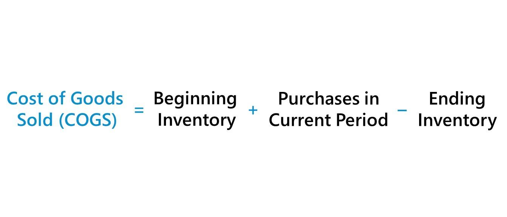

## Table of Contents

## What is Cost of Goods Sold (COGS)?

Cost of Goods Sold, often abbreviated as COGS, is the total cost a business incurs to produce or purchase the products it sells during a specific period. This includes the cost of materials and labor directly used to create the product, but it does not include indirect expenses like distribution or sales force costs. For a retailer, COGS would be the cost to purchase the products from a supplier, while for a manufacturer, it includes the cost of raw materials and the labor used in production.

Understanding COGS is important for businesses because it directly affects their profitability and helps in setting the right price for their products. By subtracting COGS from the revenue, a company can determine its gross profit, which is a key indicator of how efficiently it is producing or purchasing its goods. Keeping track of COGS also helps businesses manage their inventory and make informed decisions about production and pricing strategies.

## Why is it important to calculate COGS?

Calculating COGS is important because it helps businesses figure out how much it costs them to make or buy the things they sell. This is key because it tells them how much profit they are making from each sale. When a business knows its COGS, it can set prices that cover these costs and still make money. Without knowing COGS, a business might set prices too low and lose money, or too high and lose customers.

COGS also helps businesses keep track of their inventory. By knowing how much it costs to have products in stock, a business can decide when to buy more and how much to keep on hand. This helps them avoid running out of products or having too many that don't sell. In the end, understanding COGS makes it easier for a business to plan and manage its money wisely.

## How does COGS affect a company's profitability?

COGS directly impacts a company's profitability because it is subtracted from the company's revenue to find the gross profit. If COGS is high, the gross profit will be lower, which means the company makes less money from each sale. On the other hand, if a company can lower its COGS, it can increase its gross profit, making more money from each sale. This is why businesses always try to find ways to reduce their COGS, like buying materials cheaper or making their production process more efficient.

Understanding COGS also helps a company set the right prices for its products. If a company knows exactly how much it costs to make or buy each item, it can set a price that covers these costs and still leaves room for profit. If the price is too low, the company might not make enough money to cover its costs. If the price is too high, customers might not buy the product. So, by keeping COGS in mind, a company can find the best price to maximize its profits.

## What are the basic components included in COGS?

COGS includes the direct costs of making or buying the products a company sells. For a manufacturer, this means the cost of raw materials that go into the product and the labor needed to turn those materials into the final product. For example, if a company makes shoes, COGS would include the leather, the rubber for the soles, and the wages of the workers who sew the shoes together.

For a retailer, COGS is simpler. It's just the price they pay to buy the products they sell from a supplier. If a store sells T-shirts, COGS would be what they paid the T-shirt maker. COGS does not include indirect costs like rent for the store, advertising, or the salaries of salespeople. These costs are important but are counted separately from COGS.

## What is the difference between COGS and operating expenses?

COGS, or Cost of Goods Sold, is all about the money a business spends to make or buy the things it sells. It includes the cost of the materials and the wages of the workers who make the products. If a company makes toys, COGS would be the plastic and the pay for the people who put the toys together. For a store that sells those toys, COGS is what they paid to buy the toys from the maker. COGS is important because it helps the business figure out how much profit it makes from selling each item.

Operating expenses, on the other hand, are all the other costs a business has to pay to keep running, but they don't go into making the products. These costs include things like rent for the store or factory, salaries for people who aren't making the products, like managers or salespeople, and money spent on advertising. Operating expenses are important because they help the business keep going, but they don't directly affect how much it costs to make or buy each item. So, while COGS is about the cost of the product itself, operating expenses are about the cost of running the business.

## What are the common methods used to calculate COGS?

There are two common ways to calculate COGS: the periodic inventory method and the perpetual inventory method. In the periodic inventory method, a business counts its inventory at the beginning and end of a period, like a month or a year. It figures out COGS by taking the beginning inventory, adding any purchases made during the period, and then subtracting the ending inventory. This method is simpler but can be less accurate because it only updates inventory at certain times.

The perpetual inventory method keeps track of inventory all the time. Every time a product is bought or sold, the inventory numbers are updated right away. To calculate COGS with this method, a business adds up the cost of all the items sold during the period. This method is more accurate because it always knows exactly what's in stock, but it can be more complicated to set up and use.

Both methods can be used with different ways of figuring out which items were sold first, like FIFO (First-In, First-Out) or LIFO (Last-In, First-Out). FIFO assumes the oldest items in stock are sold first, while LIFO assumes the newest items are sold first. The choice between these can affect the COGS and, in turn, the business's profit.

## How do you calculate COGS using the specific identification method?

The specific identification method is used to calculate COGS by keeping track of the cost of each item sold. When a business sells a product, it matches the sale to the exact cost of that specific item. For example, if a jewelry store sells a necklace, it knows exactly how much that necklace cost to buy or make, and that cost is what goes into COGS.

This method is most useful for businesses that sell unique items, like cars or art, where each item has a different cost. It's very accurate because it uses the real cost of each item sold, but it can be hard to use for businesses with lots of similar items, like a store selling hundreds of the same type of shirt. For those businesses, other methods like FIFO or LIFO might be easier to use.

## What is the formula for calculating COGS using the FIFO method?

The FIFO method, or First-In, First-Out, means you assume the oldest items in your stock are the first ones you sell. To calculate COGS using FIFO, you start with the cost of the oldest items in your inventory at the beginning of the period. Then, you add the cost of any new items you bought during that time, in the order you bought them. Finally, you subtract the cost of the items you have left at the end of the period. The formula looks like this: COGS = Beginning Inventory + Purchases - Ending Inventory.

For example, if you start with 100 shirts that cost $10 each, and during the period you buy 50 more shirts at $12 each, and at the end you have 75 shirts left, here's how you'd do it. The beginning inventory is 100 shirts at $10 each, which is $1,000. You then bought 50 shirts at $12 each, adding $600 to your costs. At the end, you have 75 shirts left. Since you're using FIFO, you assume the 75 shirts left are the ones you bought last, so they cost $12 each. That's $900 in ending inventory. So, COGS would be $1,000 + $600 - $900 = $700.

## How does the LIFO method differ from FIFO in calculating COGS?

The LIFO method, or Last-In, First-Out, is different from FIFO because it assumes the newest items you bought are the first ones you sell. This means when you calculate COGS with LIFO, you use the costs of the most recent purchases first. For example, if you start with 100 shirts that cost $10 each, and then buy 50 more at $12 each, LIFO would say you sold the $12 shirts first. If you sold 75 shirts, LIFO would count 50 of them at $12 and 25 at $10, making COGS $700.

FIFO, on the other hand, assumes the oldest items are sold first. Using the same example, FIFO would say you sold the first 100 shirts at $10 each before selling any of the newer $12 shirts. So, if you sold 75 shirts, FIFO would count all 75 at $10 each, making COGS $750. The choice between LIFO and FIFO can make a big difference in how much profit you show, especially if the prices of your items are changing over time.

## What are the advantages and disadvantages of using the average cost method for COGS?

Using the average cost method for COGS can be really helpful because it's easy to understand and use. Instead of keeping track of the cost of each item, you just figure out the average cost of all the items you have. This makes things simpler, especially if you have a lot of items with different costs. It's also good for businesses where prices change a lot because it smooths out those changes over time. This way, your COGS won't jump around as much, which can make your financial reports look more stable.

But the average cost method also has some downsides. It might not be as accurate as other methods like FIFO or LIFO, which can be important if you need to know exactly how much each item costs. Also, if prices are going up or down a lot, using the average cost might not give you a clear picture of how your costs are changing. This can make it harder to make good decisions about pricing or buying more stock. So while it's easier to use, it might not always give you the best information for running your business.

## How can changes in inventory valuation methods impact COGS and financial statements?

Changing how you value your inventory can really change your COGS and your whole financial picture. If you switch from using FIFO to LIFO, for example, and prices are going up, your COGS will be higher because LIFO says you're selling the newer, more expensive items first. This means your profit will look lower, which can affect how much tax you pay and how investors see your business. On the other hand, if you switch to FIFO when prices are going up, your COGS will be lower because you're selling the older, cheaper items first, which makes your profit look higher.

These changes in COGS don't just affect your income statement; they also change your balance sheet. When COGS goes up or down, it changes the value of your ending inventory. If you use LIFO and prices are rising, your ending inventory value will be lower because it's based on the older, cheaper items. But if you use FIFO, your ending inventory will be higher because it's based on the newer, more expensive items. This can make a big difference in how your business looks on paper, which is important for getting loans or attracting investors.

## What advanced techniques can be used to optimize COGS calculations for large enterprises?

Large enterprises can use advanced techniques like activity-based costing (ABC) to get a better handle on their COGS. ABC looks at all the different activities that go into making a product, like setting up machines or inspecting the final product, and assigns costs to each one. This way, a business can see exactly where its money is going and find ways to save. For example, if setting up machines is really expensive, the company might try to do it less often or find cheaper ways to do it. Using ABC can help a big company figure out how to make their COGS lower and their profits higher.

Another technique is using sophisticated inventory management systems that track inventory in real time. These systems can use things like RFID tags or barcodes to keep a close eye on every item in stock. This helps the company know exactly what they have and what they need to buy, so they don't end up with too much or too little. By keeping inventory levels just right, a company can lower its COGS because they're not spending money on things they don't need. Plus, these systems can help with forecasting, so the company can plan better for the future and keep their COGS under control.

## What is the Understanding of Cost of Goods Sold (COGS)?

Cost of Goods Sold (COGS) signifies the direct costs incurred in the production of goods that are sold by a company. It is a crucial aspect of financial accounting as it helps businesses ascertain gross profit, a significant measure of their profitability. COGS primarily includes the cost of all materials and labor directly involved in manufacturing products. It specifically captures the expenses that are directly traceable to the production process, excluding indirect costs such as distribution, marketing, or administrative expenses.

To understand COGS, consider it as the sum of all costs that are directly linked to creating a product. These typically encompass:

1. **Material Costs**: Expenditures on raw materials or components directly used in the production of goods.
2. **Labor Costs**: Wages of employees who are directly involved in the production process, such as assembly line workers or those operating machinery.
3. **Production Overheads**: Variable costs associated with manufacturing that are tied directly to production levels, like utilities for machinery but not fixed costs like factory rental.

Calculating COGS is essential for businesses, as it directly impacts the gross profit, calculated as follows:

$$
\text{Gross Profit} = \text{Net Sales} - \text{COGS}
$$

Where $\text{Net Sales}$ refers to the total revenue from sales of goods, less any returns or discounts.

Understanding and accurately calculating COGS is vital for companies to monitor and manage their profitability. By identifying precise production costs, businesses can make informed pricing decisions, manage expenses better, and devise cost-saving strategies. Errors in COGS calculation could misrepresent a company's financial health, leading to misguided business decisions and non-compliance with financial reporting standards.

In summary, COGS serves as a fundamental indicator of a company's production efficiency and cost management capabilities, influencing business strategies and financial outcomes.

## How do you perform a detailed COGS calculation?

The calculation of Cost of Goods Sold (COGS) is a fundamental aspect of financial accounting, providing insights into the direct costs tied to product sales. The standard formula used to determine COGS is:

$$
\text{COGS} = \text{Beginning Inventory} + \text{Purchases During the Period} - \text{Ending Inventory}
$$

To illustrate the application of this formula, consider a retail store scenario. Assume the store begins with an inventory valued at $10,000. Throughout the accounting period, the store makes additional purchases amounting to $25,000. At the end of the period, the ending inventory is valued at $8,000. Substituting these figures into the formula gives:

$$
\text{COGS} = \$10,000 + \$25,000 - \$8,000 = \$27,000
$$

In this scenario, the COGS amounts to $27,000, representing the total cost directly attributable to the goods sold during the period. This calculation is crucial as it impacts the gross profit, which is determined by subtracting COGS from sales revenue. Understanding and correctly calculating COGS allows businesses to accurately assess their profitability and make informed strategic decisions.

## What are Inventory Accounting Methods?

Different inventory accounting methods significantly influence how the Cost of Goods Sold (COGS) is calculated and reported. The primary methods used by businesses are First In, First Out (FIFO), Last In, First Out (LIFO), and the Average Cost method. Each of these methods has unique characteristics that impact how inventory costs are recorded and can affect a company's financial statements in various ways.

**First In, First Out (FIFO)** assumes that the oldest inventory items are sold first. During periods of rising prices or inflation, this method typically results in lower COGS because the older, often cheaper inventory is used up first. Consequently, the ending inventory on the balance sheet will reflect more recent and usually higher costs. This can lead to a higher gross profit and net income since the expense recognized on the income statement is lower. However, this can also result in higher taxes due to the increased reported income.

**Last In, First Out (LIFO)**, on the other hand, assumes that the newest inventory items are sold first. In inflationary periods, LIFO usually results in a higher COGS because the costs of more recent, and presumably higher-cost, inventory are recognized first. This can reduce gross profit and net income, thereby potentially lowering tax liabilities. However, the ending inventory will then consist of older, possibly cheaper inventory costs, which might not accurately reflect current market conditions. In some countries, like the United States, LIFO is used for tax and financial reporting purposes, but it is not permitted under International Financial Reporting Standards (IFRS).

**Average Cost Method** calculates COGS and ending inventory by taking the weighted average of all units available for sale during the period. This method smooths out price fluctuations by averaging inventory costs. The formula for calculating the average cost is given by:

$$
\text{Average Cost per Unit} = \frac{\text{Cost of Beginning Inventory} + \text{Cost of Purchases}}{\text{Units in Beginning Inventory} + \text{Units Purchased}}
$$

This method provides a middle ground, offering a moderate effect on income statements and taxes compared to FIFO and LIFO. The average cost method can be beneficial in industries where inventory items are indistinguishable from each other, like commodities.

Each method has strategic implications for financial reporting and tax planning, necessitating careful consideration by businesses to align with financial goals and regulatory requirements. The choice of inventory accounting method can influence a company's decision-making processes, financial health, and market perception.

## What is COGS and how does it impact financial statements?

Cost of Goods Sold (COGS) plays a significant role in shaping a company's financial statements. As a direct measure of the production costs associated with goods sold, COGS is integral to calculating gross profit, a key indicator of a business's financial health. Gross profit is computed by subtracting COGS from net sales revenue, thus:

$$
\text{Gross Profit} = \text{Net Sales} - \text{COGS}
$$

The resulting gross profit not only reflects a company's core profitability before accounting for operating expenses, interest, and taxes but also serves as a benchmark for evaluating how efficiently a company manages its production costs relative to sales.

Financial statements further relay the influence of COGS on net profit and taxable income. Since net profit is derived from gross profit minus operating expenses, mismanagement of COGS can lead to inaccurately reported net profits. This, in turn, can distort a company's perceived financial performance, affecting investor confidence and strategic decision-making.

$$
\text{Net Profit} = \text{Gross Profit} - \text{Operating Expenses}
$$

Moreover, taxable income is derived from net profit, making accurate reporting of COGS essential for tax purposes. Misreporting or manipulating COGS can result in compliance issues, raising possibilities of financial penalties or legal ramifications.

Ensuring accurate and efficient management of COGS holds paramount importance for businesses aiming to optimize net profits via cost-effective production processes. Strategic approaches may involve employing cost control measures, refining inventory management practices, or leveraging technology to gain insights into cost structures and supply chain efficiencies. By accurately representing COGS, businesses not only improve internal decision-making and strategy formulation but also reinforce their credibility and adherence to financial regulations.

## References & Further Reading

[1]: ["Accounting Standards Codification (ASC) 330: Inventory"](https://viewpoint.pwc.com/dt/us/en/fasb_financial_accou/asus_fulltext/2015/asu_201511inventory_/asu_201511inventory__US/asu_201511inventory__US.html) by the Financial Accounting Standards Board (FASB)

[2]: ["International Financial Reporting Standard (IFRS) 15: Revenue from Contracts with Customers"](https://www.ifrs.org/issued-standards/list-of-standards/ifrs-15-revenue-from-contracts-with-customers/) by the International Accounting Standards Board (IASB)

[3]: ["Algorithmic Trading Strategies"](https://www.investopedia.com/articles/active-trading/101014/basics-algorithmic-trading-concepts-and-examples.asp) by Interactive Brokers

[4]: ["Financial Reporting and Analysis"](https://www.investopedia.com/terms/f/financial-analysis.asp) by Charles H. Gibson

[5]: ["Cost of Goods Sold: Expense or Cost Accounting?"](https://www.freshbooks.com/hub/accounting/cost-of-goods-sold-cogs) by Investopedia