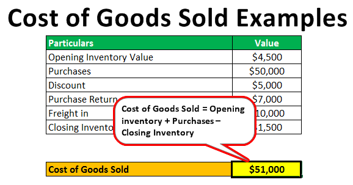

In an era driven by data and automation, understanding the intricacies of financial metrics such as Cost of Goods Sold (COGS) is crucial for businesses striving to maintain competitive advantage and financial accuracy. COGS represents the direct costs associated with the production of goods sold by a company. This article will cover the calculation of COGS, various inventory accounting methods, and their importance in business operations, including algorithmic trading. By comprehending these financial principles, enterprises can refine decision-making processes and strategic planning.

Accurate COGS calculations are vital for determining a company's gross profit, a key indicator of financial health and efficiency. This metric helps businesses identify cost-effective production strategies, streamline operations, and enhance profitability. As financial landscapes evolve, integrating traditional accounting practices with modern technologies such as algorithmic trading becomes imperative. Algorithmic trading utilizes automated systems to execute trades based on predefined criteria, often incorporating financial metrics like COGS to optimize investment strategies.



This article aims to bridge traditional accounting with technological advancements, demonstrating their relevance in today's rapidly changing financial environment. Understanding how COGS and inventory management intertwine with contemporary technological applications can empower finance professionals to drive growth, optimize costs, and achieve sustainable success in a data-driven world. By exploring this synthesis of old and new approaches, businesses can enhance their strategic insights and ensure precise forecasting and robust profitability.

## Table of Contents

## Understanding Cost of Goods Sold (COGS)

Cost of Goods Sold (COGS) signifies the direct costs incurred in the production of goods that are sold by a company. It is a crucial aspect of financial accounting as it helps businesses ascertain gross profit, a significant measure of their profitability. COGS primarily includes the cost of all materials and labor directly involved in manufacturing products. It specifically captures the expenses that are directly traceable to the production process, excluding indirect costs such as distribution, marketing, or administrative expenses.

To understand COGS, consider it as the sum of all costs that are directly linked to creating a product. These typically encompass:

1. **Material Costs**: Expenditures on raw materials or components directly used in the production of goods.
2. **Labor Costs**: Wages of employees who are directly involved in the production process, such as assembly line workers or those operating machinery.
3. **Production Overheads**: Variable costs associated with manufacturing that are tied directly to production levels, like utilities for machinery but not fixed costs like factory rental.

Calculating COGS is essential for businesses, as it directly impacts the gross profit, calculated as follows:

$$
\text{Gross Profit} = \text{Net Sales} - \text{COGS}
$$

Where $\text{Net Sales}$ refers to the total revenue from sales of goods, less any returns or discounts.

Understanding and accurately calculating COGS is vital for companies to monitor and manage their profitability. By identifying precise production costs, businesses can make informed pricing decisions, manage expenses better, and devise cost-saving strategies. Errors in COGS calculation could misrepresent a company's financial health, leading to misguided business decisions and non-compliance with financial reporting standards.

In summary, COGS serves as a fundamental indicator of a company's production efficiency and cost management capabilities, influencing business strategies and financial outcomes.

## Detailed COGS Calculation

The calculation of Cost of Goods Sold (COGS) is a fundamental aspect of financial accounting, providing insights into the direct costs tied to product sales. The standard formula used to determine COGS is:

$$
\text{COGS} = \text{Beginning Inventory} + \text{Purchases During the Period} - \text{Ending Inventory}
$$

To illustrate the application of this formula, consider a retail store scenario. Assume the store begins with an inventory valued at $10,000. Throughout the accounting period, the store makes additional purchases amounting to $25,000. At the end of the period, the ending inventory is valued at $8,000. Substituting these figures into the formula gives:

$$
\text{COGS} = \$10,000 + \$25,000 - \$8,000 = \$27,000
$$

In this scenario, the COGS amounts to $27,000, representing the total cost directly attributable to the goods sold during the period. This calculation is crucial as it impacts the gross profit, which is determined by subtracting COGS from sales revenue. Understanding and correctly calculating COGS allows businesses to accurately assess their profitability and make informed strategic decisions.

## Inventory Accounting Methods

Different inventory accounting methods significantly influence how the Cost of Goods Sold (COGS) is calculated and reported. The primary methods used by businesses are First In, First Out (FIFO), Last In, First Out (LIFO), and the Average Cost method. Each of these methods has unique characteristics that impact how inventory costs are recorded and can affect a company's financial statements in various ways.

**First In, First Out (FIFO)** assumes that the oldest inventory items are sold first. During periods of rising prices or inflation, this method typically results in lower COGS because the older, often cheaper inventory is used up first. Consequently, the ending inventory on the balance sheet will reflect more recent and usually higher costs. This can lead to a higher gross profit and net income since the expense recognized on the income statement is lower. However, this can also result in higher taxes due to the increased reported income.

**Last In, First Out (LIFO)**, on the other hand, assumes that the newest inventory items are sold first. In inflationary periods, LIFO usually results in a higher COGS because the costs of more recent, and presumably higher-cost, inventory are recognized first. This can reduce gross profit and net income, thereby potentially lowering tax liabilities. However, the ending inventory will then consist of older, possibly cheaper inventory costs, which might not accurately reflect current market conditions. In some countries, like the United States, LIFO is used for tax and financial reporting purposes, but it is not permitted under International Financial Reporting Standards (IFRS).

**Average Cost Method** calculates COGS and ending inventory by taking the weighted average of all units available for sale during the period. This method smooths out price fluctuations by averaging inventory costs. The formula for calculating the average cost is given by:

$$
\text{Average Cost per Unit} = \frac{\text{Cost of Beginning Inventory} + \text{Cost of Purchases}}{\text{Units in Beginning Inventory} + \text{Units Purchased}}
$$

This method provides a middle ground, offering a moderate effect on income statements and taxes compared to FIFO and LIFO. The average cost method can be beneficial in industries where inventory items are indistinguishable from each other, like commodities.

Each method has strategic implications for financial reporting and tax planning, necessitating careful consideration by businesses to align with financial goals and regulatory requirements. The choice of inventory accounting method can influence a company's decision-making processes, financial health, and market perception.

## COGS and Its Impact on Financial Statements

Cost of Goods Sold (COGS) plays a significant role in shaping a company's financial statements. As a direct measure of the production costs associated with goods sold, COGS is integral to calculating gross profit, a key indicator of a business's financial health. Gross profit is computed by subtracting COGS from net sales revenue, thus:

$$
\text{Gross Profit} = \text{Net Sales} - \text{COGS}
$$

The resulting gross profit not only reflects a company's core profitability before accounting for operating expenses, interest, and taxes but also serves as a benchmark for evaluating how efficiently a company manages its production costs relative to sales.

Financial statements further relay the influence of COGS on net profit and taxable income. Since net profit is derived from gross profit minus operating expenses, mismanagement of COGS can lead to inaccurately reported net profits. This, in turn, can distort a company's perceived financial performance, affecting investor confidence and strategic decision-making.

$$
\text{Net Profit} = \text{Gross Profit} - \text{Operating Expenses}
$$

Moreover, taxable income is derived from net profit, making accurate reporting of COGS essential for tax purposes. Misreporting or manipulating COGS can result in compliance issues, raising possibilities of financial penalties or legal ramifications.

Ensuring accurate and efficient management of COGS holds paramount importance for businesses aiming to optimize net profits via cost-effective production processes. Strategic approaches may involve employing cost control measures, refining inventory management practices, or leveraging technology to gain insights into cost structures and supply chain efficiencies. By accurately representing COGS, businesses not only improve internal decision-making and strategy formulation but also reinforce their credibility and adherence to financial regulations.

## Algorithmic Trading and Inventory Management

Algorithmic trading leverages complex algorithms to execute trading decisions effectively and efficiently. These algorithms are powered by financial metrics, including the Cost of Goods Sold (COGS), which provide insights into a company’s operational and financial status. Access to accurate COGS data helps traders and financial analysts draw correlations between inventory levels, production costs, and market movements. This information can be critical for designing strategies that optimize inventory turnover and align with automated trading practices.

For instance, by utilizing real-time COGS data in algorithmic models, traders can better predict stock price movements based on a company's reported production costs and inventory statuses. In turn, this enables them to anticipate potential fluctuations in the stock market, thus making more informed investment decisions.

Moreover, in inventory management, technology integration significantly augments operational efficiencies, directly impacting COGS. Automated systems and advanced analytics enable companies to streamline their supply chain processes, ensuring that inventory levels are optimized. This can be achieved through predictive analytics that forecast inventory needs, reducing instances of overstocking or stockouts, both of which can drive up costs.

Python is a popular tool for implementing these strategies. A simple example of using Python for inventory optimization might involve the use of libraries such as Pandas for data manipulation and SciPy for optimization processes. Below is a sample Python snippet illustrating a basic approach to inventory management optimization:

```python
import pandas as pd
from scipy.optimize import minimize

# Sample data for inventory and COGS
data = {
    'inventory_level': [100, 150, 120],
    'cogs': [1000, 1500, 1100],
}

df = pd.DataFrame(data)

# Objective function to minimize COGS
def objective(x):
    return sum((df['cogs'] * x) / df['inventory_level'])

# Constraints and bounds
cons = ({'type': 'ineq', 'fun': lambda x: x - 0.01})  # Inventory levels must be above 0
bounds = [(0, 1)] * len(df)

result = minimize(objective, [0.5]*len(df), method='SLSQP', bounds=bounds, constraints=cons)

print("Optimized inventory allocation:", result.x)
```

This example demonstrates how algorithmic optimization can influence inventory management and COGS: by adjusting inventory allocation to minimize costs while maintaining sufficient stock levels. As a result, adopting such technological solutions in financial operations not only enhances efficiency but also positions businesses better within the competitive markets.

## Conclusion

Mastering COGS calculations and inventory accounting is essential for thriving in today’s financial landscape. These metrics are integral to a business's ability to understand and control costs, predict future financial performance, and ensure operational efficiency. Accurate COGS calculations allow businesses to determine gross profit and evaluate cost structures, enabling informed decision-making that enhances profitability and competitiveness.

Integrating traditional financial metrics such as COGS with [algorithmic trading](/wiki/algorithmic-trading) and automation can significantly elevate business strategy. Algorithmic trading leverages historical financial data, including COGS, to automate and optimize trading decisions, leading to better market predictions and timely investment actions. This integration aids in refining inventory management strategies, improving turnover rates, and reducing carrying costs, thereby promoting a more agile and responsive supply chain.

By synthesizing conventional accounting practices with technological advancements, businesses are empowered to optimize costs more effectively. They can forecast financial outcomes with greater accuracy, aligning production and distribution efforts with market demand. This fusion of methodologies ensures that businesses can not only maintain compliance and transparency in financial reporting but also strategically maneuver through the complexities of modern financial markets, ultimately maximizing profitability.

## References & Further Reading

[1]: ["Accounting Standards Codification (ASC) 330: Inventory"](https://viewpoint.pwc.com/dt/us/en/fasb_financial_accou/asus_fulltext/2015/asu_201511inventory_/asu_201511inventory__US/asu_201511inventory__US.html) by the Financial Accounting Standards Board (FASB)

[2]: ["International Financial Reporting Standard (IFRS) 15: Revenue from Contracts with Customers"](https://www.ifrs.org/issued-standards/list-of-standards/ifrs-15-revenue-from-contracts-with-customers/) by the International Accounting Standards Board (IASB)

[3]: ["Algorithmic Trading Strategies"](https://www.investopedia.com/articles/active-trading/101014/basics-algorithmic-trading-concepts-and-examples.asp) by Interactive Brokers

[4]: ["Financial Reporting and Analysis"](https://www.investopedia.com/terms/f/financial-analysis.asp) by Charles H. Gibson

[5]: ["Cost of Goods Sold: Expense or Cost Accounting?"](https://www.freshbooks.com/hub/accounting/cost-of-goods-sold-cogs) by Investopedia