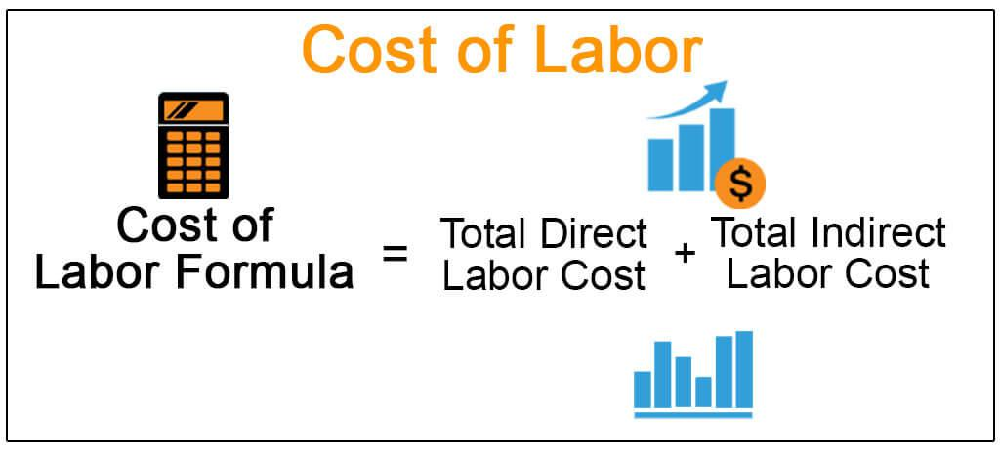

In the modern financial landscape, algorithmic trading, also known as algo trading, has emerged as a formidable force, significantly influencing market transactions and reshaping the structure of employment expenses. This automated trading strategy employs complex algorithms and mathematical models to execute trades at speeds and frequencies that are impossible for human traders. The prevalence of algorithmic trading has not only transformed trading operations but has also necessitated a keen understanding of wages and salaries within this specialized context.

In algorithmic trading, labor costs have become a crucial element for firms striving to maintain a competitive edge. Businesses must strike a balance between attracting top-tier talent proficient in both financial and technological skills and managing compensation expenditures effectively. The rapid evolution of technology and market demands have required firms to reassess compensation structures continually, making this an intricate and dynamic challenge for employers.

Algorithmic trading firms are now tasked with aligning compensation structures with the high-paced nature of the trading environment. This involves creating strategies that motivate and retain a specialized workforce while ensuring that labor costs do not impede profitability. Understanding these nuances is vital for both employers and employees as they navigate the complexities of employment in this area.

This article aims to analyze the intersection of labor costs and algorithmic trading, exploring how firms manage these expenses. By addressing the challenges and opportunities that arise from aligning compensation structures with the technological and market dynamics, stakeholders can better adapt to the shifts in the financial industry and remain viable in this competitive arena.

## Table of Contents

## Understanding Labor Costs in Algorithmic Trading

Labor costs are a critical component of the operational expenses incurred by algorithmic trading firms. These costs are divided into direct and indirect expenses. Direct costs primarily include the salaries and bonuses of traders, who play a pivotal role in designing and executing trading strategies. These individuals require a deep understanding of financial markets, quantitative analysis, and programming skills, leading firms to offer competitive compensation packages to attract and retain top talent.

Indirect costs encompass the wages of administrative and support staff, who ensure the smooth operation of the firm's daily activities. This category may also include costs associated with compliance, risk management, and IT support personnel, all essential to maintaining the firm's regulatory compliance and infrastructure integrity.

Efficient management of labor costs is essential for maintaining profitability and gaining a competitive edge in a market characterized by rapid execution and narrow margins. This requires a strategic approach to compensation, combining fixed salaries with performance-based incentives to align employee objectives with organizational goals.

In addition, firms strive to optimize their workforce structure by investing in technology that can automate repetitive tasks, thereby reallocating human resources towards higher-value activities. This not only reduces labor costs but also enhances productivity, allowing firms to maximize their operational efficiency. Maintaining flexibility in labor cost management, through practices like hiring contractors or implementing flexible work arrangements, can further support a firm's financial sustainability amid varying market conditions.

## Wage Structure for Hourly Employees

Hourly employees in [algorithmic trading](/wiki/algorithmic-trading) firms are subject to compensation structures that are notably influenced by fluctuating market demands and variations in trading volumes. This variability necessitates remuneration models that not only accommodate these fluctuations but also effectively attract and retain skilled personnel proficient in high-tech, data-intensive trading environments.

Dynamic compensation models are essential for meeting these requirements. These models typically incorporate mechanisms for adjusting wages and salaries in response to changes in trading activity. For instance, firms might implement algorithms to determine variable pay components based on specific performance metrics, underpinning a more adaptive wage structure. By aligning remuneration with individual and firm performance, such structures incentivize productivity and adaptability among employees.

Performance-based bonuses are a critical component of this strategy. These bonuses are typically calculated based on quantitative performance indicators, such as the [volume](/wiki/volume-trading-strategy) of trades executed or the profitability of trading strategies employed by the employee. This approach ensures that financial rewards directly correlate with contributions to the firm's success, fostering a mutually beneficial relationship between employer and employee.

In addition to financial incentives, offering flexible working conditions is another strategy employed to align employee objectives with corporate goals. Flexibility in work hours or the option for remote work can increase job satisfaction and productivity, making firms more attractive to potential employees who value work-life balance.

To support and maintain these dynamic and flexible compensation structures, firms often utilize technology to track performance and manage compensation in real-time. The capacity to adapt salaries and bonuses promptly, according to performance data, not only enhances operational efficiency but also helps maintain competitiveness in attracting top-tier talent.

In summary, the compensation strategy for hourly employees in algorithmic trading hinges on implementing adaptable, performance-driven compensation models, supplemented by strategies that promote work-life flexibility. These approaches not only motivate employees through direct economic incentives but also ensure the alignment of individual performance with the broader goals of the firm, thereby fostering a productive and balanced workplace.

## The Role of Technological Advancements

Algorithmic trading integrates advanced technologies, necessitating a workforce adept in both finance and technology. These technological innovations significantly influence wage structures within the industry, as firms increasingly need to offer competitive salaries to attract personnel capable of navigating this complex field. The intersection of technology and finance demands expertise in quantitative analysis, programming, and system management, resulting in high demand for skilled professionals. This competition for talent drives up salary offerings, particularly for those with specialized skill sets in [machine learning](/wiki/machine-learning) and data analytics, crucial for developing and maintaining trading algorithms.

Moreover, the financial industry invests heavily in technology to automate repetitive tasks, streamlining labor costs. Automation typically involves the development of sophisticated algorithms that execute trades at speeds and frequencies not possible for human traders. By implementing such technologies, firms can reduce reliance on human intervention for routine tasks, reallocating resources to more strategic areas. This shift allows firms to focus on hiring individuals who can further innovate and improve algorithmic processes, thereby enhancing overall operational efficiency.

Technological advancements in algorithmic trading also pave the way for the integration of [artificial intelligence](/wiki/ai-artificial-intelligence) (AI) and machine learning techniques. These methodologies enable more refined analysis of market trends and the prediction of asset price movements, offering a competitive edge. As such, salaries for roles involving AI and machine learning continue to increase as firms vie to secure employees with these competencies. 

Investments in technology not only transform labor dynamics within firms but also provide a fertile ground for operational improvements. This scenario emerges from the dual role of technology in both augmenting human capabilities in decision-making and minimizing unnecessary labor costs. As a result, firms can maintain financial sustainability while achieving a higher degree of precision and efficiency in trading operations.

## Challenges and Opportunities in Labor Cost Management

Algorithmic trading reflects the profound impact of technology on the financial markets, reshaping not only the way trades are executed but also affecting the management of labor costs. The landscape is marked by both challenges and significant opportunities for cost management.

One of the primary challenges lies in the necessity for ongoing investment in new technologies and the recruitment of skilled personnel. Algorithmic trading relies heavily on cutting-edge technology, from hardware infrastructure to software systems capable of processing vast amounts of data at high speeds. This demand for continuous technological advancement requires financial commitment from firms, which often needs to be balanced with labor costs.

Hiring personnel with the dual competencies in finance and technology is another critical issue. The unique skill set necessary for developing and managing algorithmic trading systems makes professionals in this field highly sought after. Consequently, firms face pressure to offer attractive compensation packages to recruit and retain this talent, impacting overall labor costs significantly.

However, technological advancements also present opportunities to manage labor costs more effectively. The integration of artificial intelligence (AI) and machine learning into trading algorithms can drastically enhance operational efficiencies. These technologies automate complex processes, streamline operations, and reduce the reliance on extensive human intervention, thus lowering overhead costs.

For example, algorithmic systems can be designed to automatically adjust trading strategies based on real-time data analysis, reducing the need for manual oversight. The deployment of AI-driven analytics can lead to better prediction models that optimize trading decisions, ultimately contributing to cost savings and enhanced profitability.

Moreover, regulatory compliance remains an essential aspect of labor cost management. Financial markets are governed by stringent regulations which require firms to enforce compliance measures consistently. This entails additional costs for training, audits, and the implementation of compliance systems. Organizations must adeptly balance these obligations with maintaining competitive compensation strategies to ensure they attract top talent while adhering to regulatory requirements.

In conclusion, while algorithmic trading demands considerable investment in technology and skilled labor, opportunities exist to transform these challenges into advantages. Through strategic deployment of AI and machine learning, firms can achieve greater efficiency, reduce costs, and enhance their competitiveness, all while meeting regulatory mandates and maintaining financial sustainability.

## Conclusion

The integration of algorithmic trading into financial markets necessitates a reevaluation of traditional compensation structures. Companies in this sector must adopt new strategies that align wages and salaries with technological advancements and shifting market dynamics. A strategic approach involves optimizing compensation models to ensure they reflect the skill demand and supply shifts introduced by technology, and address the resulting labor cost variations.

To remain competitive, firms need to carefully manage and potentially redesign compensation packages. This might include incorporating performance-based incentives, adjusting salary scales to attract tech-savvy and financially knowledgeable employees, and allowing for flexibility in work arrangements. Such strategies not only help in attracting top talent but also ensure that employee goals are aligned with overall corporate objectives, fostering a motivated workforce.

Additionally, leveraging technological solutions such as AI and machine learning can significantly enhance operational efficiency, thereby allowing firms to streamline labor costs. By automating repetitive tasks, organizations can redirect financial resources to areas that require human expertise, ultimately fostering innovation and growth.

In conclusion, by addressing these challenges and seizing the opportunities presented by the ongoing evolution of technology, firms involved in algorithmic trading can align their compensation structures with current needs. This not only aids in maintaining a productive and motivated workforce but also ensures financial sustainability and competitiveness in the rapidly evolving market landscape.

## References & Further Reading

[1]: Bergstra, J., Bardenet, R., Bengio, Y., & Kégl, B. (2011). ["Algorithms for Hyper-Parameter Optimization."](https://dl.acm.org/doi/10.5555/2986459.2986743) Advances in Neural Information Processing Systems 24.

[2]: ["Advances in Financial Machine Learning"](https://www.amazon.com/Advances-Financial-Machine-Learning-Marcos/dp/1119482089) by Marcos Lopez de Prado

[3]: ["Evidence-Based Technical Analysis: Applying the Scientific Method and Statistical Inference to Trading Signals"](https://www.amazon.com/Evidence-Based-Technical-Analysis-Scientific-Statistical/dp/0470008741) by David Aronson

[4]: ["Machine Learning for Algorithmic Trading"](https://github.com/stefan-jansen/machine-learning-for-trading) by Stefan Jansen

[5]: ["Quantitative Trading: How to Build Your Own Algorithmic Trading Business"](https://www.amazon.com/Quantitative-Trading-Build-Algorithmic-Business/dp/1119800064) by Ernest P. Chan