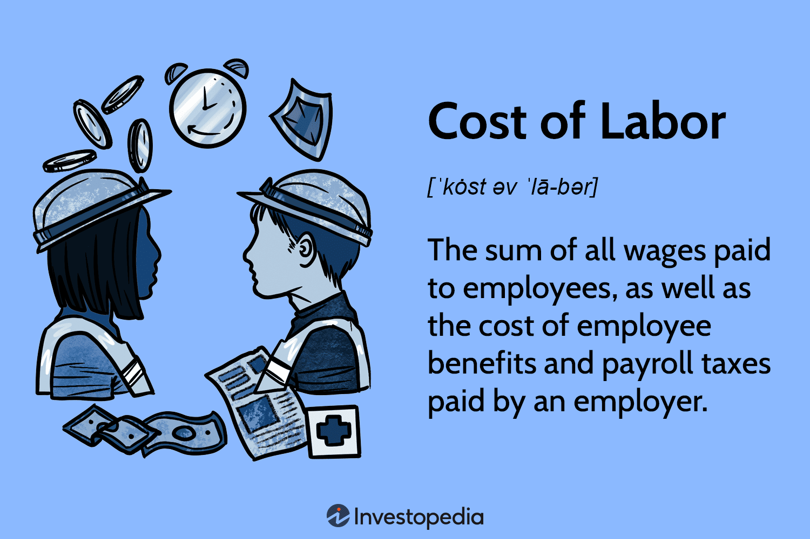

## Table of Contents

## What is the definition of labor cost?

Labor cost is the total amount of money a business spends on paying its workers. This includes wages, salaries, and any other payments made to employees for the work they do. It also covers costs like overtime pay, bonuses, and benefits such as health insurance and retirement plans.

Understanding labor cost is important for businesses because it helps them manage their budgets and plan for the future. If labor costs are too high, a business might need to find ways to reduce them, like hiring fewer workers or cutting back on overtime. On the other hand, if labor costs are too low, it might mean the business is not paying its workers fairly, which can lead to problems like high turnover and low morale.

## How is labor cost calculated?

Labor cost is calculated by adding up all the money a business spends on its workers. This includes the basic pay, like hourly wages or monthly salaries, that employees receive for their work. It also includes extra payments like overtime, bonuses, and commissions. If a business pays its workers $10 per hour and an employee works 40 hours a week, the weekly labor cost for that employee would be $400.

In addition to direct payments, labor cost also includes the cost of benefits that employees receive. These can be things like health insurance, retirement plans, paid time off, and other perks. To figure out the total labor cost, a business needs to add the cost of these benefits to the direct payments. For example, if the cost of benefits for an employee is $100 per week, the total weekly labor cost for that employee would be $500 ($400 in wages plus $100 in benefits).

Calculating labor cost helps a business understand how much it spends on its workforce. This information is important for budgeting and planning. By keeping track of labor costs, a business can make sure it is paying its workers fairly while also staying within its financial limits.

## What are the different components of labor cost?

Labor cost includes all the money a business spends on its workers. The main part of labor cost is the wages or salaries that employees earn for their work. This can be hourly pay, like $15 per hour, or a monthly salary, like $3,000 per month. Businesses also pay extra money for things like overtime, when employees work more than their usual hours, and bonuses, which are rewards for good work or meeting goals. If an employee gets a commission for selling products, that also adds to the labor cost.

Another big part of labor cost is the benefits that employees receive. These benefits can include health insurance, which helps pay for doctor visits and medicine, and retirement plans, which help workers save money for when they stop working. Other benefits might be paid time off, like vacation days or sick days, and other perks like gym memberships or free meals. When you add up all these benefits, along with the wages and extra payments, you get the total labor cost for a business.

## How do labor costs vary across different industries?

Labor costs can be very different from one industry to another. Some industries, like fast food or retail, often pay their workers less than other industries. This is because these jobs usually don't need special skills or training. But even in these industries, labor costs can go up if the business is in a place where it's hard to find workers or if they have to pay more to keep good employees.

In other industries, like tech or finance, labor costs are usually higher. These jobs often need people with special skills or a lot of education. Because of this, companies in these industries have to pay more to attract and keep the right workers. They might also offer better benefits, like health insurance or retirement plans, which add to the labor costs. So, the type of industry a business is in can make a big difference in how much it spends on labor.

## What is the impact of minimum wage on labor costs?

Minimum wage is the lowest amount of money that workers can be paid for their work. When the minimum wage goes up, it can make labor costs go up too. This is because businesses have to pay their workers more money, even if they were already paying more than the old minimum wage. If a business has a lot of workers who were paid close to the old minimum wage, the increase can make a big difference in how much they spend on labor.

But, raising the minimum wage doesn't always mean higher labor costs for every business. Some businesses might already pay their workers more than the new minimum wage, so the change doesn't affect them as much. Also, if the economy is doing well and there are a lot of jobs, businesses might have to pay more to keep their workers anyway. So, while minimum wage can push labor costs up, other things like the economy and how much businesses pay their workers can also play a big role.

## How do labor laws affect labor costs?

Labor laws are rules that businesses have to follow about how they treat their workers. These laws can change how much businesses have to pay their workers, which affects labor costs. For example, if a law says that workers have to get paid more for working extra hours, businesses will have to spend more money on overtime pay. Also, if there are laws about giving workers breaks or time off, businesses might need to hire more people to cover those times, which can make labor costs go up.

Another way labor laws can affect labor costs is by making businesses pay for things like health insurance or retirement plans. If a law says that businesses have to give these benefits to their workers, it adds to the total amount of money they spend on labor. But, not all labor laws make labor costs go up. Some laws might help businesses save money by making it easier to hire temporary workers or by setting rules about how much they have to pay workers who are just starting out. So, labor laws can change labor costs in different ways, depending on what the laws say.

## What strategies can businesses use to manage labor costs effectively?

Businesses can manage labor costs effectively by looking at how they schedule their workers. If they can plan the right number of workers for busy and slow times, they can save money. For example, a restaurant might need more workers during dinner time but fewer during the afternoon. By matching the number of workers to the amount of work, businesses can avoid paying for workers who aren't needed. Another way to manage labor costs is by training workers to do different jobs. This way, if someone is sick or leaves, other workers can fill in without the business having to hire more people.

Another strategy is to keep an eye on overtime costs. If workers are working a lot of extra hours, it can make labor costs go up quickly. Businesses can try to spread the work out more evenly so fewer people need to work overtime. They can also look at their benefits, like health insurance or retirement plans, and see if they can find cheaper options that still take care of their workers. By keeping labor costs under control, businesses can make sure they have enough money to pay their workers well and stay healthy financially.

## How do labor costs influence pricing strategies?

Labor costs are a big part of what businesses spend money on. When labor costs go up, businesses might need to charge more for their products or services to cover the extra money they're spending. For example, if a restaurant has to pay its cooks and servers more, it might raise the prices on the menu to make up for it. This means that when labor costs change, businesses have to think about how much they charge customers to stay profitable.

But, it's not always easy for businesses to raise prices when labor costs go up. If they raise prices too much, customers might go to other businesses that charge less. So, businesses have to find a balance. They might look for other ways to save money, like using cheaper ingredients or finding ways to work more efficiently. By managing labor costs carefully, businesses can keep their prices fair for customers while still making enough money to pay their workers well.

## What are the global differences in labor costs and how do they affect international business?

Labor costs are different all around the world. In some countries, like the United States or Germany, workers get paid a lot of money. This is because these countries have strong economies and good labor laws that make sure workers get paid well. But in other countries, like Bangladesh or Vietnam, workers might get paid less. This is because these countries have lower living costs and different labor laws. When businesses look at where to set up their factories or offices, they think about these labor costs. They might choose to go to a country where labor costs are lower to save money.

These differences in labor costs can affect international business in big ways. For example, a company might decide to make their products in a country where labor is cheaper and then sell those products in a country where people can pay more for them. This can help the company make more money. But it can also cause problems. If a company moves jobs to another country to save money, it might make people in their home country upset because they lose their jobs. Also, if workers in a country with low labor costs are not treated fairly, it can make customers in other countries not want to buy from that company. So, businesses have to think carefully about how they handle labor costs around the world.

## How can automation and technology impact labor costs?

Automation and technology can change labor costs in big ways. When businesses use machines or computers to do work that people used to do, they can save money on labor costs. For example, a factory might use robots to make things instead of hiring more workers. This can make the cost of making each product go down because the business doesn't have to pay as many workers. Also, machines don't need breaks or time off, so they can work all the time, which can help businesses make more things without paying more money.

But automation and technology can also make labor costs go up in some ways. When businesses start using new technology, they might need to hire workers who know how to use it. These workers might need special skills or training, which can cost more money. Also, if a business uses automation to make things faster, it might need to pay its workers more to keep up with the new pace of work. So, while automation can help businesses save money on labor costs in the long run, it can also make those costs go up at first.

## What are the long-term trends in labor costs and their economic implications?

Over the long term, labor costs have been going up in many countries. This is because people are getting more education and skills, which means businesses have to pay them more to get them to work. Also, as countries get richer, the cost of living goes up, so workers need more money to live comfortably. Another reason labor costs are going up is because of new laws that make sure workers get paid fairly and get good benefits. All these things make labor costs higher over time.

These rising labor costs have big effects on the economy. When labor costs go up, businesses might have to charge more for their products or services to make enough money. This can make things more expensive for everyone, which can lead to inflation. But higher labor costs can also be good for the economy. When workers get paid more, they have more money to spend on things like houses, cars, and vacations. This can make the economy grow because people are buying more stuff. So, while rising labor costs can be hard for businesses, they can also help make the economy stronger in the long run.

## How do labor unions negotiate labor costs and what impact do they have on businesses?

Labor unions are groups of workers who come together to talk to their bosses about things like pay and benefits. When they want to change labor costs, they sit down with the business and negotiate. They might ask for higher wages, better health insurance, or more time off. The union and the business talk back and forth until they agree on something. If they can't agree, the union might go on strike, which means the workers stop working until the business gives them what they want.

These negotiations can have a big impact on businesses. If the union gets a good deal, the business might have to pay more money to its workers. This can make labor costs go up, which might mean the business has to charge more for its products or find other ways to save money. But having a union can also be good for a business. When workers are happy with their pay and benefits, they might work harder and stay with the company longer. This can make the business run better and save money in the long run.

## References & Further Reading

[1]: Bergstra, J., Bardenet, R., Bengio, Y., & Kégl, B. (2011). ["Algorithms for Hyper-Parameter Optimization."](https://dl.acm.org/doi/10.5555/2986459.2986743) Advances in Neural Information Processing Systems 24.

[2]: ["Advances in Financial Machine Learning"](https://www.amazon.com/Advances-Financial-Machine-Learning-Marcos/dp/1119482089) by Marcos Lopez de Prado

[3]: ["Evidence-Based Technical Analysis: Applying the Scientific Method and Statistical Inference to Trading Signals"](https://www.amazon.com/Evidence-Based-Technical-Analysis-Scientific-Statistical/dp/0470008741) by David Aronson

[4]: ["Machine Learning for Algorithmic Trading"](https://github.com/stefan-jansen/machine-learning-for-trading) by Stefan Jansen

[5]: ["Quantitative Trading: How to Build Your Own Algorithmic Trading Business"](https://www.amazon.com/Quantitative-Trading-Build-Algorithmic-Business/dp/1119800064) by Ernest P. Chan