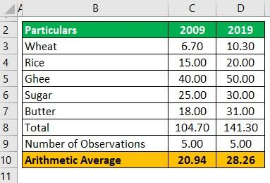

The cost of living index stands as a fundamental economic metric, crucial for both individuals and businesses in assessing the affordability and standard of living. This index quantifies the necessary expenses to sustain a specific lifestyle, thereby significantly influencing decisions related to budgeting, relocation, and compensation packaging. Economists and policymakers utilize it as a vital tool to gauge inflation and make informed adjustments to economic policies.

Simultaneously, algorithmic trading, also known as algo trading, has become closely interwoven with various economic indexes, including the cost of living index. These trading algorithms use computational algorithms to automatically execute trades upon meeting predefined criteria. As economic indices fluctuate, they inevitably impact market trends, which these trading systems swiftly monitor and react to. This interconnection not only enhances market efficiency but also introduces complexities such as potential volatility spikes following major economic announcements.



This article takes a closer look at the development and utility of the cost of living index, alongside its interplay with algorithmic trading. By understanding these components, individuals can refine their personal finance strategies, while investors and businesses can adapt their approaches to align with economic shifts. Through this exploration, readers will gain insights that enable them to navigate the intricacies of modern finance and economic frameworks more effectively.

## Table of Contents

## What is the Cost of Living Index?

The cost of living index is a statistical measure utilized to compare the relative price level of a consistent basket of goods and services needed for sustaining a specific standard of living across different geographic regions or time periods. It serves as a significant tool for evaluating how living expenses vary from one area to another. 

The primary components considered in the calculation of the cost of living index encompass essential consumer needs such as housing, which includes rent or mortgage payments, maintenance costs, and property taxes. Food costs are also integral, accounting for various types of dietary needs and consumption habits. Healthcare expenses involve out-of-pocket payments, insurance premiums, and costs associated with medical services and prescription drugs. Transportation is evaluated based on public transport costs, vehicle maintenance, fuel prices, and other related expenses. Education expenses, which may include tuition fees, books, and other educational materials, are also considered.

Economists and policymakers utilize the cost of living index as a critical indicator to assess inflation rates and its impact on purchasing power. By analyzing this index, they can make informed decisions regarding economic policies, such as adjusting interest rates, implementing subsidies, or modifying tax structures. The index also plays a considerable role in providing insights for social policies aimed at improving living standards and equitably distributing resources.

For businesses, the cost of living index is a pivotal reference when establishing salary structures, planning employee relocation packages, and setting market prices for products and services. Companies often adjust their compensation strategies based on the cost of living in different locations to ensure competitive and fair wages, which is crucial for attracting and retaining talent. Additionally, evaluating the index assists in determining the feasibility of entering new markets or expanding operations.

The cost of living index thus holds substantial importance in both economic understanding and practical applications across various sectors. By offering a comparative framework, it influences financial planning, strategic decision-making, and policy formulation aimed at enhancing economic stability and quality of life.

## How Algorithmic Trading Interacts with Economic Measurements

Algorithmic trading has revolutionized financial markets by utilizing computer algorithms to automatically execute trades based on predefined criteria. These systems rely heavily on data inputs, such as economic measurements, to make informed trading decisions. Economic indexes, including the cost of living index, play a significant role in shaping market trends. Algorithmic trading systems are designed to monitor these indexes and react swiftly to any changes.

A key feature of [algorithmic trading](/wiki/algorithmic-trading) is its ability to capitalize on the rapid fluctuations driven by economic announcements or changes in economic measurements. When new data is released, such as an updated cost of living index, it can cause immediate impacts on market sentiment and asset prices. Algorithmic trading systems use this data to make fast-paced decisions that can enhance market efficiency by providing [liquidity](/wiki/liquidity-risk-premium) and reducing transaction costs.

However, this rapid response nature of algorithmic trading also introduces challenges. One such challenge is increased market [volatility](/wiki/volatility-trading-strategies) during significant data releases. When many trading systems respond simultaneously to new economic data, it can lead to excessive price changes and heightened market volatility. This is particularly evident during major economic announcements, where the [volume](/wiki/volume-trading-strategy) of trades can spike dramatically.

Understanding the interaction between algorithmic trading and economic measurements is crucial for traders, investors, and policymakers. It helps them navigate the complexities of modern financial markets and make informed decisions. Investors need to be aware of how algorithmic trading algorithms interpret economic data and how that can affect asset prices. Similarly, policymakers should consider how the release of economic measurements might impact market stability due to algorithmic trading activities.

Ultimately, while algorithmic trading can enhance market efficiency, its interaction with economic measurements needs careful consideration to mitigate potential risks. Balancing the benefits of automated trading with the stability of financial markets remains a key focus for all involved in the trading ecosystem.

## Significance of the Cost of Living Index for Individuals and Investors

The cost of living index is an essential tool for both individuals and investors, providing critical insights into economic conditions and influencing decision-making processes across various domains.

For individuals, the cost of living index plays a vital role in budgeting and financial planning. It offers a comparative perspective on living expenses across different geographic locations, aiding individuals in deciding where to live or work. By evaluating housing, transportation, education, and healthcare costs, individuals can make informed choices that align with their financial circumstances and lifestyle preferences. This index serves as a benchmark for personal budgets, helping people allocate resources more effectively and prepare for possible inflationary pressures.

Investors and analysts, on the other hand, employ the cost of living index to gain insights into consumer spending trends, a significant component of economic growth. By analyzing shifts in the index, investors can identify changes in consumer purchasing power and adjust their investment portfolios accordingly. A rising cost of living index often indicates inflationary trends, prompting investors to reallocate assets toward inflation-protected instruments such as Treasury Inflation-Protected Securities (TIPS) or sectors less affected by inflation, like consumer staples or healthcare.

Understanding these economic dynamics is pivotal for aligning investment strategies with economic cycles. Investors can leverage the cost of living index to predict periods of economic expansion or contraction, adjusting their portfolios to optimize returns or minimize risks. For example, during anticipated inflation, investors may increase exposure to commodities or real estate, which historically perform well during such periods.

The index also directly influences government and corporate policies, particularly concerning wage increases and pension adjustments. Public and private sector entities often adjust compensation based on fluctuations in the cost of living index to maintain employees' purchasing power and manage living standard expectations. This linkage ensures that wages and pensions reflect real economic conditions, preserving economic stability and workforce motivation.

In conclusion, the cost of living index is a pivotal economic measurement, indispensable for individuals making personal and work-related decisions and investors strategizing their investment approaches. It serves as a guide through the complexities of economic fluctuations, enabling proactive financial planning and investment that respond to evolving market conditions.

## Challenges and Criticisms of Cost of Living Index and Algo Trading

The cost of living index serves as a crucial metric for understanding and comparing economic conditions across different regions and time periods. However, this index has certain limitations that merit attention. One primary limitation is its inability to capture individual consumption preferences. The index typically reflects average expenses, which might not accurately represent the diverse spending habits of individuals within various economic demographics. For instance, personal choices in lifestyle, dietary preferences, and healthcare consumption can significantly differ, leading to a disparity between the index and actual living costs faced by individuals.

Additionally, regional cost discrepancies pose another challenge. The cost of living can vary substantially between urban and rural areas, influencing the accuracy of the index when used for comparisons without considering geographical nuances. These variations can result in misleading conclusions about the relative standard of living across different locations.

Algorithmic trading, a technology-driven approach to trading financial instruments, also faces scrutiny despite its efficiency and growing prevalence. While it offers the advantage of executing trades at high speed and with precision, algorithmic trading raises concerns about market stability. It can exacerbate situations like flash crashes, where markets experience extreme volatility in a very short period. The Flash Crash of May 6, 2010, is a notable example, when the Dow Jones Industrial Average dropped by about 1,000 points in mere minutes before rapidly recovering.

Critics of algorithmic trading highlight the risk of sidelining human judgment. Algorithms are designed to follow predefined criteria, which might overlook nuanced market signals and the broader economic context that human traders might consider. This reliance on automated systems can lead to significant financial impacts if algorithms are improperly calibrated. Faulty algorithms have, on occasion, caused substantial losses to firms and individuals, demonstrating the critical importance of accurate and flexible algorithm design.

Ongoing advancements in both fields—economic measurement through the cost of living index and technology-driven considerations in algorithmic trading—aim to address these challenges. For the cost of living index, incorporating more granular data and adopting sophisticated statistical models could improve its accuracy and relevance. In algorithmic trading, the integration of [artificial intelligence](/wiki/ai-artificial-intelligence) and [machine learning](/wiki/machine-learning) may enhance adaptability and decision-making, minimizing the risk of adverse market impacts.

Ensuring stability and reliability in these areas requires continuous refinement and oversight. As technological advancements continue to reshape these domains, they must evolve with a focus on precision, personalization, and the inclusion of human expertise where necessary.

## The Future of Economic Measurement and Trading Technologies

Technological advancements are significantly transforming the methodologies used to calculate the cost of living indexes, aiming for greater accuracy and timeliness. Historically, these indexes relied on comprehensive surveys and data aggregation, which were time-consuming and prone to lags. Modern innovations are now pivoting towards the use of big data and real-time analytics to refine these processes. By harnessing extensive datasets, including transaction data and online pricing, contemporary models can provide more dynamic and responsive representations of cost variations. This shift enables policymakers and businesses to react more swiftly to economic changes.

Machine learning (ML) and artificial intelligence (AI) are playing increasingly vital roles in refining algorithmic trading strategies. These technologies facilitate the development of sophisticated algorithms that adapt to new information faster than ever before. Traditional algorithmic models tend to follow preset rules, but AI-driven models can learn and evolve from market interactions, leading to improved prediction accuracy and the ability to identify complex patterns hidden within vast datasets. For instance, [reinforcement learning](/wiki/reinforcement-learning), a subset of ML, can be used to optimize trading strategies by simulating market conditions and tweaking decision-making processes based on historical successes and failures.

```python
# Simplified example of a reinforcement learning structure using Python pseudocode
import numpy as np

# Define market environment
class MarketEnvironment:
    def __init__(self):
        self.state = self.initial_state()

    def initial_state(self):
        # Initialize with a random financial state
        return np.random.random(10)

    def step(self, action):
        # Apply action and return new state and reward
        new_state = self.state + action * np.random.normal(size=10)
        reward = np.sum(new_state)  # Simplified reward structure
        return new_state, reward

# Define reinforcement learning agent
class TradingAgent:
    def __init__(self):
        self.q_table = np.zeros((10, 10))

    def choose_action(self, state):
        # Epsilon-greedy action selection
        if np.random.random() > 0.1:
            return np.argmax(self.q_table[state])
        else:
            return np.random.choice(range(10))

    def update_q_table(self, state, action, reward, next_state):
        # Simplified Q-learning formula
        self.q_table[state, action] = reward + 0.9 * np.max(self.q_table[next_state])

# Simulated trading run
env = MarketEnvironment()
agent = TradingAgent()

state = env.initial_state()
for _ in range(1000):  # Simulating 1000 iterations
    action = agent.choose_action(state)
    next_state, reward = env.step(action)
    agent.update_q_table(state, action, reward, next_state)
    state = next_state
```

The integration of real-time data analytics is poised to revolutionize how economic indicators influence financial markets. By enabling instant access to updated economic information, traders and analysts can make more informed decisions, enhancing market efficiency and liquidity. As financial data becomes increasingly digitized, the capabilities for instantaneous analysis are expanding, reducing the latency between data publication and market response.

To address the rapid proliferation of algorithmic trading and its complexities, regulatory frameworks are evolving to ensure ethical practices and mitigate risks such as market manipulation and flash crashes. Regulators are increasingly focused on implementing safeguards and requiring transparency in algorithmic strategies. This includes stress testing algorithms under various market scenarios and enforcing robust risk management practices.

Consumers and investors will likely find themselves beneficiaries of these technological innovations, which offer more personalized financial solutions and investment strategies. Tailored financial advice powered by AI can yield improved portfolio management, adjusting strategically to individual goals and risk appetites in light of current economic conditions. As these technologies advance, financial markets become more accessible, empowering a broader spectrum of participants to achieve their economic objectives.

## Conclusion

The cost of living index and algorithmic trading represent pivotal components within the modern economic framework. Their interconnectedness plays a profound role in shaping personal finance, guiding investment decisions, and influencing economic trends. With continued advancements in both domains, we can anticipate significant transformations in financial markets and everyday life. 

Algorithmic trading, driven by sophisticated algorithms and real-time data analysis, functionally reacts to shifts in economic indicators, including the cost of living index. This interaction yields an agile trading environment that maximizes market efficiency while presenting risks such as potential volatility. Meanwhile, the cost of living index remains a key benchmark for assessing inflationary pressures and guiding both public and private decision-making processes. 

The growth and integration of these tools necessitate a proactive approach to staying informed about emerging trends and technologies. By grasping the nuances of how these systems interact, businesses and individuals can optimize their strategies and adapt to evolving economic landscapes. Enhanced awareness facilitates informed decision-making, allowing for more strategic alignment with the dynamic motions of modern economies.

Overall, this article aims to provide a detailed exploration of how the cost of living index and algorithmic trading function and intertwine, offering insights that could prove invaluable for both personal and business financial planning. Keeping abreast of developments in these areas can lead to enhanced understanding and improved strategic choices in a constantly changing world.

## References & Further Reading

[1]: ["The Cost of Living: An Annotated Bibliography"](https://www.scribbr.com/citing-sources/annotated-bibliography/) by the U.S. Bureau of Labor Statistics.

[2]: ["Logistics Regression in Cost of Living Index Matrices"](https://towardsdatascience.com/logistic-regression-explained-from-scratch-visually-mathematically-and-programmatically-eb83520fdf9a) from Journal of Applied Econometrics.

[3]: ["Machine Learning for Algorithmic Trading: Predictive Models to Extract Signals from Market and Alternative Data"](https://github.com/stefan-jansen/machine-learning-for-trading) by Stefan Jansen.

[4]: ["Algorithmic Trading and DMA: An Introduction to Direct Access Trading Strategies"](https://www.amazon.com/Algorithmic-Trading-DMA-introduction-strategies/dp/0956399207) by Barry Johnson.

[5]: ["Economic Indices and Their Impact on Financial Markets"](https://www.investopedia.com/articles/personal-finance/020215/top-ten-us-economic-indicators.asp) from The Economic Journal.

[6]: ["Advances in Financial Machine Learning"](https://www.amazon.com/Advances-Financial-Machine-Learning-Marcos/dp/1119482089) by Marcos Lopez de Prado.

[7]: ["Evidence-Based Technical Analysis: Applying the Scientific Method and Statistical Inference to Trading Signals"](https://www.amazon.com/Evidence-Based-Technical-Analysis-Scientific-Statistical/dp/0470008741) by David Aronson.