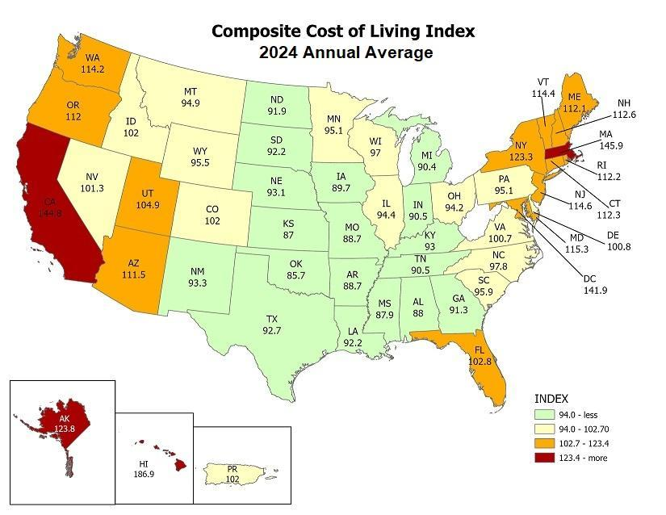

The cost of living is a critical factor in economic decision-making, influencing both personal finance and business strategies. It refers to the amount of money needed to maintain a certain standard of living, factoring in essential expenses such as housing, food, taxes, and healthcare. Understanding the cost of living is vital for individuals as it affects budgeting, savings, and investment decisions, while businesses must consider it when setting wages and prices.

Economic indexes play a crucial role in assessing living expenses by providing a systematic way to measure and compare economic health over time and regions. One of the most well-known indexes is the Consumer Price Index (CPI), which tracks the average change over time in the prices paid by urban consumers for a market basket of consumer goods and services. These indexes are integral to policymakers and economists as they offer insights into inflation trends, purchasing power, and overall economic stability.



Algorithmic trading, or algo trading, is a modern investment tool that employs mathematical models and computer algorithms to execute trades at optimal prices and times. This technique is noted for its speed, efficiency, and ability to eliminate human emotions from trading decisions, providing a significant advantage in today's fast-paced financial markets. By automating trade decisions based on predefined criteria, algo trading provides a mechanism through which large volumes of securities can be traded with precision.

At first glance, the cost of living, economic indexes, and algorithmic trading may seem like disparate concepts. However, they are interconnected in significant ways. Changes in the cost of living and economic conditions reflected in indexes can influence financial markets, which in turn affects algorithmic trading strategies. As economic indexes provide vital clues about market direction, they can be incorporated into algorithmic models to adjust trading tactics, thereby aligning investment strategies with current economic realities.

This introduction sets the stage for a more detailed exploration of how these elements interact and their implications for individuals and businesses. Understanding these connections is vital for navigating the complexities of economic landscapes, providing a foundation for informed decision-making and strategic planning in both personal finance and professional investment endeavors.

## Table of Contents

## Understanding the Cost of Living

The cost of living represents the amount of money needed to sustain a particular standard of living, typically measured through expenses such as housing, food, taxes, and healthcare. It is a critical concept in economics and personal finance, influencing people's decisions about where to live, work, and invest. The components contributing to the cost of living can vary significantly based on geographical location, lifestyle, and personal circumstances.

**Key Components of the Cost of Living**

1. **Housing**: This is often the largest expense in a household budget, encompassing rent or mortgage payments, utilities, property taxes, and maintenance costs. Housing prices can differ widely between urban and rural areas, and even among cities within the same country.

2. **Food**: The cost of groceries and dining out also plays a significant role in determining the cost of living. Prices can fluctuate based on local economies, agriculture, import levels, and even climatic conditions affecting food production.

3. **Taxes**: Both income and sales taxes influence disposable income levels. Tax policies may vary greatly from one jurisdiction to another, impacting overall living expenses.

4. **Healthcare**: Medical costs include insurance premiums, out-of-pocket expenses for visits, treatments, and medications. Differences in healthcare systems, insurance schemes, and medical facility availability can lead to significant variations in these expenses.

**Importance in Personal Finance**

Understanding the cost of living is vital for personal finance management. Individuals must consider it when budgeting, deciding on salary requirements for job offers, or contemplating relocation. High living expenses may require prioritizing savings and investment goals differently to maintain financial stability.

**Geographical Variations in Cost of Living**

The cost of living can vary enormously between and within countries. For instance, living in New York City generally requires a much larger income compared to smaller cities like Omaha. This disparity can be quantified using cost of living indexes, enabling comparisons and informed decision-making regarding relocation.

**Influence of Inflation**

Inflation plays a crucial role in modifying living expenses. It denotes the rate at which the general level of prices for goods and services rises, eroding purchasing power. Inflation can affect all components of the cost of living, influencing wages, savings, and investment returns. Consistent monitoring of inflation trends allows individuals and businesses to adjust their financial strategies accordingly.

**Impacts of Changes in the Cost of Living**

Fluctuations in the cost of living exert significant effects on both individuals and businesses. For individuals, a rise in living costs without a corresponding increase in income can result in financial strain, requiring adjustments in spending habits. Businesses face challenges as increased operating costs may necessitate higher prices for goods and services, potentially impacting competitiveness and profitability. For example, a company operating in a region with rising property and wage costs may need to reassess pricing strategies or seek cost-saving measures.

In conclusion, comprehensively understanding the cost of living and monitoring its components are essential for making informed and strategic economic decisions.

## Economic Indexes and Their Role

Economic indexes are quantitative measures that serve as indicators of economic health and performance across various domains. These indexes offer valuable insights into the economic environment, acting as tools for policymakers, investors, and the general public to assess and compare economic conditions over time and across different regions. The primary purpose of these indexes is to simplify complex economic information into easily understandable figures, enabling informed decision-making. 

One of the most prominent economic indexes related to living expenses is the Consumer Price Index (CPI). The CPI measures the average change in prices paid by consumers for goods and services over time, essentially providing a snapshot of inflation at the consumer level. This index is calculated by taking a basket of goods and services typically purchased by households and tracking their price changes over time. The formula for calculating the CPI is:

$$

CPI = \left( \frac{\text{Cost of Basket in Current Year}}{\text{Cost of Basket in Base Year}} \right) \times 100 
$$

The choice of the basket and its weightings can vary depending on the demographics and consumption patterns of particular countries or regions.

In addition to the CPI, other significant economic indexes include the Producer Price Index (PPI), which measures average changes in selling prices received by domestic producers, and the Employment Cost Index (ECI), which tracks compensation costs, including wages and benefits. These indexes play crucial roles in economic analysis by providing detailed insights into specific aspects of the economy.

Economic indexes are integral to economic policy formulation. Policymakers use these measures to guide decisions on interest rates, fiscal policies, and social welfare programs. For the general public, indexes like the CPI affect real income calculations, cost of living adjustments, and economic stability perceptions.

Despite their utility, economic indexes have limitations. They often rely on estimations and assumptions that may not fully capture real-world complexities. For example, the CPI might not adequately reflect changes in consumer consumption patterns or new product introductions, leading to potential biases.

Historically, economic indexes have shown varying trends that have significantly impacted economies. For example, during the oil crises of the 1970s, many countries experienced high inflation, leading to rising CPI figures, which subsequently prompted governments to implement strict monetary policies. Alternatively, periods of deflation, such as during the Great Depression, resulted in reduced CPI figures, accompanied by economic contraction and increasing unemployment.

In conclusion, economic indexes serve as essential tools in understanding and responding to economic phenomena, influencing both microeconomic and macroeconomic decisions. While they have limitations, their ability to convey complex economic data in an accessible format makes them indispensable for evaluating economic conditions and formulating strategies to address economic challenges.

## The Basics of Algorithmic Trading

Algorithmic trading, known as algo trading, involves the use of computer programs to execute trading orders with minimal human intervention. At its core, it leverages complex algorithms, mathematical models, and extensive data analysis to make trading decisions. This form of trading has become essential in modern financial markets due to its ability to process volumes of data and execute trades at speeds and frequencies unattainable by human traders.

Algorithms in trading are sets of specific instructions implemented to identify buying or selling opportunities. These instructions can be based on timing, price, quantity, or any mathematical model. For example, an algorithm can be designed to buy a stock when its moving average price surpasses a certain threshold or when a particular financial index, such as the S&P 500, reaches a specified point. The decision-making process is thus predominantly automated and derived from precise, pre-defined criteria.

The benefits of [algorithmic trading](/wiki/algorithmic-trading) are numerous. One of its primary advantages is speed. Algorithms can scan and react to market data far quicker than a human, often capitalizing on profitable opportunities within milliseconds. Efficiency is another critical benefit; algorithms can handle complex calculations and trades at massive scales without the fatigue that limits human traders. Additionally, algorithmic trading is devoid of emotional influences that often impair trading decisions, such as fear or greed.

Several tools and technologies facilitate algo trading. These include various trading platforms, API services, and programming libraries like Python's Pandas and NumPy for data analysis. Python, in particular, is favored for its straightforward syntax and extensive libraries that support operations related to financial data analysis, such as [backtesting](/wiki/backtesting), a crucial step where a trading strategy is tested against historical data to validate its effectiveness.

However, algorithmic trading is not without its risks and challenges. A significant risk is the potential for systemic errors induced by software bugs or flawed data input, which can result in substantial financial losses. Moreover, the reliance on high-frequency trading systems necessitates robust technological infrastructure, which can be costly. Market dynamics, which might change unpredictably, can also render a previously successful algorithm ineffective. This highlights the need for continuous monitoring and adaptation of the algorithms to align with current market conditions.

In summary, algorithmic trading plays a pivotal role in modern financial markets, exploiting speed, efficiency, and unemotional decision-making to capitalize on trading opportunities. Nonetheless, it presents certain risks that require vigilant oversight and adjustment as market conditions evolve.

## Intersections Between Living Expenses and Algo Trading

Changes in the cost of living have far-reaching effects, not only on individual and household finances but also on the broader financial markets. These shifts, in turn, play a crucial role in algorithmic trading, which relies heavily on data-driven decision-making. Algorithmic trading, or algo trading, employs quantitative models to execute trades automatically based on specific criteria. When the cost of living changes, it can affect these models by altering economic indexes, influencing market dynamics, and impacting investor sentiment.

Economic indexes, such as the Consumer Price Index (CPI), serve as indicators of inflation and, by extension, the cost of living. An increase in these indexes can signal rising inflationary pressures, which may impact interest rates set by central banks. Such changes in monetary policy can shift market dynamics, leading to [volatility](/wiki/volatility-trading-strategies) in financial markets. Algorithmic trading systems often have algorithms that adjust trading strategies in response to economic indicators like CPI. For instance, a rise in inflation may lead algorithms to anticipate [interest rate](/wiki/interest-rate-trading-strategies) hikes, thereby influencing their trading strategies by shorting bonds or shifting investments towards commodities that tend to perform better in inflationary environments.

Investor sentiment is another crucial aspect influenced by economic indexes like the cost of living. When these indexes rise, indicating inflation, it may cause an investors' sentiment to shift towards bearishness. This change in sentiment can lead to adjustments in algorithmic trading strategies, which often incorporate sentiment analysis. Advanced algo trading systems might use natural language processing (NLP) to parse financial news and social media to gauge sentiment, subsequently adjusting buying and selling strategies to capitalize on market sentiment.

The potential for algo trading to [factor](/wiki/factor-investing) in economic indexes is increasingly being explored, particularly with advancements in [machine learning](/wiki/machine-learning) and big data analytics. By integrating real-time data on the cost of living and related economic indexes, algorithmic traders can enhance their models’ predictive capabilities, allowing for more responsive and adaptive trading strategies. For instance, machine learning algorithms can be trained to recognize patterns between cost of living indexes and market movements, enabling them to predict potential market volatility and adjust trading positions accordingly.

Looking into the future, integrating cost of living data into algorithmic trading models offers promising possibilities. As data collection and processing technologies advance, trading models can become more sophisticated, incorporating a broader range of economic factors, including regional cost of living variations. This integration could provide a more nuanced view of financial markets and facilitate better risk management strategies.

One case study that illustrates the intersection between living expenses and algo trading involves the 2008 financial crisis. The housing bubble and subsequent collapse were driven, in part, by inflated property values and living costs. As the crisis unfolded, many algo trading models struggled to cope with the rapid changes in market conditions. This event highlighted the need for such models to consider real-world economic factors, such as the cost of living, to enhance their resilience to economic shocks.

In conclusion, while algorithmic trading and living expenses may appear as disparate domains, their intersections reveal important synergies. By leveraging economic indexes and understanding cost of living dynamics, algorithmic trading can become more intelligent and adaptive, offering significant potential benefits for market participants.

## Implications for Individuals and Businesses

Understanding the cost of living and economic indexes empowers individuals with the knowledge required to make sound financial decisions. These economic indicators provide insights into the overall economic environment, helping individuals assess their purchasing power and plan for future expenses. For instance, by monitoring the Consumer Price Index (CPI), individuals can anticipate inflation trends, allowing them to adjust their budgets and savings plans accordingly. Fluctuations in these indexes indicate shifts in the economy, informing decisions such as salary negotiations, investment diversification, and expenditure planning.

Algorithmic trading offers substantial opportunities for both businesses and individuals seeking to optimize their investment strategies. By automating trading decisions based on predefined criteria, algorithmic trading harnesses speed, precision, and data analysis to enhance market engagement. Businesses can use algorithmic models to adjust portfolios rapidly in response to market changes driven by economic indicators, thereby maximizing returns while managing risks. Individuals, empowered by technology, can similarly employ these strategies through accessible trading platforms, potentially boosting their personal investment outcomes.

These interconnected topics [carry](/wiki/carry-trading) broader economic implications, influencing market stability, resource allocation, and wealth distribution. Economic indexes serve as barometers for macroeconomic health, guiding governments in policy formulation and businesses in strategic planning. AI-driven analyses that consider changes in cost of living and other indicators can improve economic forecasts, ultimately aiding in the stabilization of financial markets.

Adapting to changing economic conditions requires proactive strategies for both individuals and businesses. For individuals, this could mean diversifying investment portfolios to hedge against inflation or engaging with financial advisors to mitigate economic shocks. Businesses might focus on integrating algorithmic trading systems that are responsive to economic data, ensuring a competitive advantage. Additionally, both groups should prioritize financial literacy, staying informed about economic trends through reputable sources.

To leverage algorithmic trading in the context of living expenses, individuals and businesses should consider the following actionable steps. First, conduct a thorough analysis of personal or business financial situations to understand vulnerabilities exposed by cost of living changes. Then, develop or choose algorithmic trading systems that incorporate economic indexes as variables in decision-making models. For instance, an algorithm can be designed to adjust investment strategies when certain thresholds in the CPI or employment rates are breached.

Implementing such strategies could involve using Python programming to create simple algorithms. Python's libraries like pandas and NumPy are essential for data manipulation and analysis, while tools such as PyAlgoTrade can assist in crafting custom trading strategies. Here is a basic example of using Python to create a simple moving average (SMA) strategy, indicative of the potential for algorithmic deployment:

```python
import pandas as pd
import numpy as np

# Load some financial data
data = pd.read_csv('financial_data.csv')

# Calculate a simple moving average
data['SMA'] = data['Close'].rolling(window=20).mean()

# Define trading strategy
data['Signal'] = 0
data['Signal'][20:] = np.where(data['Close'][20:] > data['SMA'][20:], 1, 0)

# Calculate positions
data['Position'] = data['Signal'].diff()

# View results
print(data[['Close', 'SMA', 'Signal', 'Position']])
```

Through understanding economic indexes and integrating algorithmic trading strategies, both individuals and businesses can navigate economic fluctuations and optimize their financial health. By remaining informed and adaptive, stakeholders can capitalize on emerging opportunities in an evolving economic landscape.

## Conclusion

The exploration of the cost of living, economic indexes, and algorithmic trading reveals their significant roles in shaping financial and economic landscapes. The cost of living remains a critical factor influencing personal and business financial decisions. Variabilities in expenses related to housing, food, and healthcare, coupled with geographic differences and inflationary pressures, necessitate continuous monitoring and adaptation to these changing conditions. Economic indexes like the Consumer Price Index (CPI) serve as vital tools for assessing these variations, offering policymakers and the public necessary insights into the health of the economy.

Algorithmic trading, a modern innovation in the financial sector, enhances the ability to navigate complex market environments through the application of predetermined criteria and technological tools. The integration of economic data into algorithms allows for more informed trading decisions, pointing towards a future where living expense data could be more intricately woven into trading strategies.

Understanding the interconnection between these topics is crucial for individuals and businesses aiming to optimize their financial strategies. This knowledge aids in anticipating market shifts triggered by fluctuations in living costs and economic indexes, potentially enabling superior investment outcomes. Engaging with these topics encourages strategic foresight and adaptability, vital traits in an ever-evolving economic landscape.

Looking ahead, the continued evolution of data analytics and algorithmic technology promises enhanced precision and responsiveness to economic conditions. The future may witness more sophisticated models that incorporate vast datasets, reflecting nuanced shifts in living expenses and other economic indicators, presenting greater opportunities and challenges alike.

Readers are encouraged to remain informed and vigilant, leveraging the potential of these interconnected areas for financial benefit. Adapting to changing economic circumstances requires proactive engagement, capable of turning insights into actionable strategies for personal and business finance optimization. Staying abreast of these developments will be essential in navigating the complexity and dynamism of future economies.

## References & Further Reading

[1]: Bureau of Labor Statistics. (2023). ["Consumer Price Index."](https://www.bls.gov/cpi/) U.S. Department of Labor.

[2]: Investopedia. (2023). ["Cost of Living"](https://www.investopedia.com/articles/personal-finance/081514/how-inflation-affects-your-cost-living.asp) and ["Economic Indicators"](https://www.investopedia.com/articles/personal-finance/081514/how-inflation-affects-your-cost-living.asp).

[3]: Forbes. (2023). ["How Algorithmic Trading Works"](https://www.forbes.com/councils/forbesbusinesscouncil/2023/07/17/how-artificial-intelligence-is-revolutionizing-stock-investing/).

[4]: CFA Institute. (2023). ["Algorithmic Trading and High Frequency Trading"](https://www.semanticscholar.org/paper/ALGORITHMIC-TRADING%3A-A-COMPREHENSIVE-REVIEW-OF-AND-Garg/94ead853e1835e7caae78d080e8b0e2f5f504607).

[5]: Chan, E. P. (2009). ["Quantitative Trading: How to Build Your Own Algorithmic Trading Business"](https://github.com/ftvision/quant_trading_echan_book). John Wiley & Sons.

[6]: Lopez de Prado, M. (2018). ["Advances in Financial Machine Learning"](https://www.amazon.com/Advances-Financial-Machine-Learning-Marcos/dp/1119482089). Wiley.