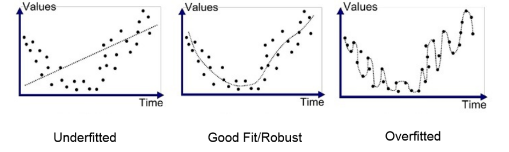

## Table of Contents

## What is meant by 'penalising models' in machine learning?

In machine learning, 'penalising models' refers to a technique used to improve the performance of a model by adding a penalty to the model's complexity. This is done to prevent the model from overfitting, which happens when a model learns the training data too well, including its noise and outliers, and fails to generalize to new, unseen data. By penalizing the model's complexity, we encourage it to find a simpler solution that works better for new data.

The penalty is usually added to the model's loss function, which is the measure of how well the model is doing. This penalty can be thought of as a cost that the model has to pay for being too complex. There are different ways to penalize a model, such as using L1 regularization, which adds a penalty equal to the sum of the absolute values of the model's parameters, or L2 regularization, which adds a penalty equal to the sum of the squares of the model's parameters. Both methods help to keep the model simple and improve its ability to generalize to new data.

## Why is it important to consider the cost of penalising models?

It's important to think about the cost of penalizing models because it helps us find the right balance between how well the model fits the data and how simple it is. If we penalize the model too much, it might become too simple and not learn important patterns in the data. This can make the model less accurate and not useful for making predictions. On the other hand, if we don't penalize the model enough, it might become too complex and overfit the data, which means it learns the training data too well, including any mistakes or random noise, and won't work well on new data.

Choosing the right amount of penalty is like finding the sweet spot that lets the model learn the important patterns without getting too caught up in the details. This balance helps the model perform better on new, unseen data, which is what we want in real-world applications. By carefully considering the cost of penalizing models, we can create models that are both accurate and reliable, making them more useful for solving practical problems.

## What are the common methods used to penalise models?

One common way to penalize models is called L1 regularization. This method adds a penalty to the model's loss function based on the sum of the absolute values of the model's parameters. Imagine the model's parameters are like knobs you can turn to make the model work better. L1 regularization makes the model pay a little extra for each knob it turns, encouraging it to keep the knobs at zero if possible. This helps make the model simpler by pushing some parameters to zero, which can be useful for figuring out which features are really important.

Another common method is L2 regularization. This method adds a penalty to the loss function based on the sum of the squares of the model's parameters. Instead of making the model pay for each knob it turns, L2 regularization makes it pay more if it turns the knobs a lot. This encourages the model to spread out the values of its parameters, keeping them small but not necessarily zero. L2 regularization helps the model stay simple and can make it more stable, which means it's less likely to change a lot if the data changes a little.

Both L1 and L2 regularization help prevent overfitting by making the model simpler. The choice between them depends on what you want the model to do. L1 can help you find the most important features, while L2 can help keep the model stable. Sometimes, people even use a mix of both, called Elastic Net regularization, to get the best of both worlds.

## How does penalisation affect model performance?

Penalizing a model can help it perform better on new data. When we penalize a model, we add a little extra cost to its complexity. This makes the model try to be simpler, which can stop it from overfitting. Overfitting happens when a model learns the training data too well, including any mistakes or random noise. By keeping the model simple, it can focus on the important patterns in the data, making it better at predicting things it hasn't seen before.

But, if we penalize the model too much, it can become too simple and miss important patterns. This can make the model less accurate because it doesn't learn enough from the data. Finding the right amount of penalty is important. It's like finding the perfect balance so the model learns just enough to be useful but not so much that it gets confused by the small details. By carefully adjusting the penalty, we can make sure the model works well on new data, which is what we want in real-world situations.

## What are the financial implications of model penalisation?

Penalizing models can save money by making them work better on new data. When a model is good at predicting things it hasn't seen before, businesses can use it to make better decisions. For example, a company might use a model to predict how many products to make or how much to charge for them. If the model is accurate, the company can save money by not making too many products or setting the right prices. This can lead to more profit and less waste.

However, if the model is penalized too much, it might become too simple and not learn enough from the data. This can cost money because the model might make bad predictions. For instance, if a bank uses a model to decide who to give loans to, and the model is too simple, it might say no to good customers or yes to risky ones. This can lead to lost opportunities or higher losses. So, it's important to find the right balance when penalizing models to make sure they help save money instead of costing more.

## Can you explain the trade-offs between model complexity and penalisation?

When we make a model more complex, it can learn the training data really well. This might seem good at first because the model looks like it's doing a great job. But, if the model is too complex, it might start to learn the little mistakes and random noise in the training data too. This is called overfitting. When we try to use the model on new data, it might not work well because it learned things that aren't important. To stop this from happening, we use something called penalization. Penalization adds a little extra cost to the model's complexity, encouraging it to stay simpler and focus on the important patterns in the data.

The trade-off here is between how well the model fits the training data and how simple it is. If we don't penalize the model enough, it might get too complex and overfit. On the other hand, if we penalize it too much, the model might become too simple and miss important patterns. This means it won't be very accurate because it didn't learn enough from the data. Finding the right balance is key. We want the model to be complex enough to learn the important stuff but simple enough to work well on new data. By carefully choosing how much to penalize the model, we can make sure it performs well in real-world situations.

## How do different types of penalties (e.g., L1, L2) impact model costs?

Different types of penalties, like L1 and L2, can affect how much a model costs in different ways. L1 penalty, also known as Lasso, adds a cost to the model based on the sum of the absolute values of its parameters. This can make some parameters zero, which means the model becomes simpler. A simpler model might be cheaper to run because it needs less computing power and memory. Also, if the model is simpler, it might be easier and cheaper to understand and explain to others.

On the other hand, L2 penalty, also called Ridge, adds a cost to the model based on the sum of the squares of its parameters. This encourages the model to spread out the values of its parameters, making them smaller but not zero. While this might not make the model as simple as L1, it can still help the model be more stable and work well on new data. A stable model can save money by making better predictions and reducing the risk of big mistakes. The choice between L1 and L2 depends on what you need the model to do and how much you want to spend on running it and fixing any problems it might cause.

## What are some real-world examples where the cost of penalising models has been significant?

In the world of finance, the cost of penalizing models can be huge. For example, banks use models to decide who gets a loan. If a bank uses a model that's too simple because it was penalized too much, it might miss out on giving loans to people who would pay them back. This means the bank loses money it could have made from interest. On the other hand, if the model is not penalized enough and becomes too complex, it might give loans to people who won't pay back, leading to big losses for the bank. Finding the right balance is really important to keep the bank's money safe.

Another example is in healthcare, where models help doctors decide on treatments. If a model is too simple because of too much penalization, it might not catch important signs of a disease, leading to wrong treatments and higher costs for the healthcare system. But if the model is too complex and not penalized enough, it might see patterns that aren't really there, causing doctors to give treatments that aren't needed. This can waste a lot of money and resources. So, getting the penalty just right can save a lot of money and help people get the right care.

## How can the cost-effectiveness of model penalisation be measured?

To measure how cost-effective it is to penalize a model, we look at how well the model works on new data and how much it costs to run. If a model is good at making predictions on new data, it can help save money by making better decisions. For example, a company might use a model to decide how much to make of a product. If the model is accurate, the company won't make too much or too little, saving money. But, if the model is too simple because it was penalized too much, it might not be accurate enough, leading to bad decisions and wasted money. So, we need to find the right balance where the model is simple enough to be cheap to run but complex enough to be accurate.

Another way to measure cost-effectiveness is by looking at how much time and resources it takes to keep the model working well. A simpler model might be cheaper to run because it needs less computing power and memory. It can also be easier and cheaper to explain to others, which is important for businesses. But, if the model is too simple, it might miss important patterns and make bad predictions, costing more money in the long run. On the other hand, a more complex model might work better but be more expensive to run and maintain. By carefully choosing how much to penalize the model, we can make sure it's both cost-effective and useful for making good decisions.

## What advanced techniques exist for optimizing the penalisation of models?

One advanced technique for optimizing the penalization of models is called cross-validation. This method helps us find the right amount of penalty by splitting the data into different parts and testing the model on each part. We try different levels of penalty and see which one makes the model work best on new data. This way, we can be sure the model isn't too simple or too complex, and it can make good predictions without costing too much.

Another technique is called Bayesian optimization. This method uses a smart way to search for the best penalty by trying different values and learning from the results. It's like playing a game where you get better at guessing the right answer each time you try. Bayesian optimization can help find the perfect balance between how well the model fits the data and how simple it is, saving time and money by making the model work well on new data without being too expensive to run.

## How does the choice of penalisation strategy influence long-term model maintenance costs?

The choice of penalization strategy can have a big impact on how much it costs to keep a model running over time. If you choose a strategy that makes the model too simple, like using a lot of L1 penalty, the model might be cheaper to run because it needs less computing power and memory. It can also be easier to explain to others, which can save time and money. But, if the model is too simple, it might not learn important patterns in the data, leading to bad predictions and higher costs in the long run because you might need to fix the model or update it more often.

On the other hand, if you choose a strategy that makes the model more complex, like using less penalty or using L2 penalty, the model might be better at making accurate predictions on new data. This can save money by helping businesses make better decisions and reducing the risk of big mistakes. However, a more complex model can be more expensive to run and maintain because it needs more computing power and might need more frequent updates to stay accurate. Finding the right balance between simplicity and complexity is key to keeping long-term maintenance costs low while still making sure the model works well.

## What are the current research trends in balancing model penalisation and cost?

One big trend in research right now is figuring out how to make models simpler without losing their ability to make good predictions. Scientists are trying different ways to penalize models to find the best balance. They use methods like cross-validation, where they split the data into parts and test the model on each part to see which penalty works best. They also use Bayesian optimization, which is a smart way to search for the right penalty by learning from the results of different tries. These methods help make sure the model is not too simple or too complex, which can save money by making the model work well on new data without being too expensive to run.

Another trend is looking at how different types of penalties, like L1 and L2, affect the cost of running and maintaining models over time. Researchers are trying to understand how choosing one type of penalty over another can make the model cheaper or more expensive in the long run. For example, L1 penalty can make the model simpler and cheaper to run, but it might not be as accurate. L2 penalty might make the model more accurate but also more expensive to maintain. By studying these effects, researchers hope to find the best way to penalize models so they can save money while still making good predictions.

## References & Further Reading

[1]: Lopez de Prado, M. (2018). ["Advances in Financial Machine Learning."](https://www.amazon.com/Advances-Financial-Machine-Learning-Marcos/dp/1119482089) Wiley.

[2]: Aronson, D. R. (2006). ["Evidence-Based Technical Analysis: Applying the Scientific Method and Statistical Inference to Trading Signals."](https://www.amazon.com/Evidence-Based-Technical-Analysis-Scientific-Statistical/dp/0470008741) Wiley.

[3]: Jansen, S. (2018). ["Machine Learning for Algorithmic Trading."](https://github.com/stefan-jansen/machine-learning-for-trading) Packt Publishing.

[4]: Chan, E. (2008). ["Quantitative Trading: How to Build Your Own Algorithmic Trading Business."](https://github.com/justinchou/books-quantitative-trading) John Wiley & Sons.

[5]: ["Marketcalls - Quantitative and Algorithmic Trading Blog."](https://therobusttrader.com/algorithmic-trading-blog-algo-quantitative-strategies/) Marketcalls offers insights into algorithmic trading aspects, including costs and strategies.

[6]: ["Alpaca's Algorithmic Trading Platform."](https://alpaca.markets/algorithmic-traders) Alpaca provides resources for calculating costs in algorithmic trading and implementing strategic trading models.