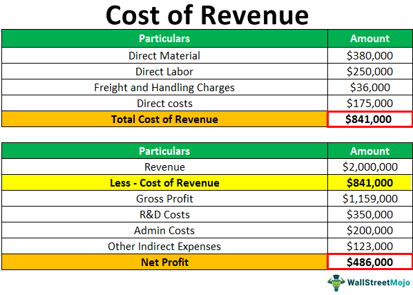

Understanding the financial landscape is crucial for business success, especially in sectors like algorithmic trading. In this rapidly evolving field, companies leverage advanced computational techniques to execute trading strategies with high speed and precision. As these firms navigate complex markets, understanding their financial metrics becomes imperative to maintaining competitiveness and profitability.

A fundamental concept that significantly impacts a company's financial performance is the cost of revenue. This metric indirectly affects a firm's profitability and strategic investment decisions by shedding light on the efficiency of its core operations. Unlike broader financial measures, the cost of revenue focuses on the expenses directly associated with the production and delivery of a company's goods and services. For businesses engaged in algorithmic trading, where margins can be razor-thin, accurately managing these costs is crucial.



The article aims to explore the intricacies of the cost of revenue and its calculation, providing insights into how this concept can be strategically used in algorithmic trading. By understanding the components and calculations of the cost of revenue, companies can make informed decisions that enhance their operational efficiencies and market strategies.

## Table of Contents

## Understanding Cost of Revenue

Cost of revenue involves all expenses directly associated with the creation and delivery of a company's products or services. This metric is essential for calculating profitability as it reflects the total cost incurred to generate revenue. Unlike cost of goods sold (COGS), which focuses solely on the costs of producing goods, cost of revenue presents a more comprehensive view by including other expenses.

Key components of cost of revenue include direct materials, which are the raw materials or components used in the production of goods. Direct labor costs encompass wages for employees directly involved in manufacturing or delivering services. Additionally, shipping and freight expenses, necessary for distributing products to customers, are considered integral parts of the cost of revenue.

Furthermore, cost of revenue can include several other direct costs not typically captured in COGS, such as marketing expenses. These expenses are crucial for promoting and selling products and services, thus directly contributing to revenue generation. By incorporating these broader expenses, the cost of revenue offers a more complete picture of the financial resources required to support sales.

For businesses, understanding and managing the cost of revenue is vital. It enables companies to fine-tune their pricing strategies, streamline operations, and improve profit margins. This broader perspective is particularly relevant for decision-making in industries like [algorithmic trading](/wiki/algorithmic-trading), where cost structures can significantly affect profitability and competitive strategies.

## Formula and Calculation of Cost of Revenue

The calculation of the cost of revenue is pivotal for understanding a company's profitability as it encompasses a broad range of expenses directly tied to the provision of goods or services. The formula to determine the cost of revenue includes the following components:

$$
\text{Cost of Revenue} = \text{COGS} + \text{Shipping Costs} + \text{Commissions} + \text{Warranties} + \text{Returns} + \text{Other Direct Costs}
$$

1. **Cost of Goods Sold (COGS):** This represents the direct costs attributable to the production of the goods sold by a company. It includes expenses for raw materials and labor directly used in creating the product.

2. **Shipping Costs:** These are the expenses incurred in transporting goods from the production facility to the end consumer. It involves freight and logistics expenses.

3. **Commissions:** Whenever sales personnel earn a percentage of the sold goods’ revenue, these commissions are added to the cost of revenue.

4. **Warranties:** The anticipated costs associated with honoring warranty claims are included here. It represents a company's liability for the repair or replacement of products under warranty.

5. **Returns:** This covers the expected costs associated with product returns, which can include restocking fees and losses related to unsellable returned items.

6. **Other Direct Costs:** This category includes various additional direct costs involved in delivering products or services. It might encompass expenses related to marketing strategies directly tied to a particular sale as opposed to general brand advertising.

To calculate the cost of revenue, businesses must meticulously track and account for these expenses to ensure precise financial reporting. The inclusion of all relevant direct costs provides a comprehensive view of the total expenses incurred in bringing the product or service to market, which is essential for accurate profitability analysis and strategic planning.

## Components of Cost of Revenue

Cost of revenue includes several components, each contributing to the overall cost necessary to deliver a product or service to the market. Understanding these components is essential for businesses looking to optimize their financial strategies.

**Direct Materials**: These are the raw materials or parts that are directly incorporated into the final product. For example, in the automotive industry, direct materials would include steel for car bodies, rubber for tires, and glass for windows. The cost of direct materials is a crucial factor as it directly impacts the production expense and thus the cost of revenue.

**Direct Labor**: This refers to the wages and salaries paid to workers directly involved in the manufacturing process. It includes the labor cost of workers who operate machinery, assemble products, or provide direct services to create the final product. Managing direct labor costs can significantly affect overall financial performance as labor cost variations can lead to substantial changes in the cost of revenue.

**Manufacturing Overhead**: This component encompasses all the indirect costs associated with production. It includes expenses such as utility costs for the production facility, depreciation on equipment, and the salaries of production supervisors. While these costs are not directly tied to a specific unit of production, they are essential for supporting the manufacturing process.

**Freight and Shipping Costs**: These are the expenses involved in the transportation of raw materials to the manufacturing facility and the delivery of finished goods to customers. Effective management of freight and shipping costs can enhance profitability, especially for companies with extensive distribution networks or those relying on global supply chains.

**Additional Costs**: Other direct costs that may form part of the cost of revenue include commissions for sales personnel, warranty expenses, and potential returns. For example, commissions are often calculated as a percentage of sales revenue and represent a variable expense that fluctuates with sales volume. Warranty costs, on the other hand, may be estimated based on historical data and reflected as a liability that affects the cost of delivering a product.

By comprehensively evaluating these components, businesses can gain insights into their cost structure, enabling them to identify areas for improvement, such as potential cost savings or efficiency enhancements. Understanding the cost of revenue is crucial in sectors like algorithmic trading, where maintaining low operational costs can make a significant difference in competitiveness and profitability.

Python can be a useful tool for calculating and analyzing these costs efficiently. For instance, one might use Python to input various cost components and compute the total cost of revenue:

```python
def calculate_cost_of_revenue(direct_materials, direct_labor, manufacturing_overhead, freight, additional_costs):
    return direct_materials + direct_labor + manufacturing_overhead + freight + additional_costs

# Example usage:
direct_materials = 10000
direct_labor = 5000
manufacturing_overhead = 3000
freight = 2000
additional_costs = 1000

total_cost_of_revenue = calculate_cost_of_revenue(direct_materials, direct_labor, manufacturing_overhead, freight, additional_costs)
print(f"Total Cost of Revenue: ${total_cost_of_revenue}")
```

This flexibility in adjusting and analyzing various cost components allows businesses to better manage and strategize their financial operations.

## Cost of Revenue vs. COGS

Cost of revenue and Cost of Goods Sold (COGS) are financial metrics crucial for assessing a company's profitability, yet they represent different scopes of expenses. Though often confused, these two metrics are distinct and cater to different facets of financial assessment.

Cost of Goods Sold (COGS) specifically pertains to the direct costs associated with the production of goods sold by a company. This includes expenses such as raw materials and direct labor involved in manufacturing. For service-based companies, COGS represents the direct costs tied to providing services, such as the labor directly linked to service delivery. The calculation for COGS is fairly straightforward:

$$
\text{COGS} = \text{Opening Inventory} + \text{Purchases during the period} - \text{Ending Inventory}
$$

However, the cost of revenue provides a more comprehensive overview. While it includes all the components of COGS, it extends further to encapsulate additional costs associated with the sales and delivery process. These may encompass expenses such as distribution, marketing, customer service, commissions, and warranty services. The broader nature of cost of revenue makes it a more inclusive metric, providing insights into the total costs incurred from production to the final sale of goods or services. The formula for calculating cost of revenue can be generalized as:

$$
\text{Cost of Revenue} = \text{COGS} + \text{Shipping Costs} + \text{Commissions} + \text{Warranties} + \text{Returns} + \text{Other Direct Costs}
$$

These inclusions are particularly significant for businesses that engage in complex product delivery or maintain substantial customer service operations, making the cost of revenue a vital metric for understanding the complete expense profile of a business. By recognizing the broader scope of the cost of revenue, companies can better strategize in relation to their market positioning and financial planning, particularly in sectors with intricate cost structures.

## Financial Example in Algo Trading

Algorithmic trading firms often gain considerable insights by dissecting cost structures, enabling them to make informed decisions that directly influence their profit margins. Understanding the cost of revenue is vital in this context, as it encompasses the various expenses associated with producing and delivering trading services or automated strategies.

Imagine a hypothetical trading firm that employs algorithmic strategies to execute trades at high-frequency and large volumes. This firm needs to account for several types of costs when assessing its financial health. Consider the direct costs involved, such as:

1. **Data Feeds**: The firm subscribes to multiple data feeds, which are crucial for algorithm optimization. These costs are a significant part of their operational expenses.

2. **Technology Infrastructure**: The hardware and software maintenance costs to run complex algorithms efficiently form a substantial part of the revenue cost. This includes servers, networking hardware, and specialized trading software.

3. **Transaction Fees**: Each trade made by the algorithm incurs a transaction fee from exchanges. These fees must be considered, as they accumulate rapidly over high volumes of trades.

4. **Personnel Costs**: While algorithmic trading minimizes human intervention, skilled personnel for oversight, strategy development, and maintenance are still necessary. Their salaries and related expenses are also part of the cost of revenue.

By calculating these direct costs, the firm can arrive at the total cost of revenue. For example, if the firm’s annual revenue from trading is $10 million and the combined cost associated with these elements is $7 million, the cost of revenue is pivotal in determining the operating income or profit. The mathematical expression for the operating income could be represented as:

$$
\text{Operating Income} = \text{Total Revenue} - \text{Cost of Revenue}
$$

$$
\text{Operating Income} = \$10,000,000 - \$7,000,000 = \$3,000,000
$$

Through this structured analysis, algorithmic trading firms can identify areas to reduce costs without compromising on performance or service quality. For example, negotiating better terms with data providers or optimizing algorithms to lower transaction costs. Thus, a thorough understanding of cost of revenue not only aids in maintaining financial health but also in strategic decision-making, contributing to enhanced competitive advantage in the crowded field of algorithmic trading.

## Integration of Cost Metrics in Algo Trading

In algorithmic trading, integrating cost metrics such as the cost of revenue into trading strategies can significantly improve efficiency and profitability. The cost of revenue, which includes all expenses directly tied to the delivery of goods or services, offers a comprehensive view of the financial obligations associated with trading activities. By analyzing these elements, traders and financial analysts can gain insights into market conditions and resource allocation.

Understanding cost elements allows traders to refine their trading operations by identifying areas where expenses can be minimized. For instance, a trading firm may analyze its cost of revenue to discern trends in its direct and indirect costs, enabling strategic adjustments in trade execution or the choice of trading platforms. This analysis can help optimize trade timings and improve profit margins.

Moreover, cost metrics can assist in assessing the viability of trading strategies by comparing the costs incurred with the potential revenues. By calculating metrics such as the cost-to-revenue ratio, a firm can determine the effectiveness of its strategies and make data-driven decisions to either continue, adjust, or scrap certain trading strategies.

With computational tools, traders can automate the integration and monitoring of these metrics. For example, using Python, traders can develop scripts to calculate key financial ratios and provide real-time insights into cost structures. Here’s a simple example:

```python
def calculate_cost_of_revenue(cogs, shipping, commissions, warranties, returns, other):
    return cogs + shipping + commissions + warranties + returns + other

def cost_to_revenue_ratio(cost_of_revenue, total_revenue):
    return cost_of_revenue / total_revenue

cogs = 100000
shipping = 5000
commissions = 2000
warranties = 300
returns = 700
other_costs = 400

total_revenue = 150000

cost_of_revenue = calculate_cost_of_revenue(cogs, shipping, commissions, warranties, returns, other_costs)
ratio = cost_to_revenue_ratio(cost_of_revenue, total_revenue)

print(f"Cost of Revenue: {cost_of_revenue}")
print(f"Cost to Revenue Ratio: {ratio:.2f}")
```

This code snippet demonstrates a basic calculation of cost of revenue and its ratio to total revenue, aiding in the financial analysis of a firm's trading strategy.

Incorporating these metrics, traders can also evaluate the cost-effectiveness of different trading algorithms and tactics. Increasing profit margins may involve selecting algorithms with lower operational costs or optimizing the use of trading platforms to reduce transaction fees. By constantly updating and refining the integration of cost metrics, algorithmic traders ensure their strategies remain competitive and are capable of adapting to the dynamic trading environment. 

Ultimately, a comprehensive understanding of cost metrics fortifies trading strategies, enhancing decision-making and ensuring sustained competitive advantage in algorithmic trading.

## Conclusion

Accurately measuring and analyzing the cost of revenue is essential for optimizing business strategies, particularly in algorithmic trading. By thoroughly understanding and accounting for all direct costs associated with producing and delivering products or services, companies can devise more effective strategies and increase their competitiveness in the market. 

For businesses engaged in algorithmic trading, recognizing the importance of cost of revenue translates into more informed decision-making. This comprehensive view of costs allows companies to identify potential areas for cost savings or reallocation of resources to improve profit margins. For instance, trading firms can better evaluate the profitability of different trading strategies by incorporating cost of revenue into their financial models.

Additionally, accurately measuring cost of revenue supports enhanced financial planning and investment analysis. Companies can refine their forecasting models by including all relevant costs beyond the traditional cost of goods sold (COGS). This ensures more precise estimates of future profitability and provides a foundation for optimizing resource allocation.

Ultimately, understanding the cost of revenue empowers algorithmic trading firms to enhance their strategic agility. This insight helps firms respond to changing market conditions effectively and maintain competitive advantage. By prioritizing a thorough analysis of direct costs, companies can achieve sustainable growth and profitability.

## References & Further Reading

[1]: Bergstra, J., Bardenet, R., Bengio, Y., & Kégl, B. (2011). ["Algorithms for Hyper-Parameter Optimization."](https://papers.nips.cc/paper/4443-algorithms-for-hyper-parameter-optimization) Advances in Neural Information Processing Systems 24.

[2]: ["Advances in Financial Machine Learning"](https://www.amazon.com/Advances-Financial-Machine-Learning-Marcos/dp/1119482089) by Marcos Lopez de Prado

[3]: ["Evidence-Based Technical Analysis: Applying the Scientific Method and Statistical Inference to Trading Signals"](https://books.google.com/books/about/Evidence_Based_Technical_Analysis.html?id=MeoJAQAAMAAJ) by David Aronson

[4]: ["Machine Learning for Algorithmic Trading"](https://github.com/stefan-jansen/machine-learning-for-trading) by Stefan Jansen

[5]: ["Quantitative Trading: How to Build Your Own Algorithmic Trading Business"](https://www.amazon.com/Quantitative-Trading-Build-Algorithmic-Business/dp/1119800064) by Ernest P. Chan