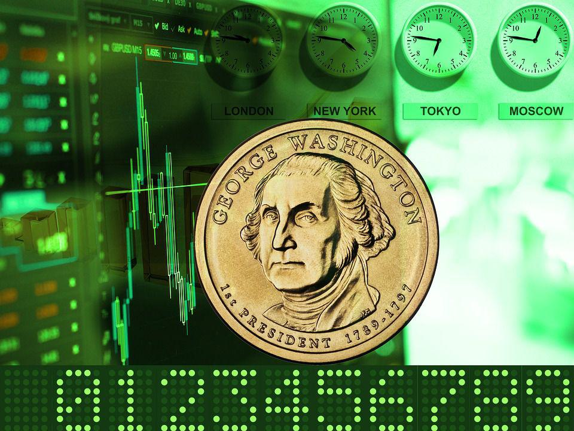

Understanding the complexities of the procurement process is vital for organizations seeking cost efficiency. Procurement involves obtaining goods and services from external suppliers, a task that directly affects an organization's operational costs and efficiency. As a central aspect of procurement, tendering, the competitive process wherein suppliers submit bids to secure contracts, plays a pivotal role in ensuring optimal supplier selection and cost control.

Managing the expenses associated with tendering is crucial for organizations striving to maintain financial viability. These expenses can encompass bid preparation, compliance costs, and the broader cost implications of securing commodities. Tender costs can significantly impact the overall procurement budget, influencing the basis between futures contracts and the spot market in financial sectors. Thus, understanding tender expenses thoroughly helps in budgeting effectively and avoiding unforeseen financial implications.



Advancements in technology are transforming traditional tender management processes. Algorithmic trading, for instance, enhances procurement efficiency by enabling real-time data analysis for informed decision-making. Automated systems facilitate streamlined bid evaluations, supplier negotiations, and contract management, significantly reducing manual oversight and the incidence of human error. E-procurement platforms further support this transformation, offering functionalities such as document automation and online bid submissions to streamline operations.

This article explores the interplay between procurement processes, tendering expenses, tender costs, and technological advancements like algorithmic trading. By examining strategic approaches to optimizing costs and integrating technology in tender management, it aims to provide actionable insights and best practices for achieving cost efficiency. The goal is to equip organizations with the tools and knowledge needed to harness technology effectively, ensuring they can meet their procurement goals while maintaining competitive and financially sustainable operations.

## Table of Contents

## Understanding the Procurement Process and Tendering

The procurement process is a structured method for acquiring goods and services from external suppliers. It involves several stages including identifying needs, soliciting suppliers, evaluating offers, and managing contracts. Among these stages, tendering is a critical component. Tendering is a competitive process where suppliers submit bids to win contracts, ensuring transparency and fairness. This competitive environment not only facilitates optimal cost control but also promotes the selection of high-quality suppliers.

Managing tendering effectively requires a comprehensive understanding of the expenses involved. These include costs related to bid preparation, adherence to compliance requirements, and administrative overheads. These costs, often termed as tendering expenses, are crucial aspects to consider. For instance, suppliers invest significant resources in preparing bids that meet specific criteria outlined in the tender documents. Compliance costs also arise from the necessity to adhere to legal and regulatory standards.

The cost of tendering can significantly impact the procurement budget of an organization. It is essential for procurement departments to accurately estimate these costs to avoid budget overruns. This can be done by conducting a detailed analysis of each component of tendering expenses. For example, understanding the costs associated with preparing comprehensive bid documents helps in anticipating the financial requirements.

Technological advancements have introduced opportunities to streamline the tendering process, thereby reducing associated expenses. E-procurement platforms enable electronic submission of bids, minimizing the need for physical documentation and thereby reducing administrative costs. Additionally, automation can be employed to evaluate supplier bids more efficiently, allowing procurement teams to focus on strategic decision-making.

In conclusion, a thorough understanding of the procurement process and effective management of tendering are vital for controlling costs and achieving procurement efficiency. Utilizing technology to enhance these processes not only simplifies the tendering procedure but also results in significant cost savings. Organizations that prioritize these aspects are better positioned to maximize their procurement efforts, ensuring financial sustainability and competitiveness in the marketplace.

## Tender Cost and Its Impact on Procurement

Tender cost encompasses all financial obligations related to the delivery and certification of goods in the procurement process. Understanding the various components of these costs is crucial for effective budget management and cost control in organizations.

Key components of tender costs include several logistical and operational expenses:

1. **Transportation Charges**: This is often the most significant portion of tender costs. It includes the expenses incurred in moving goods from the supplier to the destination specified in the contract. Factors influencing this cost include distance, mode of transportation, and fuel prices.

2. **Storage Costs**: Organizations may incur costs for storing goods before they are used or redistributed. These expenses cover warehousing, handling, and security services to ensure inventory safety and accessibility.

3. **Delivery Charges**: Apart from transportation and storage, delivery involves costs related to loading, unloading, and final distribution of goods. These can vary depending on the delivery terms agreed upon in the contract.

In the financial markets, the cost of tender can significantly impact the basis between futures contracts and the spot market. The basis is defined as the difference between the spot price of an asset and the future price. Tender costs influence this basis by altering the overall expenses involved in the delivery of the asset, thereby affecting the profitability of futures and spot market trades.

For organizations, understanding tender costs is essential for precise budgeting and avoiding unforeseen expenses that can undermine financial stability. Effective strategies for managing tender costs include:

- **Thorough Planning**: Establishing a comprehensive budget that reflects all anticipated tender expenses helps organizations allocate resources efficiently and plan for potential deviations.

- **Supplier Negotiation**: Building strong relationships with suppliers can lead to favorable terms and reduced costs. Negotiating better prices, delivery terms, and conditions can lead to significant savings.

Technological solutions play a pivotal role in monitoring and controlling tender costs. Modern analytics tools can provide real-time insights into cost trends and variances, facilitating informed decision-making. For instance:

```python
import pandas as pd

# Sample DataFrame simulating tender costs
data = {'Transportation': [5000, 7000, 6500],
        'Storage': [2000, 2500, 2300],
        'Delivery': [1500, 1800, 1700]}

df = pd.DataFrame(data)

# Calculate Total Cost
df['TotalCost'] = df.sum(axis=1)

# Display DataFrame with total tender costs
print(df)
```

This simple Python script illustrates how businesses can automate cost calculations to provide a clearer picture of their expenditures, thereby allowing for more strategic financial planning.

By adopting these strategies and leveraging technological tools, organizations can maintain control over tender costs, ensuring they remain competitive and sustainable in the long term.

## Leveraging Technology and Algo Trading in Tender Management

Algorithmic trading, often synonymous with high-frequency trading in financial markets, is being increasingly adopted for tender management processes to improve operational efficiency. By utilizing automated systems, organizations can streamline critical components of tender management, including bid evaluations, supplier negotiations, and contract management.

Algorithmic systems are designed to process large volumes of data at high speed, enabling real-time data analysis. This capability is crucial in tender management, where informed decision-making can significantly depend on the timeliness and accuracy of data. For instance, real-time analytics can offer a comparative evaluation of bids, highlighting cost-efficiency opportunities, compliance with tender specifications, and supplier reliability. This data-driven approach reduces the manual effort involved in analyzing bids, enabling procurement teams to focus on strategic decision-making.

E-procurement platforms, which form the backbone of modern tender management systems, often incorporate features such as document automation and online bid submission. Document automation reduces the administrative burden by automatically generating, storing, and retrieving necessary documents throughout the tender lifecycle. Online bid submission ensures greater accessibility for suppliers, fostering a more competitive bidding environment which can lead to improved procurement outcomes.

Another vital technological integration in tender management is Supplier Relationship Management (SRM) systems. By integrating SRM systems with tender management processes, organizations can enhance the efficiency of supplier relationship management. SRM systems facilitate data sharing, communication, and transaction processing, ensuring that procurement decisions are aligned with the organization's broader strategic goals and supplier capacities.

However, implementing such technologies requires careful selection to ensure that the solutions meet the specific needs of the organization's tender management process. Factors to consider include the scale of operations, industry-specific requirements, ease of integration with existing systems, and the ability to scale as the organization's needs grow. A tailored approach in selecting and implementing these technologies can result in significant cost savings, improved efficiency, and enhanced supplier relations.

In summary, the integration of [algorithmic trading](/wiki/algorithmic-trading) techniques and advanced technological systems into tender management processes allows for enhanced efficiency and effectiveness. These advancements provide procurement functions with the tools necessary to optimize costs, reduce manual errors, and make informed decisions, positioning organizations for sustained competitive advantage.

## Best Practices for Cost Control in Tender Management

To achieve cost control in tender management, it is essential to implement a series of best practices tailored to the specific needs of each organization. The following considerations can significantly contribute to managing and minimizing costs effectively.

Understanding the scope and requirements of a tender is the first critical step to preventing cost overruns. By clearly defining the project's parameters and expectations, organizations can avoid unforeseen expenses that often arise from vague or incomplete specifications. Comprehensive scope delineation ensures all stakeholders are aligned, reducing the likelihood of cost discrepancies later.

Developing a detailed cost breakdown is another crucial practice. This should include both direct expenses—such as materials, labor, and logistics—and indirect costs like administrative fees and potential delay penalties. By scrutinizing all financial aspects, organizations can create a thorough budget that signals possible savings opportunities and better prepare for financial variances.

Competitive pricing is achieved by inviting multiple bids, thus leveraging supplier competition. Seeking diverse proposals encourages cost-effective solutions while maintaining quality standards. This competitive environment can be further enhanced by conducting preliminary negotiations and requesting detailed proposals, pushing suppliers to present their best terms possible.

In some cases, alternative procurement methods such as leasing or outsourcing are viable options to consider. Leasing can reduce upfront costs, while outsourcing can provide specialized skills and resources otherwise unavailable internally. Each method has its own implications on cost and control, so a careful cost-benefit analysis is advised to determine the best fit for the organization’s needs.

Effective contract management is vital for monitoring performance and controlling costs post-award. By establishing clear terms and setting performance indicators aligned with cost objectives, organizations can ensure that suppliers meet contractual obligations and budget expectations. Regular audits and reviews of contract performance can prevent cost overruns and ensure adherence to specified terms.

Finally, continuous improvement in tender management practices is essential. This involves regularly reviewing and refining processes to enhance efficiency and reduce costs over time. Implementing feedback mechanisms and conducting regular audits can help identify areas for improvement, fostering a culture of constant advancement and cost awareness.

By applying these practices, organizations can effectively control costs in tender management, leading to improved financial performance and sustainable procurement outcomes.

## Conclusion: Achieving Cost Efficiency through Strategic Tender Management

Effective tender management is vital for achieving cost efficiency and supporting procurement objectives. By integrating traditional practices with modern technology, organizations can refine their procurement processes to achieve notable savings.

Strategic tender management involves streamlined processes that advocate competitive bidding. This ensures that the most qualified suppliers are considered, leading to stronger supplier relationships. These relationships are critical for negotiated favorable terms, resulting in cost benefits over time. Moreover, fostering a competitive bidding environment encourages suppliers to present their best offers, which can contribute significantly to lowering procurement expenses.

Continuous improvement is an essential aspect of tender management. Regular assessments and updates to tender processes help organizations remain competitive and financially sustainable. In an ever-changing market, adaptability ensures that procurement practices evolve in line with industry advancements and trends.

The incorporation of technology, notably algorithmic trading, presents new possibilities for cost efficiency within tender management. Real-time data analysis through automated systems enables better decision-making and can streamline various aspects of tender management, including bid evaluations and contract management. For instance, e-procurement platforms offer document automation and online bid submissions, reducing manual work and increasing accuracy.

For organizations aiming to optimize their tender management processes, the implementation of best practices is crucial. These practices include understanding the full scope of the tender, developing comprehensive cost breakdowns, and exploring alternative procurement methods such as leasing or outsourcing. Effective contract management also plays a role in maintaining performance standards and controlling costs.

In conclusion, by adopting a strategic approach that marries technology with tried-and-tested procurement methods, businesses can optimize their tender management, achieving cost efficiency and setting themselves up for long-term success. Organizations that leverage the potential of technology and maintain robust supplier partnerships will find themselves better positioned to meet their procurement goals effectively and sustainably.

## References & Further Reading

[1]: ["Advances in Financial Machine Learning"](https://www.amazon.com/Advances-Financial-Machine-Learning-Marcos/dp/1119482089) by Marcos Lopez de Prado

[2]: ["Machine Learning for Algorithmic Trading"](https://www.amazon.com/Machine-Learning-Algorithmic-Trading-alternative/dp/1839217715) by Stefan Jansen

[3]: ["Quantitative Trading: How to Build Your Own Algorithmic Trading Business"](https://www.amazon.com/Quantitative-Trading-Build-Algorithmic-Business/dp/1119800064) by Ernest P. Chan

[4]: Hawkins, T., Gravier, M. J., & Powley, E. H. (2011). [Public versus private sector procurement ethics and strategy: What each sector can learn from the other](https://www.jstor.org/stable/41476045). Journal of Business Ethics, 103(4), 461-469.

[5]: ["The Procurement and Supply Manager's Desk Reference"](https://onlinelibrary.wiley.com/doi/book/10.1002/9781119205098) by Fred Sollish and John Semanik