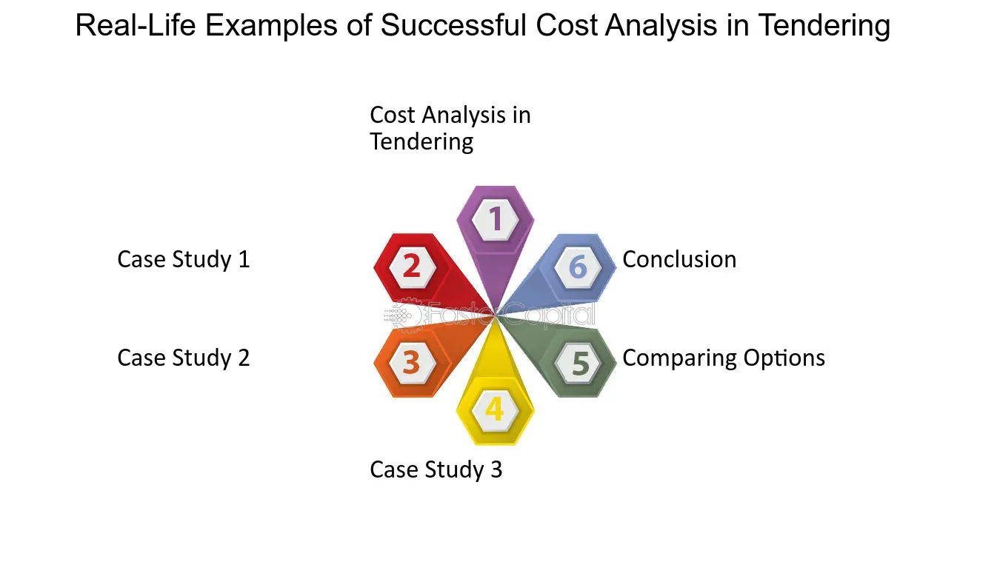

## Table of Contents

## What is tendering and why is it important?

Tendering is a process where businesses or organizations ask companies to submit offers, or bids, to provide specific goods or services. It's like a competition where different companies try to win the job by offering the best price and quality. Governments, big companies, and other organizations use tendering to make sure they get the best value for their money.

Tendering is important because it helps to make things fair and open. When everyone can see the rules and has a chance to bid, it stops companies from getting special treatment. This way, the organization can choose the best offer, which can save money and make sure the work is done well. It also encourages companies to keep their prices competitive and to offer high-quality services to win the tender.

## How does the tendering process work?

The tendering process starts when an organization decides it needs something and wants to find the best company to provide it. They write a document called a Request for Tender (RFT) that explains exactly what they need, like building a bridge or supplying office equipment. This document is sent out to different companies, or it might be posted online where anyone can see it. Companies that are interested in the job will then prepare their bids. In their bids, they explain how much they will charge and how they plan to do the work. They need to follow the rules set out in the RFT carefully.

Once the organization gets all the bids, they look at them closely. They compare the prices, check the quality of the work the companies have done before, and see if the bids meet all the requirements in the RFT. Sometimes, they might ask the companies to come and talk about their bids in more detail. After looking at everything, the organization picks the bid that gives them the best value. They then sign a contract with that company to do the work. This whole process can take a while, but it helps make sure the job is done well and at a good price.

## What are the direct costs associated with preparing a tender?

When a company decides to prepare a tender, it faces several direct costs. The main cost is the time and effort of the people working on the tender. This includes the hours spent by employees who write the proposal, gather information, and put together all the necessary documents. They might need to do research, make drawings or plans, and calculate costs. All this work adds up, and the company has to pay salaries for these hours.

Another direct cost is for any materials or services needed to prepare the tender. This could be things like printing and binding the proposal, sending it by mail or courier, or using special software to help write it. Sometimes, companies might need to hire outside experts, like consultants or lawyers, to help make the tender better. These costs can be big or small, but they all have to be paid for out of the company's budget.

## What are the indirect costs of tendering?

Indirect costs of tendering are costs that are not easy to see right away. They happen because the company is spending time and effort on the tender, but it's not the main cost of making the tender. For example, when employees work on a tender, they are not working on other things. This means the company might miss out on other jobs or projects. It's like losing money because the time spent on the tender could have been used to make money in other ways.

Another indirect cost is the risk of not winning the tender. The company spends a lot of time and money to prepare the tender, but if they don't win, they get nothing back. This can be a big problem, especially if the company was counting on winning to make money. Also, if the company keeps losing tenders, it might start to look bad to other people. This can make it harder for them to win tenders in the future. So, the indirect costs can add up and affect the company in ways that are not easy to see right away.

## How can the cost of tendering affect a company’s budget?

The cost of tendering can have a big impact on a company's budget. When a company decides to bid on a tender, it has to spend money on things like salaries for the people working on the tender, printing and mailing the proposal, and sometimes hiring experts to help. These costs add up quickly, and if the company is working on a lot of tenders, it can use up a big part of its budget. If the company doesn't win the tender, all that money spent is gone, and they don't get anything back. This can be a problem, especially if the company was expecting to win and make money from the job.

There are also indirect costs that can affect the budget in ways that are not so easy to see. When employees are working on a tender, they are not working on other things that could bring in money. This lost time is like losing money because the company could have used that time to do other jobs or projects. Also, if the company keeps losing tenders, it might start to look bad to other people. This can make it harder to win tenders in the future, which can hurt the company's budget even more. So, the cost of tendering can really change how much money a company has to work with.

## What strategies can be used to minimize tendering costs?

One way to keep tendering costs down is to be really picky about which tenders to go for. A company should only bid on tenders where it has a good chance of winning. This means looking at the tender rules and seeing if they match what the company can do well. It also means thinking about how much the tender is worth and if it's worth the time and money to bid. By only going for tenders that are a good fit, the company can save money and time.

Another strategy is to reuse parts of old tenders. When a company makes a tender, it can keep the parts that don't change much, like the company's history or safety rules. This can save a lot of time and money because the team doesn't have to start from scratch every time. Using special software can also help. There are programs that can make writing tenders easier and faster, which can save money too.

Lastly, it's important to keep the tender team small and focused. Instead of having a lot of people working on a tender, the company can choose a few people who are really good at it. This can make the work go faster and cost less. Also, the company can think about hiring outside experts only when really needed, instead of for every tender. This way, the company can control the costs and still make good tenders.

## How do tendering costs vary across different industries?

Tendering costs can be different in different industries because each industry has its own way of doing things. For example, in construction, tendering can be really expensive. This is because companies need to spend a lot of time making detailed plans and working out exact costs. They might also need to hire special experts like architects or engineers to help with the tender. All these things add up and make the cost of tendering higher. On the other hand, in the IT industry, tendering might not cost as much. IT companies often use the same kind of information in their tenders, so they can reuse a lot of it. They might also use special software to help them write tenders faster and cheaper.

Another thing that makes tendering costs different across industries is how competitive they are. In industries where a lot of companies are fighting for the same jobs, like in cleaning or security services, the cost of tendering can be lower. Companies in these industries might not need to spend as much time and money on their tenders because the work they are bidding for is simpler. But in industries like pharmaceuticals or aerospace, where the work is very complicated and only a few companies can do it, tendering costs can be much higher. These companies have to put a lot of effort into their tenders to show they can do the job well, and that costs more money.

## What are the long-term financial implications of frequent tendering?

Frequent tendering can have big effects on a company's money over a long time. Every time a company bids on a tender, it spends money on things like salaries for the people working on it, printing, and maybe even hiring experts. If the company keeps bidding on a lot of tenders, these costs can add up and use a big part of the company's budget. If the company doesn't win many of these tenders, it loses all the money it spent on them. Over time, this can make it hard for the company to have enough money to do other important things, like buying new equipment or hiring more workers.

Also, frequent tendering can make the company focus too much on trying to win new jobs instead of doing the work it already has. This can make the company's work quality go down, which can hurt its reputation. If the company keeps losing tenders, it might start to look bad to other people in the industry. This can make it even harder to win tenders in the future, which can hurt the company's money even more over time. So, it's important for a company to think carefully about how often it bids on tenders and make sure it's not spending too much money on them.

## How can technology be utilized to reduce the cost of tendering?

Technology can help lower the cost of tendering by making the whole process faster and easier. Special software can help companies write their tenders quickly. This software can keep track of all the information the company needs, like past projects and company details, so they don't have to start from scratch every time. It can also help with making budgets and plans, which saves a lot of time. When things are done faster, it means the company spends less money on salaries for the people working on the tender.

Another way technology helps is by making it easier to share information. Instead of printing and mailing a lot of papers, companies can send their tenders online. This saves money on printing and postage. Also, technology can help companies work together better, even if they are in different places. They can use online tools to talk about the tender and make changes quickly. This can make the tender better and help the company win more often, without spending a lot of extra money.

## What role does market competition play in the cost of tendering?

Market competition can change how much it costs to make a tender. When there are a lot of companies trying to win the same job, they might not need to spend as much money on their tenders. This is because the work they are bidding for is often simpler, and they can use the same kind of information in their tenders again and again. But when there are only a few companies that can do a special kind of job, like building a rocket or making a new medicine, the cost of tendering can be a lot higher. These companies have to spend more time and money to show they can do the job well, and that makes the tender more expensive.

Also, when there is a lot of competition, companies might try to keep their tendering costs low so they can offer a better price. This can help them win more tenders, but it means they have to be careful about how much they spend on each one. On the other hand, in markets with less competition, companies might feel they need to spend more on their tenders to stand out. This can make the cost of tendering go up, but it might also help them win the job if they can show they are the best choice. So, the level of competition in the market really affects how much companies spend on tendering.

## How do government regulations impact the cost of tendering?

Government rules can make the cost of tendering go up. When the government says companies have to follow a lot of rules when they make a tender, it takes more time and money to do it right. For example, they might need to fill out special forms or get certain papers. They might also need to show they are doing things in a safe and fair way. All these extra steps can make the tender more expensive because the company has to pay people to do the work and maybe even hire experts to help.

On the other hand, government rules can also help keep the cost of tendering down. When the rules are clear and the same for everyone, companies know what they need to do. This can make it easier and faster for them to make a tender. Also, if the government makes it easy to find out about tenders and how to bid on them, companies can spend less time looking for information. So, while some rules can make tendering more expensive, others can help keep the costs lower by making the process simpler and more straightforward.

## What advanced analytics can be applied to optimize tendering costs?

Advanced analytics can help companies save money when they make tenders. By using data and special math, companies can look at past tenders and see what worked well and what didn't. They can find out which tenders they are most likely to win and which ones are not worth the time and money. This helps them pick the best tenders to bid on. Also, analytics can show them how long it usually takes to make a tender and how much it costs. With this information, they can plan better and make sure they are not spending too much money on each tender.

Another way analytics can help is by making the tender process smoother. Companies can use special software to keep track of all the information they need for tenders, like past projects and company details. This makes it faster to put together a new tender because they don't have to start from scratch. Analytics can also help them see where they can save money, like by using fewer people on the tender team or not hiring experts unless they really need them. By using analytics, companies can make their tenders better and cheaper, which can help them win more jobs and save money in the long run.

## References & Further Reading

[1]: ["Advances in Financial Machine Learning"](https://www.amazon.com/Advances-Financial-Machine-Learning-Marcos/dp/1119482089) by Marcos Lopez de Prado

[2]: ["Machine Learning for Algorithmic Trading"](https://www.amazon.com/Machine-Learning-Algorithmic-Trading-alternative/dp/1839217715) by Stefan Jansen

[3]: ["Quantitative Trading: How to Build Your Own Algorithmic Trading Business"](https://www.amazon.com/Quantitative-Trading-Build-Algorithmic-Business/dp/1119800064) by Ernest P. Chan

[4]: Hawkins, T., Gravier, M. J., & Powley, E. H. (2011). [Public versus private sector procurement ethics and strategy: What each sector can learn from the other](https://www.jstor.org/stable/41476045). Journal of Business Ethics, 103(4), 461-469.

[5]: ["The Procurement and Supply Manager's Desk Reference"](https://onlinelibrary.wiley.com/doi/book/10.1002/9781119205098) by Fred Sollish and John Semanik