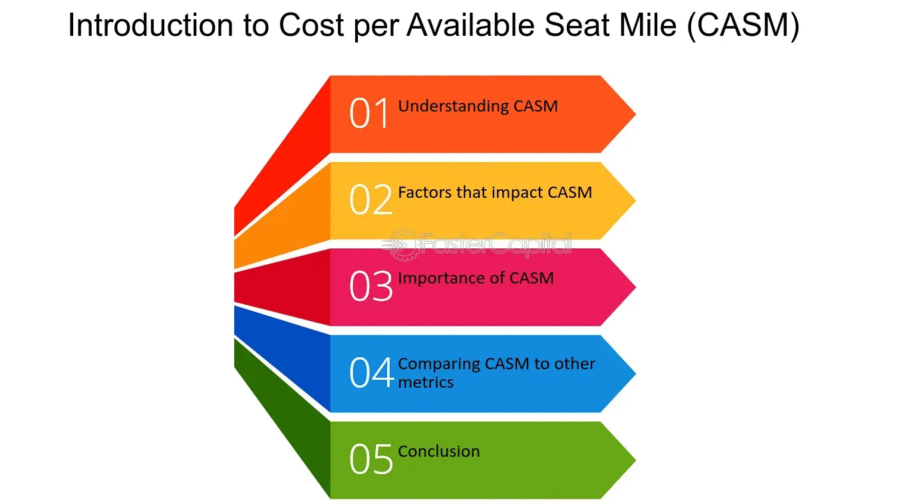

## Table of Contents

## What is Cost Per Available Seat Mile (CASM)?

Cost Per Available Seat Mile (CASM) is a measure used in the airline industry to understand how much it costs an airline to fly one seat for one mile. It helps airlines figure out how efficiently they are operating. To calculate CASM, you take the total operating costs of the airline and divide it by the total number of seat miles available. This number is important because it shows how well an airline is managing its costs relative to the capacity it offers.

A lower CASM means that an airline is running more efficiently, as it costs less to fly each seat per mile. Airlines often use CASM to compare their performance against other airlines or to track their own performance over time. For example, if an airline can reduce its CASM, it might be able to offer lower fares or increase its profits. Understanding CASM is crucial for airline managers to make smart decisions about pricing, routes, and cost management.

## How is CASM calculated?

CASM, or Cost Per Available Seat Mile, is figured out by taking the total amount of money an airline spends to operate and dividing it by the total number of seat miles available. A seat mile is one seat flying one mile. So, if an airline has a plane with 100 seats that flies 1,000 miles, it has 100,000 seat miles available.

This number is important because it shows how much it costs the airline to have one seat fly one mile. If the total operating costs are $100,000 and the airline has 100,000 seat miles available, then the CASM would be $1 per seat mile. Airlines use this to see if they are spending their money wisely and to compare how they are doing with other airlines or over time.

## Why is CASM important for airlines?

CASM is really important for airlines because it tells them how much it costs to fly one seat for one mile. This helps airlines see if they are spending their money well. If an airline can make its CASM number smaller, it means they are getting better at saving money. This can help them charge less for tickets or make more profit.

Airlines also use CASM to compare themselves with other airlines. If one airline has a lower CASM than another, it might mean they are doing a better job at keeping costs down. This can be a big deal when airlines are trying to decide where to fly, how much to charge, and how to spend their money. Knowing their CASM helps airline bosses make smart choices to keep their business running smoothly.

## What are the components that contribute to CASM?

CASM, or Cost Per Available Seat Mile, is made up of lots of different costs that airlines have to pay to fly their planes. These costs include things like fuel, which is a big part of what airlines spend their money on. Other costs are the salaries they pay to their pilots, flight attendants, and other workers. Then there are the costs for keeping the planes in good shape, like fixing them when they break and doing regular checks to make sure they are safe to fly.

There are also costs for things like renting or buying the planes, and paying for the places where the planes take off and land, called airports. Airlines also have to spend money on things like advertising to let people know about their flights, and on the computers and systems they use to sell tickets and keep track of everything. All these different costs add up to make the total operating cost, which is then divided by the total number of seat miles to find the CASM.

Knowing all these parts that make up CASM helps airlines see where they can save money. For example, if fuel costs are really high, they might try to use less fuel by flying more efficiently. Or if salaries are a big part of the costs, they might look at ways to manage their staff better. By understanding what goes into CASM, airlines can make smart choices to keep their costs down and their planes flying.

## How does CASM differ from other airline cost metrics?

CASM, or Cost Per Available Seat Mile, is different from other airline cost metrics because it looks at how much it costs to fly one seat for one mile. This is important because it helps airlines see how efficient they are at using their space. Other metrics, like Cost Per Block Hour, focus on how much it costs to fly a plane for an hour, no matter how many seats are on the plane. CASM gives a better idea of how well an airline is using all its seats, which is key for figuring out if they can offer cheaper tickets or make more money.

Another metric airlines use is RASM, or Revenue Per Available Seat Mile. While CASM looks at costs, RASM looks at how much money airlines make from each seat mile. By comparing CASM and RASM, airlines can see if they are making more money than they are spending. This comparison helps them decide if their prices are right or if they need to find ways to cut costs. Both CASM and RASM are important, but they tell different parts of the story about how an airline is doing financially.

## Can you explain how fuel prices affect CASM?

Fuel prices have a big impact on CASM because fuel is one of the biggest costs for airlines. When fuel prices go up, it costs more to fly each seat for one mile. This means the CASM number gets bigger because the total operating costs are higher. Airlines try to find ways to use less fuel, like flying more direct routes or making their planes lighter, but if fuel prices keep going up, it's hard to keep CASM low.

Airlines watch fuel prices closely because they can change a lot. If fuel prices drop, it's good news for airlines because it makes their CASM go down. This can help them offer cheaper tickets or make more profit. But when fuel prices rise, airlines might have to raise their ticket prices or find other ways to save money to keep their CASM from getting too high. So, fuel prices are a key part of what makes CASM go up or down.

## What strategies can airlines use to reduce their CASM?

Airlines can reduce their CASM by finding ways to save money on fuel. Since fuel is a big part of their costs, they might fly more direct routes to use less fuel. They can also make their planes lighter by using less heavy materials or taking out things they don't need. Another way is to use newer, more efficient planes that don't use as much fuel. All these things help lower the cost of flying each seat for one mile.

Another strategy is to manage their staff better. This means making sure they have just the right number of pilots and flight attendants, so they don't pay more than they need to. Airlines can also save money by negotiating better deals with airports and suppliers. They might also use technology to make their operations smoother and cheaper. By focusing on these areas, airlines can keep their CASM low and stay competitive.

## How does CASM impact airline profitability?

CASM, or Cost Per Available Seat Mile, is really important for figuring out how much money an airline makes. If an airline can make its CASM smaller, it means they are spending less money to fly each seat for one mile. When CASM goes down, airlines can either charge less for tickets, which can attract more passengers, or they can keep their prices the same and make more profit. So, a lower CASM usually means more money for the airline.

But if CASM goes up, it can be bad news for airline profits. When it costs more to fly each seat for one mile, airlines might have to raise their ticket prices to cover these costs. This can make fewer people want to fly with them, which means less money coming in. So, airlines always try to keep their CASM as low as they can to stay profitable and competitive.

## How do different airline business models affect their CASM?

Different airline business models can have a big impact on their CASM. For example, low-cost carriers like Southwest or Ryanair focus on keeping their costs as low as possible. They do this by flying only one type of plane, which makes it cheaper to train staff and fix planes. They also fly to smaller airports where fees are lower and offer fewer services on board, like no free meals or checked bags. All these choices help low-cost carriers keep their CASM low, so they can offer cheaper tickets and still make money.

On the other hand, full-service airlines like Delta or Lufthansa have higher CASM because they offer more services. They fly to big airports, which can be more expensive, and they provide things like free meals, entertainment, and checked bags. These extras cost more money, so their CASM is higher. But these airlines can charge more for tickets because people are willing to pay for the extra services. So, while their CASM is higher, they can still be profitable by catering to passengers who want a more comfortable and convenient experience.

## What are the trends in CASM over the past decade?

Over the past decade, airlines have been working hard to lower their CASM. They have done this by using newer, more efficient planes that use less fuel. Airlines have also started flying more direct routes and making their planes lighter to save on fuel costs. Technology has helped too, by making it easier for airlines to manage their operations and save money. These efforts have helped many airlines reduce their CASM, making it cheaper for them to fly each seat for one mile.

However, there have been challenges too. Fuel prices have gone up and down a lot over the past ten years, which can make CASM go up when prices are high. Also, some airlines have added more services to attract passengers, which can increase their costs and CASM. Despite these challenges, the overall trend has been toward lower CASM, thanks to the focus on efficiency and cost-saving measures. This has helped airlines stay competitive and profitable, even when facing economic ups and downs.

## How does CASM vary between domestic and international flights?

CASM can be different for domestic and international flights because of the different costs involved. Domestic flights usually have lower CASM because they are shorter and use less fuel. They also often fly to smaller airports, which can be cheaper. Plus, domestic flights might not need as many services like meals or entertainment, which helps keep costs down.

International flights, on the other hand, usually have higher CASM. They are longer, so they use more fuel, which is a big part of the cost. International flights also need more services like meals, entertainment, and sometimes even beds for long flights. They often fly to bigger, more expensive airports too. All these things add up to make the cost per seat mile higher for international flights.

## What advanced analytics can be used to optimize CASM?

Advanced analytics can help airlines make their CASM lower by looking at a lot of data to find ways to save money. Airlines can use something called predictive analytics to guess how much fuel they will need for each flight. This helps them buy the right amount of fuel and not waste any. They can also use analytics to figure out the best routes to fly. By choosing shorter, more direct routes, airlines can use less fuel and lower their CASM. Another way is by using data to see how full their planes are and adjust their schedules to make sure they are always flying with as many passengers as possible.

Airlines can also use analytics to manage their staff better. By looking at data, they can see how many pilots and flight attendants they need for each flight and make sure they are not paying for more staff than they need. Analytics can also help with maintenance. By predicting when planes will need to be fixed, airlines can plan better and avoid big, expensive surprises. All these ways of using advanced analytics help airlines save money and keep their CASM low, which is good for their profits.

## What is the understanding of Cost Per Available Seat Mile (CASM)?

Cost per Available Seat Mile (CASM) serves as a critical metric in evaluating airline cost efficiency. It is calculated by dividing an airline's total operating expenses by the total number of available seat miles (ASM). Mathematically, it can be expressed as:

$$
\text{CASM} = \frac{\text{Total Operating Expenses}}{\text{Available Seat Miles (ASM)}}
$$

CASM is indispensable for comparing different airlines, as it offers insight into their cost structures and operational efficiencies. By understanding CASM, industry stakeholders can discern how effectively an airline converts its expenses into seat capacity.

Key components influencing CASM include fuel costs, labor costs, and maintenance expenses. Each of these components plays a significant role in an airline's financial performance:

1. **Fuel Costs**: One of the most volatile and significant parts of an airline's cost structure, fluctuations in fuel prices can dramatically impact CASM. Airlines often engage in fuel hedging to mitigate fuel price volatility.

2. **Labor Costs**: Represent a substantial portion of an airline's expenses. Efficient management of labor resources, including pilots, cabin crew, and ground staff, is essential for maintaining a competitive CASM.

3. **Maintenance Expenses**: These ensure the aircraft's airworthiness and operational efficiency. Airlines need to balance routine maintenance with cost-effective practices to optimize their CASM.

The relationship between CASM and other metrics, particularly Revenue per Available Seat Mile (RASM), is crucial in assessing airline profitability and operational efficiency. While CASM provides a snapshot of cost efficiency, RASM offers a view of the revenue generated per mile flown per seat. The interplay between these metrics informs stakeholders about the overall financial health of an airline. A lower CASM combined with a higher RASM typically indicates a more profitable and efficient operation.

Comparative analysis of CASM across airlines allows for an understanding of competitive positioning. Airlines that successfully control their CASM without compromising service quality are better positioned to achieve sustainable profitability in a highly competitive industry.

## How can one balance Cost per Available Seat Mile (CASM) and Revenue per Available Seat Mile (RASM)?

Balancing Cost per Available Seat Mile (CASM) and Revenue per Available Seat Mile (RASM) is vital for any airline seeking profitability. This balance involves ensuring that operational costs do not outweigh the generated revenues, a critical aspect in maintaining financial health. CASM represents the average cost incurred by an airline to fly one seat over one mile, while RASM indicates the average revenue generated per seat flown per mile. The equilibrium between these metrics determines the financial efficacy of airline operations.

Strategically optimizing route efficiency is a primary method to manage this balance. Airlines may analyze flight paths to reduce fuel consumption, which can be achieved by selecting more direct routes or avoiding congested airspaces that cause delays and additional fuel burn. Advanced analytics and geographic information systems support these decisions by providing real-time data and predictive modeling capabilities.

Adjusting fare prices is another crucial strategy. Dynamic pricing models, often powered by [machine learning](/wiki/machine-learning) algorithms, enable airlines to set fares based on demand forecasts, competition, and historical data trends. This approach helps in maximizing RASM by aligning prices with what passengers are willing to pay at any given time. For instance, during peak seasons or high-demand periods, airlines might increase fare prices to optimize revenue intake.

Diversification of revenue streams also plays a significant role. Beyond ticket sales, airlines can generate additional revenue through ancillary services, such as baggage fees, priority boarding, and in-flight services. Airlines might also explore partnerships with hotels, car rental services, or activity providers at destinations, creating bundled packages that appeal to travelers and boost RASM.

Achieving a precise balance between CASM and RASM requires continuous analysis and adjustment. Airlines leverage advanced financial models to simulate various scenarios and make informed strategic decisions. Consider the simple relationship where profitability can be indicated by the following inequality:

$$
\text{RASM} > \text{CASM}
$$

Maintaining this inequality implies that revenue generation surpasses costs, ensuring profitability. A Python snippet illustrating a simplified model might look like this:

```python
def is_profitable(rasm, casm):
    return rasm > casm

# Example usage:
rasm = 0.12  # in dollars per mile
casm = 0.10  # in dollars per mile
print(is_profitable(rasm, casm))  # Output: True
```

In conclusion, the strategic interplay between CASM and RASM, when effectively managed, supports sustained profitability in the airline industry. By focusing on route optimization, fare adjustments, and revenue diversification, airlines can balance these metrics, ensuring that they not only cover operational costs but also maximize profitability.

## References & Further Reading

[1]: Doganis, R. (2006). ["The Airline Business"](https://archive.org/details/airlinebusiness0000doga). Routledge.

[2]: Belobaba, P., Odoni, A., & Barnhart, C. (2015). ["The Global Airline Industry"](https://onlinelibrary.wiley.com/doi/book/10.1002/9780470744734), 2nd Edition. Wiley.

[3]: Vasigh, B., Fleming, K., & Tacker, T. (2013). ["Introduction to Air Transport Economics"](https://www.taylorfrancis.com/books/mono/10.4324/9781315299075/introduction-air-transport-economics-bijan-vasigh-ken-fleming-thomas-tacker). Routledge.

[4]: Fabio Lucioni, et al. (2020). ["Fuel Management Strategies in Airline Operations"](https://www.intechopen.com/books/10020). Transportation Research Part D: Transport and Environment.

[5]: Michael D. Wittman, Diane L. Arndt, & Amedeo R. Odoni. (2016). ["Introduction to Airport Operations Management"](https://scholar.google.com/citations?user=s9HkM94AAAAJ). Springer.
