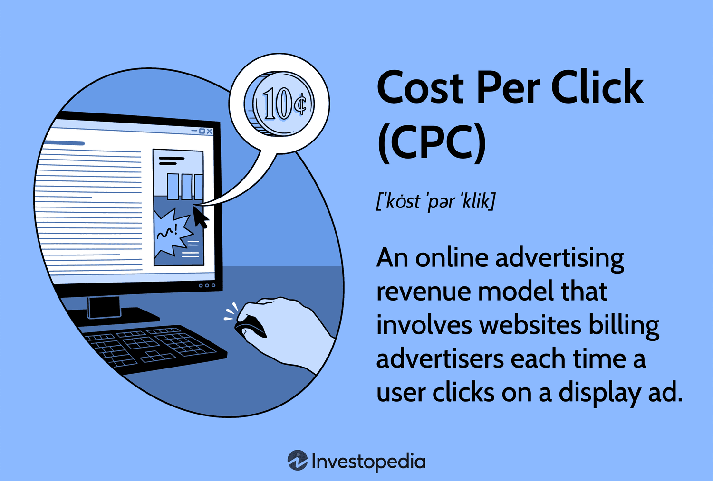

In the rapidly evolving digital marketing landscape, grasping advertising metrics is essential for running successful campaigns. Cost Per Click (CPC) is a widely adopted internet advertising model where advertisers are charged each time their ad is clicked by a user. This method has become a cornerstone of pay-per-click (PPC) advertising strategies due to its ability to directly measure user engagement with ads and drive targeted traffic to websites.

CPC highlights the direct relationship between advertising costs and user interactions, making it a vital metric for advertisers seeking to optimize their campaign performance. Advertisers can focus on driving higher quality traffic by managing and analyzing CPC, paving the way for improved conversion rates and return on investment (ROI).

This article explores the fundamentals of CPC, detailing its calculation and discussing alternative advertising models such as Cost Per Mille (CPM) and Cost Per Acquisition (CPA). These models offer different approaches to achieving campaign objectives, providing a comprehensive view of available options for advertisers. Additionally, understanding CPC's role extends beyond digital marketing, as it can influence algorithmic trading strategies by impacting a company's online advertising effectiveness and operational costs. By mastering these concepts, advertisers can enhance their strategic planning and achieve better results in both marketing and financial domains.

## Table of Contents

## What is Cost Per Click (CPC)?

Cost Per Click (CPC) is a widely-utilized digital advertising model that focuses on driving traffic to websites. In this model, advertisers pay a fee to publishers each time a user clicks on their advertisement. The essence of CPC lies in its ability to attract active engagement, facilitating interactions that lead to potential conversions, sales, or other desired actions.

The fundamental objective of CPC is to optimize the flow of web traffic, thereby increasing user engagement. By paying for clicks rather than impressions, advertisers can ensure that their expenditure is directly linked to user interactions, which can be a more effective measure of campaign performance. This contrasts with the Cost Per Mille (CPM) model, where advertisers pay for every thousand impressions regardless of the level of engagement from the audience. While CPC measures actionable interactions, CPM is oriented towards enhancing brand visibility and awareness by focusing on the number of times an ad is displayed.

CPC is particularly favorable for advertisers aiming to target a specific audience demographic, achieve measurable outcomes, and maintain control over advertising costs. As the digital marketing landscape continues to evolve, the CPC model remains integral for businesses seeking precise and impactful audience engagement.

## Calculating Cost Per Click (CPC)

The calculation of Cost Per Click (CPC) is a fundamental aspect of managing digital ad campaigns. The CPC is computed using a simple formula:

$$
\text{CPC} = \frac{\text{Total Cost of Campaign}}{\text{Number of Clicks}}
$$

This calculation provides insight into the cost efficiency of an advertising campaign. For instance, if your advertising budget amounts to $100 and this expenditure results in 500 clicks on your advertisements, the CPC would be:

$$
\text{CPC} = \frac{100}{500} = 0.20
$$

Therefore, the cost for each individual click is $0.20. Understanding and tracking CPC is essential for assessing the effectiveness of the ad spend and the engagement it generates. A lower CPC indicates a more cost-effective advertising strategy, signaling efficient use of resources to achieve clicks. Conversely, a higher CPC might necessitate revisiting aspects of the campaign, such as targeting, bidding strategies, or ad relevancy, to enhance performance. By consistently monitoring the CPC, advertisers can make informed decisions to optimize their budgets and maximize returns on investment.

## Strategies for Lowering CPC

Optimizing Cost Per Click (CPC) is essential for maximizing the return on investment (ROI) of online advertising. An effective approach to lowering CPC involves multiple strategies that ensure the advertisements are as relevant and targeted as possible. Improving the Quality Score, conducting thorough keyword research, and refining bidding techniques are pivotal components of this approach.

Quality Score is a critical [factor](/wiki/factor-investing) in determining CPC. It is a metric used by ad platforms like Google Ads to assess the relevance and quality of ads, keywords, and landing pages. A higher Quality Score can lead to a lower CPC. To optimize for relevancy:

1. **Keyword Research**: Effective keyword research identifies the most relevant and valuable keywords for a specific audience. This process involves analyzing keyword metrics such as search volume, competition, and cost-per-click estimates. Tools like Google Keyword Planner or SEMrush can aid in discovering keywords that strike a balance between high traffic potential and lower competition. By focusing on long-tail keywords, advertisers can often achieve lower CPCs due to reduced competition.

2. **Ad Copy Optimization**: The pertinence of the ad text to the keywords and user intent can significantly influence Quality Score. Crafting compelling ad copy that clearly aligns with targeted keywords and addresses the audience's needs can improve click-through rates (CTR), a factor positively influencing Quality Score. 

3. **Landing Page Relevance**: Ensuring that the landing page content is relevant and provides a positive user experience will help improve Quality Scores. This involves maintaining consistency between the ad and landing page content, ensuring mobile friendliness, and optimizing load times.

Enhancing ad positions through strategic bidding is another method to lower CPC. Competitive bidding is crucial in the ad auction, where every advertiser vies for prime space:

1. **Automated Bidding Strategies**: Utilizing automated bidding options can refine CPC more effectively than manual strategies. Platforms can adjust bids dynamically based on real-time data to optimize for conversions and cost-efficiency. For instance, using "Enhanced CPC" on Google Ads can automatically adjust manual bids to maximize conversions.

2. **Bid Adjustments**: Implementing bid modifiers can tailor advertising strategies to specific devices, locations, or times of the day, enhancing ad positions where they are most effective. This level of granularity helps in efficiently allocating the ad budget by bidding higher in segments yielding higher returns.

3. **A/B Testing**: Constantly testing different ad sets and their respective placements helps identify the most cost-effective settings, allowing advertisers to optimize bids steadily.

By implementing these strategies, advertisers can achieve reduced CPCs while improving the overall efficiency and effectiveness of their digital ad campaigns.

## Advertising Alternatives to CPC

In digital advertising, exploring alternative models to Cost Per Click (CPC) offers advertisers a variety of methodologies to achieve different campaign goals. One such model is Cost Per Mille (CPM), where advertisers pay for every thousand impressions, rather than clicks. CPM is particularly advantageous for campaigns focused on brand awareness, as it ensures that the ad reaches a broad audience, regardless of engagement levels. The cost of CPM is calculated by taking the total cost of the campaign and dividing it by the number of impressions, then multiplying by 1,000.

Another alternative is Cost Per Acquisition (CPA), a model where advertisers pay only when a specific action is completed, such as a sale or a form submission. CPA can be more cost-effective than CPC if the goal is to drive conversions rather than traffic. It allows for precise tracking of the return on investment (ROI), as advertisers are only charged when a user fulfills a predefined conversion metric.

Hybrid models, which integrate elements from different pricing structures, offer additional flexibility. These models can be tailored to combine the benefits of various approaches, such as ensuring a baseline of impressions through CPM while still incentivizing specific actions via CPA.

Platforms such as Media.net and Infolinks provide alternatives to the well-known Google AdSense, enhancing competition and offering more choices for advertisers. Media.net focuses primarily on contextual advertising, which places ads based on the content of the webpage, potentially increasing relevance and engagement. Infolinks, on the other hand, offers a variety of ad formats, including in-text and in-frame ads, which can be less intrusive and more integrated into the content.

Each advertising model has distinct advantages and disadvantages, often determined by the campaign's objectives. CPM is beneficial for visibility, CPA is highly effective for conversion-focused campaigns, and hybrid models offer adaptable solutions. Choosing the right model requires a thorough understanding of the campaign goals and the target audience to maximize the effectiveness of the advertising efforts.

## CPC vs. CPM: A Comparative Analysis

Cost Per Click (CPC) and Cost Per Mille (CPM) are two distinct pricing models utilized in digital advertising, each serving unique purposes within the marketing funnel. CPC is designed primarily for campaigns that aim to achieve actionable user engagement. This model charges advertisers when users click on an ad, making it cost-effective for driving website traffic, generating leads, and encouraging consumer interactions. By focusing on clicks, CPC prioritizes engagement metrics that can lead directly to conversions.

In contrast, CPM is a strategy centered on increasing brand visibility. Derived from the Latin "mille," meaning thousand, this model charges advertisers based on the number of times an ad is displayed, in units of one thousand impressions. CPM is advantageous for campaigns seeking to enhance brand awareness and reach a larger audience, as it measures how often the ad appears to users, regardless of whether it is clicked.

The decision to implement CPC or CPM hinges on the specific objectives of a campaign. If the goal is to enhance user engagement and generate actionable outcomes, CPC is typically more appropriate. For instance, if a company is launching a new product and desires immediate consumer interaction, CPC would be the preferred choice due to its focus on clicks and direct engagement.

Conversely, if a marketing initiative aims to build brand reputation or introduce a wide-reaching promotional campaign, CPM might be more effective. By ensuring frequent exposure to potential customers, CPM can significantly increase the visibility of a brand, fostering greater recognition in the marketplace.

Ultimately, the choice between CPC and CPM should align with the overall marketing strategy, taking into consideration the desired outcomes. Understanding the unique strengths of each model allows advertisers to optimize their advertising efforts to suit their campaign objectives efficiently.

## Algorithmic Trading & Advertising Metrics

Algorithmic trading, a sophisticated form of trading driven by complex algorithms and datasets, relies heavily on data-driven insights to execute trades at optimal times. Advertising metrics, such as Cost Per Click (CPC), while typically associated with marketing campaigns, can also inform trading strategies, albeit in a supplementary capacity. The integration of advertising data into trading can provide additional market signals and enhance decision-making processes.

CPC, as a measure of advertising expenses per engagement, can influence [algorithmic trading](/wiki/algorithmic-trading) strategies by acting as a cost parameter in financial models that account for marketing activities. Specifically, lower CPC values can lead to reduced operational costs, thereby potentially increasing the net profitability of a trading strategy that incorporates marketing expenditures.

The relationship between CPC and trading strategies can be understood through a simple formula:

$$
\text{Profit}_{\text{Net}} = \text{Revenue}_{\text{Trading}} - (\text{Operational Costs} + \text{Marketing Costs})
$$

If the marketing cost is a function of CPC, then:

$$
\text{Marketing Costs} = \text{CPC} \times \text{Number of Clicks}
$$

Thus, minimizing CPC by optimizing advertising strategies can directly decrease the marketing component of operational costs. This reduction enables more capital to be allocated towards trading activities or increased profit margins.

In terms of practical application, algorithmic traders might use historical CPC data to predict future trends in advertising costs, aligning their trading models to anticipate changes in market behavior triggered by advertising activities. For example, a sudden increase in CPC might indicate heightened competition in a particular market segment, prompting trading algorithms to adjust positions accordingly.

Moreover, the utilization of advertising metrics can aid in the development of more holistic trading strategies, where insights from marketing activities, such as campaign success and audience engagement, provide deeper context for market movements. Leveraging these insights demands robust data analytics and integration capabilities within algorithmic systems.

In summary, while CPC is primarily a marketing metric, its strategic implications for algorithmic trading lie in the potential to refine cost structures and amplify profitability through smarter marketing expenditures. Integrating such metrics into trading algorithms can yield competitive advantages by enhancing the operational efficiency of trading strategies.

## Conclusion

Mastering the Cost Per Click (CPC) formula is essential for achieving efficient digital advertising outcomes. By understanding and applying this formula, advertisers can strategically manage their budgets to enhance Return on Investment (ROI). The basic CPC formula is:

$$
\text{CPC} = \frac{\text{Total Cost of Campaign}}{\text{Number of Clicks}}
$$

This straightforward equation allows advertisers to gauge the cost-efficiency of their ad campaigns. An optimized CPC can vastly reduce unnecessary expenditure, ensuring financial resources are channeled towards the most productive advertising activities. A precise and well-calibrated approach to CPC involves continuous monitoring and adjustment of variables such as ad relevance, keyword targeting, and bid strategies. This ongoing optimization process enables advertisers not only to lower costs but also to maximize engagement and, ultimately, conversions.

Furthermore, while CPC is a powerful tool for driving targeted traffic, it is important to evaluate alternative advertising models such as Cost Per Mille (CPM) or Cost Per Acquisition (CPA). Each model presents unique advantages that might align better with specific campaign goals or stages in a marketing funnel. For example, CPM is often leveraged for boosting brand visibility, whereas CPA focuses on conversion efficiency. An integrated strategy that leverages these alternatives, along with CPC, can create a balanced and comprehensive approach to digital marketing, enhancing overall effectiveness.

In addition to traditional marketing objectives, integrating advertising insights, like those derived from CPC, into broader strategies such as algorithmic trading can also yield significant benefits. In such contexts, improved advertising performance and reduced CPC can contribute to decreased operational costs, thereby enhancing overall profitability. Thus, the ability to effectively harness the insights derived from advertising metrics such as CPC is not only beneficial for marketing professionals but also valuable across various data-driven sectors seeking optimization.

## References & Further Reading

[1]: Google Ads Help. ["About Quality Score"](https://support.google.com/google-ads/answer/6167118?hl=en)

[2]: Chen, J., & Li, W. (2011). ["An Optimal Bidding Strategy for Online Advertisement Auctions."](https://dl.acm.org/doi/10.1145/3583780.3614727) IEEE Transactions on Automation Science and Engineering.

[3]: Clow, K. E., & Baack, D. E. (2016). ["Integrated Advertising, Promotion, and Marketing Communications"](https://www.pearson.com/en-us/subject-catalog/p/integrated-advertising-promotion-and-marketing-communications/P200000005865/9780137344345) (7th ed.). Pearson.

[4]: Lopez de Prado, M. (2018). ["Advances in Financial Machine Learning"](https://www.amazon.com/Advances-Financial-Machine-Learning-Marcos/dp/1119482089) Wiley.

[5]: Varian, H. R. (2009). ["Online Ad Auctions."](https://www.aeaweb.org/articles?id=10.1257/aer.99.2.430) American Economic Review, 99(2), 430-434.

[6]: SEMrush Blog. ["How Quality Score Affects Cost Per Click"](https://www.semrush.com/blog/cost-per-click/)

[7]: Enge, E., Spencer, S., & Stricchiola, J. C. (2015). ["The Art of SEO: Mastering Search Engine Optimization"](https://books.google.com/books/about/The_Art_of_SEO.html?id=4VvOLL4KIesC) (3rd ed.). O'Reilly Media.