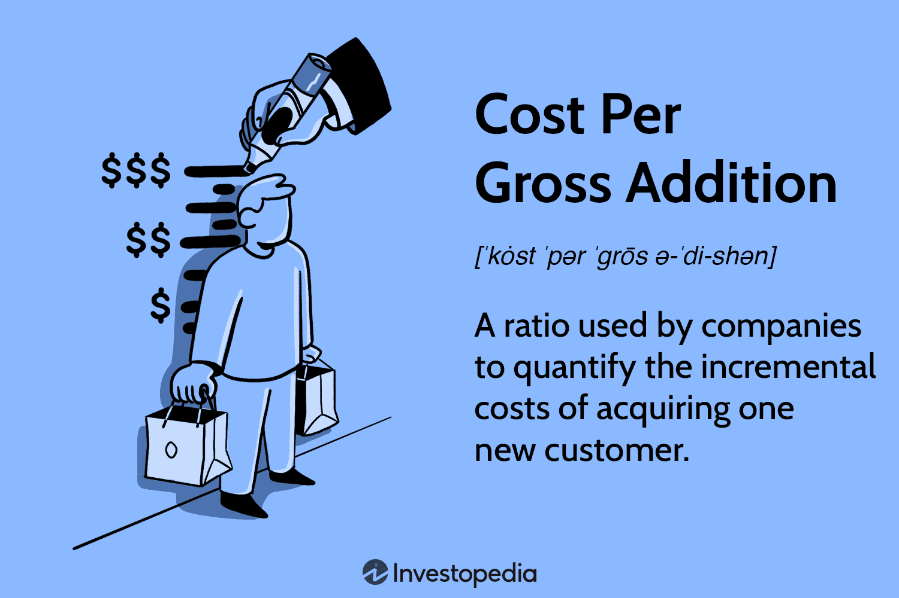

The digital economy has significantly reshaped the marketing and trading sectors, introducing sophisticated algorithms and automated systems that have changed how businesses operate. In this fast-paced environment, understanding key performance metrics such as Cost Per Gross Addition (CPGA) is vital for marketers and financial analysts. CPGA provides insights into the efficiency of customer acquisition strategies and helps in evaluating the financial impact of marketing campaigns.

This article focuses on CPGA, a central metric in measuring acquisition costs and its potential integration with algorithmic trading strategies. Algorithmic trading, known for using computational algorithms to execute trades, offers a wealth of data that can be harnessed to inform marketing strategies. By understanding the principles of both CPGA and algorithmic trading, businesses can optimize their marketing expenses and improve their overall strategic approach.



The exploration of these concepts reveals how essential they are in a technology-driven market environment. When properly understood and applied, they can guide businesses in refining their marketing spend and investment strategies. This integrated approach can ultimately make a critical difference in the success or failure of marketing initiatives.

## Table of Contents

## Understanding Cost Per Gross Addition (CPGA)

Cost Per Gross Addition (CPGA) is a pivotal metric utilized to gauge the cost incurred in acquiring a new customer. Predominantly employed by subscription-based businesses, CPGA measures the financial efficiency of marketing and sales initiatives. CPGA is calculated using the formula:

$$
\text{CPGA} = \frac{\text{Total Marketing and Sales Expenditure}}{\text{Number of New Customers Acquired}}
$$

This formula underscores the total costs associated with customer acquisition, encompassing advertising spend, promotional activities, discounts offered, and sales team expenses. For instance, if a company spends $100,000 on marketing and sales and acquires 500 new subscribers, the CPGA would be:

$$
\text{CPGA} = \frac{100,000}{500} = 200
$$

This indicates that the company pays $200 to gain each new subscriber.

Understanding CPGA is critical for making judicious business decisions. A high CPGA may indicate inefficiencies in marketing strategies or high expenditure on customer acquisition, necessitating a comprehensive evaluation of marketing efforts and channels. Conversely, a low CPGA suggests cost-effective customer acquisition strategies, presenting opportunities to amplify campaigns for broader reach and impact.

Strategically, CPGA guides pricing decisions, marketing budget allocations, and resource distribution among various customer acquisition channels. By analyzing the CPGA, companies can determine whether their current pricing strategy is sustainable in relation to acquisition costs and make necessary adjustments to increase profitability. Additionally, businesses can identify high-performing channels and optimize their marketing expenditure accordingly. Through these insights, CPGA becomes an essential tool for maximizing the return on marketing investment and steering business growth.

## Applying CPGA in Marketing Strategies

High CPGA values can be indicative of underlying inefficiencies within a company's customer acquisition strategies. When the cost per new customer surpasses anticipated limits, it's a clear signal that a reevaluation of marketing tactics is necessary. Companies can analyze their CPGA credentials to pinpoint which marketing channels or campaigns may not be performing at optimal levels, necessitating strategic refinements.

One notable case involved a subscription-based streaming service. Facing a rising CPGA, the company realized that its blanket digital advertising approach was inefficient. Upon re-evaluating the CPGA metrics correlated with their ROI data, the service shifted its strategy to more targeted campaigns focused on user personas identified with higher conversion rates. This not only reduced their CPGA but also improved their return on investment, demonstrating the crucial connection between CPGA analysis and ROI alignment.

Aligning CPGA metrics with ROI targets enables marketing teams to ensure that every dollar spent is driving bottom-line growth. Here's a simplified formula for CPGA:

$$
CPGA = \frac{\text{Total Acquisition Costs}}{\text{Number of New Customers}}
$$

Acquisition costs include advertising expenditures, promotional deals, and any other spending aimed at bringing in new customers. By regularly calculating and reviewing this metric, companies can determine the effectiveness and efficiency of their marketing investments.

Marketers can leverage CPGA data to optimize spending by performing granular analyses of marketing channels. For instance, consider a scenario where social media marketing, despite having a high initial reach, shows a disproportionate CPGA due to low conversion rates. In contrast, organic search traffic, though less voluminous initially, may have a lower CPGA indicative of higher conversion efficiency. By focusing resources on channels that exhibit lower CPGA values, marketers can fine-tune acquisition efforts and maximize ROI.

Additionally, advanced data segmentation and the application of [machine learning](/wiki/machine-learning) models can further enhance the efficiency of CPGA-driven strategies. By utilizing predictive analytics, marketers can anticipate which customer segments are likely to deliver the highest lifetime value, therefore efficiently guiding marketing spend toward acquiring these highly profitable segments.

In conclusion, CPGA is not just a static number but a pivotal metric to gauge marketing strategy effectiveness. Companies that strategically adapt their tactics based on CPGA insights can achieve more cost-effective customer acquisition, thereby enhancing overall profitability.

## Algorithmic Trading: A Brief Overview

Algorithmic trading leverages advanced computational algorithms to facilitate the automatic execution of trades based on predefined criteria. These criteria can encompass a variety of conditions, such as timing, price, or mathematical models, aimed at optimizing returns on investments. The primary objective is to execute trades at the most opportune moments, thus maximizing efficiency and profitability.

In practice, [algorithmic trading](/wiki/algorithmic-trading) functions by analyzing numerous market variables in real-time, thereby identifying trading opportunities that manual traders might overlook. This is achieved through high-frequency trading ([HFT](/wiki/high-frequency-trading-strategies)) systems, which can process trade orders at incredibly high speeds. The algorithms are designed to track market data across multiple platforms, assess risk factors, and execute trades in fractions of a second. Their speed and precision surpass human capabilities significantly, allowing for rapid response to market [volatility](/wiki/volatility-trading-strategies) and fluctuations.

The prevalence of algorithmic trading in contemporary financial markets is profound, accounting for a substantial portion of equity trading volumes globally. In the United States, for example, more than 60% of trading [volume](/wiki/volume-trading-strategy) is attributed to algorithmic trading, indicating its widespread adoption and influence.

The mechanics of algorithmic trading involve several critical components, including data analysis, strategy formulation, and execution. These processes are often automated, employing machine learning and [artificial intelligence](/wiki/ai-artificial-intelligence) to refine strategies based on real-time data and historical trading patterns. For instance, a simple python-based algorithm could be structured as follows:

```python
import pandas as pd

# Dummy function to fetch historical market data
def fetch_data(symbol):
    return pd.DataFrame({
        'time': pd.date_range(start='1/1/2022', periods=5, freq='T'),
        'price': [101, 102, 100, 105, 107]
    })

# Trading strategy based on moving average
def moving_average_strategy(symbol, short_window, long_window):
    data = fetch_data(symbol)
    data['short_mavg'] = data['price'].rolling(window=short_window, min_periods=1).mean()
    data['long_mavg'] = data['price'].rolling(window=long_window, min_periods=1).mean()

    # Generate trading signals
    data['signal'] = 0
    data['signal'][short_window:] = \
        [1 if data['short_mavg'].iloc[i] > data['long_mavg'].iloc[i] else 0 
        for i in range(short_window, len(data))]
    data['positions'] = data['signal'].diff()

    return data

symbol = 'AAPL'
result = moving_average_strategy(symbol, short_window=1, long_window=3)
print(result)
```

The above code snippet exemplifies a simple moving average strategy, which generates buy or sell signals based on the crossover between short-term and long-term moving averages. While this is a basic illustration, actual trading algorithms involve more complexity, incorporating factors such as prediction models and risk management protocols.

The critical aspects of algorithmic trading—speed and accuracy—serve to enhance performance by ensuring that trades are executed at the best possible prices, with minimal delay and reduced human error. As a result, traders and financial institutions can capitalize on even the slightest market inefficiencies.

Incorporating algorithmic trading strategies within business operations allows for enhanced decision-making and better financial outcomes. By automating processes and relying on data-driven insights, businesses minimize risk and optimize their trading strategies, aligning them with broader financial goals. As such, understanding and employing algorithmic trading is vital for participants aiming to stay competitive in fast-paced financial markets.

## Interconnecting CPGA and Algorithmic Trading

Combining Cost Per Gross Addition (CPGA) metrics with algorithmic trading insights represents a powerful intersection of marketing and finance, potentially transforming customer acquisition strategies. Understanding how these distinct domains overlap can lead to more efficient marketing spend and more effective customer acquisition processes.

Algorithmic trading, characterized by the use of algorithms for executing trades in the financial markets, generates a substantial amount of data. This data provides detailed insights into market behaviors, customer trends, and optimal timing for transactions. When integrated with CPGA metrics—a measure of the cost incurred to acquire a new customer—businesses can achieve a more nuanced understanding of their customer acquisition strategies.

By leveraging algorithmic trading data, companies can adjust their marketing decisions in real-time, potentially resulting in lower CPGA values. For instance, trading algorithms might identify periods of high market activity or specific trends that align with a company's target customer behavior. By synchronizing marketing efforts with these insights, businesses can reduce acquisition costs by targeting potential customers more efficiently during optimal windows of opportunity.

Automated trading systems, through their inherent design, prioritize speed, accuracy, and data-driven decision-making. Such systems can be adapted to enhance marketing strategies by providing predictive analytics on customer acquisition patterns and identifying cost-saving opportunities. For example, an algorithm might suggest reallocating marketing budget from underperforming channels to those showing increased customer engagement—thereby refining the overall strategy to reduce CPGA.

Case studies in industries like telecommunications and financial services demonstrate the potential for these systems. In one instance, a telecom company used algorithmic insights to better time promotional campaigns, resulting in a 15% decrease in their CPGA over a quarter. Similarly, a financial services firm optimized their digital ad spend through algorithm-driven insights, ultimately achieving a 20% reduction in acquisition costs while maintaining customer addition targets.

Through this synergy, businesses can not only cut costs but also enhance their capacity to target and acquire valuable customers. This integration marks a shift towards more intelligent marketing tactics, supported by robust data analytics from algorithmic trading environments. As companies harness these technologies, they align their marketing and trading strategies, fostering a competitive edge in increasingly data-driven markets.

## The Future of Marketing and Trading Synergies

As technology continues its rapid advancement, the convergence of marketing metrics and trading algorithms is becoming increasingly plausible and likely transformative for businesses seeking to optimize strategies. The predictive power of data in digital marketing and trading offers unparalleled opportunities for companies aiming to gain superior strategic insights. This evolution points toward an integrated approach where marketing and trading not only coexist but thrive from each other's data and techniques.

### Upcoming Trends

One of the emerging trends is the use of machine learning and artificial intelligence to analyze vast datasets. This advancement aids in identifying patterns and predicting consumer behavior with higher accuracy, leading to more informed decision-making in marketing strategies. These technologies enable real-time analysis and adjustment of campaigns, effectively lowering CPGA by optimizing resource allocation based on data-driven insights.

Another prospective development is the enhanced use of algorithmic trading techniques in marketing spend optimization. Trading algorithms, known for their precision and efficiency, can be adapted to assess and allocate marketing budgets optimally. This is achieved by employing similar algorithms that consider variables such as customer acquisition costs, predicted customer lifetime value, and market conditions.

### Skillset for the Future

Professionals possessing expertise in both marketing and algorithmic trading will be indispensable as companies navigate this hybrid landscape. Such individuals can bridge the gap between creative marketing initiatives and technical optimization processes, ensuring that strategies are not only innovative but also economically efficient.

Cross-disciplinary training will be crucial for fostering a workforce capable of excelling in this integrated environment. Teams with a comprehensive understanding of data analytics, marketing acumen, and algorithmic trading principles will be able to craft strategies that capitalize on both marketing and trading insights. 

### Encouragement for Cross-training

To fully exploit these synergies, companies are encouraged to invest in cross-training for their marketing and trading teams. Providing exposure to both fields can result in a more holistic growth approach, where marketing teams understand financial metrics and trading teams appreciate the nuances of consumer engagement. 

Companies might consider collaborative workshops, joint project tasks, and continuous learning initiatives focused on data analytics, coding, and financial strategy formulation. By embedding a culture of holistic growth and skill diversification, organizations can better position themselves at the forefront of the digital economy revolution.

Through the strategic integration of marketing and trading knowledge, businesses can not only anticipate market shifts but also proactively respond to them, ensuring resilience and profitability in an increasingly data-driven market landscape.

## Conclusion

Understanding Cost Per Gross Addition (CPGA) and its implications is essential for developing cost-efficient marketing strategies in today's technology-driven marketplace. As companies strive to optimize their marketing expenditure, CPGA serves as a critical metric in evaluating the efficiency of customer acquisition efforts. By calculating CPGA as the total marketing and sales costs divided by the number of new customers acquired, businesses can gain insights into their cost structure and make informed decisions.

Algorithmic trading complements this understanding by offering a wealth of data pivotal to refining customer acquisition methods. The precision and speed inherent in algorithmic systems allow businesses to leverage data analytics to predict market trends and customer behavior, ultimately enabling more targeted and efficient marketing campaigns. These trading algorithms analyze vast amounts of data to optimize trading decisions; similarly, incorporating this analytical capacity into marketing strategies can help in lowering CPGA values.

By marrying the robust data analytics of algorithmic trading with CPGA metrics, businesses can achieve more precise marketing and investment outcomes. This combination not only enhances the accuracy of marketing strategies but also ensures that investment decisions are informed by real-time market data. Such an integrated approach can drive both customer growth and financial performance, creating a synergistic relationship between marketing and trading operations.

Thus, the strategic application of CPGA in conjunction with algorithmic trading insights is key to maintaining competitive edge in a swiftly evolving market. As technology continues to advance, the ability to harness and integrate these tools will be paramount for businesses seeking to stay ahead and capitalize on opportunities in the digital economy.

## References & Further Reading

[1]: Bergstra, J., Bardenet, R., Bengio, Y., & Kégl, B. (2011). ["Algorithms for Hyper-Parameter Optimization."](https://dl.acm.org/doi/10.5555/2986459.2986743) Advances in Neural Information Processing Systems 24.

[2]: ["Advances in Financial Machine Learning"](https://www.amazon.com/Advances-Financial-Machine-Learning-Marcos/dp/1119482089) by Marcos Lopez de Prado

[3]: ["Evidence-Based Technical Analysis: Applying the Scientific Method and Statistical Inference to Trading Signals"](https://www.amazon.com/Evidence-Based-Technical-Analysis-Scientific-Statistical/dp/0470008741) by David Aronson

[4]: ["Machine Learning for Algorithmic Trading"](https://github.com/stefan-jansen/machine-learning-for-trading) by Stefan Jansen

[5]: ["Quantitative Trading: How to Build Your Own Algorithmic Trading Business"](https://www.amazon.com/Quantitative-Trading-Build-Algorithmic-Business/dp/1119800064) by Ernest P. Chan