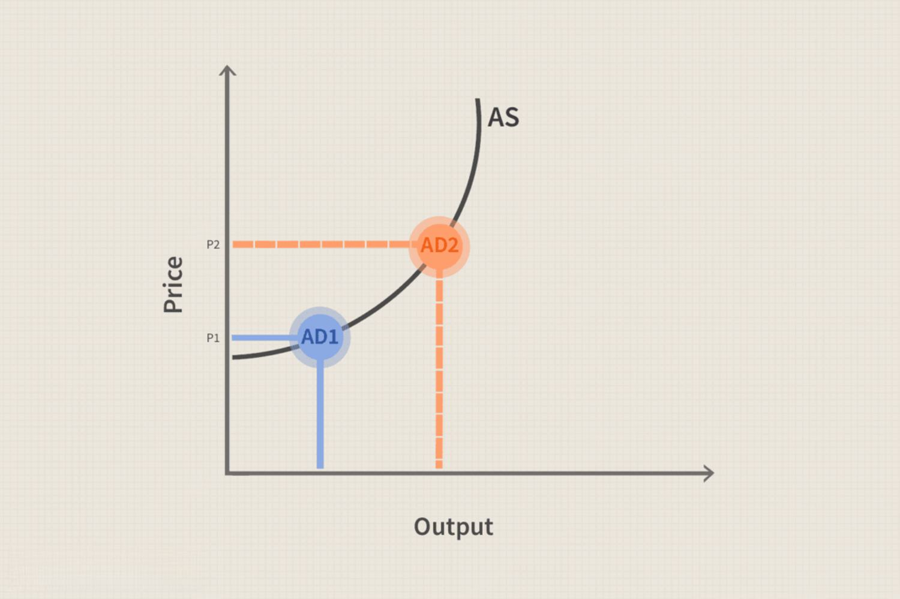

Inflation is a critical economic indicator denoting the rate at which the general level of prices for goods and services rises, consequently eroding purchasing power. It is fundamental for economic planning and forecasting, impacting consumer behavior, business investment, and policy-making. Among its various forms, two primary types are cost-push and demand-pull inflation. Cost-push inflation arises when the costs of production inputs, such as labor and raw materials, increase, leading businesses to pass these costs onto consumers in the form of higher prices. Conversely, demand-pull inflation occurs when aggregate demand within an economy surpasses aggregate supply, causing prices to rise due to higher consumer spending, investment, or government expenditure.

These inflation types have distinct causes and far-reaching impacts on financial markets and economic systems. Cost-push inflation often results from supply-side constraints, such as an increase in the price of oil or other essential commodities, which can lead to higher production costs and reduced economic output. Demand-pull inflation, meanwhile, is typically driven by strong economic growth, characterized by low unemployment and heightened consumer confidence, leading to a surge in spending that outstrips supply.



Understanding the interplay between these inflation types and financial markets is vital for investors and traders. Inflation affects a variety of asset classes, from stocks and bonds to currencies, influencing both the pricing of assets and the behavior of market participants. Stocks may see reduced earnings potential and diminished returns during inflationary periods due to increased costs. In bond markets, rising inflation often leads to higher interest rates and lower bond prices. Inflation can also affect currency valuations, with potential repercussions for exchange rates and international trade.

For those engaged in algorithmic trading, recognizing and adapting to inflationary conditions is crucial for optimizing trading strategies. Algorithmic trading, which employs complex mathematical models and technology-driven systems to execute trades at high speed and volume, relies on accurate real-time data to make informed decisions. Inflation data, such as Consumer Price Index (CPI) and Producer Price Index (PPI), are integral to these models, enabling traders to adjust strategies dynamically in response to shifting economic landscapes.

This article investigates how inflation influences financial markets and evaluates the role of algorithmic trading in adapting to these impacts. By enhancing their understanding of inflation dynamics and integrating adaptive trading strategies, investors and traders can better navigate economic fluctuations and potentially improve their financial outcomes.

## Table of Contents

## Understanding Cost-Push and Demand-Pull Inflation

Inflation is an economic phenomenon characterized by the general increase in prices and the corresponding decrease in the purchasing power of money. It is crucial to comprehend the different types and causes of inflation to understand its broader impact on the economy. Two primary types of inflation are cost-push inflation and demand-pull inflation, each arising from different economic conditions.

Cost-push inflation occurs when rising costs in production, such as wages and the cost of raw materials, lead to an overall increase in prices. This type of inflation typically originates from the supply side of the economy. For instance, if there is a significant increase in the cost of oil, which is a fundamental input for various industries, the production costs for numerous goods and services will rise. As a result, businesses may pass these increased costs to consumers, leading to inflation. Cost-push inflation can also stem from supply chain disruptions or shortages, which limit the supply of goods and thereby increase prices.

Mathematically, cost-push inflation can be represented by changes in the cost of a key input [factor](/wiki/factor-investing). For example:
$$
\text{Cost-Push Inflation} = \frac{\Delta \text{Cost of Input}}{\text{Total Production Output}}
$$

On the other hand, demand-pull inflation is driven by an increase in aggregate demand that outpaces the economy's ability to supply goods and services. This type of inflation is demand-side oriented and occurs when consumers have increased purchasing power or confidence, leading them to spend more. The increase in demand creates pressure on existing supply, leading businesses to raise prices. Demand-pull inflation can be exacerbated by factors such as fiscal stimulus, expansionary monetary policy, or increases in consumer wealth.

An illustrative model for demand-pull inflation can be approached through the basic supply-demand framework:
$$
\text{Excess Demand} = \text{Aggregate Demand} - \text{Aggregate Supply}
$$
where an increase in aggregate demand without a corresponding increase in aggregate supply leads to upward pressure on prices.

Both cost-push and demand-pull inflation result in reduced purchasing power for consumers as they face higher prices for goods and services. However, the origins of these inflation types differ significantly, reflecting either an imbalance in supply costs or in consumer demand. Understanding these distinctions allows policymakers and economists to tailor appropriate measures to manage inflationary pressures, whether they are targeting supply constraints or demand surges.

## The Impact of Inflation on Financial Markets

Inflation affects various segments of financial markets in distinct ways, impacting stocks, bonds, and currencies. Understanding these influences is crucial for investors and traders seeking to devise effective strategies in response to inflationary pressures.

In the stock market, inflation can erode corporate earnings, which in turn affects share prices. Companies facing higher input costs due to inflation may see their profit margins compressed unless they can pass these costs onto consumers by raising prices. However, if the inflation rate exceeds economic growth, consumer purchasing power is diminished, potentially leading to reduced sales volumes. The overall effect of inflation on equity markets is nuanced and contingent upon the ability of businesses to adjust pricing strategies and cost structures.

Bond markets are particularly sensitive to inflationary conditions because rising inflation typically results in higher interest rates. Central banks often respond to inflation by increasing benchmark interest rates to curb spending and borrowing, which consequently lowers bond prices. The inverse relationship between interest rates and bond prices is a fundamental concept in fixed income markets, expressed mathematically as:

$$
P = \frac{C}{(1 + r)^t}
$$

where $P$ represents the bond price, $C$ denotes the coupon payment, $r$ is the interest rate, and $t$ is the time to maturity. As interest rates ($r$) rise, the present value ($P$) of future coupon payments decreases, leading to a decline in bond prices.

Inflation also causes currency values to fluctuate, influencing foreign exchange markets. A higher inflation rate in a country typically depreciates its currency compared to those with lower inflation, as purchasing power declines. This depreciation impacts international trade competitiveness and capital flows. The relationship between inflation and currency value can be captured by the Purchasing Power Parity (PPP) theory, which states:

$$
S = \frac{P_1}{P_2}
$$

where $S$ is the exchange rate between two countries, $P_1$ is the price level in the domestic economy, and $P_2$ is the price level in the foreign economy.

Investors must account for these impacts by diversifying portfolios and developing strategies that hedge against inflation risks. Techniques such as inflation-linked bonds, commodities, and real asset investments are commonly employed to mitigate inflationary impacts. Understanding the dynamics of inflation across financial markets enables traders and investors to make informed decisions, optimizing their strategies for economic conditions characterized by varying rates of inflation.

## Integration of Inflation in Algorithmic Trading

Algorithmic trading employs mathematical and statistical models to execute trades with speed and precision that far surpass human capabilities. These systems depend heavily on real-time data, making inflation indicators crucial components for strategy adjustments. Consumer Price Index (CPI) and Producer Price Index (PPI) are common economic indicators that algorithms use to understand the inflationary environment, helping to adjust their strategies accordingly.

Inflation data alters the fundamental assumptions of models used in [algorithmic trading](/wiki/algorithmic-trading). For instance, a sudden increase in CPI might signal rising consumer prices, prompting an algorithm to favor assets traditionally hedged against inflation, such as commodities or inflation-linked bonds. On the other hand, static modeling might result in significant trading errors. Thus, it is essential to recalibrate models frequently based on new inflation data.

Machine learning and econometric models provide more advanced methods for integrating inflation data into trading algorithms. Supervised learning models, such as regression and decision trees, can be trained on historical inflation data to predict inflation trends and their impact on asset prices. Econometric models like the Vector Autoregression (VAR) model might be used to understand the relationship between multiple macroeconomic variables, allowing traders to forecast how changes in CPI and PPI can affect markets.

Python is an extensively used programming language in algorithmic trading for its capabilities in data analysis and [machine learning](/wiki/machine-learning). Using libraries like Pandas and Scikit-learn, traders can clean and analyze historical inflation data to train machine learning models.

Here is an example code snippet illustrating how one might use Python to predict inflation trends:

```python
import pandas as pd
from sklearn.model_selection import train_test_split
from sklearn.linear_model import LinearRegression

# Load some hypothetical CPI & PPI data
data = pd.read_csv('inflation_data.csv')

# Independent variables (features)
X = data[['CPI', 'PPI']]

# Dependent variable (target)
y = data['Inflation_Rate']

# Split the data into training and test sets
X_train, X_test, y_train, y_test = train_test_split(X, y, test_size=0.2, random_state=42)

# Create and train the model
model = LinearRegression()
model.fit(X_train, y_train)

# Predict inflation
predictions = model.predict(X_test)

# Output predictions
print(predictions)
```

This code uses historical data on CPI and PPI to predict future inflation rates. Such predictive capabilities are invaluable for algorithmic systems, as they allow for adaptive trading strategies responsive to expected inflationary conditions. Machine learning not only enhances the predictive accuracy but also enables trading algorithms to dynamically adapt to new economic realities. Incorporating this adaptive capacity is vital for trading algorithms to maintain resilience and competitiveness in fluctuating market conditions influenced by inflation.

## Adapting Trading Algorithms for Inflation

Trading algorithms must continuously adjust to the dynamic nature of economic indicators, with inflation being a critical factor influencing adjustments. A key aspect of developing effective trading strategies involves incorporating macroeconomic data to adapt to these changes. This includes integrating data such as the Consumer Price Index (CPI) and the Producer Price Index (PPI), which serve as vital indicators of inflation levels, into the decision-making processes of trading algorithms. 

### Incorporating Macroeconomic Data

To develop responsive trading strategies, it is essential to incorporate comprehensive macroeconomic datasets. Data integration involves assimilating real-time economic indicators and other relevant datasets to ensure that algorithms have a robust foundation for making informed decisions. This integration enables traders to align their strategies with current economic realities, thus heightening the precision of trading decisions.

### Backtesting with Historical Data

Backtesting plays a critical role in refining algorithmic strategies for inflation-driven market changes. This process involves testing trading algorithms against historical data to evaluate their performance under previous inflationary conditions. By simulating past market environments, traders can identify potential weaknesses in their strategies and iteratively refine them. This historical perspective fosters a deeper understanding of how inflation has impacted market dynamics over time, allowing for the adjustment of trading models to enhance performance.

### Machine Learning Techniques

Machine learning techniques significantly enhance the predictive accuracy of algorithms, especially in inflationary environments. By employing models such as neural networks or support vector machines, trading algorithms can identify complex patterns and relationships within economic datasets that may not be apparent through traditional analysis. Machine learning algorithms can also be trained to anticipate future inflationary trends by analyzing vast amounts of historical and current data, leading to improved decision-making capabilities.

For example, consider a simplistic Python implementation using machine learning to predict inflation trends:

```python
from sklearn.linear_model import LinearRegression
import numpy as np

# Sample data representing inflation rate and macroeconomic indicators
X = np.array([[1.5, 2.5], [2.0, 3.0], [2.5, 2.8], [3.0, 3.5]])  # Macroeconomic features
y = np.array([2.1, 2.5, 3.0, 3.5])  # Inflation rate

# Creating and fitting the model
model = LinearRegression()
model.fit(X, y)

# Predicting future inflation using new macroeconomic data
new_data = np.array([[3.5, 4.0]])
predicted_inflation = model.predict(new_data)
print(f"Predicted Inflation Rate: {predicted_inflation[0]}")
```

This Python snippet demonstrates how a simple linear regression model can be used to predict inflation rates based on macroeconomic indicators.

### Key Methods and Technologies

Adapting algorithms to inflationary trends involves the use of various methods and technologies. Techniques such as time-series analysis and econometric modeling are indispensable for capturing the temporal dynamics of inflation. Furthermore, parallel processing and cloud computing technologies enable the processing of vast datasets in real-time, essential for implementing adaptive strategies effectively.

Developing robust algorithms entails continuously monitoring economic indicators and adjusting models to capture shifting market dynamics induced by inflation. Efficient execution of these strategies requires leveraging cutting-edge technologies and analytical methods, ensuring that trading algorithms remain responsive to ongoing economic changes.

In summary, trading algorithms that effectively incorporate macroeconomic data, utilize [backtesting](/wiki/backtesting) with historical data, and integrate advanced machine learning techniques are better equipped to navigate the complexities of inflationary environments. As a result, traders can develop more resilient strategies that are capable of adapting to inflation-induced market fluctuations.

## Case Studies in Algorithmic Trading under Inflation

Renaissance Technologies and Bridgewater Associates represent paradigm examples of algorithmic trading firms that have successfully navigated inflationary environments through advanced modeling and strategic adjustments. These firms implement sophisticated systems that dynamically adjust to macroeconomic fluctuations, using a combination of ingenuity and technology to thrive under high inflation conditions.

**Renaissance Technologies** is renowned for its quantitative models that integrate vast data arrays to forecast market movements. The firm utilizes statistical arbitrage strategies that are adaptable to volatile economic periods, such as inflation surges. One aspect of their approach involves capturing inflation signals from economic indicators like the Consumer Price Index (CPI) and Producer Price Index (PPI). These metrics help the firm anticipate shifts in the market environment, allowing their algorithms to recalibrate positions across different asset classes. Techniques like time-series analysis and machine learning are employed to discern patterns and correlations between inflation data and asset prices.

Similarly, **Bridgewater Associates** implements a strategic framework known as “All Weather,” which diversifies assets to mitigate inflationary risks. Bridgewater's models integrate macroeconomic insights, adjusting allocations in response to inflation forecasts. For example, the firm employs risk parity across various asset classes, such as equities, bonds, and commodities, which are weighted to balance risk rather than capital. Bridgewater's systems continuously ingest inflation data, which influence the strategic rebalancing of portfolios to preserve purchasing power and generate returns.

Both firms emphasize data integration, where real-time economic data streams are fed into algorithmic models. This integration enables rapid adjustments to trading strategies, ensuring responsiveness to inflationary changes. Machine learning techniques further enhance predictive accuracies, enabling the precise anticipation of market movements caused by inflation pressures.

These industry leaders illustrate the critical importance of flexible and resilient algorithmic models. The capacity to adjust strategies swiftly in response to inflationary signals is vital for sustained success in financial markets. Therefore, the lessons from Renaissance Technologies and Bridgewater Associates underscore that a thorough integration of real-time data and adaptive methodologies is essential. This adaptability not only mitigates risks associated with inflation but also capitalizes on these economic conditions to advance trading performance.

## Conclusion

Inflation plays a pivotal role in shaping financial markets, necessitating the development of adaptive trading strategies to mitigate its effects. Effective algorithmic trading, which relies on real-time economic data, integrates inflation indicators such as the Consumer Price Index (CPI) and Producer Price Index (PPI) to inform trading decisions. By doing so, algorithms can respond dynamically to shifts in inflation rates, helping traders maintain competitive advantage and manage risk effectively.

The continuous advancement of research and technology presents significant opportunities for enhancing trading models. Innovations in machine learning and econometrics allow for more accurate forecasting of inflation trends, enabling algorithms to adjust strategies preemptively. As these technologies evolve, they offer the potential to refine trading approaches, making them more resilient against economic [volatility](/wiki/volatility-trading-strategies).

A nuanced understanding of how inflation impacts various asset classes is essential for traders and investors. For instance, knowing that inflation can erode purchasing power helps in anticipating its effects on stock and bond markets. Such insights guide the development of trading strategies that can effectively navigate the complexities of economic fluctuations.

In conclusion, as inflation continues to influence financial markets, the evolution of algorithmic trading models will be critical. These models must incorporate real-time data and leverage technological advancements to ensure they remain robust and adaptive. As a result, traders and investors equipped with sophisticated, inflation-aware algorithms are better positioned to thrive amidst the challenges posed by economic dynamics.

## References & Further Reading

[1]: Mishkin, F. S. (2010). ["The Economics of Money, Banking, and Financial Markets"](https://www.pearsonhighered.com/assets/preface/0/1/3/4/0134855388.pdf). Pearson.

[2]: ["How to Measure Inflation - An Economist Walks Through the Methods"](https://usafacts.org/articles/what-is-inflation-and-how-is-it-measured/) The Economist.

[3]: ["Macroeconomics"](https://www.investopedia.com/terms/m/macroeconomics.asp) by Paul Krugman and Robin Wells.

[4]: ["Advances in Financial Machine Learning"](https://www.amazon.com/Advances-Financial-Machine-Learning-Marcos/dp/1119482089) by Marcos Lopez de Prado

[5]: ["Inflation: Causes and Effects"](https://www.economicsdiscussion.net/inflation/inflation-types-causes-and-effects-with-diagram/6401) by Robert E. Hall, National Bureau of Economic Research.

[6]: ["Quantitative Trading: How to Build Your Own Algorithmic Trading Business"](https://www.amazon.com/Quantitative-Trading-Build-Algorithmic-Business/dp/1119800064) by Ernest P. Chan