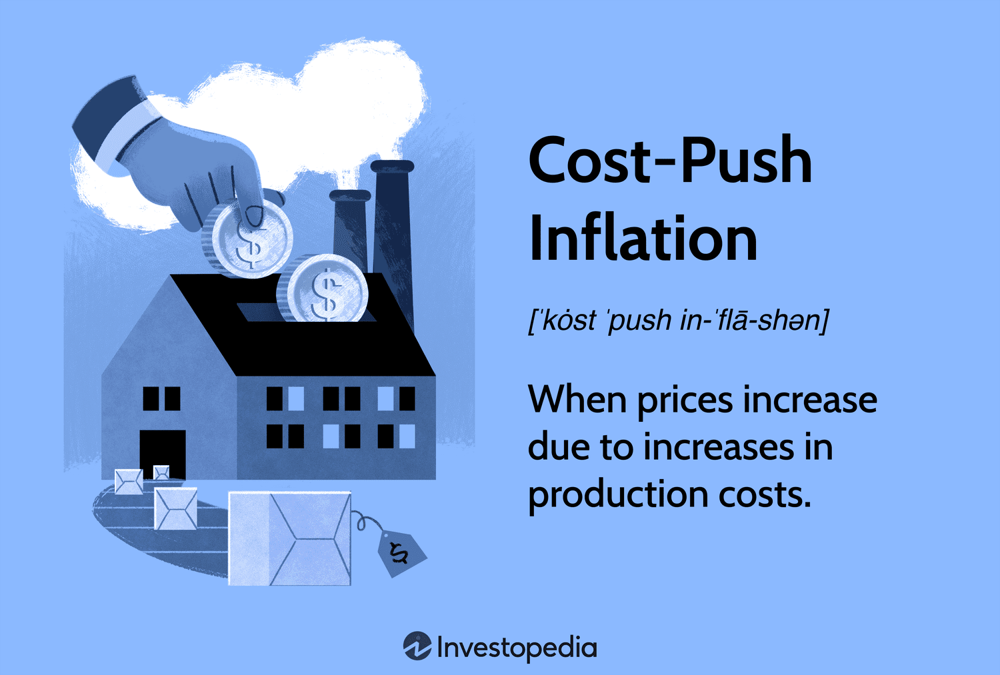

## Table of Contents

## What is cost-push inflation?

Cost-push inflation happens when the prices of things that businesses need to make their products go up. This could be because the cost of raw materials, like oil or steel, increases, or because wages for workers go up. When these costs rise, businesses have to spend more money to produce the same amount of goods. To make up for the extra costs, they raise the prices of their products. This increase in prices is what we call cost-push inflation.

When cost-push inflation happens, it can lead to a cycle where prices keep going up. For example, if the price of oil goes up, it costs more to transport goods, so businesses raise their prices. Then, workers might ask for higher wages to keep up with the rising prices, which makes the costs for businesses go up again. This back-and-forth can make inflation worse if it's not managed properly. Governments and central banks often try to control cost-push inflation by finding ways to lower the costs that businesses face or by controlling how much prices can rise.

## How does cost-push inflation differ from demand-pull inflation?

Cost-push inflation and demand-pull inflation are two different reasons why prices can go up. Cost-push inflation happens when the costs of making things, like raw materials or wages, increase. When these costs go up, businesses have to charge more for their products to cover the extra expenses. This type of inflation can start even if people aren't buying more stuff. It's like a push from the side of production that makes prices rise.

On the other hand, demand-pull inflation happens when people want to buy more things than what's available. When demand is high and there's not enough supply, businesses can raise their prices because people are willing to pay more to get what they want. This type of inflation is like pulling prices up because of strong demand from buyers. It's different from cost-push inflation because it starts with consumers wanting more, not with businesses facing higher costs.

Both types of inflation can make prices go up, but they start in different ways. Cost-push inflation is about the costs of making things going up, while demand-pull inflation is about people wanting to buy more than what's available. Understanding the difference helps in figuring out the best way to control inflation, whether it's by managing production costs or by controlling how much people can spend.

## What are the primary causes of cost-push inflation?

Cost-push inflation happens when the costs of making things go up. This can start with the price of raw materials like oil, steel, or cotton going up. When these materials become more expensive, it costs businesses more to make their products. They might then raise their prices to cover these higher costs. Another cause can be an increase in wages. If workers get paid more, the cost of labor goes up, and businesses might pass these higher costs onto customers by raising prices.

Sometimes, cost-push inflation can also come from things like taxes or regulations. If the government raises taxes on businesses or puts new rules in place that make it more expensive to produce things, businesses might raise their prices to make up for it. For example, a new environmental regulation might require businesses to spend more on cleaner technology, and they might increase prices to cover these new costs. All these reasons can lead to cost-push inflation, where prices go up because it costs more to make things.

## Can you explain how rising production costs lead to cost-push inflation?

When it costs more to make things, businesses have to spend more money on the stuff they need, like raw materials or paying their workers. Imagine a factory that makes toys. If the price of plastic goes up, it costs more to make each toy. The factory might then have to raise the price of the toys to cover the extra cost of the plastic. This is how rising production costs can lead to cost-push inflation. It starts with businesses facing higher costs, and they pass those costs onto customers by raising prices.

Sometimes, other things can make production costs go up too. For example, if the government makes new rules that businesses have to follow, like spending more on cleaner technology, it can cost more to make things. Or if wages go up because workers want to be paid more, that's another cost that businesses have to deal with. When these costs go up, businesses might raise their prices to make up for it. This can start a cycle where prices keep going up, which is what we call cost-push inflation.

## What role do wages play in causing cost-push inflation?

Wages are a big part of what businesses have to pay to make things. If workers get paid more, it costs more for businesses to make their products. When wages go up, businesses might raise the prices of their goods to cover the extra money they have to pay their workers. This is how higher wages can lead to cost-push inflation. It's like a chain reaction where higher wages mean higher costs, and then higher prices for customers.

Sometimes, workers ask for higher wages because the cost of living is going up. If the price of things like food and rent goes up, workers might need more money to keep up. When businesses give in to these demands and pay more, it can start a cycle. The higher wages make it more expensive to make things, so businesses raise their prices. Then, workers might ask for even higher wages to keep up with the new prices, and the cycle can keep going. This is another way wages can push prices up and cause cost-push inflation.

## How do commodity prices affect cost-push inflation?

Commodity prices, like the cost of oil, steel, or food, can really affect cost-push inflation. When these prices go up, it costs businesses more to make their products. For example, if the price of oil goes up, it costs more to transport goods, and businesses might have to charge more for their products to cover the extra cost. This is how higher commodity prices can push up the prices of other things.

Sometimes, the prices of commodities can go up because of things like bad weather, wars, or problems with supply chains. If a big storm damages crops, the price of food might go up. Or if there's a problem getting oil from one country to another, the price of oil can go up too. When these things happen, businesses have to pay more for what they need, and they might raise their prices to make up for it. This can start a cycle of cost-push inflation where prices keep going up because of higher commodity costs.

## What are some historical examples of cost-push inflation?

One big example of cost-push inflation happened in the 1970s. Back then, the price of oil went way up because of something called the OPEC oil embargo. OPEC is a group of countries that make a lot of oil, and they decided to stop selling oil to some countries. This made the price of oil go up a lot. Since oil is used to make and move a lot of things, it made the cost of making things go up too. Businesses had to raise their prices to cover the extra costs, and this led to cost-push inflation.

Another example was in the early 2000s, when the price of food went up a lot. This was because of things like bad weather and more people wanting to buy food. When the price of food went up, it made it more expensive for businesses to make things like bread and cereal. They had to raise their prices to cover the higher costs of the food they used. This is another way that cost-push inflation can happen, when the price of something important like food goes up.

## How do government policies influence cost-push inflation?

Government policies can have a big effect on cost-push inflation. If the government raises taxes on businesses, it can make it more expensive for them to make things. Businesses might then raise their prices to cover the extra cost of the taxes. Also, if the government makes new rules that businesses have to follow, like spending more on cleaner technology, it can cost more to make things. Businesses might raise their prices to make up for these new costs. So, government policies that make it more expensive to produce things can lead to cost-push inflation.

On the other hand, the government can also do things to try to stop cost-push inflation. For example, they might give businesses tax breaks or subsidies to help them keep their costs down. This can help stop prices from going up too much. The government can also work to make sure there's enough of things like oil and food, so the prices don't go up too high. By doing these things, the government can try to control cost-push inflation and keep prices from rising too fast.

## What are the economic impacts of cost-push inflation on businesses and consumers?

Cost-push inflation can make things harder for businesses. When the cost of making things goes up, businesses have to spend more money to produce the same amount of goods. They might have to raise their prices to cover these higher costs. But if they raise their prices too much, people might not want to buy their products anymore. This can lead to less business and even job losses. So, businesses have to find a balance between covering their costs and keeping their prices low enough that people will still buy their products.

For consumers, cost-push inflation means that the things they buy every day can get more expensive. When the prices of things like food, gas, and clothes go up, people might have to spend more money just to keep up with their normal lives. If their wages don't go up at the same time, they might have to cut back on other things they want or need. This can make life harder for people, especially if they are already struggling to make ends meet. So, cost-push inflation can affect consumers by making everything more expensive and harder to afford.

## How can businesses mitigate the effects of cost-push inflation?

Businesses can do a few things to handle cost-push inflation better. One way is to find cheaper ways to make their products. They might look for new suppliers who can give them the same materials but at a lower price. Or they might change how they make things to use less of the expensive stuff. By doing this, they can keep their costs down even when the price of things like oil or steel goes up. Another way is to make their business more efficient. This means finding ways to do the same work with fewer resources or less time. If they can do this, they might not have to raise their prices as much, which can help them keep their customers happy.

Another thing businesses can do is to think about raising prices carefully. They need to find a balance so that they can cover their higher costs without losing too many customers. Sometimes, they might choose to raise prices a little bit at a time instead of all at once. This can help customers get used to the new prices. Businesses can also look for new ways to make money, like selling different products or services that aren't affected by the rising costs. By being smart about how they handle their costs and prices, businesses can do a better job of dealing with cost-push inflation.

## What are the long-term versus short-term effects of cost-push inflation on an economy?

In the short term, cost-push inflation can make prices go up quickly. When the cost of making things goes up, businesses raise their prices to cover the extra costs. This can make life harder for people because they have to pay more for things they need every day. It can also make it tough for businesses because they might lose customers if they raise their prices too much. If people start buying less, it can slow down the economy and even lead to job losses. So, in the short term, cost-push inflation can cause a lot of problems for both people and businesses.

In the long term, cost-push inflation can lead to bigger changes in the economy. If prices keep going up because of higher costs, people might start expecting prices to keep rising. This can make them ask for higher wages, which can make costs go up even more. This cycle can keep going and make inflation worse over time. Governments and central banks might step in to try to control inflation by raising interest rates or changing policies. If they can manage it well, they might be able to slow down the inflation and help the economy get back to normal. But if they don't, the economy might keep struggling with high prices and slow growth.

## What strategies can policymakers use to combat cost-push inflation?

Policymakers can fight cost-push inflation by helping businesses keep their costs down. They might do this by giving businesses tax breaks or subsidies, which means giving them money to help pay for things. This can make it cheaper for businesses to make their products, so they don't have to raise their prices as much. Policymakers can also work to make sure there's enough of important things like oil and food, so the prices don't go up too high. By doing these things, they can help stop cost-push inflation from getting worse.

Another way policymakers can combat cost-push inflation is by controlling how much money people can spend. They might do this by raising interest rates, which makes it more expensive for people to borrow money. When people have less money to spend, they might not buy as much, which can help bring prices down. Policymakers can also change rules and regulations to make it easier for businesses to keep their costs low. By using these strategies, policymakers can try to keep prices from going up too fast and help the economy stay stable.

## References & Further Reading

[1]: Blanchard, O. (2009). ["Macroeconomics"](https://www.pearsonhighered.com/assets/preface/0/1/3/4/0134897897.pdf). Prentice Hall.

[2]: Carbaugh, R. (2019). ["Contemporary Economics: An Applications Approach"](https://www.taylorfrancis.com/books/mono/10.4324/9781315624433/contemporary-economics-robert-carbaugh). Routledge.

[3]: ["Inflation Dynamics and Monetary Policy"](https://www.federalreserve.gov/newsevents/speech/yellen20150924a.htm) by John Taylor (National Bureau of Economic Research).

[4]: Lipsey, R. G., & Chrystal, K. (2015). ["Economics"](https://books.google.com/books/about/Economics.html?id=hFVlNEC6AkUC). Oxford University Press.

[5]: Rotemberg, J. J., & Woodford, M. (1999). ["The Cyclical Behavior of Prices and Costs"](https://www.nber.org/papers/w6909). Handbook of Macroeconomics.

[6]: Hull, J. C. (2017). ["Risk Management and Financial Institutions"](https://www.amazon.com/Management-Financial-Institutions-Wiley-Finance/dp/1119932483). Wiley.