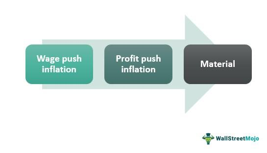

Cost-push inflation is a critical concept in the study of economics, representing one of the primary ways in which overall price levels rise in an economy. Unlike demand-pull inflation, which occurs when the demand for goods and services exceeds supply, leading to price increases, cost-push inflation arises when the costs of production inputs rise, driving up prices independently of demand. This type of inflation is often triggered by an increase in the cost of labor, raw materials, or other factors of production. For example, a sudden spike in oil prices can increase transportation and production costs across various industries, leading to a general rise in prices—a typical instance of cost-push inflation.

Understanding cost-push inflation is crucial in today's economic environment, where global supply chains and geopolitical dynamics frequently result in fluctuating production costs. For traders and economists, grasping the nuances of cost-push inflation enables more accurate predictions and strategies in response to inflationary pressures. Analyzing these trends is indispensable for investors and market participants, as inflation affects purchasing power, interest rates, and investment returns. For instance, recurring inflationary episodes can erode the real returns on fixed-income investments, prompting investors to seek inflation-hedged assets.



Moreover, the relevance of cost-push inflation extends to its impact on algorithmic trading—a domain becoming increasingly prevalent in financial markets. Algorithmic trading systems, which make decisions at rapid speeds to capitalize on market inefficiencies, must be tailored to adapt to inflationary environments. Understanding how cost-push inflation affects market volatility and pricing can improve the effectiveness of these algorithms. By incorporating inflation metrics into trading models, algorithms can respond more effectively to market changes, potentially mitigating risks associated with volatile economic conditions.

In summary, cost-push inflation constitutes a significant aspect of economic and financial analysis. For individuals and entities active in markets today, from investors to algorithmic traders, the capacity to anticipate and respond to inflation-related shifts can directly influence financial performance and decision-making efficacy. As we explore the connection between cost-push inflation and algorithmic trading further, it becomes evident that maintaining a comprehensive understanding of inflation dynamics is vital for navigating the complexities of contemporary economic landscapes.

## Table of Contents

## Understanding Cost-Push Inflation

Cost-push inflation is characterized by an increase in the price level of goods and services due to rising production costs. These increased costs are commonly linked to labor, materials, and disruptions in the supply chain. A fundamental aspect of cost-push inflation is that it occurs irrespective of demand, making it distinct from demand-pull inflation, which is driven by high consumer demand.

One of the core components that lead to cost-push inflation is increasing production costs. These costs can arise from higher prices for raw materials, energy, and other essential inputs. For instance, a surge in oil prices can escalate transportation and production expenses for various industries, ultimately increasing the prices of end products. Supply chain disruptions also contribute notably to cost-push inflation. Events such as natural disasters, trade restrictions, or logistical bottlenecks can hinder the smooth operation of supply chains, leading to scarcities and heightened production costs.

External factors play a significant role in exacerbating cost-push inflation. Raw material shortages can occur due to various reasons, including environmental constraints, regulatory changes, or over-exploitation of resources. Geopolitical events, such as political instability or conflicts, can also disrupt trade routes and access to resources, further driving up costs. For example, geopolitical tensions affecting oil-producing regions can lead to supply constraints and increased global oil prices.

History provides examples of cost-push inflation, offering valuable insights. The 1970s oil crisis is a classic instance, where a sharp increase in oil prices, triggered by geopolitical tensions in the Middle East, led to significant inflationary pressures across the globe. This period illustrated how external shocks to essential raw materials could spiral into broader economic challenges.

The impact of rising wages is another crucial [factor](/wiki/factor-investing) in understanding cost-push inflation. When wages increase, production costs may rise if businesses pass these costs onto consumers through higher prices. While rising wages can enhance workers' purchasing power, if not matched by productivity gains, they can contribute to inflationary pressures. However, moderate wage increases aligned with productivity improvements can sustain economic health without triggering significant inflation.

Businesses and consumers typically respond to cost-push inflation in several ways. Businesses might increase prices to maintain profit margins, streamline operations, or seek alternative materials to control costs. Consumers, on the other hand, might reduce discretionary spending or substitute expensive goods with cheaper alternatives. The degree of price elasticity of demand significantly influences how cost-push inflation impacts consumer behavior. For products or services with inelastic demand, consumers are less sensitive to price increases, which can exacerbate inflationary effects. 

Overall, comprehending the mechanisms of cost-push inflation is essential for policymakers and economists tasked with designing effective strategies to mitigate its impacts on the economy. Understanding these dynamics also aids investors and market participants in anticipating and navigating the complexities introduced by inflationary pressures.

## Economic Consequences of Cost-Push Inflation

Cost-push inflation occurs when increased production costs compel businesses to raise the prices of goods and services. This situation can have widespread economic repercussions, notably influencing gross domestic product (GDP) and employment rates.

Firstly, GDP growth can be adversely affected by cost-push inflation. As production costs rise, firms may reduce output to manage higher expenses, leading to a decline in economic growth. In extreme cases, businesses may downsize or shut down, which can reduce aggregate production levels. Additionally, reduced consumer purchasing power leads to lower consumption, further dampening GDP growth.

Cost-push inflation can also lead to stagflation, characterized by stagnant economic growth alongside high inflation. During stagflation, the economy suffers from low investment levels, rising unemployment, and diminishing consumer confidence, creating a challenging environment for economic recovery. A notable historical example of stagflation occurred during the 1970s, triggered by oil price shocks, resulting in prolonged economic stagnation combined with inflationary pressures.

Inflation erodes consumer purchasing power, reducing the quantity of goods and services they can afford. As the prices of goods and services increase due to higher production costs, consumers may alter their spending habits, prioritizing essentials while reducing discretionary spending. This shift in consumer behavior can impact sectors such as luxury goods and services, causing them to experience reduced demand.

Policymakers face significant challenges in managing cost-push inflation. Traditional monetary policy tools, such as [interest rate](/wiki/interest-rate-trading-strategies) adjustments, may prove less effective due to the externally driven nature of rising production costs. Increasing interest rates, for example, might further suppress economic activity without effectively addressing the root causes of inflation. Policymakers often have to balance these measures with fiscal policy or supply-side interventions that target specific industries.

Global inflationary trends can profoundly influence domestic economic policies. With interconnected economies, internal policies may sometimes mirror international inflationary practices. For instance, if inflationary pressures are global, such as commodity prices rising worldwide, domestic policymakers may have limited leverage to counteract these trends, necessitating international cooperation or policy harmonization to tackle the underlying issues.

In summary, cost-push inflation presents complex economic challenges, affecting GDP, employment, and consumer behavior, while posing substantial hurdles for policymakers tasked with maintaining economic stability amidst global inflationary pressures.

## Algorithmic Trading and Inflationary Environments

Algorithmic trading refers to the use of computer algorithms to automate trading decisions based on predefined criteria. With the rise of computational power and data analytics, [algorithmic trading](/wiki/algorithmic-trading) has grown significantly in financial markets. These algorithms can process vast amounts of data rapidly, enabling traders to make split-second decisions that would be impossible for a human to achieve.

Traders use algorithms to anticipate and react to inflationary trends by analyzing economic indicators, market data, and news releases. For instance, algorithms may incorporate data such as the Consumer Price Index (CPI) or Producer Price Index (PPI) to identify inflationary pressures. When cost-push inflation occurs due to rising production costs, these algorithms can adjust trading strategies accordingly. They may prompt the buying of inflation-linked securities like Treasury Inflation-Protected Securities (TIPS) or adjust positions in equities sensitive to inflationary changes.

In environments characterized by cost-push inflation, markets can become volatile. Algorithms play a crucial role in mitigating risks by implementing strategies such as diversification and dynamic hedging. Diversification can spread risk across various asset classes, while hedging strategies might use instruments like options or futures to protect against adverse price movements. Algorithms can dynamically adjust these strategies based on real-time data, minimizing potential losses and optimizing gains.

Historical case studies in such environments include the 1970s oil crisis, where commodity prices soared due to supply constraints, leading to inflationary pressures. In more recent contexts, algorithmic trading strategies witnessed tests during the 2008 financial crisis and the COVID-19 pandemic's economic impacts. During these periods, some algorithms successfully navigated the food and energy price inflation by reallocating capital across more resilient sectors.

Despite the capabilities of algorithmic trading, integrating inflation metrics into algorithms does have limitations. Algorithms are only as good as their input data and initial programming. Inaccurate or delayed data, such as lagging inflation reports, can lead to suboptimal trading decisions. Additionally, while algorithms are adept at responding to specific trends, they may struggle to adapt to unprecedented economic events without human oversight.

In summary, algorithmic trading offers powerful tools for anticipating and managing the complexities of inflationary environments. By integrating sophisticated data analytics and flexible decision-making algorithms, traders and financial institutions can better navigate the challenges posed by cost-push inflation. However, reliance on algorithms must be balanced with analytical insights and adaptability to an ever-changing economic landscape.

## Strategies for Navigating Cost-Push Inflation

Managing cost-push inflation is essential for investors and businesses aiming to safeguard their financial positions during periods of rising costs. A range of strategies can be employed to navigate these challenges effectively.

### Diversification and Hedging Strategies

Diversification is a fundamental strategy for mitigating the risks associated with cost-push inflation. By spreading investments across a variety of asset classes, investors can reduce the impact of rising costs on their portfolios. During inflationary periods, sectors such as commodities, real estate, and certain equities often provide a hedge against inflation. Commodities, for instance, tend to rise in price as the cost of raw materials increases, potentially offering returns that outpace inflation. 

Hedging strategies, such as investing in Treasury Inflation-Protected Securities (TIPS), provide another line of defense. TIPS are government bonds indexed to inflation, ensuring that returns are adjusted with the Consumer Price Index. Investors can also employ derivatives like futures and options to hedge against price fluctuations due to inflationary pressures.

### Monetary Policy Adjustments

Monetary policy serves as a critical tool for governments to manage inflationary pressures. Central banks may adjust interest rates to influence economic activity—raising rates can temper inflation by reducing consumer spending and borrowing capacity. However, higher interest rates can increase the cost of capital for businesses, impacting expansion plans. Therefore, policymakers must balance controlling inflation with sustaining economic growth.

Adjustments in reserve requirements and open market operations are additional monetary policy tools that can influence market [liquidity](/wiki/liquidity-risk-premium) and inflation rates. While effective, these measures can have delayed impacts on the economy, necessitating proactive policy formulation.

### Sectors and Asset Classes Resilient to Inflation

Certain sectors historically exhibit resilience during inflationary periods. Energy and utility stocks, for example, often perform well as they can pass increased cost inputs to consumers. Additionally, consumer staples—industries that provide essential goods and services—remain in demand regardless of economic conditions. Real estate is another asset class that traditionally acts as a hedge against inflation, as property values and rental incomes often rise with inflation.

Investors might also consider inflation-linked bonds and floating rate debt instruments, which provide returns that adjust with changes in inflation rates, protecting purchasing power.

### Utilizing Data Analytics for Investment Strategies

Data analytics enables investors and businesses to craft responsive strategies that adapt to evolving economic conditions. By analyzing historical inflation data and market trends, stakeholders can predict potential inflationary impacts on various sectors and asset classes. Machine learning algorithms can be particularly potent in identifying patterns and making informed forecasts.

Python is commonly used for implementing data analytics solutions due to its extensive libraries for data manipulation and analysis.

```python
import pandas as pd
import numpy as np

# Example of analyzing inflation data
inflation_data = pd.read_csv('inflation_data.csv')
inflation_trends = inflation_data.groupby('year').mean()

# Predicting inflation impact on commodity prices
from sklearn.linear_model import LinearRegression

X = inflation_trends['inflation_rate'].values.reshape(-1, 1)
y = inflation_trends['commodity_prices'].values

model = LinearRegression()
model.fit(X, y)
future_inflation = np.array([[3.5]])  # Example future inflation rate
predicted_commodity_prices = model.predict(future_inflation)
```

The ability to analyze and respond quickly to inflation data can provide investors with the flexibility needed to adjust their portfolios and strategies in real time. Consideration of these strategies can provide a buffer against the unpredictable nature of cost-push inflation, ensuring financial resilience.

## Conclusion

Cost-push inflation, characterized by rising production costs leading to higher prices, remains a significant concern for economists and investors alike. Recognizing its impact on economic indicators such as GDP and employment rates is vital for understanding broader economic consequences. Cost-push inflation can induce periods of stagflation, where inflation persists even as economic growth stagnates, presenting complex challenges for policymakers.

In recent years, the integration of algorithmic trading strategies with inflation metrics has underscored a sophisticated approach to tackling inflationary pressures. Algorithms, by design, can swiftly process vast quantities of economic data, including inflation data, enabling traders to respond promptly to market fluctuations driven by cost-push factors. This highlights the value of maintaining an updated, data-driven perspective in financial markets.

The key to navigating such dynamic economic environments lies in the continuous monitoring of economic trends and the development of adaptive financial strategies. By remaining informed about the latest economic indicators and utilizing advanced technology, investors and market participants can better shield themselves against adverse inflationary impacts.

Further research and technological advancements are essential in deepening our understanding of inflation dynamics and enhancing trading technologies. The ongoing evolution in these areas offers new opportunities to refine strategies, thereby improving resilience in a fluctuating economic landscape.

Ultimately, preparedness in the face of economic shifts is paramount. As cost structures and inflationary pressures evolve, the agility to adapt financial strategies in response becomes a critical asset, ensuring stability and growth in uncertain times.

## References & Further Reading

[1]: Blanchard, O. (2009). ["Macroeconomics"](https://www.pearsonhighered.com/assets/preface/0/1/3/4/0134897897.pdf). Prentice Hall.

[2]: Carbaugh, R. (2019). ["Contemporary Economics: An Applications Approach"](https://www.taylorfrancis.com/books/mono/10.4324/9781315624433/contemporary-economics-robert-carbaugh). Routledge.

[3]: ["Inflation Dynamics and Monetary Policy"](https://www.federalreserve.gov/newsevents/speech/yellen20150924a.htm) by John Taylor (National Bureau of Economic Research).

[4]: Lipsey, R. G., & Chrystal, K. (2015). ["Economics"](https://books.google.com/books/about/Economics.html?id=hFVlNEC6AkUC). Oxford University Press.

[5]: Rotemberg, J. J., & Woodford, M. (1999). ["The Cyclical Behavior of Prices and Costs"](https://www.nber.org/papers/w6909). Handbook of Macroeconomics.

[6]: Hull, J. C. (2017). ["Risk Management and Financial Institutions"](https://www.amazon.com/Management-Financial-Institutions-Wiley-Finance/dp/1119932483). Wiley.