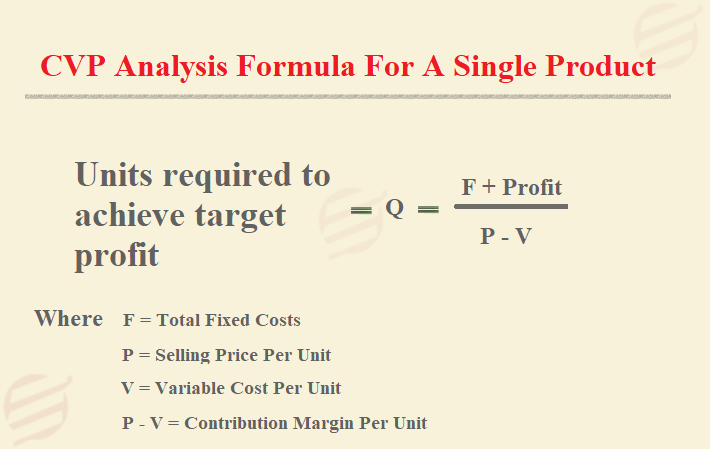

## Table of Contents

## What is Cost-Volume-Profit (CVP) analysis?

Cost-Volume-Profit (CVP) analysis is a tool that helps businesses understand how changes in costs and volume affect their profits. It looks at how sales, costs, and profit interact with each other. By using CVP analysis, a company can figure out how many products it needs to sell to break even or to make a certain amount of profit. It's useful for making decisions about pricing, what products to sell, and how much to produce.

In simple terms, CVP analysis helps answer questions like, "How many units do we need to sell to cover our costs?" or "What will happen to our profit if we lower our prices?" It involves looking at fixed costs, which stay the same no matter how much you sell, and variable costs, which change with the number of units sold. By understanding these elements, a business can plan better and make smarter choices about its operations.

## Why is CVP analysis important for businesses?

CVP analysis is important for businesses because it helps them understand the relationship between their costs, the volume of products they sell, and the profits they make. By using CVP analysis, a business can figure out how many products it needs to sell to break even, which means covering all their costs without making a profit or a loss. This is crucial because it gives business owners a clear target to aim for. If they know their break-even point, they can set realistic sales goals and plan their operations better.

Moreover, CVP analysis helps businesses make smart decisions about pricing and production. For example, if a company wants to lower its prices to attract more customers, CVP analysis can show how this change will affect their profits. It can also help a business decide whether to start selling a new product or to stop selling an old one. By understanding how costs and sales volumes impact profits, a business can choose the best strategies to grow and stay profitable.

## What are the basic components of CVP analysis?

The basic components of CVP analysis are sales revenue, variable costs, fixed costs, and profit. Sales revenue is the money a business gets from selling its products or services. Variable costs are the costs that change depending on how much is sold, like the cost of materials or labor. Fixed costs are costs that stay the same no matter how much is sold, like rent or salaries for employees who don't work on the products. Profit is what's left after all costs are subtracted from the sales revenue.

These components are used to calculate the break-even point, which is the number of units a business needs to sell to cover all its costs. To find the break-even point, you divide the total fixed costs by the contribution margin per unit. The contribution margin is the sales price per unit minus the variable cost per unit. This tells you how much each unit sold contributes to covering the fixed costs and making a profit. By understanding these components, a business can plan better and make decisions about pricing, production, and sales goals.

## How do you calculate the break-even point using CVP analysis?

To calculate the break-even point using CVP analysis, you need to know your fixed costs, variable costs, and the price you sell your product for. First, find the contribution margin per unit. This is the price you sell your product for minus the variable cost for each unit. For example, if you sell a product for $10 and it costs $6 to make, your contribution margin per unit is $4. The contribution margin tells you how much money each unit sold adds to covering your fixed costs.

Next, divide your total fixed costs by the contribution margin per unit to find the break-even point in units. If your fixed costs are $2,000 and your contribution margin per unit is $4, you divide $2,000 by $4 to get 500 units. This means you need to sell 500 units to break even, covering all your costs without making a profit or a loss. Knowing your break-even point helps you set sales goals and make decisions about pricing and production.

## What is the contribution margin and how is it used in CVP analysis?

The contribution margin is the money left over from each product sold after you pay for the costs that change with how much you sell. It's what you get when you take the price you sell your product for and subtract the variable costs, like the cost of materials or labor. For example, if you sell a product for $10 and it costs $6 to make, your contribution margin is $4. This $4 is what helps you pay for the costs that don't change, like rent or salaries for employees who don't work on the products.

In CVP analysis, the contribution margin is really important because it shows how much each product sold helps you cover your fixed costs and make a profit. To find out how many products you need to sell to break even, you divide your total fixed costs by the contribution margin per unit. If your fixed costs are $2,000 and your contribution margin per unit is $4, you need to sell 500 units to break even. This helps you set sales goals and make smart decisions about pricing and how much to produce.

## Can you explain the difference between fixed costs and variable costs in CVP analysis?

In CVP analysis, fixed costs are the costs that stay the same no matter how many products you sell. These can include things like rent for your store or office, salaries for employees who don't work directly on the products, and insurance. Even if you sell zero products or a million products, these costs don't change. Knowing your fixed costs is important because they are what you need to cover before you can start making a profit.

On the other hand, variable costs are the costs that change based on how many products you sell. These can include things like the cost of materials you use to make your product or the labor costs for workers who make the products. If you sell more products, your variable costs go up because you need more materials and labor. If you sell fewer products, your variable costs go down. In CVP analysis, understanding your variable costs helps you figure out how much each product sold contributes to covering your fixed costs and making a profit.

## How does CVP analysis help in setting sales prices and profit targets?

CVP analysis helps businesses set sales prices by showing how different prices affect their profits. If a business wants to know what price to charge for a product, they can use CVP analysis to see how different prices will change the number of units they need to sell to break even or make a profit. For example, if they raise the price, they might need to sell fewer units to break even, but they also might sell fewer products because customers might not want to pay the higher price. By understanding this, a business can choose a price that balances the need to cover costs and make a profit with what customers are willing to pay.

CVP analysis also helps businesses set profit targets by showing how many products they need to sell to reach those targets. Once a business knows its fixed costs, variable costs, and the price of its product, it can use CVP analysis to figure out how many units it needs to sell to make a certain amount of profit. For example, if a business wants to make $5,000 in profit, it can use CVP analysis to calculate how many more units it needs to sell beyond the break-even point to reach that goal. This helps the business set realistic sales goals and plan its operations to meet those targets.

## What are the limitations of CVP analysis?

CVP analysis is a helpful tool, but it has some limits. One big limit is that it assumes costs are either fixed or variable, but in real life, costs can be more complicated. Some costs might change a bit as you sell more, but not as much as true variable costs. These are called semi-variable costs, and CVP analysis doesn't handle them well. Also, CVP analysis works best when you only sell one product or when all your products have the same costs and prices. If you sell different products with different costs and prices, it can be hard to use CVP analysis accurately.

Another limit of CVP analysis is that it assumes everything you sell will be sold at the same price and that your costs will stay the same. But in real life, you might have to lower your prices to sell more, or your costs might go up because of things like inflation or changes in the market. CVP analysis also doesn't consider changes in the economy or how your competitors might affect your sales. So, while CVP analysis can help you plan, you need to remember these limits and use other tools and information to make the best decisions for your business.

## How can CVP analysis be used to assess the impact of changes in costs, volume, and prices?

CVP analysis helps businesses understand how changes in costs, volume, and prices affect their profits. For example, if a business wants to see what happens if it raises its prices, CVP analysis can show how many fewer products it might need to sell to break even or make a profit. It can also show how a price increase might change the number of customers willing to buy the product. By using CVP analysis, a business can test different price points and see which one helps them make the most profit while still attracting enough customers.

Similarly, CVP analysis can help a business figure out what happens if its costs go up or down. If the cost of materials increases, the business can use CVP analysis to see how many more products it needs to sell to cover the higher costs. On the other hand, if the business finds a way to lower its costs, CVP analysis can show how that change will help them reach their profit goals faster. By understanding these changes, a business can make smart choices about how to manage its costs and set realistic sales goals to keep making money.

## What advanced techniques can be applied to enhance the accuracy of CVP analysis?

To make CVP analysis more accurate, businesses can use something called multi-product CVP analysis. This is useful when a business sells more than one product. Instead of looking at just one product, multi-product CVP analysis looks at all the products together. It uses something called the weighted average contribution margin, which takes into account the different prices and costs of each product. By doing this, a business can get a better idea of how many of each product it needs to sell to break even or make a profit. This helps the business plan better and make decisions that consider all its products.

Another way to improve CVP analysis is by using sensitivity analysis. This technique helps a business see how changes in costs, prices, or sales volumes might affect its profits. It lets the business test different scenarios, like what happens if costs go up or if they have to lower prices. By doing sensitivity analysis, a business can be ready for different situations and make plans that work no matter what happens. This makes their CVP analysis more useful and helps them make smarter decisions.

## How does multi-product CVP analysis differ from single-product CVP analysis?

Multi-product CVP analysis is used when a business sells more than one product, while single-product CVP analysis looks at just one product. In single-product CVP analysis, you figure out how many units of that one product you need to sell to break even or make a profit. You do this by dividing your fixed costs by the contribution margin per unit, which is the price you sell the product for minus the variable cost to make it. This is simple and works well if you only sell one thing.

In multi-product CVP analysis, things get a bit more complicated because you have to consider all your products together. You use something called the weighted average contribution margin, which takes into account the different prices and costs of each product. This helps you figure out how many of each product you need to sell to cover your costs and make a profit. Multi-product CVP analysis gives you a better picture of your whole business, not just one product, so you can make smarter decisions about what to sell and how much to sell.

## What role does CVP analysis play in strategic decision-making and long-term planning?

CVP analysis helps businesses make big decisions and plan for the future. It shows how costs, how much you sell, and what you charge can affect your profits. This helps a business decide things like what new products to sell, if they should change their prices, or how much to produce. By understanding these things, a business can make plans that help it grow and stay profitable over time. For example, if a business wants to start selling a new product, CVP analysis can show how many of that product they need to sell to make it worth it.

CVP analysis also helps businesses see what might happen if things change. They can use it to test different scenarios, like what happens if costs go up or if they have to lower prices. This helps them plan for different situations and be ready for anything. By using CVP analysis, a business can set goals for the future and make decisions that help them reach those goals. It's like a roadmap that helps them navigate through changes and keep making money in the long run.

## What is CVP Analysis?

Cost-volume-profit (CVP) analysis is a fundamental financial tool employed to understand how changes in costs and sales volume affect a company's operating profit. At its core, CVP analysis is designed to support business decisions by providing insights into the financial impacts of different business scenarios.

One primary function of CVP analysis is to calculate the break-even point for a business. The break-even point represents the sales volume at which total revenues equal total costs, resulting in neither profit nor loss. This is calculated using the formula:

$$
\text{Break-even Point (in units)} = \frac{\text{Fixed Costs}}{\text{Selling Price per Unit} - \text{Variable Cost per Unit}}
$$

Fixed costs are expenses that do not change with the [volume](/wiki/volume-trading-strategy) of production or sales, such as rent and salaries. Variable costs, on the other hand, vary directly with production levels, including costs like raw materials and direct labor.

By identifying the break-even point, businesses can determine the minimum sales volume needed to avoid losses. Beyond this point, any additional sales contribute to profit.

CVP analysis also aids in understanding the impact of fixed and variable costs on a company’s profitability. By analyzing these costs, firms can explore how changes in cost structures affect the bottom line. For example, a firm might consider whether reducing variable costs through negotiating better supplier rates or investing in more efficient production equipment could improve profitability.

Additionally, CVP analysis assists firms in predicting how changes in pricing strategies or sales volumes influence profits. By evaluating different scenarios, such as price increases or expanded production, companies can choose strategies that optimize profitability. This predictive capability makes CVP analysis a critical tool for strategic decision-making in pricing and resource allocation.

## What are the Key Components of CVP Analysis?

Cost-volume-profit (CVP) analysis is a vital tool in financial management, primarily focused on understanding how different cost structures affect a company's profitability. At the heart of CVP analysis are its key components: fixed costs, variable costs, and contribution margin. Understanding these elements is crucial for effective application of CVP analysis in any business setting.

**Fixed Costs** are expenses that remain constant regardless of the level of production or sales volume. Examples include rent, salaries, and insurance. These costs do not fluctuate with changes in output, making them predictable over short periods. However, over extended periods, fixed costs may change due to business expansions or contractions.

**Variable Costs**, on the other hand, vary directly with the level of production or sales volume. Examples include raw materials, direct labor, and utilities tied to production processes. These costs increase proportionately as more units are produced and sold, making them a critical factor in determining total cost behavior.

The **Contribution Margin** is a pivotal concept in CVP analysis as it represents the amount per unit sale available to cover fixed costs and contribute to profit. It is calculated by subtracting variable costs from sales revenue. The formula for contribution margin per unit is:

$$
\text{Contribution Margin per Unit} = \text{Selling Price per Unit} - \text{Variable Cost per Unit}
$$

The **Break-even Point** is a fundamental outcome of CVP analysis, indicating the sales volume at which total revenues equal total costs, resulting in zero profit. It is calculated by dividing the total fixed costs by the contribution margin per unit:

$$
\text{Break-even Point (in units)} = \frac{\text{Total Fixed Costs}}{\text{Contribution Margin per Unit}}
$$

This calculation allows businesses to determine the minimum sales volume required to cover all costs, which is essential for pricing strategies, financial planning, and risk assessment.

By understanding and applying these components, businesses can better predict how changes in cost structures, production levels, and pricing strategies will impact profitability. This understanding aids in making informed strategic decisions, setting appropriate sales targets, and planning for future growth.

## How is CVP Analysis applied in Financial Analysis?

Cost-volume-profit (CVP) analysis plays a substantial role in financial analysis by facilitating key processes such as budgeting, forecasting, and strategic planning. This form of analysis allows businesses to examine how changes in sales volume, cost structure, and pricing strategies can influence a company’s operational profitability. As financial environments become increasingly complex, CVP provides a critical framework for simplifying decision-making and enhancing performance evaluation.

One primary application of CVP analysis is in setting sales targets and determining budget allocations for various projects or products. The ability of CVP analysis to elucidate the relationship between cost structures and revenue generation empowers companies to establish realistic sales objectives aligned with profitability goals. For instance, by evaluating the contribution margin, which is the difference between sales revenue and variable costs, businesses can ascertain the level of sales required to cover fixed costs and achieve their desired profit margins.

Mathematically, the contribution margin (CM) can be represented as:

$$
\text{CM} = \text{Sales} - \text{Variable Costs}
$$

When determining the break-even point, the analysis allows for precise calculations of the sales volume necessary to cover all costs. The break-even point (BEP) can be calculated using the formula:

$$
\text{BEP (in units)} = \frac{\text{Fixed Costs}}{\text{CM per unit}}
$$

Strategic planning benefits significantly from CVP analysis by offering insights into cost control and profit maximization strategies. Financial analysts employ CVP to assess the scalability of different projects, optimize resource allocation, and identify cost-saving opportunities. By understanding the fixed and variable costs associated with each project, companies can make informed decisions regarding expansion or downsizing, thus refining their overall business strategies.

In addition, CVP analysis serves as a cornerstone for forecasting financial performance. Financial analysts utilize CVP models to predict future financial outcomes based on varying scenarios of sales and cost assumptions. These predictions are essential for anticipating potential challenges and opportunities in the market, allowing businesses to prepare accordingly.

In summary, CVP analysis is indispensable in financial analysis, notably in budgeting, forecasting, and strategic planning. By leveraging CVP, companies can achieve clarity in their financial operations, ensuring decisions are data-informed and aligned with organizational goals for cost management and profit optimization.

## What is CVP Analysis in Algo Trading?

Algorithmic trading, a rapidly evolving area of finance, leverages computer programs to execute trading strategies at potentially high speeds and volumes. In such a dynamic environment, Cost-Volume-Profit (CVP) analysis becomes an essential framework for evaluating the profitability and viability of trading algorithms. CVP analysis provides structured insights into how different factors, such as transaction costs and traded volumes, influence profitability.

Traders often employ CVP analysis to measure the effectiveness of trading algorithms across varied market conditions. By assessing the fixed costs (e.g., initial algorithm development and software infrastructure) and variable costs (e.g., transaction fees and slippage), traders can determine the break-even point for a given strategy. The break-even point in trading can be expressed as:

$$

\text{Break-even Volume} = \frac{\text{Fixed Costs}}{\text{Contribution Margin per Unit}} 
$$

where the Contribution Margin per Unit is the revenue per trade minus the variable cost per trade. Knowing this helps traders understand how many trades need to be executed to cover all associated costs, a critical aspect when evaluating the robustness of a trading strategy.

Moreover, CVP analysis aids in risk management by illustrating the impact of volume changes on profits. Understanding this relationship is vital, especially during periods of market [volatility](/wiki/volatility-trading-strategies) when the number and size of trades can fluctuate dramatically. By using CVP, traders can better anticipate potential shifts in profitability due to these volume variations.

Consider a scenario where a trading algorithm encounters different market conditions, leading to varying transaction volumes. A CVP model could simulate these scenarios, providing insights into the algorithm's performance under each condition. This enables traders to refine their strategies, ensuring that the algorithm remains profitable across potential market states.

Furthermore, incorporating CVP analysis in [algorithmic trading](/wiki/algorithmic-trading) strategies encourages continuous improvement. Traders can regularly update their models with real trading data, refining cost structures and assumptions for enhanced accuracy. Such iterative processes make algorithms not only more efficient but also adaptable to changing economic environments, ultimately leading to more sustainable profit margins.

## References & Further Reading

[1]: ["Cost-Volume-Profit Analysis"](https://www.investopedia.com/terms/c/cost-volume-profit-analysis.asp) by Investopedia

[2]: "Breakeven Analysis: The Definitive Guide to Cost-Volume-Profit Analysis" by James W. Taylor, available in business finance textbooks.

[3]: ["Algorithmic Trading: Winning Strategies and Their Rationale"](https://www.wiley.com/en-us/Algorithmic+Trading%3A+Winning+Strategies+and+Their+Rationale-p-9781118460146) by Dr. Ernie Chan

[4]: Kaplan, R. S., & Atkinson, A. A. (1998). ["Advanced Management Accounting"](https://books.google.com/books/about/Advanced_Management_Accounting.html?id=EKBZAAAAYAAJ). Prentice Hall.

[5]: ["Valuation: Measuring and Managing the Value of Companies"](https://www.amazon.com/Valuation-Measuring-Managing-Companies-Finance/dp/1119610885) by McKinsey & Company Inc.