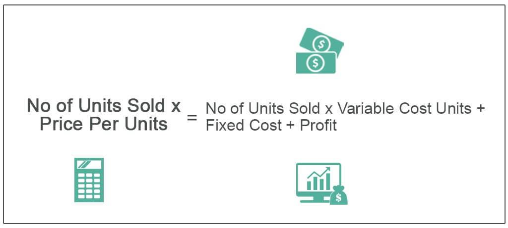

Cost-volume-profit (CVP) analysis is a pivotal tool for understanding the relationships between cost, volume, and profit in business. It plays a significant role in financial analysis by helping businesses assess profitability and make informed decisions regarding their operations. By examining how costs and sales volumes influence profit, businesses can better forecast financial outcomes and strategize accordingly. This analytical approach is essential for determining break-even points, managing resource allocation, and setting financial targets.

Algorithmic trading, or algo trading, further underscores the importance of CVP analysis. This practice involves using sophisticated computer programs to make trading decisions automatically. In such a fast-paced and data-driven environment, understanding cost structures and their impact on trading volumes becomes even more critical. CVP provides algorithmic traders with the insights needed to evaluate and optimize the performance of their trading systems under various market conditions. By integrating CVP analysis into their strategy, traders can enhance risk management and profitability potential.



This article explores the significance of CVP analysis within the context of financial analysis, highlighting its relevance to both traditional business operations and the modern world of algo trading. Through understanding CVP, readers will gain insights into optimizing profitability and making strategic financial decisions.

## Table of Contents

## What is CVP Analysis?

Cost-volume-profit (CVP) analysis is a fundamental financial tool employed to understand how changes in costs and sales volume affect a company's operating profit. At its core, CVP analysis is designed to support business decisions by providing insights into the financial impacts of different business scenarios.

One primary function of CVP analysis is to calculate the break-even point for a business. The break-even point represents the sales volume at which total revenues equal total costs, resulting in neither profit nor loss. This is calculated using the formula:

$$
\text{Break-even Point (in units)} = \frac{\text{Fixed Costs}}{\text{Selling Price per Unit} - \text{Variable Cost per Unit}}
$$

Fixed costs are expenses that do not change with the [volume](/wiki/volume-trading-strategy) of production or sales, such as rent and salaries. Variable costs, on the other hand, vary directly with production levels, including costs like raw materials and direct labor.

By identifying the break-even point, businesses can determine the minimum sales volume needed to avoid losses. Beyond this point, any additional sales contribute to profit.

CVP analysis also aids in understanding the impact of fixed and variable costs on a company’s profitability. By analyzing these costs, firms can explore how changes in cost structures affect the bottom line. For example, a firm might consider whether reducing variable costs through negotiating better supplier rates or investing in more efficient production equipment could improve profitability.

Additionally, CVP analysis assists firms in predicting how changes in pricing strategies or sales volumes influence profits. By evaluating different scenarios, such as price increases or expanded production, companies can choose strategies that optimize profitability. This predictive capability makes CVP analysis a critical tool for strategic decision-making in pricing and resource allocation.

## Key Components of CVP Analysis

Cost-volume-profit (CVP) analysis is a vital tool in financial management, primarily focused on understanding how different cost structures affect a company's profitability. At the heart of CVP analysis are its key components: fixed costs, variable costs, and contribution margin. Understanding these elements is crucial for effective application of CVP analysis in any business setting.

**Fixed Costs** are expenses that remain constant regardless of the level of production or sales volume. Examples include rent, salaries, and insurance. These costs do not fluctuate with changes in output, making them predictable over short periods. However, over extended periods, fixed costs may change due to business expansions or contractions.

**Variable Costs**, on the other hand, vary directly with the level of production or sales volume. Examples include raw materials, direct labor, and utilities tied to production processes. These costs increase proportionately as more units are produced and sold, making them a critical factor in determining total cost behavior.

The **Contribution Margin** is a pivotal concept in CVP analysis as it represents the amount per unit sale available to cover fixed costs and contribute to profit. It is calculated by subtracting variable costs from sales revenue. The formula for contribution margin per unit is:

$$
\text{Contribution Margin per Unit} = \text{Selling Price per Unit} - \text{Variable Cost per Unit}
$$

The **Break-even Point** is a fundamental outcome of CVP analysis, indicating the sales volume at which total revenues equal total costs, resulting in zero profit. It is calculated by dividing the total fixed costs by the contribution margin per unit:

$$
\text{Break-even Point (in units)} = \frac{\text{Total Fixed Costs}}{\text{Contribution Margin per Unit}}
$$

This calculation allows businesses to determine the minimum sales volume required to cover all costs, which is essential for pricing strategies, financial planning, and risk assessment.

By understanding and applying these components, businesses can better predict how changes in cost structures, production levels, and pricing strategies will impact profitability. This understanding aids in making informed strategic decisions, setting appropriate sales targets, and planning for future growth.

## Application of CVP Analysis in Financial Analysis

Cost-volume-profit (CVP) analysis plays a substantial role in financial analysis by facilitating key processes such as budgeting, forecasting, and strategic planning. This form of analysis allows businesses to examine how changes in sales volume, cost structure, and pricing strategies can influence a company’s operational profitability. As financial environments become increasingly complex, CVP provides a critical framework for simplifying decision-making and enhancing performance evaluation.

One primary application of CVP analysis is in setting sales targets and determining budget allocations for various projects or products. The ability of CVP analysis to elucidate the relationship between cost structures and revenue generation empowers companies to establish realistic sales objectives aligned with profitability goals. For instance, by evaluating the contribution margin, which is the difference between sales revenue and variable costs, businesses can ascertain the level of sales required to cover fixed costs and achieve their desired profit margins.

Mathematically, the contribution margin (CM) can be represented as:

$$
\text{CM} = \text{Sales} - \text{Variable Costs}
$$

When determining the break-even point, the analysis allows for precise calculations of the sales volume necessary to cover all costs. The break-even point (BEP) can be calculated using the formula:

$$
\text{BEP (in units)} = \frac{\text{Fixed Costs}}{\text{CM per unit}}
$$

Strategic planning benefits significantly from CVP analysis by offering insights into cost control and profit maximization strategies. Financial analysts employ CVP to assess the scalability of different projects, optimize resource allocation, and identify cost-saving opportunities. By understanding the fixed and variable costs associated with each project, companies can make informed decisions regarding expansion or downsizing, thus refining their overall business strategies.

In addition, CVP analysis serves as a cornerstone for forecasting financial performance. Financial analysts utilize CVP models to predict future financial outcomes based on varying scenarios of sales and cost assumptions. These predictions are essential for anticipating potential challenges and opportunities in the market, allowing businesses to prepare accordingly.

In summary, CVP analysis is indispensable in financial analysis, notably in budgeting, forecasting, and strategic planning. By leveraging CVP, companies can achieve clarity in their financial operations, ensuring decisions are data-informed and aligned with organizational goals for cost management and profit optimization.

## CVP Analysis in Algo Trading

Algorithmic trading, a rapidly evolving area of finance, leverages computer programs to execute trading strategies at potentially high speeds and volumes. In such a dynamic environment, Cost-Volume-Profit (CVP) analysis becomes an essential framework for evaluating the profitability and viability of trading algorithms. CVP analysis provides structured insights into how different factors, such as transaction costs and traded volumes, influence profitability.

Traders often employ CVP analysis to measure the effectiveness of trading algorithms across varied market conditions. By assessing the fixed costs (e.g., initial algorithm development and software infrastructure) and variable costs (e.g., transaction fees and slippage), traders can determine the break-even point for a given strategy. The break-even point in trading can be expressed as:

$$

\text{Break-even Volume} = \frac{\text{Fixed Costs}}{\text{Contribution Margin per Unit}} 
$$

where the Contribution Margin per Unit is the revenue per trade minus the variable cost per trade. Knowing this helps traders understand how many trades need to be executed to cover all associated costs, a critical aspect when evaluating the robustness of a trading strategy.

Moreover, CVP analysis aids in risk management by illustrating the impact of volume changes on profits. Understanding this relationship is vital, especially during periods of market [volatility](/wiki/volatility-trading-strategies) when the number and size of trades can fluctuate dramatically. By using CVP, traders can better anticipate potential shifts in profitability due to these volume variations.

Consider a scenario where a trading algorithm encounters different market conditions, leading to varying transaction volumes. A CVP model could simulate these scenarios, providing insights into the algorithm's performance under each condition. This enables traders to refine their strategies, ensuring that the algorithm remains profitable across potential market states.

Furthermore, incorporating CVP analysis in [algorithmic trading](/wiki/algorithmic-trading) strategies encourages continuous improvement. Traders can regularly update their models with real trading data, refining cost structures and assumptions for enhanced accuracy. Such iterative processes make algorithms not only more efficient but also adaptable to changing economic environments, ultimately leading to more sustainable profit margins.

## Challenges and Considerations

CVP analysis, while a pivotal tool for assessing cost and volume relationships in business, presents several challenges and considerations that practitioners must acknowledge to ensure its effective application.

One primary assumption in CVP analysis is the linearity of costs, which simplifies the relationship between cost drivers and production volume. This assumption, however, does not always hold true in real-world business scenarios. Fixed costs might experience step changes at different levels of production due to capacity constraints, and variable costs might not always change proportionately with output, affected by factors such as economies of scale or changing input costs. To address these inconsistencies, businesses need to adjust their models, incorporating more sophisticated cost functions where necessary.

In algo trading, CVP analysis must also contend with the volatility and unpredictability inherent in financial markets. External factors such as economic news, political events, and market sentiment can significantly impact trading conditions, leading to variations in transaction costs, [liquidity](/wiki/liquidity-risk-premium), and, ultimately, the profitability of trading algorithms. Consequently, traders must integrate dynamic elements into their CVP analysis, ensuring that their models can adapt to varying market conditions. This may involve using historical data to simulate a range of scenarios and stress-testing the robustness of trading strategies under different conditions.

Continual refinement of CVP models is essential for maintaining their accuracy and relevance. This involves routinely updating assumptions to reflect current market conditions and business environments. Machine learning and other advanced data analysis techniques can aid in this process, providing deeper insights and allowing for the adjustment of models based on real-time data. For example, Python's Scikit-learn library can be utilized to build predictive models of cost behavior, enhancing the precision of CVP analysis.

```python
from sklearn.linear_model import LinearRegression
import numpy as np

# Example of fitting a linear model to cost data
X = np.array([[1], [2], [3], [4], [5]])  # Production volume
y = np.array([100, 180, 250, 310, 360])  # Total cost

model = LinearRegression()
model.fit(X, y)

# Predict cost for a new production volume
predicted_cost = model.predict([[6]])
print(f"Predicted cost for production volume 6: {predicted_cost[0]}")
```

This script showcases how simple linear regression can be used to model costs in CVP analysis, though practitioners must be aware of the limitations and ensure their data closely aligns with the linearity assumption or consider polynomial regression for more complex cost behaviors.

## Conclusion

Cost-volume-profit (CVP) analysis is a crucial instrument in financial analysis and algorithmic trading, offering significant insights into the interplay between costs, sales volume, and profitability. Its strength lies in its capability to dissect cost structures and evaluate how different sales volumes impact profitability. By examining fixed and variable costs, businesses can precisely determine their break-even points and make informed strategic decisions to enhance profit margins.

For algorithmic trading, where rapid decision-making is vital, CVP analysis provides a structured approach to understanding how changes in trading volumes and costs affect the potential profitability of trading algorithms. This makes CVP analysis a valuable tool for developing robust risk management strategies and optimizing trading operations.

As businesses increasingly incorporate digital technologies and data-driven strategies, CVP analysis gains further relevance. It enables businesses to adapt to changing market conditions by providing comprehensive insights into financial performance, facilitating better resource allocation, strategic planning, and ultimately contributing to sustained profitability.

In conclusion, CVP analysis remains indispensable across sectors, particularly as businesses transition to more technology-driven models. By integrating CVP into financial strategies, organizations can better navigate the complexities of modern business environments, ensuring financial success and resilience against market volatility.

## References & Further Reading

[1]: ["Cost-Volume-Profit Analysis"](https://www.investopedia.com/terms/c/cost-volume-profit-analysis.asp) by Investopedia

[2]: "Breakeven Analysis: The Definitive Guide to Cost-Volume-Profit Analysis" by James W. Taylor, available in business finance textbooks.

[3]: ["Algorithmic Trading: Winning Strategies and Their Rationale"](https://www.wiley.com/en-us/Algorithmic+Trading%3A+Winning+Strategies+and+Their+Rationale-p-9781118460146) by Dr. Ernie Chan

[4]: Kaplan, R. S., & Atkinson, A. A. (1998). ["Advanced Management Accounting"](https://books.google.com/books/about/Advanced_Management_Accounting.html?id=EKBZAAAAYAAJ). Prentice Hall.

[5]: ["Valuation: Measuring and Managing the Value of Companies"](https://www.amazon.com/Valuation-Measuring-Managing-Companies-Finance/dp/1119610885) by McKinsey & Company Inc.