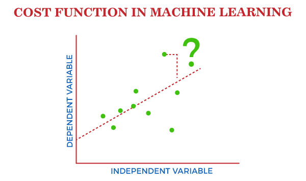

## Table of Contents

## What is cost in the context of machine learning?

In machine learning, cost refers to a measure of how wrong the model's predictions are compared to the actual outcomes. It's a way to quantify the error of the model, which helps in training the model to make better predictions. The cost function, also known as the loss function, is used to calculate this error. By minimizing the cost, the model learns to improve its accuracy over time. For example, if a model predicts house prices, the cost function would measure how far off these predictions are from the actual sale prices of the houses.

One common cost function is the Mean Squared Error (MSE), which calculates the average of the squared differences between predicted and actual values. The formula for MSE is $$ \text{MSE} = \frac{1}{n} \sum_{i=1}^{n} (y_i - \hat{y}_i)^2 $$, where $y_i$ is the actual value, $\hat{y}_i$ is the predicted value, and $n$ is the number of observations. By using this or other cost functions, machine learning algorithms can adjust their parameters to minimize the error, thereby improving the model's performance. This process is fundamental to training models and is used across various types of machine learning, from simple linear regression to complex neural networks.

## Why is cost important in machine learning models?

Cost is important in machine learning because it helps us see how well our model is doing. When we train a model, we want it to make good guesses about new data. The cost tells us how far off those guesses are from the real answers. By keeping track of the cost, we can make our model better over time. If the cost is high, it means our model is making big mistakes, and we need to fix it. If the cost is low, our model is doing a good job.

One way to think about cost is with the Mean Squared Error (MSE). The MSE formula is $$ \text{MSE} = \frac{1}{n} \sum_{i=1}^{n} (y_i - \hat{y}_i)^2 $$. This formula looks at the difference between what the model guessed and what was actually true, squares those differences, and then finds the average. By using this or other cost functions, we can adjust the model to make smaller mistakes. This is how machine learning models learn and get better at making predictions.

## How is cost calculated in machine learning?

Cost in [machine learning](/wiki/machine-learning) is calculated using a cost function, which measures how wrong the model's predictions are compared to the actual outcomes. A common cost function is the Mean Squared Error (MSE), which looks at the difference between the model's predictions and the real values, squares those differences, and then finds the average. The formula for MSE is $$ \text{MSE} = \frac{1}{n} \sum_{i=1}^{n} (y_i - \hat{y}_i)^2 $$, where $y_i$ is the actual value, $\hat{y}_i$ is the predicted value, and $n$ is the number of observations. By calculating this, we can see how well our model is doing and where it needs to improve.

Different types of problems might use different cost functions. For example, in classification problems, we might use the Cross-Entropy Loss, which measures the performance of a classification model whose output is a probability value between 0 and 1. The goal of using these cost functions is to minimize the error, which means the model will make better predictions as it learns. By adjusting the model's parameters to lower the cost, we can train the model to be more accurate over time.

## What is the difference between cost and loss in machine learning?

In machine learning, "cost" and "loss" are often used interchangeably, but they can have slightly different meanings depending on the context. Loss typically refers to the error on a single example or a small batch of examples. It's a measure of how well the model is doing on each individual prediction. For example, if you're predicting house prices, the loss would tell you how far off your prediction is for one specific house. The loss function calculates this error, and common loss functions include Mean Squared Error (MSE) for regression problems, where $$ \text{MSE} = \frac{1}{n} \sum_{i=1}^{n} (y_i - \hat{y}_i)^2 $$, and Cross-Entropy Loss for classification problems.

On the other hand, cost usually refers to the average loss over the entire training dataset. It's a broader measure that gives you an idea of how well the model is doing overall. When you're training a model, you're trying to minimize the cost by adjusting the model's parameters. This process helps the model learn and make better predictions over time. So, while loss focuses on individual errors, cost gives you a bigger picture of the model's performance across all the data it's been trained on.

## Can you explain the concept of a cost function?

A cost function is like a scorecard for a machine learning model. It tells us how well the model is doing by measuring the difference between what the model predicts and what is actually true. If the model guesses a house will sell for $200,000 but it actually sells for $250,000, the cost function helps us see how far off that guess was. By using the cost function, we can adjust the model to make better guesses over time. The goal is to make the cost as small as possible, which means the model is getting more accurate.

One common cost function is the Mean Squared Error (MSE). It works by taking the difference between the predicted value and the actual value, squaring that difference, and then averaging all those squared differences across all the examples in the dataset. The formula for MSE is $$ \text{MSE} = \frac{1}{n} \sum_{i=1}^{n} (y_i - \hat{y}_i)^2 $$, where $y_i$ is the actual value, $\hat{y}_i$ is the predicted value, and $n$ is the number of observations. By calculating the MSE, we can see how well our model is doing overall and make changes to improve it.

## What are some common types of cost functions used in machine learning?

In machine learning, different types of problems use different cost functions to measure how well a model is doing. One common cost function is the Mean Squared Error (MSE), which is used for regression problems. MSE measures the average of the squared differences between the predicted values and the actual values. The formula for MSE is $$ \text{MSE} = \frac{1}{n} \sum_{i=1}^{n} (y_i - \hat{y}_i)^2 $$, where $y_i$ is the actual value, $\hat{y}_i$ is the predicted value, and $n$ is the number of observations. This function helps the model learn by trying to make the average squared error as small as possible.

Another common cost function is the Cross-Entropy Loss, which is often used for classification problems. This function measures how well the model's predicted probabilities match the actual class labels. If the model predicts a high probability for the correct class, the Cross-Entropy Loss will be low, indicating that the model is doing well. If the model's predictions are far off, the loss will be high, showing that the model needs to improve. By minimizing the Cross-Entropy Loss, the model can learn to make better classifications over time.

## How does the choice of cost function affect model performance?

The choice of cost function can really change how well a machine learning model works. Different cost functions focus on different kinds of errors, so [picking](/wiki/asset-class-picking) the right one depends on what you want the model to do. For example, if you're trying to predict numbers, like house prices, you might use the Mean Squared Error (MSE). The MSE formula is $$ \text{MSE} = \frac{1}{n} \sum_{i=1}^{n} (y_i - \hat{y}_i)^2 $$. This function makes the model pay more attention to big mistakes because it squares the errors. If your model cares more about big errors, using MSE can help it learn to avoid them.

On the other hand, if you're trying to tell things apart, like sorting pictures of cats and dogs, you might use the Cross-Entropy Loss. This function looks at how well the model's guesses match the real answers. It helps the model learn by making it focus on getting the right probabilities for each class. If you pick the wrong cost function, like using MSE for a classification problem, the model might not learn what you want it to learn. So, choosing the right cost function is important for making sure your model does its job well.

## What is the role of cost in model optimization and training?

Cost plays a big role in making a machine learning model better. When we train a model, we want it to make good guesses about new data. The cost tells us how far off those guesses are from the real answers. By keeping track of the cost, we can change the model to make it more accurate over time. If the cost is high, it means our model is making big mistakes, and we need to fix it. If the cost is low, our model is doing a good job. One way to measure cost is with the Mean Squared Error (MSE). The formula for MSE is $$ \text{MSE} = \frac{1}{n} \sum_{i=1}^{n} (y_i - \hat{y}_i)^2 $$. This formula looks at the difference between what the model guessed and what was actually true, squares those differences, and then finds the average. By using this or other cost functions, we can adjust the model to make smaller mistakes.

During model training, the goal is to make the cost as small as possible. This process is called optimization. When we optimize the model, we change its settings, or parameters, to lower the cost. The model learns by trying different settings and seeing which ones make the cost go down. This is how machine learning models get better at making predictions. For example, if the model is guessing house prices, it will keep adjusting its guesses until the average difference between its guesses and the real prices is as small as it can get. By focusing on reducing the cost, the model can improve its performance and make more accurate predictions on new data.

## How do you minimize cost during the training of a machine learning model?

Minimizing cost during the training of a machine learning model involves adjusting the model's parameters to reduce the error between its predictions and the actual outcomes. This process is called optimization, and it's done using algorithms like gradient descent. Gradient descent works by calculating the gradient of the cost function, which shows the direction of the steepest increase in cost. By moving in the opposite direction, the model can lower its cost. For example, if you're using the Mean Squared Error (MSE) as your cost function, the formula is $$ \text{MSE} = \frac{1}{n} \sum_{i=1}^{n} (y_i - \hat{y}_i)^2 $$. The model keeps changing its parameters to make this value smaller, which means its predictions are getting closer to the real values.

The key to successfully minimizing cost is to find the right balance in adjusting the model's parameters. If you change them too much at once, you might overshoot the best solution and end up with a worse model. If you change them too little, the training might take too long or never reach the best solution. This balance is often controlled by a learning rate, which determines how big the steps are that the model takes in the direction of lower cost. By carefully tuning the learning rate and using the right optimization algorithm, the model can gradually reduce its cost and improve its performance over time.

## What are the challenges associated with using cost functions in complex models?

Using cost functions in complex models can be tricky. One big challenge is that the cost function might have many bumps and valleys, making it hard for the model to find the best solution. Imagine trying to find the lowest point in a hilly area with lots of ups and downs. This is what happens when you're trying to minimize the cost in a complex model. The model might get stuck in a spot that's not the lowest point, which is called a local minimum. This means the model thinks it's doing the best it can, but there's actually a better solution out there.

Another challenge is that some cost functions can be very sensitive to small changes in the model's parameters. For example, if you're using the Mean Squared Error (MSE) as your cost function, the formula is $$ \text{MSE} = \frac{1}{n} \sum_{i=1}^{n} (y_i - \hat{y}_i)^2 $$. If the model's guesses change just a little bit, the cost can jump up a lot because of the squaring part. This can make it hard to train the model because small adjustments might lead to big swings in the cost. To deal with these challenges, you might need to use special techniques or different optimization algorithms to help the model find the best solution and keep the cost from jumping around too much.

## How can cost functions be adapted for specific machine learning tasks?

Cost functions can be changed to fit different machine learning jobs. For example, if you're trying to guess numbers, like how much a house will sell for, you might use the Mean Squared Error (MSE). The formula for MSE is $$ \text{MSE} = \frac{1}{n} \sum_{i=1}^{n} (y_i - \hat{y}_i)^2 $$. This function works well because it makes big mistakes more important by squaring them. But if you're trying to sort things into groups, like telling cats from dogs, you might use the Cross-Entropy Loss. This function helps the model learn by focusing on getting the right probabilities for each group. By picking the right cost function, you can make sure your model learns what you want it to learn.

Sometimes, you need to tweak the cost function to match the specific needs of your task. For example, if you're working on a problem where some mistakes are more important than others, you might add weights to your cost function. This means you can tell the model to care more about certain kinds of errors. Another way to adapt cost functions is by using regularization, which adds a term to the cost function to stop the model from getting too complicated. This can help the model work better on new data it hasn't seen before. By adjusting the cost function in these ways, you can make your model better at the specific job you want it to do.

## What advanced techniques exist for managing and optimizing cost in machine learning?

One advanced technique for managing and optimizing cost in machine learning is using adaptive learning rates. This means the model changes how big its steps are when it's trying to lower the cost. Algorithms like Adam and RMSprop do this by looking at past changes in the cost and adjusting the learning rate to make the model learn faster and avoid getting stuck. Another technique is using regularization, which adds a term to the cost function to keep the model from getting too complicated. This can help the model work better on new data it hasn't seen before. For example, L2 regularization adds a term to the cost function that looks like $$ \text{Cost}_{\text{regularized}} = \text{Cost} + \lambda \sum_{i=1}^{n} \theta_i^2 $$, where $\lambda$ is a small number that controls how much the model is penalized for being too complex.

Another advanced method is using ensemble techniques, where you combine several models to make better predictions. By averaging the predictions from different models, you can lower the overall cost and make the final model more accurate. Techniques like bagging and boosting are used to create these ensembles. For example, in boosting, models are trained one after the other, with each new model focusing on the examples that the previous models got wrong. This helps in reducing the cost by making sure the model pays more attention to its mistakes. By using these advanced techniques, you can make your machine learning model more efficient and effective at minimizing the cost and improving its performance.