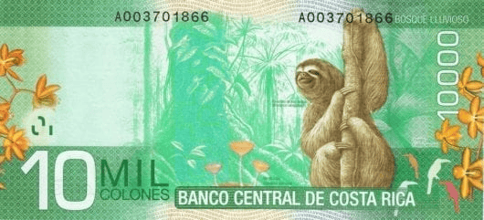

## Table of Contents

## What is the Costa Rican Colón?

The Costa Rican Colón is the official money used in Costa Rica. It is named after Christopher Columbus, who is called "Cristóbal Colón" in Spanish. The symbol for the Colón is ₡, and it is used every day by people in Costa Rica to buy things like food, clothes, and other items.

The Colón comes in both coins and paper money. The coins are used for smaller amounts, and the paper money is used for larger amounts. The value of the Colón can change compared to other countries' money, like the US dollar. This means that sometimes the Colón might be worth more or less when you want to exchange it for other currencies.

## When was the Costa Rican Colón first introduced?

The Costa Rican Colón was first introduced on April 1, 1896. Before that, Costa Rica used different types of money, including the peso. The government decided to create the Colón to have its own special money for the country.

When the Colón was introduced, it replaced the peso at a rate of 1 Colón to 12.5 pesos. This change helped make money easier to understand and use in everyday life in Costa Rica. Since then, the Colón has been the main money used in the country.

## What does the symbol for the Costa Rican Colón look like?

The symbol for the Costa Rican Colón looks like a letter "C" with a forward slash through it. It is written as ₡. This symbol is used to show prices and amounts of money in Costa Rica.

You can see this symbol on price tags in stores, on bills, and when you are paying for things. It helps people quickly know that the amount is in Colónes, the money used in Costa Rica.

## How is the Costa Rican Colón abbreviated?

The Costa Rican Colón is usually shortened to "CRC" when people write about it or in financial reports. This short form helps to quickly show that the money being talked about is the Colón from Costa Rica.

You might see "CRC" used on websites, in newspapers, or when people are talking about money in Costa Rica. It's a simple way to know that the amount is in Colónes without writing out the full name every time.

## What are the different denominations of the Costa Rican Colón?

The Costa Rican Colón comes in different amounts for both coins and paper money. The coins are for smaller amounts and include 5, 10, 25, 50, 100, and 500 colones. These coins are used every day to buy things like snacks, bus tickets, and other small items.

The paper money, or banknotes, are for bigger amounts. They come in 1,000, 2,000, 5,000, 10,000, and 20,000 colones. People use these notes to buy more expensive things like clothes, electronics, and to pay for services. Having different amounts of money helps make it easier to use the right amount for what you need to buy.

## What is the historical background of the Costa Rican Colón?

The Costa Rican Colón was first introduced on April 1, 1896. Before that, Costa Rica used the peso, but the government wanted to have its own special money. They named it after Christopher Columbus, who is called "Cristóbal Colón" in Spanish. When the Colón was introduced, it replaced the peso at a rate of 1 Colón to 12.5 pesos. This change made money easier to use and understand for people in Costa Rica.

Over the years, the Colón has gone through some changes. In the beginning, the Colón was made of gold and silver, but as time passed, the money became just paper and coins. The value of the Colón has also changed compared to other countries' money, like the US dollar. This means that sometimes the Colón might be worth more or less when you want to exchange it for other currencies. Despite these changes, the Colón has remained the main money used in Costa Rica, helping people buy things every day.

## How has the value of the Costa Rican Colón changed over time?

The value of the Costa Rican Colón has changed a lot over time, especially when you compare it to other countries' money like the US dollar. When the Colón was first introduced in 1896, it was worth more than it is now. Back then, it was made of gold and silver, which made it valuable. But as time went on, the Colón started to lose value. This means that you need more Colónes to buy things from other countries or to exchange for dollars.

Over the years, the Colón has seen times when it lost value quickly, and other times when it stayed more stable. For example, in the 1980s, the Colón lost a lot of its value because of economic problems in Costa Rica. People needed more and more Colónes to buy the same things. But the government and the Central Bank of Costa Rica have worked to keep the Colón stable. Even though it's not as strong as it used to be, the Colón is still the money that people in Costa Rica use every day to buy things they need.

## What are the key economic factors that influence the Costa Rican Colón's value?

The value of the Costa Rican Colón is affected by many things in the economy. One big thing is how much other countries want to buy things from Costa Rica, like coffee and bananas. If they want to buy a lot, the Colón might become stronger because more people need it to buy those things. Another important thing is how much money Costa Rica borrows from other countries. If they borrow a lot, it can make the Colón weaker because people might worry about paying it back. Also, the interest rates set by the Central Bank of Costa Rica can change the Colón's value. If they make interest rates higher, it can make the Colón stronger because it makes saving money in Colónes more attractive.

Another [factor](/wiki/factor-investing) is how stable the government is. If people think the government is doing a good job, they might trust the Colón more, which can make it stronger. But if there are problems or people are worried about the future, the Colón might get weaker. Inflation also plays a big role. If prices in Costa Rica go up a lot, the Colón loses value because you need more of it to buy the same things. Finally, the exchange rate with other big currencies like the US dollar can change the Colón's value. If the dollar gets stronger, the Colón usually gets weaker, and if the dollar gets weaker, the Colón might get stronger.

## How does the Costa Rican Colón compare to other currencies in Central America?

The Costa Rican Colón is one of several currencies used in Central America, but it has its own unique value and characteristics. Compared to the US dollar, which is used in countries like Panama and El Salvador, the Colón is generally weaker. This means that you need more Colónes to buy things that cost dollars. For example, in Panama and El Salvador, where the dollar is used, prices are often higher when you convert them to Colónes. The Guatemalan Quetzal and the Honduran Lempira are also used in Central America, and they are usually stronger than the Colón but not as strong as the dollar.

The Nicaraguan Córdoba is another currency in the region, and it is often weaker than the Colón. This means that if you're in Nicaragua, things might be cheaper when you convert from Colónes to Córdobas. The Belize Dollar, used in Belize, is pegged to the US dollar, making it stronger than the Colón. Overall, the value of the Colón can change a lot compared to these other currencies, depending on things like trade, borrowing, and how stable the economy is in Costa Rica. Even though it's not as strong as some other Central American currencies, the Colón is still important for everyday life in Costa Rica.

## What role does the Central Bank of Costa Rica play in managing the Colón?

The Central Bank of Costa Rica is very important for managing the Costa Rican Colón. It helps make sure the Colón stays stable and works well for people in Costa Rica. One way the Central Bank does this is by setting interest rates. If they make interest rates higher, it can make people want to save more money in Colónes, which can help the Colón get stronger. The Central Bank also keeps an eye on how much money is coming into and going out of the country. They do this to make sure there's enough Colónes for everyone to use and to stop the Colón from losing value too quickly.

Another thing the Central Bank does is control how much money is printed and put into use. They make sure there's not too much or too little money around. If there's too much, it can make prices go up, which is called inflation, and that can make the Colón weaker. The Central Bank also helps the government borrow money in a way that doesn't hurt the Colón too much. By doing all these things, the Central Bank tries to keep the Colón stable so that people in Costa Rica can use it every day to buy things they need.

## How does the Costa Rican Colón impact trade and tourism in Costa Rica?

The Costa Rican Colón plays a big role in trade and tourism in Costa Rica. For trade, the value of the Colón can affect how much it costs to buy things from other countries. If the Colón is weak, it might be cheaper for Costa Rica to buy things like machines or food from other places. But if the Colón is strong, it might be more expensive. This can change how much businesses in Costa Rica can sell their own products, like coffee and bananas, to other countries because the price in Colónes might be different when converted to dollars or other currencies.

For tourism, the Colón's value can make a big difference too. When the Colón is weaker, it can make Costa Rica a cheaper place for tourists from countries with stronger money, like the US or Europe. This means more people might want to visit and spend money in Costa Rica, which is good for hotels, restaurants, and other businesses. But if the Colón gets stronger, it might make Costa Rica more expensive for tourists, and fewer people might come. So, the Colón's value can really affect how many tourists visit and how much they spend while they're there.

## What are the future prospects and challenges for the Costa Rican Colón in the global economy?

The future of the Costa Rican Colón will depend a lot on how well Costa Rica does in the world economy. If Costa Rica can keep making and selling things like coffee, bananas, and eco-tourism, the Colón might stay strong. Also, if the government and the Central Bank keep the economy stable, more people might want to use the Colón, which can help it stay valuable. But, if other countries start buying less from Costa Rica or if there are big problems in the economy, the Colón might get weaker. So, it's important for Costa Rica to keep doing well in trade and keep the economy stable to help the Colón.

There are also challenges that could make things harder for the Colón. One big challenge is inflation, which means prices going up. If prices in Costa Rica go up a lot, the Colón could lose value because people will need more Colónes to buy the same things. Another challenge is how much money Costa Rica borrows from other countries. If they borrow too much, it might make people worried about paying it back, which can make the Colón weaker. Also, big changes in the world, like new trade deals or problems with other countries' economies, can affect the Colón too. So, Costa Rica needs to watch out for these challenges and work to keep the Colón strong.

## How can CRC be integrated into algorithmic trading?

Incorporating the Costa Rican Colón (CRC) into [algorithmic trading](/wiki/algorithmic-trading) strategies presents both challenges and opportunities. Algorithmic trading, which relies on computer programs to execute trades based on predefined criteria, offers significant advantages in terms of speed, accuracy, and the ability to process large data sets. However, the relatively smaller market size of the CRC compared to major currencies like the USD or EUR presents unique considerations.

### Challenges and Opportunities

**Challenges:**  
1. **Market Size and Trading Volume**: The CRC is traded much less frequently than major currencies, which can lead to lower liquidity. This poses a challenge for algorithmic trading, as reduced liquidity can result in higher bid-ask spreads and increased slippage. Algorithms must be carefully designed to navigate these conditions effectively.

2. **Data Availability**: Compared to global currencies, there may be less historical and real-time data available for the CRC. This can complicate backtesting and the development of predictive models. To mitigate this, traders can use statistical methods to interpolate missing data or model volatility.

3. **Exchange Rate Fluctuations**: The CRC has historically experienced fluctuations due to various factors, including economic policies and external influences. Algorithmic models need to account for such volatility, possibly by incorporating volatility forecasting with methods such as GARCH (Generalized Autoregressive Conditional Heteroskedasticity) models:
$$
   \sigma_t^2 = \alpha_0 + \alpha_1 \epsilon_{t-1}^2 + \beta_1 \sigma_{t-1}^2 

$$

   where $\sigma_t^2$ is the current period's variance, $\epsilon_{t-1}^2$ is the squared return from the previous period, and $\alpha_0, \alpha_1, \beta_1$ are parameters to be estimated.

**Opportunities:**

1. **Niche Market Strategies**: The CRC’s specific market dynamics can allow for the development of niche algorithmic strategies that capitalize on local economic events and trends, potentially outperforming generalized strategies used in more stable currency markets.

2. **Arbitrage**: Due to less competition, there may be arbitrage opportunities using CRC in cross-currency trades or between different financial instruments.

3. **Technological Advancements**: Innovations in machine learning and artificial intelligence can enhance the predictive capabilities of trading algorithms. These technologies can process non-traditional data sources, such as social media sentiment or economic indicators specific to Costa Rica, to forecast currency movements.

### Impact on Liquidity and Volatility

Algorithmic trading can potentially improve CRC's market [liquidity](/wiki/liquidity-risk-premium) by providing continuous buying and selling, thus narrowing spreads and decreasing execution costs for traders. This increased activity also has the potential to reduce [volatility](/wiki/volatility-trading-strategies) by stabilizing prices through constant market participation. However, reliance on algorithms during periods of market stress may amplify volatility, as was observed during the "flash crash" events in larger markets.

### Enhancing Efficiency

By incorporating the CRC into algorithmic strategies, traders can potentially increase the currency’s market efficiency. Algorithms can exploit inefficiencies and anomalies faster than human traders, leading to quicker price correction and a more accurate reflection of the currency's true value. Furthermore, as more traders engage in these practices, the increased demand for CRC transactions can attract further investment and interest in the Costa Rican financial markets, promoting overall economic growth.

## References & Further Reading

[1]: ["How Costa Rica Remade its Economy, and is the US Listening?"](https://www.investmentmonitor.ai/sponsored/how-costa-rica-is-growing-its-economy-to-reflect-and-serve-a-new-reality/) by BNamericas 

[2]: ["Central Bank of Costa Rica"](https://www.bccr.fi.cr/en/SitePages/Home.aspx) - Official Website of Banco Central de Costa Rica

[3]: Sharma, Vasudha. (2020). ["The Rise of Algorithmic Trading: A Legal, Regulatory, and Economic Perspective."](https://www.primedatabase.com/article/2024/Article-Rakshith_Sharma.pdf) Journal of Economics and Public Policy.

[4]: CFTC and SEC. (2010). ["Findings Regarding the Market Events of May 6, 2010"](https://www.sec.gov/news/studies/2010/marketevents-report.pdf) - Joint SEC and CFTC report on Flash Crash.

[5]: ["Costa Rica: Poverty Reduction Through Growth and Social Policy"](http://eurosocial-ii.eurosocial.eu/en/noticia/costa-rica-estrategia-nacional-reduccion-de-la-pobreza) by The World Bank Group.

[6]: Lo, Andrew W. (2004). ["The Adaptive Markets Hypothesis: Market Efficiency from an Evolutionary Perspective."](https://papers.ssrn.com/sol3/papers.cfm?abstract_id=602222) Journal of Portfolio Management.