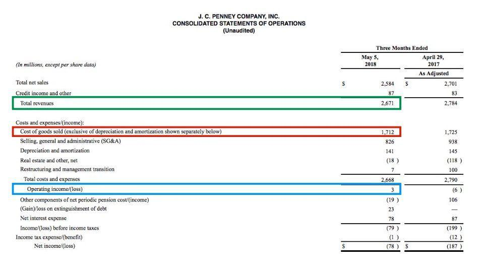

In the world of finance, understanding key financial metrics is crucial for making informed investment decisions. Among these metrics, Gross Profit Margin stands out as a vital tool for evaluating a company's financial health. Gross Profit Margin is calculated by subtracting the cost of goods sold (COGS) from total revenue and then dividing this figure by total revenue. This calculation yields a percentage that reflects the portion of revenue exceeding the cost of producing goods or services.

In recent years, the landscape of trading has been revolutionized by algorithmic trading, which leverages complex algorithms and vast amounts of data to execute trades at speeds far beyond human capability. The precision and speed of algorithmic trading make the accurate analysis of financial metrics more important than ever before. Metrics like the Gross Profit Margin are integral in providing insights into a company's operational efficiency, which can inform trading algorithms and strategies.



This article will explore the concept of Gross Profit Margin and will examine the specific costs excluded from its calculation for a clearer assessment of a company's core profitability. Furthermore, it will discuss the significance of Gross Profit Margin in algorithmic trading and how it serves as a key input in data-driven trading decisions. By focusing on these elements, the article aims to provide a comprehensive understanding of financial metrics and their growing significance in modern trading practices.

## Table of Contents

## Understanding Gross Profit Margin

Gross Profit Margin is a critical financial metric utilized to assess a company's profitability by examining the relationship between its gross profit and total revenue. The Gross Profit Margin is mathematically expressed as:

$$
\text{Gross Profit Margin} = \left( \frac{\text{Total Revenue} - \text{Cost of Goods Sold (COGS)}}{\text{Total Revenue}} \right) \times 100
$$

In this calculation, the cost of goods sold (COGS) refers to the direct costs attributed to the production of goods or services that a company sells. These costs typically include expenses such as raw materials, direct labor, and manufacturing overhead directly tied to the production process. By subtracting COGS from total revenue, we determine the gross profit, which is then divided by the total revenue to yield a percentage. This percentage represents the portion of revenue that surpasses the production costs, providing insight into the basic profitability of the company's core operations before accounting for other operating expenses.

A higher Gross Profit Margin is indicative of improved efficiency in managing production costs relative to the revenue generated. It signifies that a company retains more capital from each dollar of sales, which can be reinvested in the business, used to pay off debts, or distributed as dividends to shareholders. Conversely, a lower Gross Profit Margin suggests higher production costs or lower revenue generation, which could indicate inefficiencies or challenges in the market environment.

The significance of Gross Profit Margin extends to evaluating the core profitability of a business. It serves as a useful measure for comparing companies within the same industry, as industries have varying average margins. A robust Gross Profit Margin relative to industry peers can be a strong signal of competitive advantage, suggesting that the company is more adept at managing production costs or commanding higher prices for its products or services.

In conclusion, Gross Profit Margin is a pivotal metric for financial analysis, providing a snapshot of a company's operational efficiency and inherent profitability. It is used by investors and analysts to compare companies and identify those with potential for sustainable growth and profitability.

## Costs Excluded from Gross Profit Margin

Gross Profit Margin is a crucial financial metric used to evaluate a company's efficiency in managing production costs relative to its revenue. However, it intentionally excludes several operating expenses from its calculation to provide a clearer picture of direct production efficiency. Specifically, Gross Profit Margin focuses solely on the relationship between revenue and the cost of goods sold (COGS). This approach excludes other expenses, such as administrative costs, selling expenses, and marketing costs, that are not directly tied to the production process.

These exclusions are significant because they allow investors and analysts to concentrate on a company's core production operations without the distortions that can arise from other operational costs. By excluding these costs, the Gross Profit Margin highlights how well a company can manage its production-related expenses, thus offering insights into the efficiency and effectiveness of its production processes.

To understand the rationale behind these exclusions, consider that administrative costs, selling expenses, and marketing efforts are often variable and can be influenced by strategic decisions unrelated to production efficiency. For instance, a company might choose to invest heavily in marketing to expand its market share or incur higher administrative costs due to corporate restructuring. These actions, while affecting overall profitability, do not directly reflect the efficiency of production management.

The implications of excluding these costs from Gross Profit Margin can be illustrated with real-world examples. Consider a manufacturing company that reports a high Gross Profit Margin. This figure suggests effective management of production expenses. However, if the company has substantial administrative and marketing costs that are not included in the Gross Profit Margin, its net profit may tell a different story about overall efficiency.

In financial analysis, it is crucial to understand the impact of these excluded costs. While Gross Profit Margin provides insights into production efficiency, a comprehensive assessment of a company's financial health also requires an examination of operating expenses through metrics such as operating profit margin or net profit margin, which include these additional costs. By combining these metrics, investors and analysts can gain a more complete understanding of operational efficiency and overall profitability.

## The Role of Gross Profit Margin in Algorithmic Trading

Algorithmic trading has become a dominant force in financial markets, characterized by the use of complex algorithms and high-speed data analysis to automate trading decisions. In this context, financial metrics like Gross Profit Margin (GPM) serve as vital inputs that help algorithms evaluate a company's financial performance and market potential.

Gross Profit Margin is calculated as follows:

$$
\text{Gross Profit Margin} = \left( \frac{\text{Revenue} - \text{COGS}}{\text{Revenue}} \right) \times 100
$$

where COGS refers to the Cost of Goods Sold. This metric provides insight into how efficiently a company is managing its production costs relative to its revenue, offering a glimpse into the company's core profitability.

In [algorithmic trading](/wiki/algorithmic-trading), GPM is used to identify companies with robust financial health, which may indicate higher potential for stock appreciation. Algorithms can incorporate GPM as a parameter in quantitative models to filter and select stocks that exhibit strong profitability metrics. This helps in creating portfolios with an expected higher return on investment.

Moreover, GPM can be leveraged to predict market trends. High gross profit margins might suggest a competitive advantage or a well-controlled cost structure, contributing to a potential price increase in the company's stock. Conversely, declining GPMs could signal deteriorating market conditions or inefficiencies, prompting algorithms to adjust their strategies accordingly.

For example, a Python algorithm might screen stocks based on their GPM values, seeking those with a GPM above a certain threshold:

```python
import pandas as pd

# Sample data
data = {'Company': ['A', 'B', 'C'], 'Revenue': [1000, 1500, 1200], 'COGS': [400, 900, 800]}
df = pd.DataFrame(data)

# Calculate GPM
df['GPM'] = (df['Revenue'] - df['COGS']) / df['Revenue'] * 100

# Filter companies with GPM greater than 50%
high_gpm_companies = df[df['GPM'] > 50]

print(high_gpm_companies)
```

The use of Gross Profit Margin in algorithmic models not only enhances the precision of trading strategies but also contributes to more timely and informed decision-making processes. By analyzing the relationship between GPM and market movements, traders can better anticipate shifts in stock values and adjust their portfolios to capture profitable opportunities. Hence, Gross Profit Margin remains a crucial component in the toolkit of algorithmic traders, despite the complexities and challenges associated with financial markets.

## Challenges and Limitations

Despite its utility in assessing a company's profitability, the Gross Profit Margin (GPM) is subject to certain challenges and limitations that can affect its reliability and interpretation. One notable challenge is its exclusion of fixed and variable operating expenses, which are crucial components in determining a company's overall financial performance. The Gross Profit Margin focuses solely on the relationship between gross profit and revenue, where gross profit is calculated by subtracting the cost of goods sold (COGS) from total revenue. While this offers insights into how well a company manages its production costs, it overlooks expenses such as administrative, selling, and marketing costs, which can significantly impact net profitability. Therefore, relying solely on GPM might result in an incomplete picture of a company's financial health.

Another important consideration is the influence of fluctuating market conditions on the Gross Profit Margin's effectiveness as a standalone metric. Economic downturns, changes in consumer demand, or supply chain disruptions can alter a company's revenue and cost structures, potentially skewing the GPM and obscuring the true economic conditions faced by the company. In such cases, variations in GPM may not necessarily reflect changes in operational efficiency but rather broader economic trends that impact all businesses in the industry.

Mitigating the limitations of GPM involves combining it with other financial indicators. For instance, incorporating metrics like net profit margin, which considers all operating expenses, or earnings before interest and taxes (EBIT) can provide a well-rounded view of a company's financial performance. Using a multi-metric approach allows for a more comprehensive analysis of profitability, helping to contextualize the GPM within a broader financial framework.

For traders utilizing algorithmic models, understanding these challenges is essential to refine their trading strategies. Algorithms based solely on GPM could misinterpret market signals, leading to suboptimal trading decisions. By integrating diverse financial metrics and adjusting for broader market conditions, traders can enhance the predictive accuracy of their models, ensuring that decisions are based on a holistic assessment of a company's financial position.

In conclusion, while the Gross Profit Margin is a valuable measure of core business profitability, its limitations must be acknowledged and addressed. By leveraging a range of financial metrics and considering external economic conditions, investors and traders can derive more accurate insights, enabling informed and strategic decision-making in dynamic market environments.

## Conclusion

Gross Profit Margin remains an indispensable indicator of a company's profitability at its core, offering crucial insights even when certain operational costs are excluded from its calculation. In the context of algorithmic trading, this metric takes on even greater significance. Algorithmic models that incorporate Gross Profit Margin as a key input are equipped to assess a company’s financial health more effectively, identifying trends and potential investment opportunities swiftly.

The integration of Gross Profit Margin with other financial metrics is pivotal for traders aiming to construct resilient trading strategies. By combining Gross Profit Margin with metrics like net profit margin, return on equity, and earnings per share, traders can gain a comprehensive view of a company's overall financial performance and stability. This multi-metric approach enhances decision-making by providing a holistic picture of a company's market positioning and operational efficiency.

Recognizing the limitations of Gross Profit Margin is equally important in ensuring a balanced approach to financial analysis. It is crucial to understand that while this metric provides insights into production efficiency, it does not account for other significant expenses such as administrative and selling costs. This limitation suggests the necessity of using Gross Profit Margin alongside other metrics to derive a more accurate assessment of a company’s profitability.

By understanding the practical application of Gross Profit Margin particularly in trading, investors and traders can enhance their ability to make informed decisions, adapt to changing market conditions, and ultimately achieve better financial outcomes. This understanding ensures that Gross Profit Margin remains a vital tool in the complex landscape of today's dynamic financial markets.

## References & Further Reading

[1]: ["Understanding Financial Statements"](https://online.hbs.edu/blog/post/how-to-read-financial-statements) by Lyn M. Fraser and Aileen Ormiston

[2]: ["Algorithmic Trading: Winning Strategies and Their Rationale"](https://www.amazon.com/Algorithmic-Trading-Winning-Strategies-Rationale-ebook/dp/B00CY5HC0U) by Ernie Chan

[3]: ["Financial Statement Analysis and Security Valuation"](https://www.amazon.com/Financial-Statement-Analysis-Security-Valuation/dp/0073379662) by Stephen H. Penman

[4]: Fernández, P., & Del Campo, J. (2015). ["Gross Profit Margin: A Game of High Stakes."](https://pubmed.ncbi.nlm.nih.gov/25779918/) IESE Business School Working Paper.

[5]: ["Trading and Exchanges: Market Microstructure for Practitioners"](https://www.amazon.com/Trading-Exchanges-Market-Microstructure-Practitioners/dp/0195144708) by Larry Harris