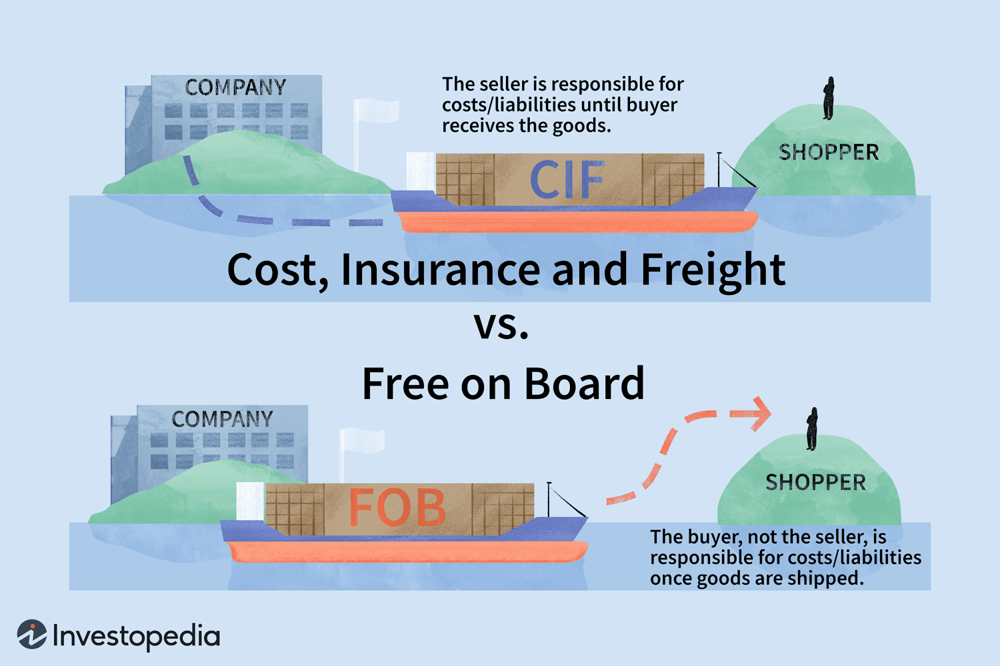

International trade is an essential component of today's interconnected global economy, representing the exchange of goods and services across international borders. It facilitates economic growth, encourages innovation, and enables countries to specialize in the production of specific goods, enhancing efficiency and productivity. The significance of international trade has skyrocketed with globalization, making it a crucial factor in determining the economic health of nations. By allowing for the comparative advantage of countries, international trade ensures a more equitable distribution of resources and skills on a worldwide scale.

A critical component of international trade is understanding the costs associated with transporting goods, particularly through maritime freight shipping—one of the oldest and most cost-effective modes of shipping large quantities of goods. In this realm, the term Free on Board (FOB) holds considerable importance. FOB costs refer to the expenses incurred by a seller to transport goods to a designated point, usually a ship's deck, from where the risk of loss or damage transfers to the buyer. These costs include not only the goods' production and transport within the seller's locale but also expenses necessary to load the goods on the shipping vessel. The clear demarcation of responsibilities and costs under FOB terms is integral to contractual agreements in international trade, often affecting pricing strategies, insurance needs, and overall logistics planning.

Moreover, the advent of algorithmic trading has transformed commerce by introducing sophisticated, data-driven strategies to price and negotiate trade deals. Algorithmic trading employs mathematical models and algorithms to automate trading decisions, primarily in commodities and foreign exchange (FX) markets. Its growing presence in commercial sectors like trade finance and logistics enhances the precision and speed of transactions, impacting global trade practices significantly. This technology helps businesses respond swiftly to market changes, manage risks effectively, and optimize costs by integrating variables such as FOB expenses and freight rates.

The interdependence of FOB costs, freight shipping, international trade, and algorithmic trading cannot be understated. Together, they form a framework that businesses must navigate to optimize their trade operations efficiently. Understanding the costs associated with FOB terms is necessary for managing freight expenses, while insights from algorithmic trading can offer strategies to mitigate these costs and enhance trade performance. This article aims to unravel these interconnected elements, offering insights into each component and guiding businesses on how to leverage algorithmic strategies for cost efficiency in international trade. Readers can expect a comprehensive exploration of FOB costs, the essentials of freight shipping, the dynamic role of algorithmic trading, and the integration of these aspects within a modern business context.

## Table of Contents

## Understanding FOB Costs in International Trade

FOB, or Free on Board, is a term commonly used in international trade agreements to specify the point at which the risk and responsibility for goods are transferred from the seller to the buyer. Under FOB terms, the seller is obligated to deliver the goods onto a designated vessel at a named port of shipment. Once the goods are loaded onto the ship, the buyer assumes responsibility for all costs and risks associated with the subsequent shipping, including freight, insurance, and import duties.

### Responsibilities Under FOB Terms

Under FOB agreements, the seller bears the costs and risks of transporting the goods to the port of shipment and loading them onto the vessel. This includes securing the goods for transport, covering any loading and handling fees at the origin port, and ensuring that the goods clear export documentation and customs. The seller must also provide the buyer with a bill of lading and other necessary shipping documents.

Conversely, once the goods are on board, the buyer takes on all risks, including potential loss or damage during sea transit. The buyer is responsible for arranging insurance, securing freight shipping, and handling import customs clearance upon arrival at the destination. The handover point is the shipping vessel at the port of origin, making it critical for buyers to understand their roles and responsibilities under FOB terms clearly.

### Impact of FOB Costs on International Shipping Expenses

FOB costs play a significant role in the overall expense calculation when shipping goods internationally. By defining who is responsible for costs and risks at different stages of the shipping process, FOB terms can influence the total shipping expenditure. These costs include:

1. **Loading and Export Fees**: Handled by the seller, these are part of the upfront costs before shipping.
2. **Freight Costs**: Once the goods are on board, the buyer covers these costs, which may vary based on shipping distance and volume.
3. **Insurance Costs**: The buyer typically covers marine insurance, which protects against loss or damage during transit.
4. **Import Fees and Duties**: Upon the goods' arrival, the buyer is also liable for these costs, affecting the landed cost of goods.

By clearly identifying who bears each cost, FOB terms impact the bottom line for both buyers and sellers, influencing pricing strategies and contract negotiations.

### Challenges and Considerations in Negotiating FOB Costs

Negotiating FOB terms can present several challenges and require careful consideration. These include:

- **Clarity in Terms**: Ensuring that both parties clearly understand their responsibilities and the point at which obligations transfer is crucial. Misunderstandings can lead to disputes and additional unforeseen costs.

- **Currency Fluctuations**: Exchange rate volatility can impact cost calculations, making it essential for buyers and sellers to factor these into their financial agreements.

- **Changes in Freight Rates**: The buyer assumes all costs post-shipment; thus, fluctuations in freight rates directly affect their expenses. Accurate freight rate forecasting is vital for budgeting.

- **Insurance Issues**: Determining the appropriate level of insurance coverage is essential to protect the buyer's investment against potential risks during transit.

Navigating these challenges requires robust communication between the buyer and seller, as well as strategic planning and flexibility to accommodate changes in shipping logistics and costs. Properly managing the intricacies of FOB terms can lead to more efficient and cost-effective international trade operations.

## Freight Shipping Essentials

Freight shipping is a critical component of international trade, acting as the backbone for moving goods across borders. It allows for the efficient transportation of a wide variety of products, from raw materials to finished goods, enabling global commerce and economic integration. The key to successful freight shipping lies in understanding the various modes of transportation available and their implications for cost, speed, and efficiency.

### Modes of Freight Shipping

There are three primary modes of freight shipping: sea, air, and land, each with its unique benefits and drawbacks.

**Sea Freight:** This mode is the most cost-effective, particularly for bulky or heavy shipments. It offers the highest capacity and the ability to transport large quantities of goods. Sea freight is ideal for non-perishable commodities and items that are not time-sensitive. However, it is slower compared to air and land transport, and its delivery schedules can be affected by weather conditions and port congestion.

**Air Freight:** Known for its speed, air freight is the preferred choice for high-value or time-sensitive goods. It ensures fast delivery and has a lower risk of damage or theft compared to other modes. However, air freight is significantly more expensive than sea and land freight, making it less suitable for heavy or low-value goods. Additionally, there are restrictions on the types of goods that can be transported by air due to safety and regulatory considerations.

**Land Freight:** This mode, encompassing rail and trucking, is versatile and often used in conjunction with sea or air transport to complete the door-to-door delivery process. It is generally more flexible and can be faster than sea freight, particularly for distances within the same continent. While trucking can offer direct delivery to many locations, it is subject to road conditions, traffic, and regulatory constraints. Rail, on the other hand, is cost-effective for long distances but requires access to rail infrastructure.

### Current Trends in Freight Shipping

The freight shipping industry is experiencing significant advancements driven by technology and digitization. These trends are reshaping how goods are transported:

- **Technology and Automation:** The introduction of automated systems and robotics in ports and freight terminals has improved efficiency and reduced human error. Automated guided vehicles (AGVs), drones, and robotic arms are increasingly used for loading and unloading cargo.

- **Digitization:** Digital platforms are enhancing transparency and decision-making in freight shipping. Real-time tracking systems, electronic bills of lading, and blockchain technology ensure secure and efficient documentation, enabling stakeholders to monitor shipments and streamline operations.

- **Sustainability Initiatives:** With an increasing focus on reducing carbon emissions, the industry is exploring sustainable practices such as the use of alternative fuels, electric vehicles, and energy-efficient shipping routes.

### Managing Freight Costs

Understanding and managing freight costs is crucial for financial management in international trade. Freight costs consist of several components, including transportation fees, fuel surcharges, insurance, and handling charges. These costs can significantly impact the bottom line and influence pricing strategies.

By assessing and optimizing these costs, businesses can achieve better financial outcomes. Techniques such as freight consolidation, choosing economical routes, and negotiating favorable terms with carriers can lead to cost savings. Moreover, businesses utilizing digital solutions for freight management can achieve significant efficiencies. For instance, freight cost calculators and logistics software help in predicting expenses, allowing firms to budget appropriately and engage in effective contract negotiations.

In summary, freight shipping plays a pivotal role in global trade, requiring careful consideration of mode, technology, and cost management to ensure optimal shipping solutions.

## The Role of Algorithmic Trading in International Trade

Algorithmic trading, often referred to as algo trading, is a method of executing trades using pre-programmed instructions that account for variables such as timing, price, and [volume](/wiki/volume-trading-strategy). Its application extends significantly into commodities and foreign exchange ([FX](/wiki/fx-anomaly)) markets, where it plays a pivotal role in streamlining operations and enhancing decision-making. 

In the commodities market, [algorithmic trading](/wiki/algorithmic-trading) facilitates efficient handling of vast quantities of data and rapid decision-making, which are crucial for managing price [volatility](/wiki/volatility-trading-strategies). Algorithms enable traders to analyze market conditions in real-time, assess historical data, and predict future trends, thereby enhancing the precision of pricing and risk management strategies. In FX markets, which operate around the clock, algorithmic trading allows for continuous monitoring and execution of trades without the need for human intervention, optimizing responses to market dynamics promptly.

The influence of algorithmic trading on pricing strategies and negotiations in international trade is substantial. Algorithms can process and interpret a wealth of market data to identify patterns and predict price movements with high accuracy. By leveraging such insights, businesses can optimize their pricing strategies, ensuring competitive positioning in global markets. Moreover, algorithms can facilitate more informed negotiations by providing real-time data analytics that strengthen a trader's position on pricing matters.

The advantages of using algorithms extend to optimizing trading decisions and managing risks effectively. Algorithms can execute trades at the most opportune moments, minimizing manual errors and ensuring that decisions are based on rigorous data analysis. This leads to increased efficiency and reduced transaction costs. Additionally, algorithms can model various risk scenarios and adjust strategies accordingly, which is particularly beneficial in mitigating market risks and managing financial exposure.

Despite its advantages, algorithmic trading is not without challenges and ethical considerations. One significant challenge is the potential for technical failures or programming errors, which could lead to substantial financial losses. The dependence on complex algorithms can also result in reduced human oversight, potentially exacerbating systemic risks during unforeseen market disruptions. Ethically, the use of high-frequency trading ([HFT](/wiki/high-frequency-trading-strategies)) algorithms has sparked debates over market fairness, as these can give technologically advanced traders undue advantages over their slower competitors.

Furthermore, the complexity of algorithmic systems raises concerns around transparency and accountability. Traders must ensure that their algorithms comply with legal standards and market regulations, as improper conduct can result in market manipulation charges or other legal repercussions. 

In conclusion, while algorithmic trading presents numerous opportunities for enhancing efficiency and precision in international trade, it also necessitates careful consideration of technical, ethical, and regulatory challenges. As such, traders must balance these factors to harness the full potential of algorithmic trading while maintaining market integrity and fairness.

## Integrating FOB Costs with Algorithmic Strategies for Efficiency

Businesses today are increasingly integrating algorithmic trading strategies to effectively manage Free on Board (FOB) and freight costs. Through these advanced methods, firms can streamline operations, reduce expenses, and improve logistic efficiency. 

Algorithmic trading, primarily used in financial markets, facilitates automated, quick decision-making based on pre-set rules or models. A similar approach can be applied to FOB and freight cost management. By analyzing historical data and predicting freight market trends, algorithms can optimize shipping routes, select cost-effective transport modes, and negotiate favorable terms. 

Tools and platforms like Flexport and Freightos enable the integration of FOB calculations within trading algorithms. These platforms utilize advanced analytics, real-time data, and [machine learning](/wiki/machine-learning) to provide visibility into shipping costs and logistics needs. For instance, Freightos employs algorithms that integrate diverse data points to automate freight pricing, comparing carrier rates and optimizing shipping routes. This leads to significant cost savings and efficiency improvements.

Case studies demonstrate the successful application of algorithmic strategies in FOB cost management. For example, a multinational electronics company utilized an AI-driven platform to optimize its shipping logistics. By inputting factors like current market rates, demand forecasts, and vessel availability, the company reduced shipping costs by 15% and improved delivery timelines.

The potential for cost savings through algorithmic trading is substantial. Algorithms can predict the best time to lock in rates, adjust shipping volumes based on commodity trends, and simulate various cost scenarios. Python libraries such as NumPy and Pandas can be used to develop models that perform complex calculations for route optimization and cost prediction. For example, an algorithm could be designed to minimize $Z = \sum_{i=1}^{n} (c_{i}x_{i})$, where $c_{i}$ represents the cost of shipping option $i$ and $x_{i}$ the decision variable for choosing that option.

Overall, the integration of algorithmic trading for FOB costs and freight management fosters not only financial savings but also operational efficiencies. By embracing technological advancements, companies can enhance their strategic positioning in the competitive landscape of international trade logistics.

## Challenges and Future Directions

Effective management of FOB costs and freight shipping amidst economic volatility presents significant challenges for businesses engaged in international trade. One of the primary challenges is the fluctuation in currency exchange rates, which can considerably affect the cost of goods once they are on board. Additionally, global supply chain disruptions, often caused by geopolitical tensions or pandemic-related restrictions, can lead to unforeseen increases in shipping expenses. These disruptions may also affect the availability of shipping routes and schedules, complicating logistics planning and FOB cost forecasting.

Global regulatory changes exert a substantial impact on FOB agreements and algorithmic trading practices. Stricter environmental regulations, such as the International Maritime Organization's sulfur cap on shipping emissions, can increase fuel costs, thereby influencing freight pricing strategies. Such regulatory frameworks necessitate adjustments in FOB agreements to reflect shared responsibilities between buyers and sellers in covering these additional costs. Similarly, algorithmic trading practices must adapt to varying compliance requirements across jurisdictions, which can impose constraints on data usage and financial transactions.

The future of international trade is likely to be shaped by the growing integration of technology and data-driven strategies. Advanced analytics and blockchain technology are expected to enhance transparency across the supply chain, leading to more informed decision-making in FOB cost negotiations and compliance with trade agreements. Moreover, the proliferation of [artificial intelligence](/wiki/ai-artificial-intelligence)-powered logistics platforms promises to optimize routing and inventory management, potentially reducing shipping costs and enhancing the efficiency of trade operations.

To innovate in freight cost management, businesses should consider adopting a multifaceted approach. Leveraging predictive analytics can help forecast market trends and currency fluctuations more accurately, enabling proactive adjustments to pricing and logistics strategies. Engaging in collaborative platforms with other stakeholders in the supply chain can facilitate information sharing and collective bargaining power, which may lead to more favorable FOB terms. Furthermore, investing in sustainable shipping practices can not only mitigate regulatory compliance costs but also align with global shifts toward environmental responsibility.

In conclusion, navigating the complexities of FOB costs and freight shipping in a volatile economic landscape requires businesses to stay informed about regulatory developments and embrace technology-driven solutions. By doing so, they can optimize their operations and maintain a competitive edge in the evolving global trade environment.

## Conclusion

In concluding our exploration of FOB costs, freight shipping, and algorithmic trading, it is clear that these components constitute fundamental pillars in the architecture of international trade. The FOB (Free on Board) framework outlines specific responsibilities for buyers and sellers, impacting the overall cost structure and negotiations in global commerce. Meanwhile, freight shipping acts as the operational backbone, facilitating the movement of goods across oceans, skies, and lands, and presenting various logistical and financial challenges.

Algorithmic trading, traditionally associated with financial markets, emerges as a transformative force in international trade, offering advanced capabilities for optimizing pricing strategies, executing trades, and managing risks. By leveraging such algorithms, businesses can align with FOB agreements and freight logistics, driving greater efficiency and potentially realizing substantial cost savings. 

The integration of innovative strategies, including algorithmic computation and digital platforms, is crucial for maximizing efficiencies and gaining competitive advantages. Businesses are encouraged to remain vigilant and informed about technological advancements such as AI, machine learning, and blockchain, which are reshaping the trade landscape.

Recognizing the dynamic and evolving nature of global trade, it is essential for future research and discussion to focus on the impacts of regulatory shifts, economic volatilities, and the continuous merging of technology with trade practices. These emerging trends will define the next phase of globalization, offering opportunities for businesses poised to adapt and innovate.

## References & Further Reading

[1]: Incoterms® 2020 by the International Chamber of Commerce (ICC). This publication provides detailed and official insights on international commercial terms, including Free on Board (FOB).

[2]: Branch, A. E. (2011). "Elements of Shipping." Routledge. This book covers the fundamentals of maritime shipping, including costs and regulations associated with freight transport.

[3]: "Maritime Economics" by Martin Stopford. This book provides comprehensive insights into the economics of shipping markets, aligning with discussions on freight rates and FOB costs.

[4]: Domowitz, I., & Steil, B. (2001). "Automation, Trading Costs, and the Structure of the Securities Trading Industry." In this paper, the impact of technology such as algorithmic trading on trading costs and market structure is analyzed, relevant to the intersection of algorithmic trading and trade logistics discussed.

[5]: "Algorithmic Trading and DMA: An Introduction to Direct Access Trading Strategies" by Barry Johnson. This text offers an elaborate overview of algorithmic trading techniques employed in various markets.

[6]: Freightos. (n.d.). Freightos.com. [Website providing freight rate comparisons and digital solutions for freight management](https://www.freightos.com/cheap-freight-rates/), notable for its role in integrating technology with logistics as mentioned in the content.

[7]: Wood, D. J., Logemann, H., & Dent, J. (2006). "Sustainable Development and International Business: A Study Quadruple International Journal of Operations & Production Management." This paper details economic changes and sustainable practices in international business, relevant to freight shipping's sustainability trends discussed.

[8]: "The Future of Global Trade and Investment" by Emma Aisbett and others, in "In-Depth Integrated Review of International Trade Flows and their Environmental Impacts" symposium proceedings, which discusses future trends and challenges in global trade, including regulatory aspects.