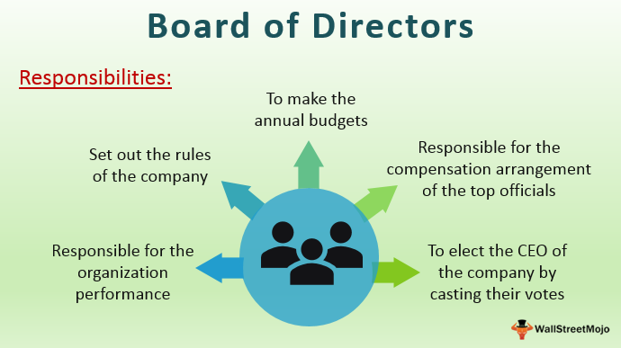

In today's fast-paced financial markets, algorithmic trading constitutes a critical component, relying on algorithms to execute pre-programmed trading instructions based on a multitude of variables, including timing, price, and quantity. The role of government economic policies in guiding algorithmic trading mechanisms is substantial, as these policies can alter economic landscapes and market dynamics. Understanding the function of government policies, particularly through the activities of the Council of Economic Advisers (CEA), is crucial for grasping the implications of policy decisions on trading trends.

The Council of Economic Advisers serves as a vital institution in shaping U.S. economic policy. Comprised of a group of distinguished economists, the CEA provides expert analysis and advice to the President of the United States on economic issues. This advisory body plays a significant role in interpreting macroeconomic indicators and trends that can influence the financial markets, including variables that are directly relevant to algorithmic trading strategies.



The intersection between U.S. government economic policy, particularly the guidance and insights provided by the CEA, and algorithmic trading is a dynamic field of interest. Investors and financial analysts can gain a strategic advantage by comprehending how government actions, such as fiscal and monetary policy decisions, impact financial markets. These insights allow for better prediction and management of market behaviors, which algorithmic trading systems can exploit to optimize performance.

Furthermore, the economic forecasts and policy recommendations from the CEA carry the potential to affect trading algorithms and investment decisions. As the CEA provides influential reports and analyses, such as the annual Economic Report of the President, these become critical resources for algorithmic traders. By integrating this data, traders can adjust their algorithms to align with anticipated economic trends and policy shifts, enhancing their ability to react to market changes effectively.

In summary, in the context of algorithmic trading, a comprehensive understanding of government economic policies—guided by the analytical expertise of the CEA—is indispensable. This knowledge equips investors with the requisite insights to make informed trading decisions, adapting their strategies to align with the latest economic conditions and policy directives.

## Table of Contents

## The Role of the Council of Economic Advisers

The Council of Economic Advisers (CEA) plays a critical advisory role to the President of the United States, focusing on the formulation and assessment of economic policy. This entity leverages data-driven insights to support the executive branch's economic agenda, ensuring that policy decisions are well-informed and systematically aligned with national objectives. The CEA is composed of leading economists who provide non-partisan and expert guidance, thus maintaining the integrity and effectiveness of U.S. economic policy.

Since its establishment, the CEA has traditionally favored Keynesian economic principles, especially during times of economic downturn. This theoretical framework emphasizes government intervention and fiscal policy as mechanisms to manage economic cycles and combat unemployment and inflation. By advocating for such principles, the CEA has historically influenced critical policy decisions, focusing on stabilizing the economy and promoting growth.

The CEA's input is especially vital during the preparation of the annual Economic Report of the President. This document serves as a comprehensive review and analysis of the nation's economic progress and challenges, addressing various sectors and providing detailed policy recommendations. It is through this report that the CEA communicates its assessments and suggests strategic directions for the economy.

A thorough understanding of CEA policies is crucial for maintaining macroeconomic stability, a key concern for traders and investors who rely on predictability and consistency in the market. Policies crafted or advised upon by the CEA can have significant implications on economic indicators, which, in turn, affect market behaviors and investment strategies. Consequently, traders and market participants must remain attuned to CEA policy shifts and analyses to optimize their investment decisions.

## Economic Policy and Its Influence on Algorithmic Trading

Algorithmic trading, prevalent in today's financial markets, relies significantly on economic indicators and market trends—a landscape shaped by government policies. Economic decisions, particularly those recommended by the U.S. Council of Economic Advisers (CEA), play a crucial role in defining the parameters within which algorithmic models operate.

Fiscal policies proposed by the CEA can considerably affect investor confidence and market [liquidity](/wiki/liquidity-risk-premium). For instance, expansionary fiscal policies, such as tax cuts or increased government spending, may boost investor confidence, encouraging investment and thereby increasing market liquidity. Conversely, contractionary policies could pull resources out of markets, impacting liquidity adversely. Algorithmic models, which depend on constant data streams reflecting investor behavior and liquidity metrics, must adjust accordingly to these shifts. 

The CEA's rigorous analysis of economic developments provides essential insights. Such analysis can feed into [algorithmic trading](/wiki/algorithmic-trading) programs, setting parameters that guide their decision-making processes. Algorithms rely on historical data and predictive analytics to forecast market movements, and these forecasts are often grounded in economic reports issued by the CEA. Notably, the Economic Report of the President, an annual document provided by the CEA, offers comprehensive data and projections about the economy. This report acts as a pivotal resource for traders using automated systems, offering insights into economic growth forecasts, unemployment rates, and inflation projections.

Algorithmic traders need to remain agile, adapting to policy changes prescribed by economic advisers. Well-calibrated trading algorithms can swiftly respond to new datasets. Here's a simple Python script illustrating how an algorithm might adjust its strategy based on new economic forecasts:

```python
import numpy as np

def trade_decision(gdp_growth, inflation_rate):
    # Adjusts trading strategy based on GDP growth and inflation rate
    if gdp_growth > 2.0 and inflation_rate < 2.5:
        return "Buy"
    elif gdp_growth < 1.0 or inflation_rate > 3.0:
        return "Sell"
    else:
        return "Hold"

# Example with latest economic indicators
gdp_growth_forecast = 2.5  # from CEA report
inflation_forecast = 2.2  # from CEA report

decision = trade_decision(gdp_growth_forecast, inflation_forecast)
print(f"Trading Decision: {decision}")
```

In this example, the trading algorithm adapts its buy, sell, or hold decisions based on GDP growth and inflation forecasts provided by economic advisers. Such adaptability ensures that traders can optimize their strategies to align with evolving economic policies.

In conclusion, the integration of economic policies into algorithmic trading reveals the necessity for traders to continually adapt their models to reflect changes in government policies accurately. As CEA recommendations unfold, they impact the financial algorithms that drive trading decisions, emphasizing the importance for algorithmic traders to stay abreast of such developments. These insights allow for the crafting of strategies that not only respond to new information but also anticipate future trends, ensuring sustained competitiveness in the market.

## Algorithmic Trading: Opportunities and Challenges

Algorithmic trading, which uses computer algorithms to automate trading processes, offers significant opportunities, particularly in executing high-frequency trades and enhancing market efficiency. These algorithms can analyze vast amounts of data within milliseconds, uncovering transient market inefficiencies quicker than any human could. However, the sensitivity of these algorithms to external stimuli such as policy shifts presents both opportunities and challenges.

**Opportunities and Challenges Created by Policy Shifts**

When governments enact new economic policies, they can induce market [volatility](/wiki/volatility-trading-strategies), affecting asset prices and trading volumes. For instance, an unexpected [interest rate](/wiki/interest-rate-trading-strategies) decision by the Federal Reserve can lead to sudden market movements. Algorithmic trading systems, designed to respond to specific parameters, can capitalize on these fluctuations. By identifying patterns and executing trades rapidly, they exploit fleeting opportunities. On the flip side, such volatility also raises the risk of erroneous trades, as algorithms might misinterpret transient market signals as trends.

```python
# Example of a simple moving average trading strategy in Python
import numpy as np

def simple_moving_average(data, window_size):
    weights = np.ones(window_size) / window_size
    return np.convolve(data, weights, 'valid')

prices = [101, 102, 103, 104, 105, 106] # hypothetical price data
sma_prices = simple_moving_average(prices, 2)
print(sma_prices)
```

**Navigating Policy Recommendations**

Traders utilizing algorithmic systems must stay informed on policy recommendations from economic advisers to adjust their trading algorithms appropriately. Accurate forecasts and policy analyses enable traders to recalibrate their strategies to mitigate the effects of policy changes. Algorithms programmed to dynamically adjust parameters in response to economic indicators can offer a competitive edge, reinforcing the need for traders to remain attuned to governmental economic insights.

**Impact Across Asset Classes**

The effect of policy on trading algorithms is not homogeneous across all asset classes. Stocks, bonds, and commodities each respond differently to policy changes due to differing market dynamics and liquidity levels. For instance, commodities might be more sensitive to geopolitical events and environmental policies, whereas bonds are generally more affected by monetary policy. Traders must tailor algorithms to reflect these nuances for each asset class, tweaking models to optimize performance under varying market conditions.

**Understanding Regulatory Frameworks**

Understanding the regulatory environment is crucial for algorithmic traders who must navigate a complex web of rules to ensure compliance. Policies and regulations surrounding algorithmic trading are designed to maintain market fairness and integrity. Failure to adhere to these regulations can result in penalties or the suspension of trading privileges. Therefore, comprehensive knowledge of the legal landscape is essential to minimize legal risks and ensure smooth algorithmic operations amidst abrupt policy adjustments.

In summary, while algorithmic trading presents significant opportunities to leverage high-frequency trading and market efficiencies, it also necessitates a keen awareness of economic policies and regulatory frameworks. This dual focus helps traders maximize potential benefits while mitigating the inherent risks associated with policy-induced market volatility.

## The Future of Economic Policy and Algorithmic Trading

As economic policies evolve, algorithmic trading strategies must continuously adapt to these changes to thrive in the ever-shifting financial markets. The integration of advanced data analytics and [artificial intelligence](/wiki/ai-artificial-intelligence) (AI) in trading algorithms is significantly enhancing the precision of decision-making processes. These technologies allow for the real-time analysis of vast datasets and the automated execution of trades with minimal human intervention, providing traders with a competitive edge.

Future policy developments may be pivotal in addressing the competitive dynamics of algorithms in financial markets. Policymakers and regulators are increasingly aware of the influence of algorithmic trading, leading to considerations for frameworks that ensure fair competition and market stability. This may involve updated regulatory measures aimed at mitigating the risks of market manipulation and ensuring transparency in algorithmic activities.

Additionally, the dialogue between policymakers and economic advisers such as the Council of Economic Advisers (CEA) is crucial in maintaining the stability of the financial ecosystem. It helps in crafting policies that not only safeguard market integrity but also encourage innovation in financial technologies. Collaborative efforts can yield guidelines that both protect investors and support the continued evolution of algorithmic trading technologies.

Traders must be proactive in refining their strategies to remain in sync with the latest economic insights and technological advancements. This includes the incorporation of [machine learning](/wiki/machine-learning) techniques to enhance predictive capabilities and adapt to emerging market patterns. The ability to anticipate policy changes and comprehend their implications on market behavior is essential for optimizing algorithmic strategies.

In conclusion, the intersection of economic policy and algorithmic trading is poised for further advancement. With ongoing technological innovation and responsive policy frameworks, traders equipped with cutting-edge analytics and strategic foresight can harness the full potential of algorithmic trading in a dynamic economic landscape.

## Conclusion

The intersection of U.S. government economic policy and algorithmic trading is a complex and dynamic relationship that continues to evolve as both areas grow increasingly sophisticated. To navigate the challenges and harness the potential benefits of these algorithmic systems, collaboration between policymakers and traders is crucial. Traders seeking to optimize their trading activities must possess a profound understanding of economic policies, as these policies shape market dynamics and influence trading decisions.

The Council of Economic Advisers (CEA), as a guide to U.S. economic policy, holds a significant influence over market mechanisms and trading strategies. As the CEA continues its work, traders and investors alike will need to pay close attention to its policy recommendations and economic forecasts. This attentiveness is essential, as changes in economic policy can profoundly affect market conditions and, consequently, the algorithms that traders employ.

Keeping abreast of economic developments and policy recommendations is not optional for traders aiming to capitalize on market trends; it is imperative. With algorithmic trading systems increasingly integrating sophisticated data analytics and artificial intelligence, remaining informed allows traders to refine their strategies and adapt to the ever-changing financial landscape. Therefore, the symbiosis between algorithmic trading and economic policy is not just a reality but a strategic necessity for modern investors and traders.

## References & Further Reading

[1]: ["Economic Report of the President"](https://www.whitehouse.gov/cea/economic-report-of-the-president/) - Annual report published by the Council of Economic Advisers offering comprehensive overviews of economic trends and policy analyses.

[2]: ["Advances in Financial Machine Learning"](https://www.amazon.com/Advances-Financial-Machine-Learning-Marcos/dp/1119482089) by Marcos Lopez de Prado - A book exploring the application of machine learning techniques to financial trading.

[3]: Gomber, P., Arndt, B., Lutat, M., & Uhle, T. (2011). ["High-frequency trading."](https://papers.ssrn.com/sol3/papers.cfm?abstract_id=1858626) Business & Information Systems Engineering.

[4]: Friedman, B. (2006). ["The Failure of the Economy and the Economists."](https://www.nybooks.com/articles/2009/05/28/the-failure-of-the-economy-the-economists/) Daedalus, 135(4), 12-21.

[5]: ["Quantitative Trading: How to Build Your Own Algorithmic Trading Business"](https://www.amazon.com/Quantitative-Trading-Build-Algorithmic-Business/dp/1119800064) by Ernest P. Chan - Provides insights into how to develop and manage an algorithmic trading business.

[6]: "Council of Economic Advisers" - Information available at the official [White House website](https://www.whitehouse.gov/cea/), detailing the role and function of the CEA in shaping U.S. economic policy.

[7]: Carver, R. (2019). ["Systematic Trading: A unique new method for designing trading and investing systems."](https://www.amazon.com/Systematic-Trading-designing-trading-investing/dp/0857194453) - A book on creating algorithmic trading strategies based on a systematic approach.