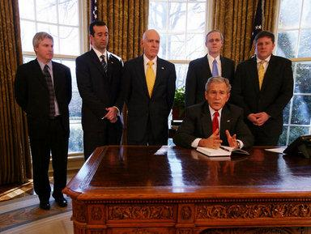

## Table of Contents

## What is the Council of Economic Advisers (CEA)?

The Council of Economic Advisers (CEA) is a group of experts that helps the President of the United States understand the economy. They give advice on things like jobs, money, and how the country can grow. The CEA is part of the Executive Office of the President and has been around since 1946.

The CEA has three main members, called the Chair and two other advisers. They work with a team of economists to study data and make reports. These reports help the President make decisions about laws and policies that affect everyone in the country. The CEA also talks to Congress and the public about what is happening with the economy.

## When was the Council of Economic Advisers established?

The Council of Economic Advisers was set up in 1946. It was created to help the President understand the economy better. The idea was to have a group of experts who could give advice on important economic issues.

The CEA is part of the Executive Office of the President. It has three main members: the Chair and two other advisers. They work with a team of economists to study data and write reports. These reports help the President make decisions about laws and policies that affect the whole country.

## Who appoints the members of the Council of Economic Advisers?

The President of the United States appoints the members of the Council of Economic Advisers. This means the President picks who will be on the council. The members include the Chair and two other advisers. They are chosen because they know a lot about the economy and can give good advice.

Once the President picks the members, the Senate has to approve them. This is called a confirmation process. If the Senate agrees, the members can start working on the council. They help the President understand the economy and make important decisions about laws and policies that affect everyone in the country.

## What is the primary role of the Council of Economic Advisers?

The main job of the Council of Economic Advisers (CEA) is to help the President of the United States understand the economy. They give advice on important things like jobs, money, and how the country can grow. The CEA is made up of three main members: the Chair and two other advisers. They work with a team of economists to study data and make reports that help the President make good decisions.

The CEA also talks to Congress and the public about what is happening with the economy. They explain things in a way that everyone can understand. This helps people know what the government is doing to help the economy. The CEA has been doing this important work since it was set up in 1946.

## How does the CEA influence economic policy in the United States?

The Council of Economic Advisers (CEA) helps shape economic policy in the United States by giving the President advice on big economic issues. They look at data and write reports that help the President understand what is happening with jobs, money, and the country's growth. When the President needs to make decisions about new laws or policies, the CEA's advice is very important. They help the President see the best ways to help the economy and make life better for people.

The CEA also talks to Congress and the public about the economy. They explain things in a simple way so everyone can understand what the government is doing. This helps Congress make good laws and helps people know what to expect. By sharing their knowledge, the CEA makes sure that economic policies are based on facts and good ideas. This way, they play a big role in making sure the country's economy stays strong and healthy.

## Can you describe a significant historical event involving the CEA?

One big event involving the Council of Economic Advisers happened during the 2008 financial crisis. The CEA, led by Chair Christina Romer, played a key role in helping President Barack Obama understand what was happening with the economy. They gave advice on how to fix the problems caused by the crisis, like banks failing and people losing jobs. The CEA helped create the American Recovery and Reinvestment Act, a big plan to help the economy recover. This act included spending money on things like building roads and giving money to people who lost their jobs.

The CEA's work during this time was very important. They helped the President make quick decisions to stop the economy from getting worse. By studying data and making reports, the CEA showed the President what needed to be done. Their advice helped the government take action to help people and businesses. The CEA's role in the 2008 financial crisis is a good example of how they can make a big difference in tough times.

## What are some key economic reports produced by the CEA?

The Council of Economic Advisers makes a big report every year called the "Economic Report of the President." This report tells everyone what is happening with the economy, like jobs, money, and how the country is growing. It also talks about what the government is doing to help the economy. The report is important because it helps people understand what is going on and what the government plans to do next.

Another important report the CEA makes is called the "Annual Report on the Economic Impact of Federal Regulations." This report looks at how the rules the government makes affect the economy. It helps the President and Congress see if the rules are helping or hurting businesses and people. By studying these reports, the government can make better decisions about new laws and policies that affect everyone in the country.

## How does the CEA interact with other government agencies?

The Council of Economic Advisers works closely with other parts of the government to help the President make good decisions about the economy. They talk a lot with the Treasury Department, which deals with money and taxes. The CEA shares data and ideas with them to make sure the President knows everything about what is happening with money in the country. They also work with the Federal Reserve, which controls things like interest rates. By working together, they can make plans that help the economy grow and keep things stable.

The CEA also talks with other agencies like the Department of Labor, which looks after jobs and workers. They share information about jobs and how people are doing to make sure the President's plans help everyone. The CEA helps these agencies understand the big picture of the economy. By working together, they can create policies that make life better for people and businesses. This teamwork is important because it helps the government make smart choices that affect the whole country.

## What is the structure of the Council of Economic Advisers?

The Council of Economic Advisers is made up of three main members: the Chair and two other advisers. The President picks these members, and then the Senate has to say it's okay for them to start working. These three people lead the council and are in charge of giving the President advice about the economy. They work with a team of economists who help them study data and write reports. This team helps make sure the advice they give is based on good information.

The CEA is part of the Executive Office of the President. This means they are very close to the President and can talk to them easily. The CEA works with other parts of the government too, like the Treasury Department and the Federal Reserve. They share information and ideas to help make good plans for the economy. By working together, they can make sure the President's decisions help the country grow and keep things stable.

## How has the role of the CEA evolved over time?

The Council of Economic Advisers was created in 1946 to help the President understand the economy better. At first, the CEA's main job was to give advice on big economic issues and help the President make good decisions about laws and policies. Over the years, the CEA has become more important as the economy got more complicated. They started to work more with other parts of the government, like the Treasury Department and the Federal Reserve, to make sure everyone had the same information and could work together on plans.

As time went on, the CEA started to do more than just give advice. They began making important reports like the "Economic Report of the President" every year. This report tells everyone what is happening with the economy and what the government plans to do. The CEA also started talking more to Congress and the public about the economy. They explain things in a way that everyone can understand, which helps people know what the government is doing to help the economy. This way, the CEA has grown from just giving advice to being a big part of how the government makes economic policy.

## What qualifications are typically required for members of the CEA?

Members of the Council of Economic Advisers usually have a strong background in economics. They often have a Ph.D. in economics or a related field. This means they have studied a lot about how money and jobs work. They also have experience working as economists, maybe at a university or in the government. This helps them understand the big picture of the economy and how to solve problems.

Besides their education and experience, members of the CEA need to be good at explaining things. They have to talk to the President, Congress, and the public about the economy. So, they need to be able to take complicated ideas and make them simple so everyone can understand. They also need to work well with others because they will be working with different parts of the government to make plans for the economy.

## Can you discuss any controversies or criticisms faced by the CEA in its history?

The Council of Economic Advisers has faced some criticism over the years. One big criticism is that the CEA sometimes gets too close to the President and their political party. People worry that this might make the CEA's advice less fair and more about what the President wants. For example, during the 2008 financial crisis, some people thought the CEA's advice to President Obama was too political and not based enough on facts. They said the CEA should focus more on giving the best economic advice, no matter what the President or their party thinks.

Another criticism is about the CEA's predictions. Sometimes, the CEA's guesses about what will happen with the economy are not right. This can make people question if the CEA really knows what they are talking about. For instance, the CEA has been criticized for not seeing big economic problems coming, like the 2008 financial crisis. People say the CEA should be better at warning the President and the country about these risks so they can be ready and take action to stop them.

## References & Further Reading

[1]: ["Economic Report of the President"](https://www.whitehouse.gov/cea/economic-report-of-the-president/) - Annual report published by the Council of Economic Advisers offering comprehensive overviews of economic trends and policy analyses.

[2]: ["Advances in Financial Machine Learning"](https://www.amazon.com/Advances-Financial-Machine-Learning-Marcos/dp/1119482089) by Marcos Lopez de Prado - A book exploring the application of machine learning techniques to financial trading.

[3]: Gomber, P., Arndt, B., Lutat, M., & Uhle, T. (2011). ["High-frequency trading."](https://papers.ssrn.com/sol3/papers.cfm?abstract_id=1858626) Business & Information Systems Engineering.

[4]: Friedman, B. (2006). ["The Failure of the Economy and the Economists."](https://www.nybooks.com/articles/2009/05/28/the-failure-of-the-economy-the-economists/) Daedalus, 135(4), 12-21.

[5]: ["Quantitative Trading: How to Build Your Own Algorithmic Trading Business"](https://www.amazon.com/Quantitative-Trading-Build-Algorithmic-Business/dp/1119800064) by Ernest P. Chan - Provides insights into how to develop and manage an algorithmic trading business.

[6]: "Council of Economic Advisers" - Information available at the official [White House website](https://www.whitehouse.gov/cea/), detailing the role and function of the CEA in shaping U.S. economic policy.

[7]: Carver, R. (2019). ["Systematic Trading: A unique new method for designing trading and investing systems."](https://www.amazon.com/Systematic-Trading-designing-trading-investing/dp/0857194453) - A book on creating algorithmic trading strategies based on a systematic approach.