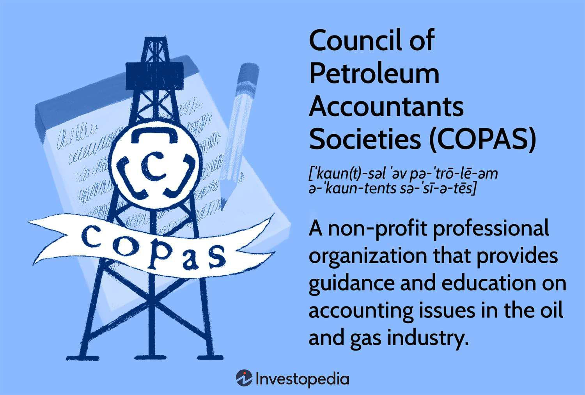

Oil and gas accounting presents unique challenges due to the intricacies and scale of the industry. This sector is characterized by large-scale operations, significant capital investments, and complex financial transactions, from exploration to production and distribution. These factors create a demanding environment for accounting professionals who must ensure accurate financial reporting and compliance with varying regulations.

Organizations such as the Council of Petroleum Accountants Societies (COPAS) play an essential role in establishing standards and guidelines that address these complexities. COPAS is instrumental in formulating practices that help standardize accounting and financial reporting in the oil and gas industry. By providing frameworks and guidelines, COPAS aids accountants and companies in maintaining accuracy and transparency in their financial dealings.

The introduction of technology, particularly algorithmic trading, is profoundly influencing how accounting in the oil and gas sectors is practiced. Algorithmic trading, which employs computer algorithms to optimize trading strategies and manage risk, is reshaping traditional accounting roles and introducing new efficiency standards. The integration of such technology requires accountants to adapt to changes and embrace new tools to manage and interpret data effectively.

This article explores COPAS’s influential role, the nuances of petroleum accounting, and the ongoing impact of algorithmic trading on the industry. These elements underscore the necessity for petroleum accountants to continuously update their knowledge and skills to navigate this dynamic environment successfully.

## Table of Contents

## What is COPAS?

The Council of Petroleum Accountants Societies (COPAS) is a non-profit organization established in 1961, dedicated to the advancement and standardization of accounting practices within the oil and gas industry. The primary mission of COPAS is to facilitate discussions and provide solutions for the myriad accounting issues that arise in this sector, which is characterized by its complexity and rapid evolution.

COPAS is composed of 26 member societies situated across the United States and Canada. This extensive network enables COPAS to cater to a wide array of accounting practices and challenges, ensuring that its guidelines and best practices remain relevant and applicable across different jurisdictions. The organization acts as a central hub through which members can exchange ideas, partake in educational opportunities, and collectively address challenges unique to petroleum accounting.

In addition to fostering communication and collaboration among its members, COPAS plays a pivotal role in setting industry standards. It provides comprehensive guidelines and disseminates best practices to ensure uniformity in accounting methods across the petroleum industry. These guidelines are instrumental in promoting transparency, accuracy, and consistency in financial reporting, thereby supporting companies in maintaining compliance with both domestic and international regulations.

Moreover, COPAS offers specialized accreditation for accountants in the petroleum sector, such as the Accredited Petroleum Accountant (APA) certification. This certification serves to recognize accountants who have demonstrated expertise and proficiency in handling the specialized accounting challenges of the oil and gas industry. By setting these professional benchmarks, COPAS not only enhances the credibility of accountants but also champions the continual professional development necessary to keep pace with industry advancements.

Through its ongoing efforts, COPAS significantly contributes to the standardization and optimization of petroleum accounting practices, thereby supporting the industry in navigating its complex financial landscape.

## Understanding Petroleum Accounting

Petroleum accounting is a specialized branch of accounting focused on the tracking and management of financial transactions related to the exploration, extraction, production, and delivery of oil and gas. This field requires practitioners to possess a deep understanding of several accounting practices that are unique to the petroleum industry due to its inherent complexities.

The journey of petroleum accounting begins at the exploration phase, where costs associated with geophysical studies, drilling, and site evaluations need meticulous documentation. Additionally, these costs must be classified correctly—whether as capital or operational expenses—since they influence the financial statements and tax obligations significantly.

A critical aspect of petroleum accounting is joint interest accounting. This discipline deals with financial transactions and cost-sharing arrangements among multiple stakeholders or partners involved in oil and gas ventures. Such collaborations are common, as the capital-intensive nature of petroleum projects often necessitates partnerships to mitigate risks and share the substantial financial burden. Petroleum accountants must skillfully allocate costs and profits according to the joint operating agreement terms, ensuring each party's financial records reflect their respective financial interest in the venture.

Auditing in the petroleum industry also presents unique challenges. Auditors must be adept at understanding and verifying complex contractual arrangements and cost-sharing agreements. The intricate nature of exploration and production contracts demands a detailed examination to ensure compliance with industry standards and regulatory requirements. Auditors employ specialized techniques to evaluate whether financial transactions accurately represent the economic realities of operations.

Tax considerations form another crucial component of petroleum accounting. Governments across the globe impose various tax regimes on the oil and gas sector, often including royalties, severance taxes, and excise duties. Petroleum accountants must navigate these tax obligations efficiently to ensure compliance and to optimize tax liabilities for their organizations or clients.

Publications and standards issued by the Council of Petroleum Accountants Societies (COPAS) are pivotal to the practice of petroleum accounting. These guidelines offer standardized procedures and best practices adopted widely across the industry, promoting consistency and accuracy in financial reporting. Furthermore, the influence of COPAS extends to shaping government regulations, as these standards often serve as a reference point in regulatory frameworks.

In sum, petroleum accounting demands a high level of expertise and specialization. Accountants in this field must be proficient in joint interest allocation, adept in audit practices tailored for the industry, and well-versed in managing complex tax obligations. The role of COPAS in providing authoritative guidelines cannot be overstated, as it ensures adherence to industry norms, facilitating a transparent and structured financial reporting mechanism.

## The Role of COPAS in Petroleum Accounting

The Council of Petroleum Accountants Societies (COPAS) plays an indispensable role in petroleum accounting by offering a wide array of services designed to support professionals in the industry. The organization publishes a variety of documents that serve as authoritative references for accountants, providing guidelines that cover joint interest billing audit protocols, revenue accounting, and more. These publications ensure consistency and clarity in financial reporting, which is crucial in an industry characterized by complex transactions and regulatory demands.

Additionally, COPAS supports ongoing professional development through webinars and educational events. These initiatives are pivotal for keeping industry professionals abreast of emerging trends, regulatory changes, and best practices. The dynamic nature of the oil and gas industry necessitates a continuous learning approach, which COPAS facilitates through the provision of timely and relevant information.

The committees within COPAS are fundamental in tackling industry-specific challenges. These committees are composed of experts who contribute their knowledge and experience to develop solutions tailored to the petroleum sector's unique requirements. They work on various issues, from improving accounting standards to enhancing financial transparency and accountability.

A significant contribution of COPAS to the industry is its Accredited Petroleum Accountant (APA) certification. This certification is a mark of excellence, acknowledging professionals who have demonstrated a high level of proficiency and commitment to petroleum accounting standards. The APA credential is recognized within the industry, conferring a competitive advantage to those who hold it, as it signifies a thorough understanding of the sector's complexities and the ability to perform at a high level.

Through its comprehensive range of services, publications, and educational activities, COPAS remains a critical resource for petroleum accountants. The organization's efforts ensure that industry professionals are well-equipped to manage the intricacies of financial reporting and regulatory compliance in the oil and gas sector.

## Algorithmic Trading in the Petroleum Industry

Algorithmic trading, a method that employs complex computer algorithms to automate and enhance trading strategies, has become increasingly prevalent in the petroleum industry. This technique leverages mathematical models and statistical analyses to make trading decisions that are executable at speeds beyond human capability. In the context of oil and gas, [algorithmic trading](/wiki/algorithmic-trading) facilitates various operations such as price forecasting, risk management, and optimization of trading strategies.

In price forecasting, algorithms analyze vast datasets, incorporating historical price data, market trends, geopolitical events, and supply-demand dynamics to predict future price movements. This predictive capability can be crucial for petroleum companies that need to make informed decisions about buying and selling commodities. For instance, [machine learning](/wiki/machine-learning) models like regression analysis and time-series forecasting (e.g., ARIMA models) can be employed to predict the price of [crude oil](/wiki/crude-oil) based on historical data and influencing variables.

Risk management is another significant area where algorithmic trading proves beneficial. Algorithms can continuously monitor market conditions and execute trades that minimize the risk exposure of a portfolio. This involves techniques such as hedging, where an algorithm might automatically buy futures contracts to offset potential losses from market fluctuations in the physical oil market.

Optimizing trading strategies is achieved by using algorithms to backtest various scenarios and identify the most profitable trading strategies. These strategies can then be applied in real-time, taking advantage of minute [arbitrage](/wiki/arbitrage) opportunities that exist between different markets or exchanges. For example, algorithms are capable of conducting thousands of trade simulations in parallel, finding the optimal points for entering or exiting trades based on [statistical arbitrage](/wiki/statistical-arbitrage) or mean reversion strategies.

The integration of algorithmic trading in the petroleum sector introduces both challenges and opportunities for petroleum accountants. On the one hand, the enhanced speed and complexity of transactions necessitate sophisticated accounting systems capable of handling large volumes of data and maintaining accurate records in real-time. Accountants must also ensure compliance with financial regulations and manage the risks associated with algorithmic trading, such as market manipulation and systemic errors.

On the other hand, algorithmic trading can offer opportunities by enhancing the precision and efficiency of financial data management. Automation reduces the potential for human error and provides accountants with advanced tools to track and report financial activities more accurately. 

As the petroleum industry increasingly embraces technological advancements, the role of petroleum accountants may evolve significantly. Staying abreast of the latest developments in algorithmic trading and adapting to new tools and methodologies will be crucial for professionals looking to succeed in this dynamic environment.

## Integrating Technology with COPAS Standards

The integration of algorithmic trading in the oil and gas sector necessitates adherence to established accounting standards to ensure accurate reporting and compliance. The Council of Petroleum Accountants Societies (COPAS) standards form a crucial foundation for incorporating such new technologies into existing processes. As algorithmic trading gains traction, accountants within the sector must remain agile, continuously educating themselves to keep pace with evolving technologies and practices.

Algorithmic trading relies on advanced algorithms and computational techniques to manage trading activities efficiently. In the context of the petroleum industry, these algorithms assist in price forecasting, risk management, and the optimization of trading strategies. The integration of these technologies within the accounting framework is where COPAS standards become essential. They provide structured guidance, ensuring that data generated from algorithmic trading is accurately captured and reported in compliance with industry regulations.

When these technologies are implemented, there is an immediate need to evaluate existing processes and adapt them so that they align with COPAS guidelines. For example, accountants must understand how algorithmic trades impact financial statements, necessitating adjustments in reporting methodologies to accommodate these transactions. The precise recording and reporting of these trades are crucial for maintaining transparency and accountability, thus fostering trust among stakeholders.

Moreover, the adaptation to these technological advancements is not a one-time effort. The dynamic nature of both technology and market conditions requires ongoing education for petroleum accountants. COPAS, through its webinars, publications, and educational events, plays a significant role in equipping accountants with the knowledge and tools necessary to work effectively with these new technologies. As the industry shifts, the continuous professional development of accountants becomes imperative to ensure that they can efficiently integrate these tools while adhering to established standards.

In conclusion, the intersection of algorithmic trading and petroleum accounting represents both a challenge and an opportunity. By leveraging COPAS standards, accountants can effectively incorporate technological advancements into their work, ensuring that they deliver value while maintaining compliance across sectors. As technology evolves, so too must the practices of accounting professionals, underscoring the importance of lifelong learning and adaptation in the industry.

## Conclusion

COPAS (Council of Petroleum Accountants Societies) has long stood as a fundamental component in the petroleum accounting landscape, offering essential guidelines and educational resources. This organization's role is increasingly vital as the industry faces transformation through emerging technological trends. The influence of algorithmic trading in the oil and gas sector exemplifies a significant shift, fundamentally altering how financial transactions are processed, reported, and analyzed. This shift introduces numerous challenges and opportunities for the accounting practices traditionally employed in this industry.

Algorithmic trading utilizes sophisticated computer algorithms to automate trading activities, optimize strategies, and forecast prices. As this technology gains prominence, petroleum accountants are pressed to evolve their practices. The integration of algorithmic trading into the industry demands precise and adaptable accounting methods to ensure accurate financial reporting and compliance with regulatory standards. This necessitates a deep understanding of both technological advancements and established accounting principles.

To navigate these changes, petroleum accountants are encouraged to rely heavily on COPAS resources. The organization's standards provide a solid foundation for assimilating new technologies into existing accounting frameworks, maintaining precision and compliance. Furthermore, COPAS's commitment to providing ongoing education and fostering knowledge exchange is crucial for accountants aiming to remain relevant and effective in this dynamic environment. As the petroleum industry continues to evolve, the role of COPAS as a guiding entity remains indispensable, supporting accountants in meeting contemporary challenges and leveraging new opportunities with confidence and competence.

## References & Further Reading

[1]: The Council of Petroleum Accountants Societies (COPAS) - [COPAS Official Website](https://copas.org/home-new/)

[2]: Lopez de Prado, M. (2018). ["Advances in Financial Machine Learning."](https://www.amazon.com/Advances-Financial-Machine-Learning-Marcos/dp/1119482089) John Wiley & Sons.

[3]: Jansen, S. (2020). ["Machine Learning for Algorithmic Trading."](https://github.com/stefan-jansen/machine-learning-for-trading) Packt Publishing.

[4]: Aronson, D. R. (2006). ["Evidence-Based Technical Analysis: Applying the Scientific Method and Statistical Inference to Trading Signals."](https://www.amazon.com/Evidence-Based-Technical-Analysis-Scientific-Statistical/dp/0470008741) Wiley.

[5]: Chan, E. P. (2008). ["Quantitative Trading: How to Build Your Own Algorithmic Trading Business."](https://github.com/ftvision/quant_trading_echan_book) John Wiley & Sons.

[6]: Bergstra, J., Bardenet, R., Bengio, Y., & Kégl, B. (2011). ["Algorithms for Hyper-Parameter Optimization."](https://dl.acm.org/doi/10.5555/2986459.2986743) Advances in Neural Information Processing Systems 24.